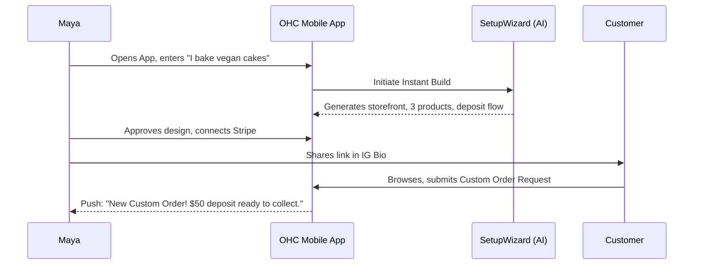
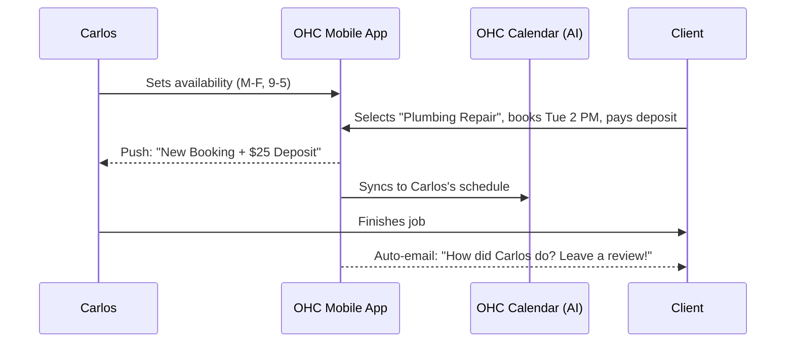
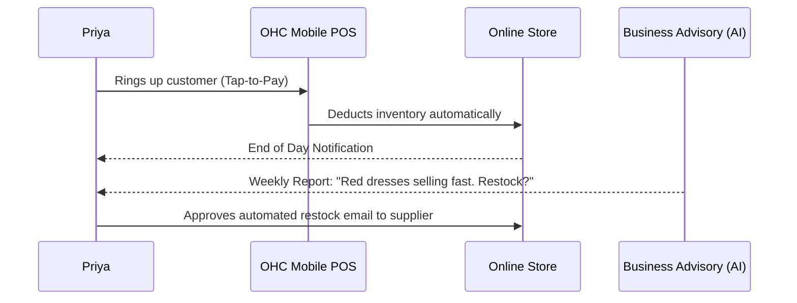
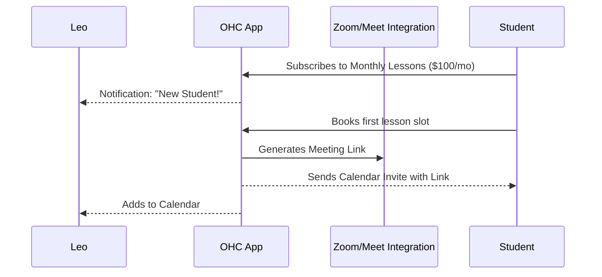
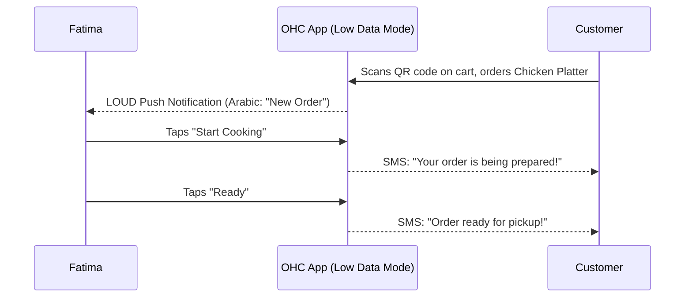

# Business Journey Architecture

## 1. Overview
This design document maps the complete end-to-end user journey for each of OneHumanCorp's core personas: Maya (Baker), Carlos (Handyman), Priya (Boutique Owner), Leo (Music Tutor), and Fatima (Food Cart Operator). The goal is to detail how a non-technical small business owner interacts with the OHC platform from initial discovery through active daily use and organic referral, ensuring AI agents seamlessly and invisibly eliminate operational friction.

## 2. Universal Journey Phases
For every persona, the journey follows six key phases:
1. **Acquisition:** How the user discovers OHC.
2. **Onboarding:** The initial setup and "Time to Live" (< 10 minutes).
3. **Activation:** The first critical action (e.g., first product added, first booking received).
4. **Retention:** The daily or weekly habits that bring the user back.
5. **Revenue:** The trigger that converts a free user to a paid subscriber.
6. **Referral:** The viral loop that brings in new users.

---

## 3. Persona Journeys & Sequence Diagrams

### 3.1 Maya — The Home Baker (Physical Products / Custom Orders)
**Profile:** 28, non-technical, relies entirely on her iPhone.

*   **Acquisition:** Discovers OHC via a TikTok ad showing "Turn your Instagram DMs into a real bakery in 30 seconds."
*   **Onboarding:** Uses the "Instant Build" SetupWizard. Types: "I'm Maya, I bake custom vegan cakes in Portland." AI agents automatically generate a pink-themed storefront, upload stock cake photos, and draft a "Custom Order Deposit" product.
*   **Activation:** Maya connects Stripe in 2 taps and shares her new OHC storefront link in her Instagram bio.
*   **Retention:** Checks the mobile dashboard daily to review custom order requests and approve AI-drafted responses to customer questions.
*   **Revenue:** Upgrades to the $9/mo Starter tier when she exceeds the 10-product limit after expanding her cake catalog.
*   **Referral:** A customer purchasing a cake sees a small "Powered by OHC" badge on the beautiful checkout page.



*   **Friction Points:** If Stripe connection requires navigating away from the app and returning, Maya might drop off. **Mitigation:** Deep link integration and one-tap Stripe Connect.

### 3.2 Carlos — The Freelance Handyman (Services & Bookings)
**Profile:** 42, non-technical, uses a mid-range Android phone.

*   **Acquisition:** Hears about OHC from another contractor on a job site who uses it for invoicing.
*   **Onboarding:** Downloads the Android app. The Advisor asks: "What services do you offer?" Carlos selects "Plumbing" and "General Repairs." AI generates a service listing page with a built-in calendar.
*   **Activation:** A customer books a "Leaky Faucet Repair" slot for Tuesday at 2 PM and pays a $25 booking deposit.
*   **Retention:** Carlos relies on the OHC app's calendar as his primary daily schedule and uses the AI quote generator to quickly reply to new leads while in his truck.
*   **Revenue:** Upgrades to the Pro tier ($29/mo) to unlock unlimited AI agent actions (quote generation).
*   **Referral:** Uses the built-in "Request Review" feature, which emails his satisfied customers a link to his OHC profile, increasing local SEO visibility.



*   **Friction Points:** Setting up availability schedules can be confusing. **Mitigation:** Default to standard business hours and allow simple visual block-outs (e.g., tapping days on a calendar).

### 3.3 Priya — The Boutique Owner (Omnichannel Retail)
**Profile:** 35, semi-technical, uses iPhone and MacBook.

*   **Acquisition:** Searching Google for "Square alternative with better online store."
*   **Onboarding:** Uses the desktop web interface. Imports her existing inventory list via CSV. The Manager agent automatically categorizes items and suggests variants (Size/Color).
*   **Activation:** Completes her first in-person sale using the OHC mobile app's Tap-to-Pay feature.
*   **Retention:** Uses the Desktop dashboard every morning to view the Business Advisory report ("Yesterday's top seller: Red Summer Dress") and manage her email newsletter.
*   **Revenue:** Starts directly on the Pro tier ($29/mo) for inventory sync and custom domain support.
*   **Referral:** Recommends OHC to a fellow boutique owner in a local Facebook business group.



*   **Friction Points:** Importing inventory via CSV often fails due to formatting. **Mitigation:** The Manager agent must be highly fault-tolerant, using LLMs to map fuzzy CSV columns to the correct schema automatically.

### 3.4 Leo — The Music Tutor (Digital Services / Subscriptions)
**Profile:** 22, non-technical, heavy social media user (TikTok).

*   **Acquisition:** Sees an ad promoting a "Better Link-in-Bio that actually takes payments."
*   **Onboarding:** Creates a profile on his phone. Adds a "Monthly Guitar Lessons" subscription product and links his Google Calendar.
*   **Activation:** Gets his first student to sign up for a $100/mo subscription.
*   **Retention:** The app automatically generates and sends Zoom links for upcoming lessons. Leo checks the app to see who hasn't paid or booked recently.
*   **Revenue:** Upgrades to Starter ($9/mo) to use a custom domain (`leoguitar.com`).
*   **Referral:** Prominently features his OHC link in his TikTok bio. His students share the link with friends who want to learn.



*   **Friction Points:** OAuth flows for linking Google Calendar/Zoom are notorious for dropping users. **Mitigation:** Ensure the OAuth handoff returns cleanly to the native app, and provide an OHC-native video option fallback if possible.

### 3.5 Fatima — The Food Cart Operator (Food & Beverage)
**Profile:** 50, limited English, low-end Android phone, slow connection.

*   **Acquisition:** A younger relative sets it up for her to help manage the lunch rush.
*   **Onboarding:** The relative uses the bilingual interface (Arabic/English). Snaps photos of the menu board, and the AI extracts the items, prices, and translates them to create a digital menu.
*   **Activation:** The first customer orders a "Chicken Over Rice" for pickup via the web link and pays online.
*   **Retention:** Fatima relies entirely on the loud, clear push notifications on her Android phone ("NEW ORDER") and the simple "Mark Ready" button.
*   **Revenue:** Remains on the Free tier initially, but eventually pays for a custom domain to print on her food cart menus.
*   **Referral:** Customers in line scan a QR code to order instead of waiting, introducing them to the OHC checkout flow.



*   **Friction Points:** The app must be instantaneous even on a poor 3G connection. If the "Mark Ready" button lags, Fatima will abandon the app during a busy rush. **Mitigation:** Optimistic UI updates. The button must immediately show success, handling network retries invisibly in the background.

---

## 4. Key Architectural Takeaways

To support these journeys seamlessly, the platform architecture must enforce:

1.  **Optimistic UI & Offline Resilience:** (Critical for Fatima and Carlos). Mobile actions must feel instant. Writes go to a local queue and sync when connectivity allows.
2.  **Fuzzy Data Ingestion:** (Critical for Priya and SetupWizard). The system must use LLMs to gracefully handle imperfect inputs (messy CSVs, unstructured text descriptions, photos of menus).
3.  **Invisible Agent Integration:** AI must not feel like a chatbot. It must manifest as background tasks that propose concrete actions (e.g., drafts, schedule updates, simple reports) requiring only 1-tap approval.
4.  **Deep-Linked Third-Party Auth:** Connecting Stripe or Google Calendar must not break the mobile flow.

---

```yaml
issue_title: "[architecture] Implement Optimistic UI Action Queue for Mobile App"
issue_priority: "P0"
issue_description: "Implement a robust offline-first action queue in the Flutter mobile application. Critical state changes (e.g., 'Mark Order Ready', 'Approve Draft') must immediately update the UI and queue the network request in the background, retrying automatically upon connection loss. This is essential for users like food cart operators (Fatima) who rely on the app in low-connectivity environments."
issue_todo_list:
  - [ ] Implement local SQLite action queue in Flutter client.
  - [ ] Create optimistic state updaters for core entity mutations.
  - [ ] Implement background sync worker with exponential backoff.
issue_label: ["architecture", "mobile", "high-impact"]
```
