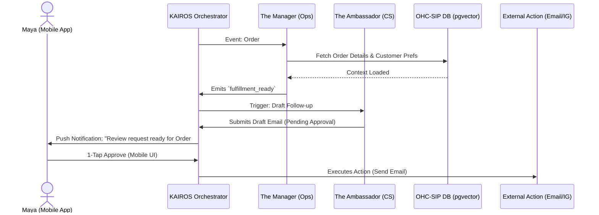

# 📐 Architect: Define AI Agent Department Architecture

## Problem Statement
Small business owners—like Maya the baker, Carlos the handyman, and Fatima the food cart operator—need the power of enterprise-grade software to grow, but lack the technical expertise, time, and vocabulary to configure complex workflows. Traditional software expects them to manage "queues," "API integrations," and "marketing automation rules." Our users simply need "The Manager" to track orders and "The Promoter" to run Instagram ads. They need AI that operates invisibly in the background, organized into understandable departments, so they can focus on their craft while the platform runs the business.

## Research Report
Traditional SMB SaaS platforms force the user to do the work:
*   **Shopify/Wix:** Rely heavily on app marketplaces. A baker must find, install, and configure a "review request" app, a "social media poster" app, and a "loyalty program" app, leading to plugin bloat and fragmented data.
*   **Squarespace/GoDaddy:** Offer basic marketing tools but require the user to actively draft emails and social posts, which is time-consuming and intimidating.

**The OHC Advantage:**
OHC abstracts functionality into 7 friendly AI Departments. The AI doesn't just provide "suggestions"; it executes work. Instead of installing a "review app," the user simply employs "The Ambassador" (Customer Success Agent), which automatically drafts review request emails post-fulfillment based on a unified data layer.

### Key Personas & Use Cases
*   **Maya (Baker):** When Maya receives a DM on Instagram asking "Do you do vegan cakes?", **The Ambassador** auto-drafts a positive reply and a link to her vegan menu, pending her 1-tap approval.
*   **Carlos (Handyman):** When Carlos marks a job complete on his phone, **The Accountant** auto-generates an invoice and **The Manager** follows up for the final payment.
*   **Fatima (Food Cart):** **The Advisor** notices she sells out of Halal chicken by 1 PM every Tuesday and sends a simple notification suggesting she increase her order size for next week.

## Design Doc
### Key Design Decisions
1.  **Friendly Nomenclature:** "Agent" and "LLM" are never exposed in the UI. The platform refers to them as "Departments" or "Teammates" (e.g., "The Promoter", "The Manager").
2.  **1-Tap Approval (Draft-for-Review):** To build trust, high-risk actions (sending emails, publishing posts, initiating refunds) are never fully autonomous. The AI drafts the action and sends a mobile notification. The user approves it with a single tap.
3.  **Unified Memory (AutoDream):** Agents share a single, unified memory context (`autodream_memories` via `pgvector`). "The Salesperson" knows that a customer previously complained to "The Ambassador", preventing tone-deaf upsells.

### Architecture Diagram (Mermaid.js)

### UI Wireframes & Screen Flow (375px First)
**Screen 1: The Daily Briefing (Dashboard)**
*   **Layout:** Clean Glassmorphism card at the top.
*   **Content:** "Good morning Maya. The Manager processed 3 orders overnight. The Promoter drafted a new Instagram post for the vegan cakes."
*   **CTA:** [Review Post] button.

**Screen 2: The Approval Queue (1-Tap Interface)**
*   **Layout:** Tinder-style swipe or simple stack of cards.
*   **Content Card:** Shows the drafted action. e.g., "Email to Sarah: 'Hi Sarah, hope you loved the cake! Leave a review here.'"
*   **Interactions:** Large [Approve] button (green), secondary [Edit] or [Discard] buttons. Native mobile feel, touch target > 44px.

### Mobile UX Flow
1.  **Notification:** User receives a push notification: "The Ambassador has a draft ready."
2.  **Deep Link:** Tapping opens the specific drafted action in the Approval Queue.
3.  **Action:** User reads the plain-language summary and taps "Approve".
4.  **Optimistic UI:** The card disappears immediately with a subtle satisfying animation, and the orchestrator handles the external action asynchronously.

### AI Agent Integration Points
*   **Event Mesh (Hub):** Agents listen to system events (`tenant.order.created`, `tenant.payment.failed`).
*   **Task List:** Agents claim tasks from a distributed lock queue.
*   **Feedback Loop:** If a user repeatedly edits an agent's draft (e.g., changing the tone from formal to casual), the changes are embedded back into the memory vector, tuning future drafts.

## Implementation Prompt
**To Implementer Agent:**
Implement the "Draft-for-Review" approval engine within the KAIROS Orchestrator.

**User-Facing Outcome:** Business owners will receive unified notifications for high-risk AI actions (like emails or social posts) and can approve them with a single tap from their mobile dashboard, ensuring they remain in control without doing the heavy lifting.

**Critical User Journey (CUJ):**
1. An order transitions to `FULFILLED`.
2. The "Customer Success" agent automatically drafts a review request email.
3. The system creates a `PENDING_APPROVAL` task.
4. The frontend fetches the pending task.
5. The user clicks "Approve", and the system executes the email dispatch and marks the task `COMPLETED`.

**Acceptance Criteria:**
*   Extend the existing Task/Job payload to include an `ActionRisk` enum (e.g., `AUTO_EXECUTE`, `DRAFT_FOR_REVIEW`).
*   Create an API endpoint for the mobile frontend to fetch all tasks currently in `DRAFT_FOR_REVIEW` for a specific tenant.
*   Create an endpoint to transition a task from `DRAFT_FOR_REVIEW` to `APPROVED` and subsequently trigger its execution.
*   Ensure the implementation respects strict multi-tenancy RLS. Do not prescribe specific database tables if existing task queues can be adapted.

## Priority
P0

## Estimated Scope
Medium

## Debt Report

No outstanding technical debt identified in the architectural definition of the AI Agent Departments.

