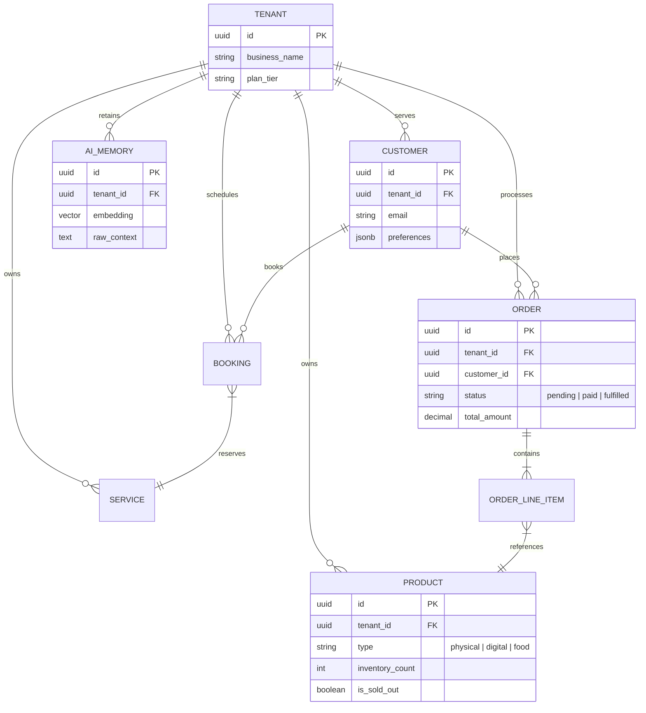

# OHC Core System Data Model Architecture

## 1. Problem Statement
For OneHumanCorp to empower non-technical users to launch and manage businesses in minutes, the underlying data model must securely isolate multi-tenant data while supporting a diverse array of business types (physical goods, services, digital downloads, food/beverage). The AI agents require efficient access patterns to query historical context without violating tenant boundaries. Currently, the lack of a formalized, scalable entity relationship design risks data leakage, poor query performance, and architectural debt as new AI departments are introduced.

## 2. Research Report
**Market Context:**
- **Shopify:** Complex relational model designed for e-commerce, heavily reliant on GraphQL for custom access. Often requires technical expertise to structure custom metafields.
- **Wix/Squarespace:** Simpler, but siloed data models (e.g., reservations don't easily talk to physical inventory without heavy app integrations).
- **OHC Opportunity:** A unified model where an `Order` for a physical cake, a `Booking` for a repair service, and a `Subscription` for a music lesson are all treated as top-level transactional entities, securely isolated by PostgreSQL RLS, enabling the AI agents to reason about the business holistically.

**Key Invariants Required:**
1. **Strict Multi-Tenancy:** Every table must include `tenant_id`. Every query must enforce `tenant_id` at the database level via Row Level Security (RLS). A user can *never* query or mutate data belonging to another tenant.
2. **Unified Transaction Log:** Operations must track all state changes to entities (Orders, Bookings) to provide the AI departments (e.g., Business Advisory, Finance) with a coherent event history.
3. **Agent Memory Segregation:** Long-term vector memory (`autodream_memories`) must be strictly partitioned by `tenant_id` to prevent cross-business hallucination.

## 3. Design Doc

### 3.1 Entity Relationship Diagram

### 3.2 Access Patterns
- **Mobile App (Owner View):** Fetches dashboard summaries (e.g., "Orders Today") via highly optimized, read-only materialized views, always filtered by the authenticated user's `tenant_id`.
- **Operations Agent:** Subscribes to new `ORDER` inserts. Validates `ORDER_LINE_ITEM` against `PRODUCT.inventory_count`. Updates `PRODUCT.is_sold_out` if stock hits zero.
- **Customer Success Agent:** Queries `CUSTOMER.preferences` and historical `ORDER` data to draft personalized email responses or Instagram DM replies.
- **Business Advisory Agent:** Runs weekly aggregate queries across `ORDER` and `BOOKING` to generate the plain-language health report.

### 3.3 Migration Strategy
- **Initial Setup:** Implement base schema with strict RLS policies ensuring `tenant_id` matches the active session context.
- **Evolution:** Use JSONB columns for flexible data requirements initially (e.g., `CUSTOMER.preferences`, product variants), promoting frequently queried JSONB keys to dedicated indexed columns as access patterns solidify.
- **Versioning:** All schema changes must be applied via Goose migrations (`-- +goose Up` / `-- +goose Down`) with zero-downtime execution guarantees.

## 4. Implementation Prompt
**Task for Implementer:**
Implement the base PostgreSQL schema for the OHC data model described above.
- **CUJ:** A new business signs up. The system creates a `Tenant` record. The user then creates a `Product` and receives an `Order` from a `Customer`. All inserts and selects must strictly enforce `tenant_id` Row Level Security.
- **Acceptance Criteria:**
    1. Goose migration files are created defining the `tenants`, `products`, `customers`, and `orders` tables.
    2. PostgreSQL `ENABLE ROW LEVEL SECURITY` is applied to all tables.
    3. RLS policies are created restricting `SELECT`, `INSERT`, `UPDATE`, and `DELETE` to the active `tenant_id` context.
    4. Integration tests verify that queries attempting to access data outside the mock tenant context are denied by the DB.

## 5. Metadata
**Priority:** P0 (Critical - Foundational Architecture)
**Estimated Scope:** Medium
