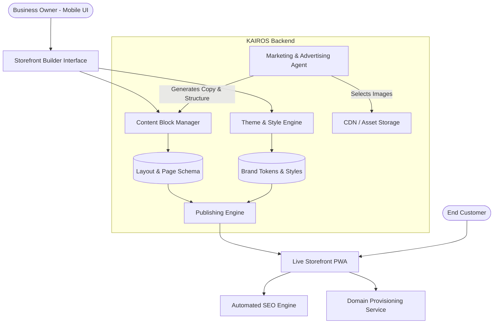

# KAIROS OHC Website & Storefront Builder Architecture

## Title
**Architectural Blueprint: AI-Native Website & Storefront Builder**

## Problem Statement
Small business owners (our core personas like Maya the Baker and Carlos the Handyman) find traditional website builders (Shopify, Wix, Squarespace) overwhelming. They require technical knowledge, design sensibility, and time—resources our users do not have. They need a zero-configuration, AI-assisted platform where a professional, SEO-optimized, and fully functional storefront can be generated in under 10 minutes, entirely from a mobile phone, without dragging and dropping complex elements or writing a single line of code. The platform must feel premium, intuitive, and "just work."

## Research Report
Current market solutions treat website building as a desktop-first, drag-and-drop exercise.
- **Shopify:** Powerful but requires significant setup time (30-60+ mins), understanding of themes, and often a desktop for efficient management.
- **Wix/Squarespace:** Highly customizable but prone to user-generated design errors ("ugly websites"). Mobile editing is an afterthought or heavily restricted.
- **GoDaddy (Airo):** Basic AI generation but limited depth and rigidity in ongoing management.

**OHC Differentiation:**
1. **Mobile-First Native Management:** 100% of the building and management experience happens on a 375px viewport. No desktop required.
2. **AI as the Designer:** The user provides intent (e.g., "I sell custom vegan cakes in Brooklyn"); the AI generates the copy, selects the theme, structures the layout, and configures the store.
3. **Guardrailed Customization:** Users customize via content blocks and style tokens (colors, typography) rather than pixel-perfect positioning, ensuring the site always looks premium (Glassmorphism, correct spacing).

## Design Doc

### 1. High-Level Concept & Components

The Storefront Builder is not a generic WYSIWYG editor. It is a structured content management engine powered by AI.

- **Content Blocks:** Pre-designed, responsive, and data-bound UI components. Examples include:
    - **Hero Block:** Headline, subheadline, primary CTA, background image.
    - **Product Grid:** Automatically syncs with the user's catalog.
    - **Service/Booking Block:** Integration with the Operations department for scheduling.
    - **Testimonial/Review Block:** Automatically pulls 5-star reviews from Customer Success data.
    - **Contact/Lead Form:** Feeds directly into the Sales & Acquisition department.
- **Themes & Style Tokens:** Global design settings (color palettes, font pairings—Outfit/Inter) that ensure aesthetic excellence. Users select a "vibe" rather than picking hex codes.
- **AI Copilot (The Promoter):** Autonomously writes initial copy, suggests image layouts, and recommends structural changes based on business type.

### 2. Architecture Diagram

### 3. Mobile UX Flow (375px First)

**The 10-Minute Onboarding Flow:**
1. **Intent Collection:** AI asks 3 simple questions via a conversational UI:
   - "What's the name of your business?"
   - "What do you sell?" (e.g., Services, Physical Goods)
   - "Describe your vibe in one word." (e.g., Elegant, Playful, Professional)
2. **Instant Generation:** AI shows a loading state ("The Promoter is designing your site..."). In seconds, a fully functional homepage is presented.
3. **Review & Tweak:** User sees the live preview on their 375px screen.
   - Tap a text block -> AI offers 3 alternate headlines.
   - Tap an image -> Opens camera to snap a product, or AI suggests stock.
   - Tap "Vibe" -> Cycles through curated color/font tokens.
4. **Publish:** User taps "Go Live". Site is published instantly to an `[alias].ohc.site` subdomain.

### 4. Key Mechanics & Workflows

**A. Publishing Workflow (Draft -> Live)**
- **Draft State:** Changes made in the builder are saved as an isolated JSON schema version. The live site is unaffected.
- **Publish Action:** Merges the draft schema to the active 'live' pointer. Triggers a background job to purge CDN caches and re-render static assets if necessary.
- **Rollback:** Users can revert to previously published versions with one tap.

**B. Automated SEO**
- **Meta Generation:** "The Promoter" agent automatically generates `title`, `description`, and `og:image` tags based on the page content and business intent.
- **Sitemap & Structured Data:** Automatically generates and submits `sitemap.xml` and injects JSON-LD schema (e.g., `LocalBusiness`, `Product`, `Service`) without user intervention.
- **Performance:** Image assets are automatically compressed to WebP and lazy-loaded to ensure high Core Web Vitals scores.

**C. Custom Domain Provisioning**
- **Free Tier:** Users get `mybusiness.ohc.site`.
- **Paid Tier (Starter/Pro):**
  - User taps "Connect Domain".
  - System initiates DNS verification and automated SSL certificate provisioning (e.g., via Let's Encrypt or Cloudflare integration).
  - Background polling checks DNS propagation; user receives a push notification when the domain is active.

### 5. AI Integration Points

- **Initial Setup:** Generates the complete site schema (blocks, copy, theme) from a brief text prompt.
- **Continuous Improvement:** "The Advisor" department analyzes traffic. If bounce rate is high, it suggests: "Let's change your Hero image—I've drafted a new option."
- **Content Sync:** When a user adds a new product in the Operations department, the Storefront Builder automatically adds it to the active Product Grid block.

## Implementation Prompt

**To the Implementer Swarm:**
Your objective is to implement the foundational backend and frontend systems for the AI-Native Storefront Builder, focusing strictly on the non-technical user experience on mobile devices.

**Critical User Journeys (CUJs) to Implement:**
1. **Instant Generation:** Create the API layer that accepts business intent and returns a complete, renderable JSON page schema (content blocks + style tokens).
2. **Mobile Builder UI:** Build the Flutter/Slint UI components for the builder interface. It must strictly adhere to the 375px mobile layout. Implement the "tap-to-tweak" interaction model for replacing AI-generated copy and images.
3. **Publishing Engine:** Implement the draft-to-live publishing flow, ensuring atomicity and immediate availability on the OHC subdomain.
4. **SEO Automation:** Ensure the rendering engine automatically generates and serves valid meta tags and JSON-LD based on the live page schema.

**Acceptance Criteria:**
- The end-to-end flow from "New Business" to "Live Site" must be completed entirely within the mobile UI without horizontal scrolling or desktop-specific paradigms.
- The generated site must score >90 on Lighthouse performance and SEO metrics by default.
- Ensure all AI generation is abstracted behind the "Promoter" department persona, keeping the experience conversational and jargon-free.
- **Do not** build a free-form drag-and-drop canvas. Restrict customization to predefined, data-bound content blocks to maintain design integrity.
- All code must include 100% unit test coverage and E2E Playwright tests covering the full CUJ from login to published site.

**Priority:** P1
**Estimated Scope:** Large
