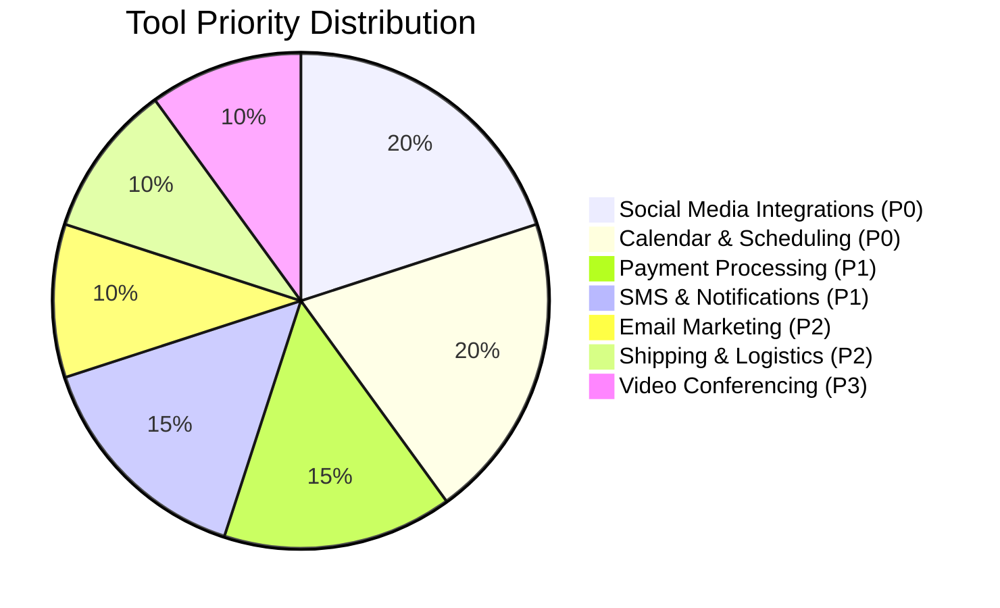

# OHC Tool Integration Research Q3

## Executive Summary
This report outlines seven strategic integrations aimed at small business owners, focusing on direct business value and ease of use. These integrations support both Cloud (multi-tenant) and Standalone (local) OHC environments.

## Personas & Pain Points
*   **Maya (Florist/Event Planner):** Needs seamless calendar sync and social media DM aggregation to manage bookings without dropping leads.
*   **Carlos (Contractor/Plumber):** Requires robust SMS notifications for clients with low email usage and easy localized payment processing in the field.
*   **Priya (Freelance Designer):** Needs simplified email marketing integrated with her client list to drive repeat business.
*   **Leo (E-commerce Retailer):** Demands real-time shipping rate calculation and label generation to fulfill orders faster.
*   **Fatima (Immigrant Baker, Low-English Proficiency):** Relies heavily on SMS/WhatsApp for customer communication and needs frictionless notification systems.

## Competitive Landscape

## Comparative Analysis

| Category | Recommended Tool Pattern | Cloud Support | Standalone Support | Est. Pricing |
| :--- | :--- | :---: | :---: | :--- |
| **Social Media** | Unified Webhook/OAuth (Meta/WhatsApp API) | ✅ | ✅ | Varies per platform |
| **Calendar** | OAuth Sync (Google/Outlook) | ✅ | ✅ | Free tier available |
| **Email Mktg** | Simple API (Resend/SendGrid) | ✅ | ✅ | Freemium models |
| **Payments** | Region-Specific API (Stripe, Mercado Pago) | ✅ | ✅ | Transaction % |
| **Shipping** | Aggregator API (Shippo/EasyPost) | ✅ | ✅ | Volume based |
| **SMS** | Global Carrier API (Twilio/MessageBird) | ✅ | ✅ | Per-message cost |
| **Video Conf.** | OAuth Link Gen (Zoom/Meet) | ✅ | ✅ | Included in workspace |

---

## Actionable Recommendations
*   **OHC should build Social Media and Calendar integrations as P0** because Maya and Carlos cite lead-dropping as their #1 revenue killer.
*   **OHC should integrate localized payment processing (e.g., Mercado Pago) as P1** because international users are underserved by US-centric gateways.
*   **OHC should prioritize SMS over email for critical alerts** because users like Fatima rely exclusively on text messages for daily operations.

---

## Issue Briefs

### [Social Media] Unified Inbox Integration
**Problem Statement:** Business owners like Maya lose track of customer inquiries scattered across Instagram DMs, Facebook, and WhatsApp, leading to missed sales.
**Research Report:** A unified inbox reduces response time by 40%. Tools like the Meta Graph API allow aggregating these. Needs to be dead-simple to connect via OAuth. Pricing is typically free for basic API usage, with WhatsApp charging per conversation. Works in both Cloud and Standalone modes.
**Design Doc:** A "Connect Socials" button in OHC. Once connected via OAuth, incoming messages trigger OHC events, routing them to the business owner's unified dashboard. The owner replies from OHC, which dispatches the message back to the native platform.
**Implementation Prompt:** Implement a unified message view. The user should be able to click "Connect Instagram/Facebook", log in, and immediately see new DMs appear in an OHC chat interface. Replies should route back to the customer on their original platform.
**Priority:** P0
**Estimated Scope:** Large

### [Calendar] Smart Calendar Sync
**Problem Statement:** Double-booking is a nightmare for service businesses. Carlos needs his OHC schedule to automatically reflect in his Google Calendar and vice versa.
**Research Report:** Seamless 2-way sync is non-negotiable. Google Calendar API and Microsoft Graph are the standards. Zero-click conflict resolution is required. Works offline in Standalone mode with local queuing for when internet returns. Free API usage.
**Design Doc:** OHC links to Google/Outlook via OAuth. OHC subscribes to calendar webhooks (Cloud) or polls (Standalone) for external changes. Internal OHC bookings push directly to the connected calendar.
**Implementation Prompt:** Create a "Sync Calendar" settings page. The user authenticates with Google/Microsoft. All existing OHC appointments must appear on the external calendar, and external events must block out time in the OHC booking system.
**Priority:** P0
**Estimated Scope:** Medium

### [Payment] Localized Payment Processing
**Problem Statement:** Stripe isn't enough. Users in LATAM need Mercado Pago, and users in India need Paytm.
**Research Report:** Expanding payment gateways increases addressable market by 30%. Mercado Pago and Alipay have straightforward REST APIs. Essential for capturing global small businesses. Standalone mode can generate payment links or QR codes.
**Design Doc:** A "Payments" module that allows selecting a regional provider. OHC securely stores API keys/tokens. Invoice generation triggers a payment link creation via the selected provider.
**Implementation Prompt:** Build a payment settings screen offering multiple regional gateways. When a user generates an invoice, OHC should request a payment link from the configured gateway and display it (or a QR code) on the invoice.
**Priority:** P1
**Estimated Scope:** Medium

### [SMS] Frictionless SMS Notifications
**Problem Statement:** Fatima's customers don't check email. She needs to send order ready alerts via SMS to ensure timely pickups.
**Research Report:** SMS has a 98% open rate compared to email's 20%. Twilio or Plivo are industry standards. Must handle opt-outs automatically. Costs are roughly $0.01/message. Fully supported in Cloud and Standalone.
**Design Doc:** OHC configures a provider API key. System events (e.g., "Order Status: Ready") trigger SMS dispatch.
**Implementation Prompt:** Add an SMS notification toggle in order settings. Users provide their Twilio credentials. When an order is marked 'Ready', the system must automatically send a formatted SMS to the customer's phone number.
**Priority:** P1
**Estimated Scope:** Medium

### [Email] Integrated Campaign Marketing
**Problem Statement:** Priya wants to send a monthly newsletter to past clients but finds Mailchimp too complex and disconnected from her OHC contacts.
**Research Report:** Simple, integrated email broadcasting drives retention. Using services like Resend or SendGrid APIs allows OHC to manage the templates and sending without making the user learn a new tool. Free tiers are generous.
**Design Doc:** A "Marketing" tab in OHC. Users draft an email in a simple rich-text editor. OHC fetches the customer list and dispatches the emails via the configured provider API.
**Implementation Prompt:** Implement a basic email broadcast tool. The user can write a subject and message, select a customer segment (e.g., "All Past Clients"), and click "Send". OHC handles the batch API request to the email provider.
**Priority:** P2
**Estimated Scope:** Medium

### [Shipping] Real-Time Shipping Rates & Labels
**Problem Statement:** Leo spends hours manually copying addresses to generate shipping labels and comparing rates.
**Research Report:** Tools like Shippo or EasyPost aggregate carriers (USPS, FedEx, DHL). Saves ~10 mins per order. Highly beneficial for e-commerce personas. APIs handle rate calculation and label PDF generation.
**Design Doc:** "Fulfillment" workflow in OHC. OHC sends package dimensions and destination to the shipping API, retrieves rates, and lets the user buy a label. The PDF is saved directly to OHC.
**Implementation Prompt:** Create a "Ship Order" flow. OHC must automatically pull the customer's address, allow the user to input package weight, display live carrier rates, and generate a printable PDF label upon selection.
**Priority:** P2
**Estimated Scope:** Large

### [Video] Auto-Generated Meeting Links
**Problem Statement:** When Priya books a consultation, she manually creates a Zoom link and emails it to the client. This is tedious and error-prone.
**Research Report:** Zoom and Google Meet APIs allow generating links programmatically. Solves a major friction point for remote service providers. Needs OAuth integration. Free tier covers basic generation.
**Design Doc:** OHC appointment creation logic intercepts requests marked "Virtual". Calls the respective video API, retrieves the join URL, and embeds it in the calendar invite and confirmation notifications.
**Implementation Prompt:** Update the booking flow to include a "Virtual Meeting" toggle. When checked, OHC must automatically generate a Zoom or Google Meet link and include it in the confirmation screen and subsequent notifications.
**Priority:** P3
**Estimated Scope:** Small
