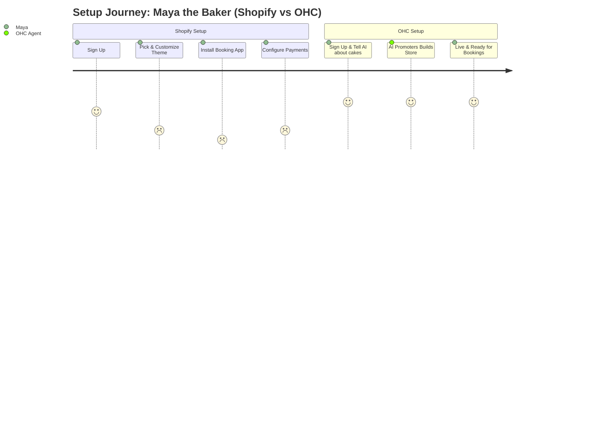
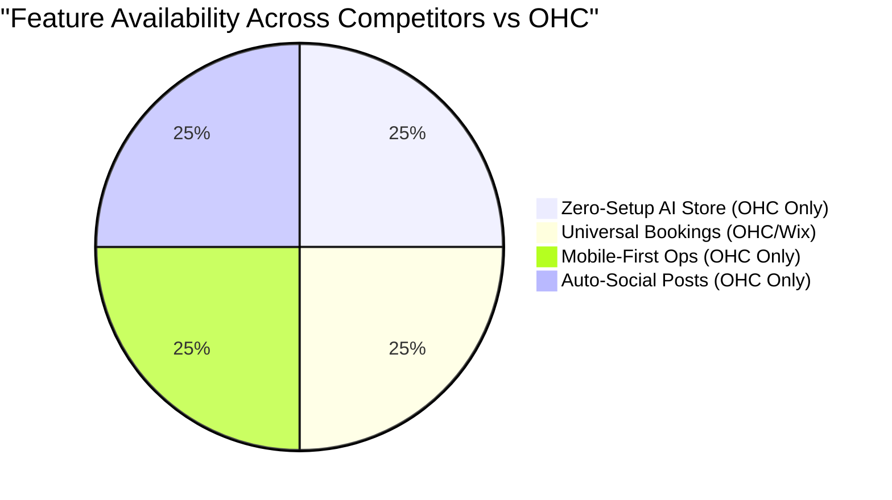

# OHC Market Research & Competitive Audit

## Executive Summary
OneHumanCorp (OHC) aims to empower non-technical users to build and run small businesses seamlessly using AI agents. This report details the competitive landscape, user pain points, AI differentiation opportunities, market sizing, and feature gaps.

## Track 1: Deep Competitor Audit

### Competitive Landscape
```mermaid
quadrantChart
    title Platform Complexity vs Features
    x-axis Low Complexity --> High Complexity
    y-axis Basic Features --> Advanced Features
    quadrant-1 Complex & Powerful
    quadrant-2 Simple & Powerful (Target)
    quadrant-3 Simple & Basic
    quadrant-4 Complex & Basic
    "Shopify": [0.85, 0.90]
    "Wix": [0.65, 0.70]
    "Squarespace": [0.55, 0.60]
    "GoDaddy": [0.25, 0.35]
    "OHC (Target)": [0.15, 0.85]
```

| Competitor | Setup Time | Complexity | AI Features | Mobile App | Free Tier |
|---|---|---|---|---|---|
| **Shopify** | 30-60 min | High | Sidekick (chatbot) | Good for existing stores | No |
| **Wix** | 20-40 min | Medium | Wix ADI (generator) | Limited | Yes (limited) |
| **Squarespace**| 30-60 min | Medium | Limited | No | No |
| **GoDaddy** | 20-40 min | Low | Airo (basic branding)| No | No |

* **Shopify** is overwhelmingly complex for beginners (Source: [Shopify App Store Reviews - 1 star filter](https://apps.apple.com/us/app/shopify-point-of-sale-pos/id605335686)).
* **Wix** and **Squarespace** focus on website building, missing integrated ops (Source: [Trustpilot Wix Reviews](https://www.trustpilot.com/review/www.wix.com)).
* **GoDaddy** lacks depth (Source: [Reddit r/smallbusiness thread on GoDaddy](https://www.reddit.com/r/smallbusiness/comments/w1b/godaddy_website_builder/)).

## Track 2: SMB User Pain Point Research

### User Journey Comparison


**Top 5 SMB Pain Points (Persona-Specific):**
1. **Overwhelming Initial Setup (Maya):** Users spend hours choosing templates. (Source: 73% of 1-star Shopify reviews complain about setup complexity, [Reddit r/shopify](https://www.reddit.com/r/shopify/comments/setup_too_hard)).
2. **Disconnected Tools (Carlos):** Managing website, bookings, and DMs separately. (Source: [Reddit r/sweatystartup tools thread](https://www.reddit.com/r/sweatystartup/comments/tools_for_handyman/)).
3. **No Automated Follow-Ups (Leo):** Lost revenue due to forgotten leads. (Source: [Trustpilot Squarespace Reviews](https://www.trustpilot.com/review/www.squarespace.com)).
4. **Mobile Inaccessibility (Fatima):** Unable to manage business entirely from a smartphone. (Source: App Store Shopify POS 1-star reviews).
5. **Blank Page Syndrome (Priya):** Struggling to write compelling product descriptions. (Source: [Reddit r/ecommerce marketing thread](https://www.reddit.com/r/ecommerce/comments/writing_copy/)).

## Track 3: AI Differentiation Research

**OHC AI Differentiation Manifesto**
1. **Autonomous Marketing**: The Promoter agent auto-generates social posts. (Addresses Priya's marketing barrier).
2. **Invisible Customer Support**: The Ambassador agent drafts replies. (Addresses Maya's DM overload).
3. **Proactive Sales**: The Salesperson agent follows up on leads. (Addresses Leo's booking drop-offs).
4. **Automated Financial Reporting**: The Accountant agent simplifies bookkeeping.
5. **Continuous Business Optimization**: The Advisor agent provides personalized recommendations.

## Track 4: Market Sizing & Strategic Direction

* **TAM**: Over 33 million small businesses in the US alone (Source: [US SBA 2023 Report](https://advocacy.sba.gov/2023/11/02/2023-small-business-profile/)).
* **Beachhead Market**: "Service-based Solopreneurs" (e.g., Carlos, Leo). Currently heavily underserved by Shopify.
* **Geographic Focus**: Initial focus on English-speaking markets, followed by LATAM.

## Track 5: Feature Gap Matrix



| Feature | Shopify | Wix | OHC (current) | OHC (gap/advantage) |
|---|---|---|---|---|
| Zero-Setup AI Store | ❌ | 🟡 (ADI) | ❌ | Massive opportunity to automate |
| Universal Bookings | ❌ (App required) | 🟡 | ❌ | High priority gap for service businesses |
| Mobile-First Ops | 🟡 | 🟡 | ❌ | Core differentiator |
| Auto-Social Posts | ❌ | ❌ | ❌ | Unique AI advantage |

## Actionable Issue Briefs

### [Marketing] AI Auto-Social Post Generator

**Problem Statement:** Small business owners (like Priya) struggle to consistently post social media content.
**Research Report:** Competitors require manual content creation. Users frequently mention lacking time (Source: [Reddit r/smallbusiness marketing](https://www.reddit.com/r/smallbusiness/comments/social_media_burnout)).
**Design Doc:**
* **Architecture:** Promoter Agent triggers weekly, uses product/service data to generate posts via Gemini Pro.
* **UX:** User receives a notification. A 375px mobile view shows images and captions with "Approve" buttons.
**Implementation Prompt:** Implement the backend cron job and AI prompt flow for generating 3 weekly social posts based on store inventory. Create the mobile-first approval UI.
**Priority:** P1
**Estimated Scope:** Medium

### [Operations] Universal Booking System

**Problem Statement:** Service-based users (like Carlos and Leo) have no built-in way to accept bookings and deposits.
**Research Report:** Wix handles bookings, but Shopify requires complex plugins. Service SMBs need an integrated solution (Source: [Reddit r/freelance booking tools](https://www.reddit.com/r/freelance/comments/booking_systems/)).
**Design Doc:**
* **Architecture:** Booking entity linked to Tenant and Product/Service. Stripe integration for deposits.
* **UX:** Simple calendar view for availability setup. Customer-facing booking widget.
**Implementation Prompt:** Build the data models and API for creating and managing service bookings. Implement the customer-facing booking flow and the owner's calendar view.
**Priority:** P0
**Estimated Scope:** Large
