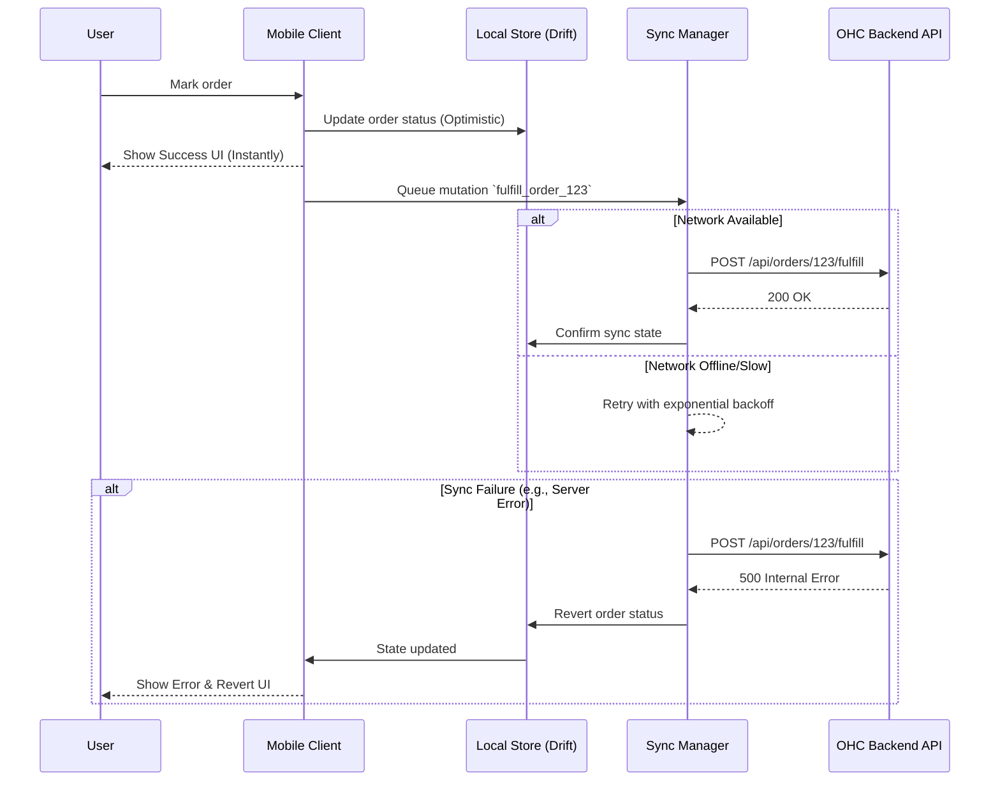

<div markdown="1" style="backdrop-filter: blur(20px) saturate(200%); font-family: 'Outfit', 'Inter', sans-serif; background: rgba(255, 255, 255, 0.03);">

# Mobile-First Architecture Review

## Title
[architecture] Mobile-First Platform Assessment and Overhaul Strategy

## Problem Statement
While OHC targets non-technical small business owners (Maya, Carlos, Priya, Leo, Fatima), the current architecture does not rigidly enforce a mobile-first standard. Users managing their businesses on 375px screens experience high latency on poor networks, excessive data payloads, and UI workflows that have desktop-centric assumptions (e.g., complex multi-step forms without optimistic UI updates or native mobile inputs). If the system does not support a fast, resilient mobile experience, our target personas will abandon the platform.

## Research Report
*   **Target Market Comparison:**
    *   *Shopify:* App-heavy, complex for absolute beginners. Good mobile management but requires a learning curve.
    *   *Wix & Squarespace:* Primarily desktop-first builders. Mobile editing is a secondary feature and often clunky.
    *   *GoDaddy:* Basic mobile builder, lacks deep AI integration.
    *   *OHC:* Must differentiate by offering a completely seamless, natively-feeling mobile PWA/Flutter app that works flawlessly offline and under low bandwidth.
*   **Key Issues Identified in OHC Architecture:**
    *   **Network Resilience:** Lack of an explicit optimistic UI strategy for critical writes (e.g., updating inventory, approving AI agent drafts).
    *   **Data Footprint:** No mandatory lazy loading or localized compression strategy explicitly enforced at the mobile client level.
    *   **Offline Capability:** Read-only dashboard needs clearer boundaries and local caching policies (e.g., SQLite/Hive for Flutter).
    *   **Touch/Layout Constraints:** While documented, programmatic enforcement of 44x44px touch targets and 375px base width needs automated UI verification.

## Design Doc

### Key Architectural Decisions
1.  **Optimistic UI with Rollback:** All critical mutations (e.g., accepting an order, marking a booking paid) will immediately update the local state. If the API (via retry queue) fails, the state rolls back, alerting the user.
2.  **Offline-First Read Replicas:** The mobile client will use a local database (e.g., Drift or Hive in Flutter) to cache the last known state of the dashboard, orders, and customer messages.
3.  **Low-Data Mode Profiles:** Implement automatic detection of slow networks to trigger Low-Data mode (disables auto-playing videos, uses aggressive image compression/thumbnails, defers non-critical AI background synchronization).

### Architecture Diagram


### Mobile UX Flow
1.  **Dashboard Load:** User opens the app. The UI immediately renders from the `LocalDB`. A background sync fetches new events (new orders, AI draft replies).
2.  **Action Execution:** User taps a 44x44px button to approve an AI-generated quote. The UI updates instantly. The Native keyboard (numeric) was used to quickly edit the price.
3.  **Offline Indicator:** If connection drops, a subtle, premium Glassmorphism banner appears: "Working offline. Changes will sync when reconnected."

### AI Agent Integration Points
*   **Customer Success Agent:** Generates drafts for messages. The drafts are synced to the mobile client in the background and cached locally so the user can review them offline.
*   **Business Advisory Agent:** Compiles weekly reports into lightweight JSON payloads that are rendered natively on the client, avoiding heavy HTML/WebView components.

## Implementation Prompt
**Task for Implementer Agent:**
Implement the foundational Optimistic UI Sync Queue in the Flutter client architecture.
1. Create a `SyncQueueManager` that intercepts API mutation requests.
2. Ensure it updates the local state provider (e.g., Riverpod/Zustand) immediately.
3. Queue the request in local storage and attempt to sync with the backend.
4. If the sync fails after 3 retries, revert the local state and notify the user via a snackbar.
Ensure all UI components adhere strictly to the 44x44px touch target rule and test on a simulated 375px viewport.

## Priority
P1

## Estimated Scope
Medium
</div>

```yaml
issue_title: "[architecture] Implement Optimistic UI Sync Queue for Mobile-First Resilience"
issue_priority: "P1"
issue_description: "Design and implement an offline-capable sync queue in the mobile client to support optimistic UI updates for critical actions (e.g., order fulfillment). This ensures the app feels instantaneous and functions reliably on poor network connections, reverting state on ultimate failure."
issue_todo_list:
  - [ ] Implement local state caching strategy (e.g., Drift/Hive)
  - [ ] Create SyncQueueManager for offline queuing and background retries
  - [ ] Implement optimistic UI updates and rollback mechanisms
  - [ ] Add 375px viewport and 44x44px touch target verification tests
issue_label: ["research", "high-impact", "mobile"]
```
