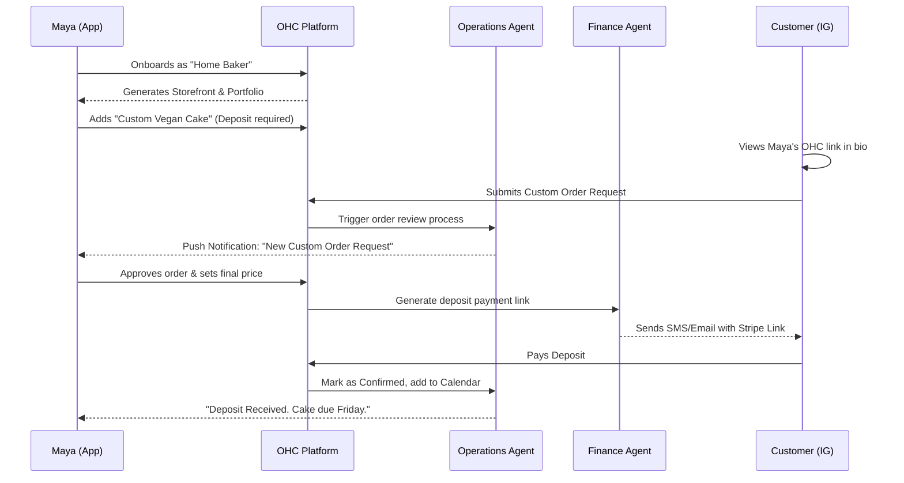
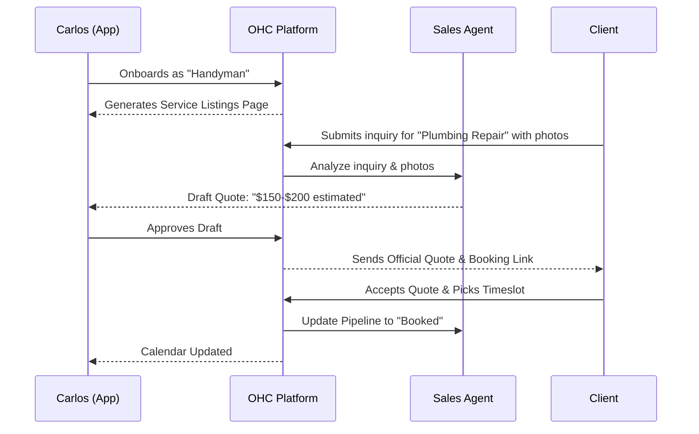
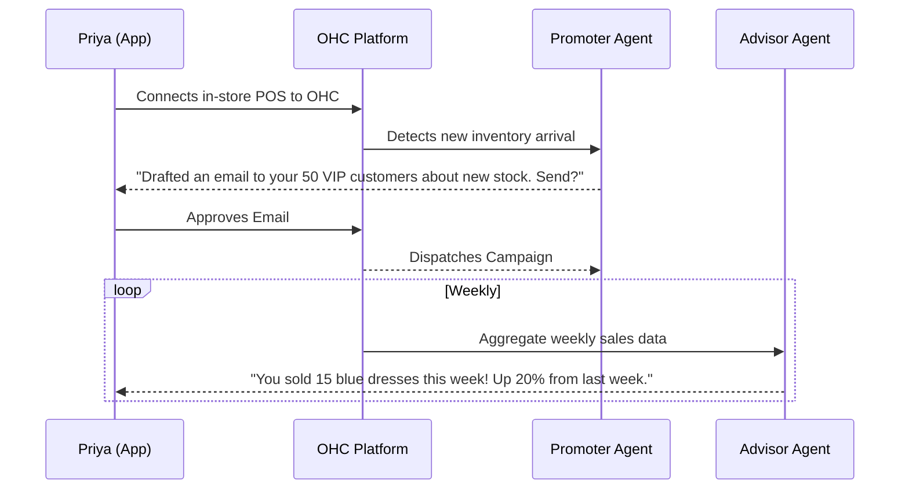
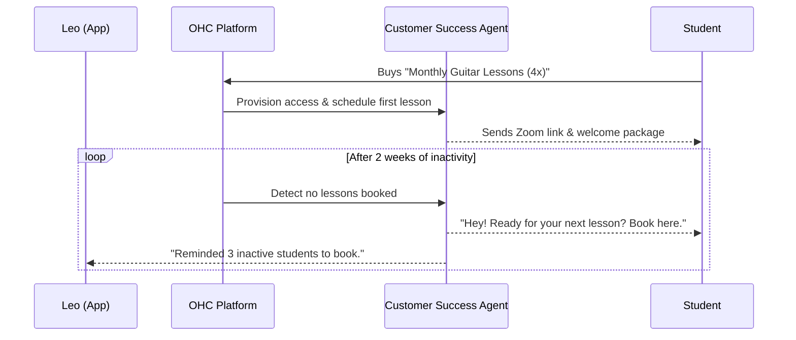
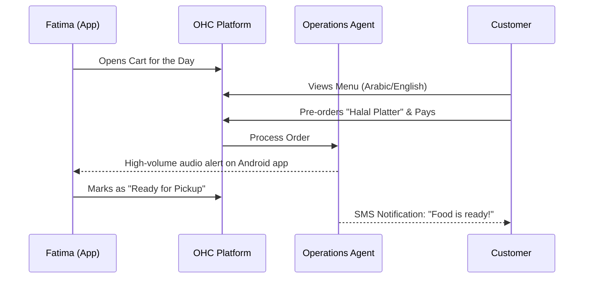

# [architecture]_business_journey_architecture

## Title
Business Journey Architecture: End-to-End Persona Lifecycle & AI Integration

## Problem Statement
Non-technical small business owners (like bakers, handymen, boutique owners, music tutors, and food cart operators) currently face a highly fragmented ecosystem when attempting to start and grow their businesses online. They are forced to stitch together a website builder (Wix/Squarespace), an e-commerce platform (Shopify), a booking system (Calendly), and various marketing tools. The cognitive load required to understand these disjointed platforms, along with the technical jargon they use, creates immense friction. OHC's mission is to guide these users from zero to a fully functional, AI-managed business in under 10 minutes from their mobile phones. The lack of a unified, end-to-end business journey architecture prevents the seamless integration of our AI agents across the acquisition, onboarding, activation, retention, revenue, and referral phases.

## Research Report
### Competitive Landscape
*   **Shopify:** Powerful, but geared towards semi-technical users and strictly e-commerce. Setup takes 30-60 minutes on desktop. The "Sidekick" AI is mostly conversational, rather than acting as autonomous infrastructure.
*   **Wix/Squarespace:** Complex drag-and-drop builders that break easily on mobile. E-commerce and booking add-ons are clunky. Setup requires significant time investment.
*   **GoDaddy:** Basic site generation, but limited functionality for complex operations like split payments or variant inventory.
*   **OHC Differentiation:** OHC is mobile-first, zero-technical-knowledge required, and uses AI not as an assistant, but as functional "Departments" (e.g., The Promoter, The Manager) running invisibly in the background.

### Friction Points Identified
1.  **Blank Canvas Paralysis:** Users abandon onboarding when asked to "design" a site or define database-like structures (e.g., SKU tracking).
2.  **App Switching:** Having to open a separate app for Instagram DMs, another for Stripe payments, and another for Calendar bookings causes missed opportunities.
3.  **Analytics Jargon:** "Bounce rate" and "CTR" mean nothing to Carlos the handyman. They need actionable, plain-language insights ("You have 3 unanswered quotes").
4.  **Mobile Management:** Most platforms allow mobile *viewing*, but creating a service listing with a deposit requirement on a 375px screen is nearly impossible on competitors' platforms.

## Design Doc
### Architecture Principles
1.  **Mobile-First UX (375px):** All onboarding and management flows must be natively designed for phone screens.
2.  **AI as Infrastructure:** Agents trigger proactively based on business lifecycle events (e.g., "The Advisor" triggers on Sunday night to send the weekly health report).
3.  **Progressive Disclosure:** Ask only for what is immediately necessary to go live (Name, Business Type, 1 Product/Service). Defer complex setup (custom domains, tax settings) until the user has achieved their first success (Activation).

### The 6-Phase Business Journey

#### 1. Acquisition
*   **Goal:** User discovers OHC and understands the value proposition instantly.
*   **Flow:** Organic search/Instagram Ad → Mobile Landing Page → 1-Click "Start My Business" CTA.
*   **AI Integration:** Marketing & Advertising ("The Promoter") uses AI to auto-generate personalized landing page variants based on the ad creative the user clicked.

#### 2. Onboarding
*   **Goal:** Zero to Live in < 10 minutes.
*   **Flow:** Chat-like interface collecting basics: Name, Business Type (e.g., "Home Baker", "Handyman"), Vibe/Colors.
*   **AI Integration:** The Promoter generates a fully functioning site. Operations ("The Manager") sets up the initial default product/service listing.

#### 3. Activation
*   **Goal:** First product added, first payment received (Aha! Moment).
*   **Flow:** Guided UI prompting the user to share their generated link. Walkthrough of the first order.
*   **AI Integration:** Customer Success ("The Ambassador") drafts an initial "Welcome" or "Grand Opening" post for the user to share on social media.

#### 4. Retention
*   **Goal:** Daily active use.
*   **Flow:** Push notifications for new orders/inquiries. Plain-language daily summary.
*   **AI Integration:** Business Advisory ("The Advisor") sends weekly plain-language reports. Customer Success auto-drafts replies to incoming customer inquiries.

#### 5. Revenue
*   **Goal:** Upgrade from Free to Starter/Pro.
*   **Flow:** Frictionless upgrade path when limits (e.g., 10 products, 100 AI actions) are approached.
*   **AI Integration:** The Advisor analyzes usage and suggests upgrading based on ROI ("Upgrading to Starter will let The Salesperson automate quotes, saving you 5 hours a week").

#### 6. Referral
*   **Goal:** Organic growth.
*   **Flow:** "Powered by OHC" badge on free tier sites. Simple link sharing for boutique owners to invite friends.
*   **AI Integration:** The Promoter generates tailored referral links and suggested messages.

### Mermaid.js Sequence Diagrams

#### Journey 1: Maya (The Home Baker) - Product & Order Flow

#### Journey 2: Carlos (The Handyman) - Booking & Quote Flow

#### Journey 3: Priya (The Boutique Owner) - Activation & Retention

#### Journey 4: Leo (The Music Tutor) - Subscription & Follow-up

#### Journey 5: Fatima (The Food Cart) - Pre-order & Pickup

## Implementation Prompt
**For Implementer Agent:**
Implement the end-to-end "Guided Onboarding & Dashboard" flow for the mobile application. Ensure the UI adheres to the 375px mobile-first requirement, using the OHC Premium Token library (Glassmorphism, Outfit/Inter fonts).

1. Create a conversational onboarding UI that accepts the user's business name and category, and immediately provisions a tenant.
2. Develop a unified dashboard view that aggregates actionable items from the AI Departments (e.g., "The Salesperson has a drafted quote for you to review", "The Advisor's weekly report is ready").
3. Ensure no complex setup (domain routing, tax forms) is required before the user can view their generated storefront.
4. Emphasize plain-language copy (pass the "grandmother test"). Do not expose database IDs, complex error codes, or technical marketing jargon.

## Priority
P0

## Estimated Scope
Large
