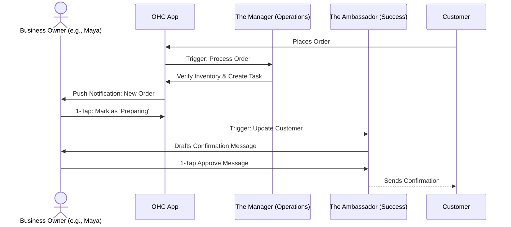
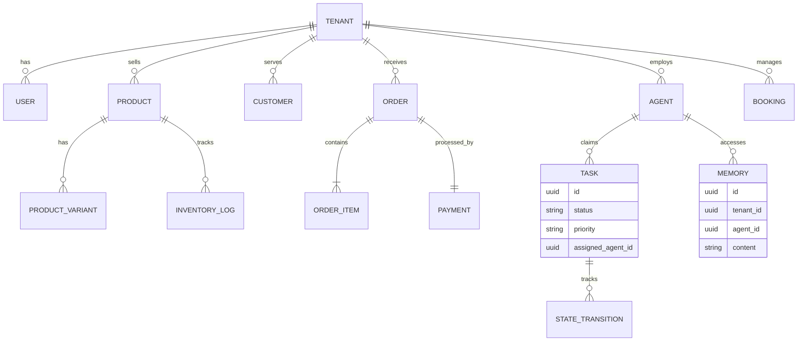

# Comprehensive Architectural Research Report: OHC Platform Evolution

## Executive Summary
OneHumanCorp (OHC) is the platform where anyone can launch, run, and grow a real small business without touching a single line of code or reading a manual. The platform is designed for non-technical small business owners like Maya (baker), Carlos (handyman), Priya (boutique), Leo (music tutor), and Fatima (food cart). It must guide users from **zero → live business in under 10 minutes**, with AI handling all the complexity invisibly in the background.

This report consolidates architectural research across the entire platform, addressing the Business Journey, Data Model, AI Agent Departments, Website & Storefront Builder, Mobile-First Constraints, and Multi-Tenant SaaS Tiers. It evaluates every design decision against our core personas and the "Grandmother Test."

## Persona-Specific Pain Points and Business Impact

*   **Maya (Home Baker, 28):**
    *   *Pain Point:* Needs to manage custom orders, deposits, and Instagram DMs simultaneously.
    *   *Business Impact:* Without AI handling inquiries while she sleeps and a streamlined order form, she loses potential customers who need quick answers.
*   **Carlos (Handyman, 42):**
    *   *Pain Point:* Relies on word of mouth, lacks a digital presence, and needs an easy way to manage service bookings and generate quotes on an Android phone.
    *   *Business Impact:* Manual quoting and disjointed inboxes lead to lost leads and double bookings.
*   **Priya (Boutique Owner, 35):**
    *   *Pain Point:* Operates both in-store and online, needing seamless POS integration and inventory sync.
    *   *Business Impact:* Without unified analytics and automated re-order alerts, she risks stockouts and revenue loss.
*   **Leo (Music Tutor, 22):**
    *   *Pain Point:* Requires subscription management, automated calendar links, and a strong public profile (TikTok link-in-bio).
    *   *Business Impact:* Managing online links and recurring billing manually eats into teaching time.
*   **Fatima (Food Cart Operator, 50, limited English):**
    *   *Pain Point:* Needs extreme simplicity, low-data mobile performance, pre-order management, and a bilingual interface.
    *   *Business Impact:* Complex interfaces or high-latency systems cause her to lose fast-paced local pre-orders.

## Architectural Overviews

### The Business Journey Architecture
The business journey is mapped to Acquisition, Onboarding, Activation, Retention, Revenue, and Referral. The critical constraint is that onboarding must use *Progressive Profiling*—requesting minimal data and deferring advanced settings until after the "Aha!" Activation moment (a live storefront or first payment within Day 1).

**Unified Persona Journey (Example: The Fulfillment Flow)**

### Data Model & Multi-Tenancy Architecture
OHC uses a "Shared Database, Shared Schema" model. The data layer ensures that all records are strictly partitioned.

**Key Invariants:**
1.  **Mandatory Tenant Scoping:** Every query and action must be scoped to the active tenant's context to prevent data leakage.
2.  **Agent Isolation:** Agents only see and claim tasks for their explicitly assigned tenant.
3.  **Semantic Memory:** The system maintains long-term, embedded memories ("AutoDream") allowing agents to recall contextual data (e.g., past seasonal trends) natively within the data model.

**Data Model ER Diagram**

## Detailed Design Documentation

### AI Agent Departments
OHC organizes agents into functional departments: Operations ("The Manager"), Marketing ("The Promoter"), Sales ("The Salesperson"), Customer Success ("The Ambassador"), Finance ("The Accountant"), Legal ("The Protector"), and Business Advisory ("The Advisor").

*   **Coordination:** Agents coordinate via a central orchestrator and shared event mesh, using distributed locks to prevent collisions on shared resources.
*   **Approval Workflows:** Actions are tiered by risk. Low-risk (internal tagging) is *Auto-Execute*. High-risk (external messages, refunds, publishing) is *Draft-for-Review*, requiring a 1-tap approval from the mobile dashboard.

### Website & Storefront Builder (The "Smart Builder")
To meet the 60-second "Grandmother Test," OHC uses an AI-driven "Smart Builder" and "Vibe Coding."
*   **Input:** User bio or paragraph.
*   **Process:** "The Advisor" extrapolates metadata. "The Promoter" selects a visual vibe (colors, typography) and generates "Smart Content Blocks" (Hero, Product Grid, Booking Calendar).
*   **Output:** The site is born as a draft. A 1-Tap "Launch" instantly provisions required routing and makes it live.
*   **Visual Excellence:** Strict use of OHC Premium Design Tokens (Glassmorphism, correct typography).

### Multi-Tenant SaaS Tiers
The platform provides a fair, volume-based pricing model enforced across the system.

| Tier | Price | Products | AI Departments | AI Actions/mo | Storage | Custom Domain |
|---|---|---|---|---|---|---|
| Free | $0 | 10 | 1 | 100 | 500MB | No (OHC subdomain) |
| Starter | $9/mo | 100 | 3 | 1,000 | 5GB | Yes |
| Pro | $29/mo | Unlimited | 10 | Unlimited | 50GB | Yes + SSL |
| Business | $79/mo | Unlimited | Unlimited | Unlimited | 500GB | Yes + multi-domain |

When limits are reached, the system gracefully pauses actions and presents plain-language upgrade prompts, guided by "The Advisor" agent.

### Mobile-First Review & Performance
To serve users like Fatima efficiently, the mobile app must feel as fast as a native calculator.
*   **Targets:** Lightning-fast loading even on poor connections, and responsive buttons.
*   **Optimistic UI:** User actions instantly update the local state while the central orchestrator handles synchronization in the background.
*   **Offline Support:** A local storage mechanism enables drafting products or messages while offline, which automatically sync when connectivity is restored.

## Actionable Recommendations & Implementation Prompts

1.  **Implement the Core AI Draft-for-Review Workflow Engine (P0)**
    *   *Action:* Build the orchestrator pending queue to hold high-risk agent actions. Implement the mobile UI for 1-tap approvals with optimistic updates and background sync indicators. Let implementers determine the specific queueing mechanism.
2.  **Enforce Multi-Tenancy Invariants at the Data Layer (P0)**
    *   *Action:* Ensure all data access automatically scopes queries to the authenticated tenant. Implement semantic memory stores strictly filtered by tenant boundaries. Let implementers decide the ORM and query injection patterns.
3.  **Develop the "Smart Builder" Vibe Coding Engine (P0)**
    *   *Action:* Build the engine where "The Promoter" generates storefront configurations based on user bios. Implement the asynchronous draft-to-live publishing pipeline, ensuring 100% mobile usability. Let implementers decide the payload formats and hosting infrastructure.
4.  **Audit and Optimize Mobile Performance (P1)**
    *   *Action:* Implement a lightweight data fetch path to return only essential metrics for initial mobile paint. Add skeleton/shimmer loading states to all critical mobile components. Let implementers decide the API transport protocol (e.g., REST vs gRPC).
