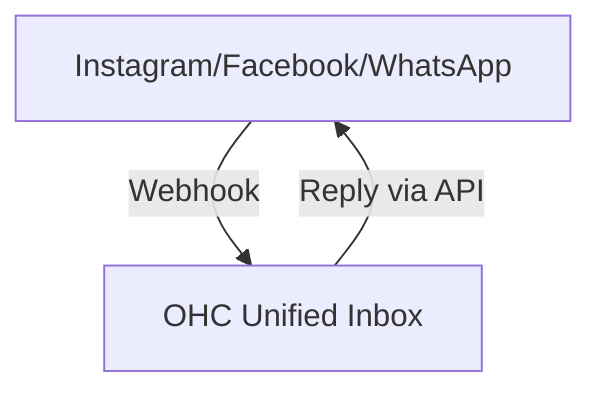
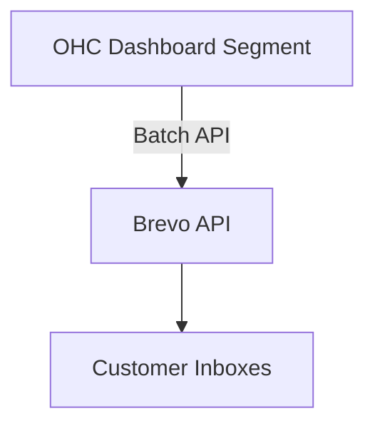

# 🔎 Scout: Tool Integration Research Q4

## 1. Social Media Integration: Unified Inbox
**Problem Statement**: Small business owners (like bakers or consultants) receive messages across Instagram DMs, Facebook, WhatsApp, and TikTok. Missing a DM means losing a sale. They do not have time to check 4 different apps.
**Research Report**: ManyChat and Chatwoot are strong contenders. Chatwoot is open-source and easy to self-host (Standalone) but also has a Cloud offering. ManyChat is powerful but locked into Cloud and expensive ($15+/mo). Chatwoot's API is robust and handles OAuth complexity well.

### Comparison Table
| Tool | Pricing | Open Source | Cloud Support | Standalone Support |
|---|---|---|---|---|
| Chatwoot | Free/Paid | Yes | Yes | Yes |
| ManyChat | $15+/mo | No | Yes | No |

### Flow Diagram

**Design Doc**:
- Trigger: New message arrives on any connected social channel.
- Action: OHC routes the message into the central unified inbox.
- User UI: A single chat interface in OHC where replying sends the message back to the native platform.
**Implementation Prompt**: Build a unified inbox view that securely connects to Meta and WhatsApp APIs. Ensure the user can authorize their accounts via a simple OAuth flow without seeing API keys.
**Priority**: P0
**Estimated Scope**: Large

## 2. Calendar & Scheduling: Auto-Booking
**Problem Statement**: Service businesses waste hours doing "when are you free?" dances over text.
**Research Report**: Calendly is the industry standard but expensive ($12/mo). Cal.com is open-source, developer-friendly, and supports both Cloud and Standalone. It handles timezone math and conflict resolution natively.

### Comparison Table
| Tool | Pricing | Open Source | Conflict Handling |
|---|---|---|---|
| Cal.com | Free/Paid | Yes | Excellent |
| Calendly | $12/mo | No | Excellent |

**Design Doc**:
- Trigger: User shares their unique OHC booking link.
- Action: Client selects a time; OHC creates a Google Calendar event and generates a Meet link.
- User UI: A "Share Link" button and an integrated calendar view.
**Implementation Prompt**: Integrate Cal.com's embeddable booking widget or API so business owners can generate and share a personalized booking link directly from their OHC dashboard.
**Priority**: P0
**Estimated Scope**: Medium

## 3. Email Marketing: Simple Campaigns
**Problem Statement**: Sending newsletters or promotions requires exporting customer emails to Mailchimp, which is confusing and expensive.
**Research Report**: Resend and Postmark are developer-focused, but Brevo (formerly Sendinblue) offers a generous free tier (300 emails/day) and simple APIs. It handles spam compliance automatically.

### Flow Diagram

**Design Doc**:
- Trigger: Business owner selects a customer segment and writes a message.
- Action: OHC sends the batch via Brevo's API.
- User UI: A simple compose window with "Send to All" or "Send to Recent Customers" buttons.
**Implementation Prompt**: Create a simplified email blast feature that uses a reliable transactional email API, completely hiding the complex list-management and DNS setup from the user.
**Priority**: P1
**Estimated Scope**: Medium

## 4. Payment Processing: Alternative Markets
**Problem Statement**: Stripe isn't supported everywhere, and some customers prefer local payment methods.
**Research Report**: Mercado Pago is essential for LATAM. Razorpay is dominant in India. Both have good APIs but different webhook structures than Stripe. Settlement speeds vary.

**Design Doc**:
- Trigger: User generates an invoice.
- Action: OHC creates a payment link using the regionally appropriate provider.
- User UI: A single "Create Invoice" button that automatically offers the right payment methods based on the customer's region.
**Implementation Prompt**: Implement a flexible payment connector that supports Mercado Pago and Razorpay alongside Stripe, allowing users to accept payments seamlessly without writing code.
**Priority**: P1
**Estimated Scope**: Large

## 5. Shipping & Logistics: Easy Labels
**Problem Statement**: Calculating shipping costs and buying labels at the post office is a huge time sink for e-commerce shops.
**Research Report**: Shippo and EasyPost provide unified APIs for USPS, FedEx, and UPS. Shippo is generally easier for small volume sellers.

**Design Doc**:
- Trigger: An order is marked "Ready to Ship".
- Action: OHC fetches rates and purchases the cheapest label.
- User UI: A "Buy Label" button that prints a PDF instantly.
**Implementation Prompt**: Integrate a shipping API to automatically calculate rates and generate printable PDF shipping labels for domestic orders directly within the order details view.
**Priority**: P2
**Estimated Scope**: Medium

## 6. SMS & Notifications: Global Reach
**Problem Statement**: Email open rates are low. Urgent updates (like appointment reminders) need to be sent via text, especially for users who aren't tech-savvy.
**Research Report**: Twilio is the standard but complex. Vonage and Plivo are alternatives. Twilio's global reach and reliability justify the slightly higher cost.

**Design Doc**:
- Trigger: Appointment is 24 hours away.
- Action: OHC sends an SMS reminder.
- User UI: A simple toggle in settings: "Send SMS reminders to customers".
**Implementation Prompt**: Add automated SMS reminders for appointments using a reliable global provider, ensuring compliance with local opt-out regulations automatically.
**Priority**: P1
**Estimated Scope**: Small

## 7. Video Conferencing: One-Click Meetings
**Problem Statement**: Tutors and consultants struggle to manually create Zoom links and email them to clients before every session.
**Research Report**: Zoom API requires strict OAuth. Google Meet via Google Calendar API is much easier if the user already connects their Google account.

**Design Doc**:
- Trigger: An online appointment is booked.
- Action: OHC automatically adds a Google Meet link to the calendar event.
- User UI: The booking confirmation automatically includes a "Join Meeting" button.
**Implementation Prompt**: Automatically generate and attach a video conferencing link (e.g., Google Meet) to any calendar event marked as "online," requiring zero manual copy-pasting from the user.
**Priority**: P2
**Estimated Scope**: Small
