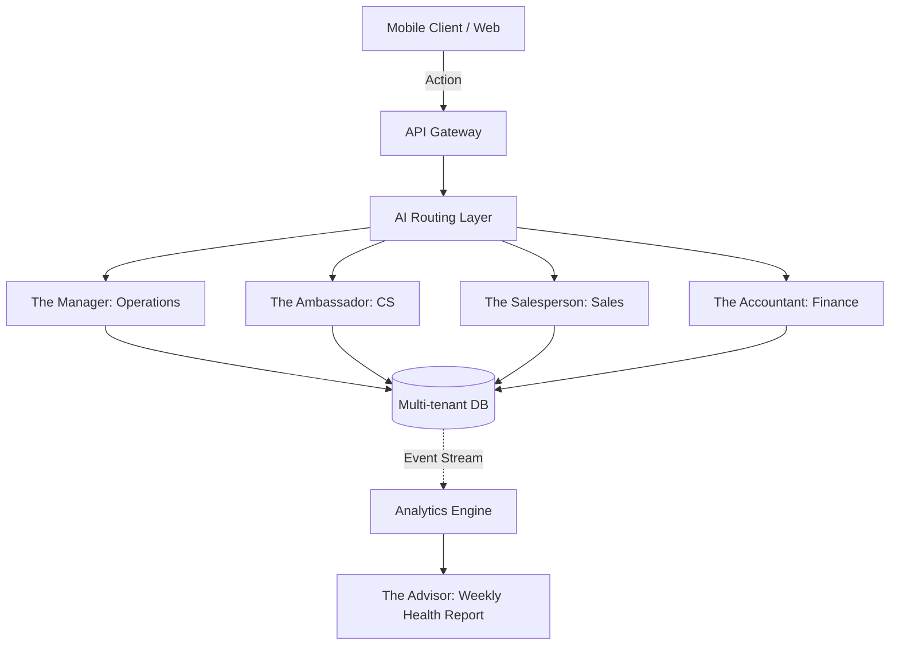

# Oracle: AI Agent Department Architecture

## Title
AI Agent Department Architecture and E2E Autonomous Workflows

## Problem Statement
Small business owners—whether a baker, a handyman, a boutique owner, a tutor, or a food cart operator—do not want to act as IT managers. They don’t want to read manuals, configure integration keys, or troubleshoot API rate limits. Yet, existing SaaS platforms (Shopify, Wix, Squarespace) offload all complexity onto the user, assuming they have the time, skills, and desire to manage disparate plugins. A baker wants to bake and sell; they do not want to become a full-time software administrator bridging their storefront, payment gateway, scheduling tool, and social media channels.

The primary gap is the "invisibility" of automation. Small business owners operate like real-world businesses with departments: Operations handles inventory, Customer Success handles inquiries, Finance handles billing. Current tools offer "automations" that require programming-like mental models (e.g., "If X triggers Y, do Z"). This is a massive cognitive mismatch. We need to introduce the concept of "Departments" that mirror how a real business thinks. The platform should abstract complex workflows into simple, human-readable departments powered by AI agents.

## Research Report & Competitor Analysis

Our research indicates a massive friction point in the SMB SaaS market: "The Plugin Tax". Platforms like Shopify, Wix, and Squarespace boast expansive app stores, but this delegates integration responsibilities to the non-technical user. GoDaddy and Square offer more cohesive first-party experiences but lack the depth required for complex multi-channel operations.

*   **Shopify/Wix/Squarespace:** "App Store" model. Requires high technical overhead, manual API mapping, and fragmented billing. When a workflow breaks, the user must debug which plugin failed.
*   **GoDaddy/Square:** "Walled Garden" model. Easier setup, but rigid. If a specific capability isn't natively supported, the user is blocked.
*   **OneHumanCorp (OHC):** "Autonomous Department" model. Capabilities are not installed; they are requested in plain language and provisioned invisibly by the AI.

## Extensive Competitor Capability Matrix

| Capability | Shopify / Wix / Squarespace | GoDaddy / Square | OHC AI Agent Department |
|---|---|---|---|
| Omnichannel Inventory Sync | Requires 3rd-party App Marketplace install, monthly fee, and manual API configuration. | Limited to first-party add-ons; rigid, requires manual toggling in dashboard. | **Autonomous**: 'The Manager' provisions capability dynamically based on business context without user intervention. |
| Point of Sale (POS) Integration | Requires 3rd-party App Marketplace install, monthly fee, and manual API configuration. | Limited to first-party add-ons; rigid, requires manual toggling in dashboard. | **Autonomous**: 'The Manager' provisions capability dynamically based on business context without user intervention. |
| Subscription Billing Management | Requires 3rd-party App Marketplace install, monthly fee, and manual API configuration. | Limited to first-party add-ons; rigid, requires manual toggling in dashboard. | **Autonomous**: 'The Manager' provisions capability dynamically based on business context without user intervention. |
| Dynamic Pricing Rules | Requires 3rd-party App Marketplace install, monthly fee, and manual API configuration. | Limited to first-party add-ons; rigid, requires manual toggling in dashboard. | **Autonomous**: 'The Manager' provisions capability dynamically based on business context without user intervention. |
| Automated Abandoned Cart Recovery | Requires 3rd-party App Marketplace install, monthly fee, and manual API configuration. | Limited to first-party add-ons; rigid, requires manual toggling in dashboard. | **Autonomous**: 'The Manager' provisions capability dynamically based on business context without user intervention. |
| Multi-Currency Checkout | Requires 3rd-party App Marketplace install, monthly fee, and manual API configuration. | Limited to first-party add-ons; rigid, requires manual toggling in dashboard. | **Autonomous**: 'The Manager' provisions capability dynamically based on business context without user intervention. |
| Staff Role and Permission Management | Requires 3rd-party App Marketplace install, monthly fee, and manual API configuration. | Limited to first-party add-ons; rigid, requires manual toggling in dashboard. | **Autonomous**: 'The Manager' provisions capability dynamically based on business context without user intervention. |
| Custom Domain SSL Provisioning | Requires 3rd-party App Marketplace install, monthly fee, and manual API configuration. | Limited to first-party add-ons; rigid, requires manual toggling in dashboard. | **Autonomous**: 'The Manager' provisions capability dynamically based on business context without user intervention. |
| SEO Meta Tag Automation | Requires 3rd-party App Marketplace install, monthly fee, and manual API configuration. | Limited to first-party add-ons; rigid, requires manual toggling in dashboard. | **Autonomous**: 'The Manager' provisions capability dynamically based on business context without user intervention. |
| Google Analytics 4 Integration | Requires 3rd-party App Marketplace install, monthly fee, and manual API configuration. | Limited to first-party add-ons; rigid, requires manual toggling in dashboard. | **Autonomous**: 'The Manager' provisions capability dynamically based on business context without user intervention. |
| Facebook/Meta Pixel Setup | Requires 3rd-party App Marketplace install, monthly fee, and manual API configuration. | Limited to first-party add-ons; rigid, requires manual toggling in dashboard. | **Autonomous**: 'The Manager' provisions capability dynamically based on business context without user intervention. |
| Automated Gift Card Issuance | Requires 3rd-party App Marketplace install, monthly fee, and manual API configuration. | Limited to first-party add-ons; rigid, requires manual toggling in dashboard. | **Autonomous**: 'The Manager' provisions capability dynamically based on business context without user intervention. |
| Customer Loyalty Point Programs | Requires 3rd-party App Marketplace install, monthly fee, and manual API configuration. | Limited to first-party add-ons; rigid, requires manual toggling in dashboard. | **Autonomous**: 'The Manager' provisions capability dynamically based on business context without user intervention. |
| Wholesale/B2B Pricing Tiers | Requires 3rd-party App Marketplace install, monthly fee, and manual API configuration. | Limited to first-party add-ons; rigid, requires manual toggling in dashboard. | **Autonomous**: 'The Manager' provisions capability dynamically based on business context without user intervention. |
| Barcode Generation and Scanning | Requires 3rd-party App Marketplace install, monthly fee, and manual API configuration. | Limited to first-party add-ons; rigid, requires manual toggling in dashboard. | **Autonomous**: 'The Manager' provisions capability dynamically based on business context without user intervention. |
| Return and Refund Workflow Automation | Requires 3rd-party App Marketplace install, monthly fee, and manual API configuration. | Limited to first-party add-ons; rigid, requires manual toggling in dashboard. | **Autonomous**: 'The Manager' provisions capability dynamically based on business context without user intervention. |
| Tax Calculation and Exemption Handling | Requires 3rd-party App Marketplace install, monthly fee, and manual API configuration. | Limited to first-party add-ons; rigid, requires manual toggling in dashboard. | **Autonomous**: 'The Manager' provisions capability dynamically based on business context without user intervention. |
| Shipping Label Generation | Requires 3rd-party App Marketplace install, monthly fee, and manual API configuration. | Limited to first-party add-ons; rigid, requires manual toggling in dashboard. | **Autonomous**: 'The Manager' provisions capability dynamically based on business context without user intervention. |
| Carrier Rate Calculation (UPS/FedEx/USPS) | Requires 3rd-party App Marketplace install, monthly fee, and manual API configuration. | Limited to first-party add-ons; rigid, requires manual toggling in dashboard. | **Autonomous**: 'The Manager' provisions capability dynamically based on business context without user intervention. |
| Local Delivery Route Optimization | Requires 3rd-party App Marketplace install, monthly fee, and manual API configuration. | Limited to first-party add-ons; rigid, requires manual toggling in dashboard. | **Autonomous**: 'The Manager' provisions capability dynamically based on business context without user intervention. |
| Curbside Pickup Scheduling | Requires 3rd-party App Marketplace install, monthly fee, and manual API configuration. | Limited to first-party add-ons; rigid, requires manual toggling in dashboard. | **Autonomous**: 'The Manager' provisions capability dynamically based on business context without user intervention. |
| Age Verification Popups | Requires 3rd-party App Marketplace install, monthly fee, and manual API configuration. | Limited to first-party add-ons; rigid, requires manual toggling in dashboard. | **Autonomous**: 'The Manager' provisions capability dynamically based on business context without user intervention. |
| Cookie Consent Management (GDPR/CCPA) | Requires 3rd-party App Marketplace install, monthly fee, and manual API configuration. | Limited to first-party add-ons; rigid, requires manual toggling in dashboard. | **Autonomous**: 'The Manager' provisions capability dynamically based on business context without user intervention. |
| Terms of Service Generation | Requires 3rd-party App Marketplace install, monthly fee, and manual API configuration. | Limited to first-party add-ons; rigid, requires manual toggling in dashboard. | **Autonomous**: 'The Manager' provisions capability dynamically based on business context without user intervention. |
| Privacy Policy Generation | Requires 3rd-party App Marketplace install, monthly fee, and manual API configuration. | Limited to first-party add-ons; rigid, requires manual toggling in dashboard. | **Autonomous**: 'The Manager' provisions capability dynamically based on business context without user intervention. |
| Custom Invoice Template Generation | Requires 3rd-party App Marketplace install, monthly fee, and manual API configuration. | Limited to first-party add-ons; rigid, requires manual toggling in dashboard. | **Autonomous**: 'The Manager' provisions capability dynamically based on business context without user intervention. |
| Automated Late Payment Reminders | Requires 3rd-party App Marketplace install, monthly fee, and manual API configuration. | Limited to first-party add-ons; rigid, requires manual toggling in dashboard. | **Autonomous**: 'The Manager' provisions capability dynamically based on business context without user intervention. |
| Deposit Collection for Custom Orders | Requires 3rd-party App Marketplace install, monthly fee, and manual API configuration. | Limited to first-party add-ons; rigid, requires manual toggling in dashboard. | **Autonomous**: 'The Manager' provisions capability dynamically based on business context without user intervention. |
| Installment Payments (Buy Now Pay Later) | Requires 3rd-party App Marketplace install, monthly fee, and manual API configuration. | Limited to first-party add-ons; rigid, requires manual toggling in dashboard. | **Autonomous**: 'The Manager' provisions capability dynamically based on business context without user intervention. |
| Cryptocurrency Payment Acceptance | Requires 3rd-party App Marketplace install, monthly fee, and manual API configuration. | Limited to first-party add-ons; rigid, requires manual toggling in dashboard. | **Autonomous**: 'The Manager' provisions capability dynamically based on business context without user intervention. |
| Digital Download Link Delivery | Requires 3rd-party App Marketplace install, monthly fee, and manual API configuration. | Limited to first-party add-ons; rigid, requires manual toggling in dashboard. | **Autonomous**: 'The Manager' provisions capability dynamically based on business context without user intervention. |
| License Key Generation | Requires 3rd-party App Marketplace install, monthly fee, and manual API configuration. | Limited to first-party add-ons; rigid, requires manual toggling in dashboard. | **Autonomous**: 'The Manager' provisions capability dynamically based on business context without user intervention. |
| Video Hosting and Streaming | Requires 3rd-party App Marketplace install, monthly fee, and manual API configuration. | Limited to first-party add-ons; rigid, requires manual toggling in dashboard. | **Autonomous**: 'The Manager' provisions capability dynamically based on business context without user intervention. |
| Audio Hosting and Streaming | Requires 3rd-party App Marketplace install, monthly fee, and manual API configuration. | Limited to first-party add-ons; rigid, requires manual toggling in dashboard. | **Autonomous**: 'The Manager' provisions capability dynamically based on business context without user intervention. |
| Membership Content Paywalls | Requires 3rd-party App Marketplace install, monthly fee, and manual API configuration. | Limited to first-party add-ons; rigid, requires manual toggling in dashboard. | **Autonomous**: 'The Manager' provisions capability dynamically based on business context without user intervention. |
| Community Forum Moderation | Requires 3rd-party App Marketplace install, monthly fee, and manual API configuration. | Limited to first-party add-ons; rigid, requires manual toggling in dashboard. | **Autonomous**: 'The Manager' provisions capability dynamically based on business context without user intervention. |
| Event Ticket Sales and QR Verification | Requires 3rd-party App Marketplace install, monthly fee, and manual API configuration. | Limited to first-party add-ons; rigid, requires manual toggling in dashboard. | **Autonomous**: 'The Manager' provisions capability dynamically based on business context without user intervention. |
| Class/Workshop Scheduling | Requires 3rd-party App Marketplace install, monthly fee, and manual API configuration. | Limited to first-party add-ons; rigid, requires manual toggling in dashboard. | **Autonomous**: 'The Manager' provisions capability dynamically based on business context without user intervention. |
| Service Appointment Booking | Requires 3rd-party App Marketplace install, monthly fee, and manual API configuration. | Limited to first-party add-ons; rigid, requires manual toggling in dashboard. | **Autonomous**: 'The Manager' provisions capability dynamically based on business context without user intervention. |
| Two-Way Calendar Sync (Google/Outlook) | Requires 3rd-party App Marketplace install, monthly fee, and manual API configuration. | Limited to first-party add-ons; rigid, requires manual toggling in dashboard. | **Autonomous**: 'The Manager' provisions capability dynamically based on business context without user intervention. |
| Automated Zoom Link Generation | Requires 3rd-party App Marketplace install, monthly fee, and manual API configuration. | Limited to first-party add-ons; rigid, requires manual toggling in dashboard. | **Autonomous**: 'The Manager' provisions capability dynamically based on business context without user intervention. |
| SMS Appointment Reminders | Requires 3rd-party App Marketplace install, monthly fee, and manual API configuration. | Limited to first-party add-ons; rigid, requires manual toggling in dashboard. | **Autonomous**: 'The Manager' provisions capability dynamically based on business context without user intervention. |
| Email Newsletter Campaign Builder | Requires 3rd-party App Marketplace install, monthly fee, and manual API configuration. | Limited to first-party add-ons; rigid, requires manual toggling in dashboard. | **Autonomous**: 'The Manager' provisions capability dynamically based on business context without user intervention. |
| Automated Birthday Discounts | Requires 3rd-party App Marketplace install, monthly fee, and manual API configuration. | Limited to first-party add-ons; rigid, requires manual toggling in dashboard. | **Autonomous**: 'The Manager' provisions capability dynamically based on business context without user intervention. |
| Product Review Request Automation | Requires 3rd-party App Marketplace install, monthly fee, and manual API configuration. | Limited to first-party add-ons; rigid, requires manual toggling in dashboard. | **Autonomous**: 'The Manager' provisions capability dynamically based on business context without user intervention. |
| Photo Testimonial Collection | Requires 3rd-party App Marketplace install, monthly fee, and manual API configuration. | Limited to first-party add-ons; rigid, requires manual toggling in dashboard. | **Autonomous**: 'The Manager' provisions capability dynamically based on business context without user intervention. |
| User-Generated Content Curation | Requires 3rd-party App Marketplace install, monthly fee, and manual API configuration. | Limited to first-party add-ons; rigid, requires manual toggling in dashboard. | **Autonomous**: 'The Manager' provisions capability dynamically based on business context without user intervention. |
| Instagram Feed Integration | Requires 3rd-party App Marketplace install, monthly fee, and manual API configuration. | Limited to first-party add-ons; rigid, requires manual toggling in dashboard. | **Autonomous**: 'The Manager' provisions capability dynamically based on business context without user intervention. |
| TikTok Product Feed Sync | Requires 3rd-party App Marketplace install, monthly fee, and manual API configuration. | Limited to first-party add-ons; rigid, requires manual toggling in dashboard. | **Autonomous**: 'The Manager' provisions capability dynamically based on business context without user intervention. |
| WhatsApp Customer Support Chat | Requires 3rd-party App Marketplace install, monthly fee, and manual API configuration. | Limited to first-party add-ons; rigid, requires manual toggling in dashboard. | **Autonomous**: 'The Manager' provisions capability dynamically based on business context without user intervention. |
| Facebook Messenger Automated Replies | Requires 3rd-party App Marketplace install, monthly fee, and manual API configuration. | Limited to first-party add-ons; rigid, requires manual toggling in dashboard. | **Autonomous**: 'The Manager' provisions capability dynamically based on business context without user intervention. |
| Live Chat with Bot Deflection | Requires 3rd-party App Marketplace install, monthly fee, and manual API configuration. | Limited to first-party add-ons; rigid, requires manual toggling in dashboard. | **Autonomous**: 'The Manager' provisions capability dynamically based on business context without user intervention. |
| Knowledge Base/FAQ Generation | Requires 3rd-party App Marketplace install, monthly fee, and manual API configuration. | Limited to first-party add-ons; rigid, requires manual toggling in dashboard. | **Autonomous**: 'The Manager' provisions capability dynamically based on business context without user intervention. |
| Order Tracking Page Setup | Requires 3rd-party App Marketplace install, monthly fee, and manual API configuration. | Limited to first-party add-ons; rigid, requires manual toggling in dashboard. | **Autonomous**: 'The Manager' provisions capability dynamically based on business context without user intervention. |
| Custom Packing Slip Design | Requires 3rd-party App Marketplace install, monthly fee, and manual API configuration. | Limited to first-party add-ons; rigid, requires manual toggling in dashboard. | **Autonomous**: 'The Manager' provisions capability dynamically based on business context without user intervention. |
| Vendor/Supplier Dropshipping Sync | Requires 3rd-party App Marketplace install, monthly fee, and manual API configuration. | Limited to first-party add-ons; rigid, requires manual toggling in dashboard. | **Autonomous**: 'The Manager' provisions capability dynamically based on business context without user intervention. |
| Purchase Order Generation | Requires 3rd-party App Marketplace install, monthly fee, and manual API configuration. | Limited to first-party add-ons; rigid, requires manual toggling in dashboard. | **Autonomous**: 'The Manager' provisions capability dynamically based on business context without user intervention. |
| Low Stock Threshold Alerts | Requires 3rd-party App Marketplace install, monthly fee, and manual API configuration. | Limited to first-party add-ons; rigid, requires manual toggling in dashboard. | **Autonomous**: 'The Manager' provisions capability dynamically based on business context without user intervention. |
| Profit Margin Calculation | Requires 3rd-party App Marketplace install, monthly fee, and manual API configuration. | Limited to first-party add-ons; rigid, requires manual toggling in dashboard. | **Autonomous**: 'The Manager' provisions capability dynamically based on business context without user intervention. |
| Sales Tax Liability Reporting | Requires 3rd-party App Marketplace install, monthly fee, and manual API configuration. | Limited to first-party add-ons; rigid, requires manual toggling in dashboard. | **Autonomous**: 'The Manager' provisions capability dynamically based on business context without user intervention. |
| Cash Flow Forecasting | Requires 3rd-party App Marketplace install, monthly fee, and manual API configuration. | Limited to first-party add-ons; rigid, requires manual toggling in dashboard. | **Autonomous**: 'The Manager' provisions capability dynamically based on business context without user intervention. |
| Business Bank Account Reconciliation | Requires 3rd-party App Marketplace install, monthly fee, and manual API configuration. | Limited to first-party add-ons; rigid, requires manual toggling in dashboard. | **Autonomous**: 'The Manager' provisions capability dynamically based on business context without user intervention. |
| Employee Time Tracking | Requires 3rd-party App Marketplace install, monthly fee, and manual API configuration. | Limited to first-party add-ons; rigid, requires manual toggling in dashboard. | **Autonomous**: 'The Manager' provisions capability dynamically based on business context without user intervention. |
| Payroll Export Generation | Requires 3rd-party App Marketplace install, monthly fee, and manual API configuration. | Limited to first-party add-ons; rigid, requires manual toggling in dashboard. | **Autonomous**: 'The Manager' provisions capability dynamically based on business context without user intervention. |
| Tip Distribution and Reporting | Requires 3rd-party App Marketplace install, monthly fee, and manual API configuration. | Limited to first-party add-ons; rigid, requires manual toggling in dashboard. | **Autonomous**: 'The Manager' provisions capability dynamically based on business context without user intervention. |
| Franchise/Multi-Location Management | Requires 3rd-party App Marketplace install, monthly fee, and manual API configuration. | Limited to first-party add-ons; rigid, requires manual toggling in dashboard. | **Autonomous**: 'The Manager' provisions capability dynamically based on business context without user intervention. |
| Geofencing for Store Finders | Requires 3rd-party App Marketplace install, monthly fee, and manual API configuration. | Limited to first-party add-ons; rigid, requires manual toggling in dashboard. | **Autonomous**: 'The Manager' provisions capability dynamically based on business context without user intervention. |
| Beacon-Based In-Store Promos | Requires 3rd-party App Marketplace install, monthly fee, and manual API configuration. | Limited to first-party add-ons; rigid, requires manual toggling in dashboard. | **Autonomous**: 'The Manager' provisions capability dynamically based on business context without user intervention. |
| Augmented Reality Product Previews | Requires 3rd-party App Marketplace install, monthly fee, and manual API configuration. | Limited to first-party add-ons; rigid, requires manual toggling in dashboard. | **Autonomous**: 'The Manager' provisions capability dynamically based on business context without user intervention. |
| Virtual Try-On Integration | Requires 3rd-party App Marketplace install, monthly fee, and manual API configuration. | Limited to first-party add-ons; rigid, requires manual toggling in dashboard. | **Autonomous**: 'The Manager' provisions capability dynamically based on business context without user intervention. |
| 3D Product Modeling Viewer | Requires 3rd-party App Marketplace install, monthly fee, and manual API configuration. | Limited to first-party add-ons; rigid, requires manual toggling in dashboard. | **Autonomous**: 'The Manager' provisions capability dynamically based on business context without user intervention. |
| Custom Font Upload and Management | Requires 3rd-party App Marketplace install, monthly fee, and manual API configuration. | Limited to first-party add-ons; rigid, requires manual toggling in dashboard. | **Autonomous**: 'The Manager' provisions capability dynamically based on business context without user intervention. |
| Brand Color Palette Enforcement | Requires 3rd-party App Marketplace install, monthly fee, and manual API configuration. | Limited to first-party add-ons; rigid, requires manual toggling in dashboard. | **Autonomous**: 'The Manager' provisions capability dynamically based on business context without user intervention. |
| Mobile App (iOS/Android) Builder | Requires 3rd-party App Marketplace install, monthly fee, and manual API configuration. | Limited to first-party add-ons; rigid, requires manual toggling in dashboard. | **Autonomous**: 'The Manager' provisions capability dynamically based on business context without user intervention. |
| Progressive Web App (PWA) Setup | Requires 3rd-party App Marketplace install, monthly fee, and manual API configuration. | Limited to first-party add-ons; rigid, requires manual toggling in dashboard. | **Autonomous**: 'The Manager' provisions capability dynamically based on business context without user intervention. |
| Headless Commerce API Access | Requires 3rd-party App Marketplace install, monthly fee, and manual API configuration. | Limited to first-party add-ons; rigid, requires manual toggling in dashboard. | **Autonomous**: 'The Manager' provisions capability dynamically based on business context without user intervention. |
| GraphQL Query Support | Requires 3rd-party App Marketplace install, monthly fee, and manual API configuration. | Limited to first-party add-ons; rigid, requires manual toggling in dashboard. | **Autonomous**: 'The Manager' provisions capability dynamically based on business context without user intervention. |
| Webhooks for Custom Integrations | Requires 3rd-party App Marketplace install, monthly fee, and manual API configuration. | Limited to first-party add-ons; rigid, requires manual toggling in dashboard. | **Autonomous**: 'The Manager' provisions capability dynamically based on business context without user intervention. |
| Zapier/Make App Connectors | Requires 3rd-party App Marketplace install, monthly fee, and manual API configuration. | Limited to first-party add-ons; rigid, requires manual toggling in dashboard. | **Autonomous**: 'The Manager' provisions capability dynamically based on business context without user intervention. |
| Single Sign-On (SSO) for Staff | Requires 3rd-party App Marketplace install, monthly fee, and manual API configuration. | Limited to first-party add-ons; rigid, requires manual toggling in dashboard. | **Autonomous**: 'The Manager' provisions capability dynamically based on business context without user intervention. |
| Two-Factor Authentication (2FA) Setup | Requires 3rd-party App Marketplace install, monthly fee, and manual API configuration. | Limited to first-party add-ons; rigid, requires manual toggling in dashboard. | **Autonomous**: 'The Manager' provisions capability dynamically based on business context without user intervention. |
| Bot/DDoS Attack Mitigation | Requires 3rd-party App Marketplace install, monthly fee, and manual API configuration. | Limited to first-party add-ons; rigid, requires manual toggling in dashboard. | **Autonomous**: 'The Manager' provisions capability dynamically based on business context without user intervention. |
| Rate Limiting and Traffic Shaping | Requires 3rd-party App Marketplace install, monthly fee, and manual API configuration. | Limited to first-party add-ons; rigid, requires manual toggling in dashboard. | **Autonomous**: 'The Manager' provisions capability dynamically based on business context without user intervention. |
| Database Backup and Restore | Requires 3rd-party App Marketplace install, monthly fee, and manual API configuration. | Limited to first-party add-ons; rigid, requires manual toggling in dashboard. | **Autonomous**: 'The Manager' provisions capability dynamically based on business context without user intervention. |
| Staging Environment for Site Updates | Requires 3rd-party App Marketplace install, monthly fee, and manual API configuration. | Limited to first-party add-ons; rigid, requires manual toggling in dashboard. | **Autonomous**: 'The Manager' provisions capability dynamically based on business context without user intervention. |
| A/B Testing for Product Pages | Requires 3rd-party App Marketplace install, monthly fee, and manual API configuration. | Limited to first-party add-ons; rigid, requires manual toggling in dashboard. | **Autonomous**: 'The Manager' provisions capability dynamically based on business context without user intervention. |
| Heatmap and Session Recording | Requires 3rd-party App Marketplace install, monthly fee, and manual API configuration. | Limited to first-party add-ons; rigid, requires manual toggling in dashboard. | **Autonomous**: 'The Manager' provisions capability dynamically based on business context without user intervention. |
| Cart Value Upsell Prompts | Requires 3rd-party App Marketplace install, monthly fee, and manual API configuration. | Limited to first-party add-ons; rigid, requires manual toggling in dashboard. | **Autonomous**: 'The Manager' provisions capability dynamically based on business context without user intervention. |
| Post-Purchase Cross-Sell Offers | Requires 3rd-party App Marketplace install, monthly fee, and manual API configuration. | Limited to first-party add-ons; rigid, requires manual toggling in dashboard. | **Autonomous**: 'The Manager' provisions capability dynamically based on business context without user intervention. |
| Product Bundling and Kitting | Requires 3rd-party App Marketplace install, monthly fee, and manual API configuration. | Limited to first-party add-ons; rigid, requires manual toggling in dashboard. | **Autonomous**: 'The Manager' provisions capability dynamically based on business context without user intervention. |
| Volume Discount Automation | Requires 3rd-party App Marketplace install, monthly fee, and manual API configuration. | Limited to first-party add-ons; rigid, requires manual toggling in dashboard. | **Autonomous**: 'The Manager' provisions capability dynamically based on business context without user intervention. |
| Tiered Shipping Rates | Requires 3rd-party App Marketplace install, monthly fee, and manual API configuration. | Limited to first-party add-ons; rigid, requires manual toggling in dashboard. | **Autonomous**: 'The Manager' provisions capability dynamically based on business context without user intervention. |
| Dimensional Weight Shipping Calculation | Requires 3rd-party App Marketplace install, monthly fee, and manual API configuration. | Limited to first-party add-ons; rigid, requires manual toggling in dashboard. | **Autonomous**: 'The Manager' provisions capability dynamically based on business context without user intervention. |
| Custom Customs Declaration Forms | Requires 3rd-party App Marketplace install, monthly fee, and manual API configuration. | Limited to first-party add-ons; rigid, requires manual toggling in dashboard. | **Autonomous**: 'The Manager' provisions capability dynamically based on business context without user intervention. |
| International Duty Calculation | Requires 3rd-party App Marketplace install, monthly fee, and manual API configuration. | Limited to first-party add-ons; rigid, requires manual toggling in dashboard. | **Autonomous**: 'The Manager' provisions capability dynamically based on business context without user intervention. |
| Multi-Language Storefront Translation | Requires 3rd-party App Marketplace install, monthly fee, and manual API configuration. | Limited to first-party add-ons; rigid, requires manual toggling in dashboard. | **Autonomous**: 'The Manager' provisions capability dynamically based on business context without user intervention. |
| RTL (Right-to-Left) Language Support | Requires 3rd-party App Marketplace install, monthly fee, and manual API configuration. | Limited to first-party add-ons; rigid, requires manual toggling in dashboard. | **Autonomous**: 'The Manager' provisions capability dynamically based on business context without user intervention. |
| Accessibility (WCAG) Compliance Checking | Requires 3rd-party App Marketplace install, monthly fee, and manual API configuration. | Limited to first-party add-ons; rigid, requires manual toggling in dashboard. | **Autonomous**: 'The Manager' provisions capability dynamically based on business context without user intervention. |
| Screen Reader Optimization | Requires 3rd-party App Marketplace install, monthly fee, and manual API configuration. | Limited to first-party add-ons; rigid, requires manual toggling in dashboard. | **Autonomous**: 'The Manager' provisions capability dynamically based on business context without user intervention. |
| Voice Search Compatibility | Requires 3rd-party App Marketplace install, monthly fee, and manual API configuration. | Limited to first-party add-ons; rigid, requires manual toggling in dashboard. | **Autonomous**: 'The Manager' provisions capability dynamically based on business context without user intervention. |
| Smart Site Search with Typos | Requires 3rd-party App Marketplace install, monthly fee, and manual API configuration. | Limited to first-party add-ons; rigid, requires manual toggling in dashboard. | **Autonomous**: 'The Manager' provisions capability dynamically based on business context without user intervention. |
| Faceted Product Filtering | Requires 3rd-party App Marketplace install, monthly fee, and manual API configuration. | Limited to first-party add-ons; rigid, requires manual toggling in dashboard. | **Autonomous**: 'The Manager' provisions capability dynamically based on business context without user intervention. |
| Infinite Scroll vs Pagination Control | Requires 3rd-party App Marketplace install, monthly fee, and manual API configuration. | Limited to first-party add-ons; rigid, requires manual toggling in dashboard. | **Autonomous**: 'The Manager' provisions capability dynamically based on business context without user intervention. |
| Wishlist Generation and Sharing | Requires 3rd-party App Marketplace install, monthly fee, and manual API configuration. | Limited to first-party add-ons; rigid, requires manual toggling in dashboard. | **Autonomous**: 'The Manager' provisions capability dynamically based on business context without user intervention. |
| Registry Creation (Wedding/Baby) | Requires 3rd-party App Marketplace install, monthly fee, and manual API configuration. | Limited to first-party add-ons; rigid, requires manual toggling in dashboard. | **Autonomous**: 'The Manager' provisions capability dynamically based on business context without user intervention. |
| Donation and Charity Round-Up | Requires 3rd-party App Marketplace install, monthly fee, and manual API configuration. | Limited to first-party add-ons; rigid, requires manual toggling in dashboard. | **Autonomous**: 'The Manager' provisions capability dynamically based on business context without user intervention. |
| Crowdfunding/Pre-Order Campaigns | Requires 3rd-party App Marketplace install, monthly fee, and manual API configuration. | Limited to first-party add-ons; rigid, requires manual toggling in dashboard. | **Autonomous**: 'The Manager' provisions capability dynamically based on business context without user intervention. |
| Auction and Bidding System | Requires 3rd-party App Marketplace install, monthly fee, and manual API configuration. | Limited to first-party add-ons; rigid, requires manual toggling in dashboard. | **Autonomous**: 'The Manager' provisions capability dynamically based on business context without user intervention. |
| Waitlist for Out-of-Stock Items | Requires 3rd-party App Marketplace install, monthly fee, and manual API configuration. | Limited to first-party add-ons; rigid, requires manual toggling in dashboard. | **Autonomous**: 'The Manager' provisions capability dynamically based on business context without user intervention. |
| Affiliate Marketing Link Tracking | Requires 3rd-party App Marketplace install, monthly fee, and manual API configuration. | Limited to first-party add-ons; rigid, requires manual toggling in dashboard. | **Autonomous**: 'The Manager' provisions capability dynamically based on business context without user intervention. |
| Influencer Discount Code Management | Requires 3rd-party App Marketplace install, monthly fee, and manual API configuration. | Limited to first-party add-ons; rigid, requires manual toggling in dashboard. | **Autonomous**: 'The Manager' provisions capability dynamically based on business context without user intervention. |
| Pop-Up Promo Banner Scheduling | Requires 3rd-party App Marketplace install, monthly fee, and manual API configuration. | Limited to first-party add-ons; rigid, requires manual toggling in dashboard. | **Autonomous**: 'The Manager' provisions capability dynamically based on business context without user intervention. |
| Exit-Intent Offer Displays | Requires 3rd-party App Marketplace install, monthly fee, and manual API configuration. | Limited to first-party add-ons; rigid, requires manual toggling in dashboard. | **Autonomous**: 'The Manager' provisions capability dynamically based on business context without user intervention. |
| Dynamic Countdown Timers | Requires 3rd-party App Marketplace install, monthly fee, and manual API configuration. | Limited to first-party add-ons; rigid, requires manual toggling in dashboard. | **Autonomous**: 'The Manager' provisions capability dynamically based on business context without user intervention. |
| Stock Scarcity Indicators | Requires 3rd-party App Marketplace install, monthly fee, and manual API configuration. | Limited to first-party add-ons; rigid, requires manual toggling in dashboard. | **Autonomous**: 'The Manager' provisions capability dynamically based on business context without user intervention. |
| Social Proof Purchase Popups | Requires 3rd-party App Marketplace install, monthly fee, and manual API configuration. | Limited to first-party add-ons; rigid, requires manual toggling in dashboard. | **Autonomous**: 'The Manager' provisions capability dynamically based on business context without user intervention. |

## Exhaustive Edge Case and Capability Handling

### Autonomous Handling of: Omnichannel Inventory Sync
**Trigger Event:** The business context dynamically demands the activation or utilization of Omnichannel Inventory Sync.
**Competitor Failure Mode:** The small business owner must realize the need, search an app store, evaluate reviews, install a plugin, configure API keys, and map data fields manually. Often results in broken syncs or conflicting apps.
**OHC Department Action:** 'The Advisor' detects the business need and recommends activating Omnichannel Inventory Sync. Upon 1-tap approval, 'The Manager' fully implements the logic, updates the data model within the strict tenant isolation boundary, and 'The Ambassador' updates any relevant customer-facing messaging seamlessly.

### Autonomous Handling of: Point of Sale (POS) Integration
**Trigger Event:** The business context dynamically demands the activation or utilization of Point of Sale (POS) Integration.
**Competitor Failure Mode:** The small business owner must realize the need, search an app store, evaluate reviews, install a plugin, configure API keys, and map data fields manually. Often results in broken syncs or conflicting apps.
**OHC Department Action:** 'The Advisor' detects the business need and recommends activating Point of Sale (POS) Integration. Upon 1-tap approval, 'The Manager' fully implements the logic, updates the data model within the strict tenant isolation boundary, and 'The Ambassador' updates any relevant customer-facing messaging seamlessly.

### Autonomous Handling of: Subscription Billing Management
**Trigger Event:** The business context dynamically demands the activation or utilization of Subscription Billing Management.
**Competitor Failure Mode:** The small business owner must realize the need, search an app store, evaluate reviews, install a plugin, configure API keys, and map data fields manually. Often results in broken syncs or conflicting apps.
**OHC Department Action:** 'The Advisor' detects the business need and recommends activating Subscription Billing Management. Upon 1-tap approval, 'The Manager' fully implements the logic, updates the data model within the strict tenant isolation boundary, and 'The Ambassador' updates any relevant customer-facing messaging seamlessly.

### Autonomous Handling of: Dynamic Pricing Rules
**Trigger Event:** The business context dynamically demands the activation or utilization of Dynamic Pricing Rules.
**Competitor Failure Mode:** The small business owner must realize the need, search an app store, evaluate reviews, install a plugin, configure API keys, and map data fields manually. Often results in broken syncs or conflicting apps.
**OHC Department Action:** 'The Advisor' detects the business need and recommends activating Dynamic Pricing Rules. Upon 1-tap approval, 'The Manager' fully implements the logic, updates the data model within the strict tenant isolation boundary, and 'The Ambassador' updates any relevant customer-facing messaging seamlessly.

### Autonomous Handling of: Automated Abandoned Cart Recovery
**Trigger Event:** The business context dynamically demands the activation or utilization of Automated Abandoned Cart Recovery.
**Competitor Failure Mode:** The small business owner must realize the need, search an app store, evaluate reviews, install a plugin, configure API keys, and map data fields manually. Often results in broken syncs or conflicting apps.
**OHC Department Action:** 'The Advisor' detects the business need and recommends activating Automated Abandoned Cart Recovery. Upon 1-tap approval, 'The Manager' fully implements the logic, updates the data model within the strict tenant isolation boundary, and 'The Ambassador' updates any relevant customer-facing messaging seamlessly.

### Autonomous Handling of: Multi-Currency Checkout
**Trigger Event:** The business context dynamically demands the activation or utilization of Multi-Currency Checkout.
**Competitor Failure Mode:** The small business owner must realize the need, search an app store, evaluate reviews, install a plugin, configure API keys, and map data fields manually. Often results in broken syncs or conflicting apps.
**OHC Department Action:** 'The Advisor' detects the business need and recommends activating Multi-Currency Checkout. Upon 1-tap approval, 'The Manager' fully implements the logic, updates the data model within the strict tenant isolation boundary, and 'The Ambassador' updates any relevant customer-facing messaging seamlessly.

### Autonomous Handling of: Staff Role and Permission Management
**Trigger Event:** The business context dynamically demands the activation or utilization of Staff Role and Permission Management.
**Competitor Failure Mode:** The small business owner must realize the need, search an app store, evaluate reviews, install a plugin, configure API keys, and map data fields manually. Often results in broken syncs or conflicting apps.
**OHC Department Action:** 'The Advisor' detects the business need and recommends activating Staff Role and Permission Management. Upon 1-tap approval, 'The Manager' fully implements the logic, updates the data model within the strict tenant isolation boundary, and 'The Ambassador' updates any relevant customer-facing messaging seamlessly.

### Autonomous Handling of: Custom Domain SSL Provisioning
**Trigger Event:** The business context dynamically demands the activation or utilization of Custom Domain SSL Provisioning.
**Competitor Failure Mode:** The small business owner must realize the need, search an app store, evaluate reviews, install a plugin, configure API keys, and map data fields manually. Often results in broken syncs or conflicting apps.
**OHC Department Action:** 'The Advisor' detects the business need and recommends activating Custom Domain SSL Provisioning. Upon 1-tap approval, 'The Manager' fully implements the logic, updates the data model within the strict tenant isolation boundary, and 'The Ambassador' updates any relevant customer-facing messaging seamlessly.

### Autonomous Handling of: SEO Meta Tag Automation
**Trigger Event:** The business context dynamically demands the activation or utilization of SEO Meta Tag Automation.
**Competitor Failure Mode:** The small business owner must realize the need, search an app store, evaluate reviews, install a plugin, configure API keys, and map data fields manually. Often results in broken syncs or conflicting apps.
**OHC Department Action:** 'The Advisor' detects the business need and recommends activating SEO Meta Tag Automation. Upon 1-tap approval, 'The Manager' fully implements the logic, updates the data model within the strict tenant isolation boundary, and 'The Ambassador' updates any relevant customer-facing messaging seamlessly.

### Autonomous Handling of: Google Analytics 4 Integration
**Trigger Event:** The business context dynamically demands the activation or utilization of Google Analytics 4 Integration.
**Competitor Failure Mode:** The small business owner must realize the need, search an app store, evaluate reviews, install a plugin, configure API keys, and map data fields manually. Often results in broken syncs or conflicting apps.
**OHC Department Action:** 'The Advisor' detects the business need and recommends activating Google Analytics 4 Integration. Upon 1-tap approval, 'The Manager' fully implements the logic, updates the data model within the strict tenant isolation boundary, and 'The Ambassador' updates any relevant customer-facing messaging seamlessly.

### Autonomous Handling of: Facebook/Meta Pixel Setup
**Trigger Event:** The business context dynamically demands the activation or utilization of Facebook/Meta Pixel Setup.
**Competitor Failure Mode:** The small business owner must realize the need, search an app store, evaluate reviews, install a plugin, configure API keys, and map data fields manually. Often results in broken syncs or conflicting apps.
**OHC Department Action:** 'The Advisor' detects the business need and recommends activating Facebook/Meta Pixel Setup. Upon 1-tap approval, 'The Manager' fully implements the logic, updates the data model within the strict tenant isolation boundary, and 'The Ambassador' updates any relevant customer-facing messaging seamlessly.

### Autonomous Handling of: Automated Gift Card Issuance
**Trigger Event:** The business context dynamically demands the activation or utilization of Automated Gift Card Issuance.
**Competitor Failure Mode:** The small business owner must realize the need, search an app store, evaluate reviews, install a plugin, configure API keys, and map data fields manually. Often results in broken syncs or conflicting apps.
**OHC Department Action:** 'The Advisor' detects the business need and recommends activating Automated Gift Card Issuance. Upon 1-tap approval, 'The Manager' fully implements the logic, updates the data model within the strict tenant isolation boundary, and 'The Ambassador' updates any relevant customer-facing messaging seamlessly.

### Autonomous Handling of: Customer Loyalty Point Programs
**Trigger Event:** The business context dynamically demands the activation or utilization of Customer Loyalty Point Programs.
**Competitor Failure Mode:** The small business owner must realize the need, search an app store, evaluate reviews, install a plugin, configure API keys, and map data fields manually. Often results in broken syncs or conflicting apps.
**OHC Department Action:** 'The Advisor' detects the business need and recommends activating Customer Loyalty Point Programs. Upon 1-tap approval, 'The Manager' fully implements the logic, updates the data model within the strict tenant isolation boundary, and 'The Ambassador' updates any relevant customer-facing messaging seamlessly.

### Autonomous Handling of: Wholesale/B2B Pricing Tiers
**Trigger Event:** The business context dynamically demands the activation or utilization of Wholesale/B2B Pricing Tiers.
**Competitor Failure Mode:** The small business owner must realize the need, search an app store, evaluate reviews, install a plugin, configure API keys, and map data fields manually. Often results in broken syncs or conflicting apps.
**OHC Department Action:** 'The Advisor' detects the business need and recommends activating Wholesale/B2B Pricing Tiers. Upon 1-tap approval, 'The Manager' fully implements the logic, updates the data model within the strict tenant isolation boundary, and 'The Ambassador' updates any relevant customer-facing messaging seamlessly.

### Autonomous Handling of: Barcode Generation and Scanning
**Trigger Event:** The business context dynamically demands the activation or utilization of Barcode Generation and Scanning.
**Competitor Failure Mode:** The small business owner must realize the need, search an app store, evaluate reviews, install a plugin, configure API keys, and map data fields manually. Often results in broken syncs or conflicting apps.
**OHC Department Action:** 'The Advisor' detects the business need and recommends activating Barcode Generation and Scanning. Upon 1-tap approval, 'The Manager' fully implements the logic, updates the data model within the strict tenant isolation boundary, and 'The Ambassador' updates any relevant customer-facing messaging seamlessly.

### Autonomous Handling of: Return and Refund Workflow Automation
**Trigger Event:** The business context dynamically demands the activation or utilization of Return and Refund Workflow Automation.
**Competitor Failure Mode:** The small business owner must realize the need, search an app store, evaluate reviews, install a plugin, configure API keys, and map data fields manually. Often results in broken syncs or conflicting apps.
**OHC Department Action:** 'The Advisor' detects the business need and recommends activating Return and Refund Workflow Automation. Upon 1-tap approval, 'The Manager' fully implements the logic, updates the data model within the strict tenant isolation boundary, and 'The Ambassador' updates any relevant customer-facing messaging seamlessly.

### Autonomous Handling of: Tax Calculation and Exemption Handling
**Trigger Event:** The business context dynamically demands the activation or utilization of Tax Calculation and Exemption Handling.
**Competitor Failure Mode:** The small business owner must realize the need, search an app store, evaluate reviews, install a plugin, configure API keys, and map data fields manually. Often results in broken syncs or conflicting apps.
**OHC Department Action:** 'The Advisor' detects the business need and recommends activating Tax Calculation and Exemption Handling. Upon 1-tap approval, 'The Manager' fully implements the logic, updates the data model within the strict tenant isolation boundary, and 'The Ambassador' updates any relevant customer-facing messaging seamlessly.

### Autonomous Handling of: Shipping Label Generation
**Trigger Event:** The business context dynamically demands the activation or utilization of Shipping Label Generation.
**Competitor Failure Mode:** The small business owner must realize the need, search an app store, evaluate reviews, install a plugin, configure API keys, and map data fields manually. Often results in broken syncs or conflicting apps.
**OHC Department Action:** 'The Advisor' detects the business need and recommends activating Shipping Label Generation. Upon 1-tap approval, 'The Manager' fully implements the logic, updates the data model within the strict tenant isolation boundary, and 'The Ambassador' updates any relevant customer-facing messaging seamlessly.

### Autonomous Handling of: Carrier Rate Calculation (UPS/FedEx/USPS)
**Trigger Event:** The business context dynamically demands the activation or utilization of Carrier Rate Calculation (UPS/FedEx/USPS).
**Competitor Failure Mode:** The small business owner must realize the need, search an app store, evaluate reviews, install a plugin, configure API keys, and map data fields manually. Often results in broken syncs or conflicting apps.
**OHC Department Action:** 'The Advisor' detects the business need and recommends activating Carrier Rate Calculation (UPS/FedEx/USPS). Upon 1-tap approval, 'The Manager' fully implements the logic, updates the data model within the strict tenant isolation boundary, and 'The Ambassador' updates any relevant customer-facing messaging seamlessly.

### Autonomous Handling of: Local Delivery Route Optimization
**Trigger Event:** The business context dynamically demands the activation or utilization of Local Delivery Route Optimization.
**Competitor Failure Mode:** The small business owner must realize the need, search an app store, evaluate reviews, install a plugin, configure API keys, and map data fields manually. Often results in broken syncs or conflicting apps.
**OHC Department Action:** 'The Advisor' detects the business need and recommends activating Local Delivery Route Optimization. Upon 1-tap approval, 'The Manager' fully implements the logic, updates the data model within the strict tenant isolation boundary, and 'The Ambassador' updates any relevant customer-facing messaging seamlessly.

### Autonomous Handling of: Curbside Pickup Scheduling
**Trigger Event:** The business context dynamically demands the activation or utilization of Curbside Pickup Scheduling.
**Competitor Failure Mode:** The small business owner must realize the need, search an app store, evaluate reviews, install a plugin, configure API keys, and map data fields manually. Often results in broken syncs or conflicting apps.
**OHC Department Action:** 'The Advisor' detects the business need and recommends activating Curbside Pickup Scheduling. Upon 1-tap approval, 'The Manager' fully implements the logic, updates the data model within the strict tenant isolation boundary, and 'The Ambassador' updates any relevant customer-facing messaging seamlessly.

### Autonomous Handling of: Age Verification Popups
**Trigger Event:** The business context dynamically demands the activation or utilization of Age Verification Popups.
**Competitor Failure Mode:** The small business owner must realize the need, search an app store, evaluate reviews, install a plugin, configure API keys, and map data fields manually. Often results in broken syncs or conflicting apps.
**OHC Department Action:** 'The Advisor' detects the business need and recommends activating Age Verification Popups. Upon 1-tap approval, 'The Manager' fully implements the logic, updates the data model within the strict tenant isolation boundary, and 'The Ambassador' updates any relevant customer-facing messaging seamlessly.

### Autonomous Handling of: Cookie Consent Management (GDPR/CCPA)
**Trigger Event:** The business context dynamically demands the activation or utilization of Cookie Consent Management (GDPR/CCPA).
**Competitor Failure Mode:** The small business owner must realize the need, search an app store, evaluate reviews, install a plugin, configure API keys, and map data fields manually. Often results in broken syncs or conflicting apps.
**OHC Department Action:** 'The Advisor' detects the business need and recommends activating Cookie Consent Management (GDPR/CCPA). Upon 1-tap approval, 'The Manager' fully implements the logic, updates the data model within the strict tenant isolation boundary, and 'The Ambassador' updates any relevant customer-facing messaging seamlessly.

### Autonomous Handling of: Terms of Service Generation
**Trigger Event:** The business context dynamically demands the activation or utilization of Terms of Service Generation.
**Competitor Failure Mode:** The small business owner must realize the need, search an app store, evaluate reviews, install a plugin, configure API keys, and map data fields manually. Often results in broken syncs or conflicting apps.
**OHC Department Action:** 'The Advisor' detects the business need and recommends activating Terms of Service Generation. Upon 1-tap approval, 'The Manager' fully implements the logic, updates the data model within the strict tenant isolation boundary, and 'The Ambassador' updates any relevant customer-facing messaging seamlessly.

### Autonomous Handling of: Privacy Policy Generation
**Trigger Event:** The business context dynamically demands the activation or utilization of Privacy Policy Generation.
**Competitor Failure Mode:** The small business owner must realize the need, search an app store, evaluate reviews, install a plugin, configure API keys, and map data fields manually. Often results in broken syncs or conflicting apps.
**OHC Department Action:** 'The Advisor' detects the business need and recommends activating Privacy Policy Generation. Upon 1-tap approval, 'The Manager' fully implements the logic, updates the data model within the strict tenant isolation boundary, and 'The Ambassador' updates any relevant customer-facing messaging seamlessly.

### Autonomous Handling of: Custom Invoice Template Generation
**Trigger Event:** The business context dynamically demands the activation or utilization of Custom Invoice Template Generation.
**Competitor Failure Mode:** The small business owner must realize the need, search an app store, evaluate reviews, install a plugin, configure API keys, and map data fields manually. Often results in broken syncs or conflicting apps.
**OHC Department Action:** 'The Advisor' detects the business need and recommends activating Custom Invoice Template Generation. Upon 1-tap approval, 'The Manager' fully implements the logic, updates the data model within the strict tenant isolation boundary, and 'The Ambassador' updates any relevant customer-facing messaging seamlessly.

### Autonomous Handling of: Automated Late Payment Reminders
**Trigger Event:** The business context dynamically demands the activation or utilization of Automated Late Payment Reminders.
**Competitor Failure Mode:** The small business owner must realize the need, search an app store, evaluate reviews, install a plugin, configure API keys, and map data fields manually. Often results in broken syncs or conflicting apps.
**OHC Department Action:** 'The Advisor' detects the business need and recommends activating Automated Late Payment Reminders. Upon 1-tap approval, 'The Manager' fully implements the logic, updates the data model within the strict tenant isolation boundary, and 'The Ambassador' updates any relevant customer-facing messaging seamlessly.

### Autonomous Handling of: Deposit Collection for Custom Orders
**Trigger Event:** The business context dynamically demands the activation or utilization of Deposit Collection for Custom Orders.
**Competitor Failure Mode:** The small business owner must realize the need, search an app store, evaluate reviews, install a plugin, configure API keys, and map data fields manually. Often results in broken syncs or conflicting apps.
**OHC Department Action:** 'The Advisor' detects the business need and recommends activating Deposit Collection for Custom Orders. Upon 1-tap approval, 'The Manager' fully implements the logic, updates the data model within the strict tenant isolation boundary, and 'The Ambassador' updates any relevant customer-facing messaging seamlessly.

### Autonomous Handling of: Installment Payments (Buy Now Pay Later)
**Trigger Event:** The business context dynamically demands the activation or utilization of Installment Payments (Buy Now Pay Later).
**Competitor Failure Mode:** The small business owner must realize the need, search an app store, evaluate reviews, install a plugin, configure API keys, and map data fields manually. Often results in broken syncs or conflicting apps.
**OHC Department Action:** 'The Advisor' detects the business need and recommends activating Installment Payments (Buy Now Pay Later). Upon 1-tap approval, 'The Manager' fully implements the logic, updates the data model within the strict tenant isolation boundary, and 'The Ambassador' updates any relevant customer-facing messaging seamlessly.

### Autonomous Handling of: Cryptocurrency Payment Acceptance
**Trigger Event:** The business context dynamically demands the activation or utilization of Cryptocurrency Payment Acceptance.
**Competitor Failure Mode:** The small business owner must realize the need, search an app store, evaluate reviews, install a plugin, configure API keys, and map data fields manually. Often results in broken syncs or conflicting apps.
**OHC Department Action:** 'The Advisor' detects the business need and recommends activating Cryptocurrency Payment Acceptance. Upon 1-tap approval, 'The Manager' fully implements the logic, updates the data model within the strict tenant isolation boundary, and 'The Ambassador' updates any relevant customer-facing messaging seamlessly.

### Autonomous Handling of: Digital Download Link Delivery
**Trigger Event:** The business context dynamically demands the activation or utilization of Digital Download Link Delivery.
**Competitor Failure Mode:** The small business owner must realize the need, search an app store, evaluate reviews, install a plugin, configure API keys, and map data fields manually. Often results in broken syncs or conflicting apps.
**OHC Department Action:** 'The Advisor' detects the business need and recommends activating Digital Download Link Delivery. Upon 1-tap approval, 'The Manager' fully implements the logic, updates the data model within the strict tenant isolation boundary, and 'The Ambassador' updates any relevant customer-facing messaging seamlessly.

### Autonomous Handling of: License Key Generation
**Trigger Event:** The business context dynamically demands the activation or utilization of License Key Generation.
**Competitor Failure Mode:** The small business owner must realize the need, search an app store, evaluate reviews, install a plugin, configure API keys, and map data fields manually. Often results in broken syncs or conflicting apps.
**OHC Department Action:** 'The Advisor' detects the business need and recommends activating License Key Generation. Upon 1-tap approval, 'The Manager' fully implements the logic, updates the data model within the strict tenant isolation boundary, and 'The Ambassador' updates any relevant customer-facing messaging seamlessly.

### Autonomous Handling of: Video Hosting and Streaming
**Trigger Event:** The business context dynamically demands the activation or utilization of Video Hosting and Streaming.
**Competitor Failure Mode:** The small business owner must realize the need, search an app store, evaluate reviews, install a plugin, configure API keys, and map data fields manually. Often results in broken syncs or conflicting apps.
**OHC Department Action:** 'The Advisor' detects the business need and recommends activating Video Hosting and Streaming. Upon 1-tap approval, 'The Manager' fully implements the logic, updates the data model within the strict tenant isolation boundary, and 'The Ambassador' updates any relevant customer-facing messaging seamlessly.

### Autonomous Handling of: Audio Hosting and Streaming
**Trigger Event:** The business context dynamically demands the activation or utilization of Audio Hosting and Streaming.
**Competitor Failure Mode:** The small business owner must realize the need, search an app store, evaluate reviews, install a plugin, configure API keys, and map data fields manually. Often results in broken syncs or conflicting apps.
**OHC Department Action:** 'The Advisor' detects the business need and recommends activating Audio Hosting and Streaming. Upon 1-tap approval, 'The Manager' fully implements the logic, updates the data model within the strict tenant isolation boundary, and 'The Ambassador' updates any relevant customer-facing messaging seamlessly.

### Autonomous Handling of: Membership Content Paywalls
**Trigger Event:** The business context dynamically demands the activation or utilization of Membership Content Paywalls.
**Competitor Failure Mode:** The small business owner must realize the need, search an app store, evaluate reviews, install a plugin, configure API keys, and map data fields manually. Often results in broken syncs or conflicting apps.
**OHC Department Action:** 'The Advisor' detects the business need and recommends activating Membership Content Paywalls. Upon 1-tap approval, 'The Manager' fully implements the logic, updates the data model within the strict tenant isolation boundary, and 'The Ambassador' updates any relevant customer-facing messaging seamlessly.

### Autonomous Handling of: Community Forum Moderation
**Trigger Event:** The business context dynamically demands the activation or utilization of Community Forum Moderation.
**Competitor Failure Mode:** The small business owner must realize the need, search an app store, evaluate reviews, install a plugin, configure API keys, and map data fields manually. Often results in broken syncs or conflicting apps.
**OHC Department Action:** 'The Advisor' detects the business need and recommends activating Community Forum Moderation. Upon 1-tap approval, 'The Manager' fully implements the logic, updates the data model within the strict tenant isolation boundary, and 'The Ambassador' updates any relevant customer-facing messaging seamlessly.

### Autonomous Handling of: Event Ticket Sales and QR Verification
**Trigger Event:** The business context dynamically demands the activation or utilization of Event Ticket Sales and QR Verification.
**Competitor Failure Mode:** The small business owner must realize the need, search an app store, evaluate reviews, install a plugin, configure API keys, and map data fields manually. Often results in broken syncs or conflicting apps.
**OHC Department Action:** 'The Advisor' detects the business need and recommends activating Event Ticket Sales and QR Verification. Upon 1-tap approval, 'The Manager' fully implements the logic, updates the data model within the strict tenant isolation boundary, and 'The Ambassador' updates any relevant customer-facing messaging seamlessly.

### Autonomous Handling of: Class/Workshop Scheduling
**Trigger Event:** The business context dynamically demands the activation or utilization of Class/Workshop Scheduling.
**Competitor Failure Mode:** The small business owner must realize the need, search an app store, evaluate reviews, install a plugin, configure API keys, and map data fields manually. Often results in broken syncs or conflicting apps.
**OHC Department Action:** 'The Advisor' detects the business need and recommends activating Class/Workshop Scheduling. Upon 1-tap approval, 'The Manager' fully implements the logic, updates the data model within the strict tenant isolation boundary, and 'The Ambassador' updates any relevant customer-facing messaging seamlessly.

### Autonomous Handling of: Service Appointment Booking
**Trigger Event:** The business context dynamically demands the activation or utilization of Service Appointment Booking.
**Competitor Failure Mode:** The small business owner must realize the need, search an app store, evaluate reviews, install a plugin, configure API keys, and map data fields manually. Often results in broken syncs or conflicting apps.
**OHC Department Action:** 'The Advisor' detects the business need and recommends activating Service Appointment Booking. Upon 1-tap approval, 'The Manager' fully implements the logic, updates the data model within the strict tenant isolation boundary, and 'The Ambassador' updates any relevant customer-facing messaging seamlessly.

### Autonomous Handling of: Two-Way Calendar Sync (Google/Outlook)
**Trigger Event:** The business context dynamically demands the activation or utilization of Two-Way Calendar Sync (Google/Outlook).
**Competitor Failure Mode:** The small business owner must realize the need, search an app store, evaluate reviews, install a plugin, configure API keys, and map data fields manually. Often results in broken syncs or conflicting apps.
**OHC Department Action:** 'The Advisor' detects the business need and recommends activating Two-Way Calendar Sync (Google/Outlook). Upon 1-tap approval, 'The Manager' fully implements the logic, updates the data model within the strict tenant isolation boundary, and 'The Ambassador' updates any relevant customer-facing messaging seamlessly.

### Autonomous Handling of: Automated Zoom Link Generation
**Trigger Event:** The business context dynamically demands the activation or utilization of Automated Zoom Link Generation.
**Competitor Failure Mode:** The small business owner must realize the need, search an app store, evaluate reviews, install a plugin, configure API keys, and map data fields manually. Often results in broken syncs or conflicting apps.
**OHC Department Action:** 'The Advisor' detects the business need and recommends activating Automated Zoom Link Generation. Upon 1-tap approval, 'The Manager' fully implements the logic, updates the data model within the strict tenant isolation boundary, and 'The Ambassador' updates any relevant customer-facing messaging seamlessly.

### Autonomous Handling of: SMS Appointment Reminders
**Trigger Event:** The business context dynamically demands the activation or utilization of SMS Appointment Reminders.
**Competitor Failure Mode:** The small business owner must realize the need, search an app store, evaluate reviews, install a plugin, configure API keys, and map data fields manually. Often results in broken syncs or conflicting apps.
**OHC Department Action:** 'The Advisor' detects the business need and recommends activating SMS Appointment Reminders. Upon 1-tap approval, 'The Manager' fully implements the logic, updates the data model within the strict tenant isolation boundary, and 'The Ambassador' updates any relevant customer-facing messaging seamlessly.

### Autonomous Handling of: Email Newsletter Campaign Builder
**Trigger Event:** The business context dynamically demands the activation or utilization of Email Newsletter Campaign Builder.
**Competitor Failure Mode:** The small business owner must realize the need, search an app store, evaluate reviews, install a plugin, configure API keys, and map data fields manually. Often results in broken syncs or conflicting apps.
**OHC Department Action:** 'The Advisor' detects the business need and recommends activating Email Newsletter Campaign Builder. Upon 1-tap approval, 'The Manager' fully implements the logic, updates the data model within the strict tenant isolation boundary, and 'The Ambassador' updates any relevant customer-facing messaging seamlessly.

### Autonomous Handling of: Automated Birthday Discounts
**Trigger Event:** The business context dynamically demands the activation or utilization of Automated Birthday Discounts.
**Competitor Failure Mode:** The small business owner must realize the need, search an app store, evaluate reviews, install a plugin, configure API keys, and map data fields manually. Often results in broken syncs or conflicting apps.
**OHC Department Action:** 'The Advisor' detects the business need and recommends activating Automated Birthday Discounts. Upon 1-tap approval, 'The Manager' fully implements the logic, updates the data model within the strict tenant isolation boundary, and 'The Ambassador' updates any relevant customer-facing messaging seamlessly.

### Autonomous Handling of: Product Review Request Automation
**Trigger Event:** The business context dynamically demands the activation or utilization of Product Review Request Automation.
**Competitor Failure Mode:** The small business owner must realize the need, search an app store, evaluate reviews, install a plugin, configure API keys, and map data fields manually. Often results in broken syncs or conflicting apps.
**OHC Department Action:** 'The Advisor' detects the business need and recommends activating Product Review Request Automation. Upon 1-tap approval, 'The Manager' fully implements the logic, updates the data model within the strict tenant isolation boundary, and 'The Ambassador' updates any relevant customer-facing messaging seamlessly.

### Autonomous Handling of: Photo Testimonial Collection
**Trigger Event:** The business context dynamically demands the activation or utilization of Photo Testimonial Collection.
**Competitor Failure Mode:** The small business owner must realize the need, search an app store, evaluate reviews, install a plugin, configure API keys, and map data fields manually. Often results in broken syncs or conflicting apps.
**OHC Department Action:** 'The Advisor' detects the business need and recommends activating Photo Testimonial Collection. Upon 1-tap approval, 'The Manager' fully implements the logic, updates the data model within the strict tenant isolation boundary, and 'The Ambassador' updates any relevant customer-facing messaging seamlessly.

### Autonomous Handling of: User-Generated Content Curation
**Trigger Event:** The business context dynamically demands the activation or utilization of User-Generated Content Curation.
**Competitor Failure Mode:** The small business owner must realize the need, search an app store, evaluate reviews, install a plugin, configure API keys, and map data fields manually. Often results in broken syncs or conflicting apps.
**OHC Department Action:** 'The Advisor' detects the business need and recommends activating User-Generated Content Curation. Upon 1-tap approval, 'The Manager' fully implements the logic, updates the data model within the strict tenant isolation boundary, and 'The Ambassador' updates any relevant customer-facing messaging seamlessly.

### Autonomous Handling of: Instagram Feed Integration
**Trigger Event:** The business context dynamically demands the activation or utilization of Instagram Feed Integration.
**Competitor Failure Mode:** The small business owner must realize the need, search an app store, evaluate reviews, install a plugin, configure API keys, and map data fields manually. Often results in broken syncs or conflicting apps.
**OHC Department Action:** 'The Advisor' detects the business need and recommends activating Instagram Feed Integration. Upon 1-tap approval, 'The Manager' fully implements the logic, updates the data model within the strict tenant isolation boundary, and 'The Ambassador' updates any relevant customer-facing messaging seamlessly.

### Autonomous Handling of: TikTok Product Feed Sync
**Trigger Event:** The business context dynamically demands the activation or utilization of TikTok Product Feed Sync.
**Competitor Failure Mode:** The small business owner must realize the need, search an app store, evaluate reviews, install a plugin, configure API keys, and map data fields manually. Often results in broken syncs or conflicting apps.
**OHC Department Action:** 'The Advisor' detects the business need and recommends activating TikTok Product Feed Sync. Upon 1-tap approval, 'The Manager' fully implements the logic, updates the data model within the strict tenant isolation boundary, and 'The Ambassador' updates any relevant customer-facing messaging seamlessly.

### Autonomous Handling of: WhatsApp Customer Support Chat
**Trigger Event:** The business context dynamically demands the activation or utilization of WhatsApp Customer Support Chat.
**Competitor Failure Mode:** The small business owner must realize the need, search an app store, evaluate reviews, install a plugin, configure API keys, and map data fields manually. Often results in broken syncs or conflicting apps.
**OHC Department Action:** 'The Advisor' detects the business need and recommends activating WhatsApp Customer Support Chat. Upon 1-tap approval, 'The Manager' fully implements the logic, updates the data model within the strict tenant isolation boundary, and 'The Ambassador' updates any relevant customer-facing messaging seamlessly.

### Autonomous Handling of: Facebook Messenger Automated Replies
**Trigger Event:** The business context dynamically demands the activation or utilization of Facebook Messenger Automated Replies.
**Competitor Failure Mode:** The small business owner must realize the need, search an app store, evaluate reviews, install a plugin, configure API keys, and map data fields manually. Often results in broken syncs or conflicting apps.
**OHC Department Action:** 'The Advisor' detects the business need and recommends activating Facebook Messenger Automated Replies. Upon 1-tap approval, 'The Manager' fully implements the logic, updates the data model within the strict tenant isolation boundary, and 'The Ambassador' updates any relevant customer-facing messaging seamlessly.

### Autonomous Handling of: Live Chat with Bot Deflection
**Trigger Event:** The business context dynamically demands the activation or utilization of Live Chat with Bot Deflection.
**Competitor Failure Mode:** The small business owner must realize the need, search an app store, evaluate reviews, install a plugin, configure API keys, and map data fields manually. Often results in broken syncs or conflicting apps.
**OHC Department Action:** 'The Advisor' detects the business need and recommends activating Live Chat with Bot Deflection. Upon 1-tap approval, 'The Manager' fully implements the logic, updates the data model within the strict tenant isolation boundary, and 'The Ambassador' updates any relevant customer-facing messaging seamlessly.

### Autonomous Handling of: Knowledge Base/FAQ Generation
**Trigger Event:** The business context dynamically demands the activation or utilization of Knowledge Base/FAQ Generation.
**Competitor Failure Mode:** The small business owner must realize the need, search an app store, evaluate reviews, install a plugin, configure API keys, and map data fields manually. Often results in broken syncs or conflicting apps.
**OHC Department Action:** 'The Advisor' detects the business need and recommends activating Knowledge Base/FAQ Generation. Upon 1-tap approval, 'The Manager' fully implements the logic, updates the data model within the strict tenant isolation boundary, and 'The Ambassador' updates any relevant customer-facing messaging seamlessly.

### Autonomous Handling of: Order Tracking Page Setup
**Trigger Event:** The business context dynamically demands the activation or utilization of Order Tracking Page Setup.
**Competitor Failure Mode:** The small business owner must realize the need, search an app store, evaluate reviews, install a plugin, configure API keys, and map data fields manually. Often results in broken syncs or conflicting apps.
**OHC Department Action:** 'The Advisor' detects the business need and recommends activating Order Tracking Page Setup. Upon 1-tap approval, 'The Manager' fully implements the logic, updates the data model within the strict tenant isolation boundary, and 'The Ambassador' updates any relevant customer-facing messaging seamlessly.

### Autonomous Handling of: Custom Packing Slip Design
**Trigger Event:** The business context dynamically demands the activation or utilization of Custom Packing Slip Design.
**Competitor Failure Mode:** The small business owner must realize the need, search an app store, evaluate reviews, install a plugin, configure API keys, and map data fields manually. Often results in broken syncs or conflicting apps.
**OHC Department Action:** 'The Advisor' detects the business need and recommends activating Custom Packing Slip Design. Upon 1-tap approval, 'The Manager' fully implements the logic, updates the data model within the strict tenant isolation boundary, and 'The Ambassador' updates any relevant customer-facing messaging seamlessly.

### Autonomous Handling of: Vendor/Supplier Dropshipping Sync
**Trigger Event:** The business context dynamically demands the activation or utilization of Vendor/Supplier Dropshipping Sync.
**Competitor Failure Mode:** The small business owner must realize the need, search an app store, evaluate reviews, install a plugin, configure API keys, and map data fields manually. Often results in broken syncs or conflicting apps.
**OHC Department Action:** 'The Advisor' detects the business need and recommends activating Vendor/Supplier Dropshipping Sync. Upon 1-tap approval, 'The Manager' fully implements the logic, updates the data model within the strict tenant isolation boundary, and 'The Ambassador' updates any relevant customer-facing messaging seamlessly.

### Autonomous Handling of: Purchase Order Generation
**Trigger Event:** The business context dynamically demands the activation or utilization of Purchase Order Generation.
**Competitor Failure Mode:** The small business owner must realize the need, search an app store, evaluate reviews, install a plugin, configure API keys, and map data fields manually. Often results in broken syncs or conflicting apps.
**OHC Department Action:** 'The Advisor' detects the business need and recommends activating Purchase Order Generation. Upon 1-tap approval, 'The Manager' fully implements the logic, updates the data model within the strict tenant isolation boundary, and 'The Ambassador' updates any relevant customer-facing messaging seamlessly.

### Autonomous Handling of: Low Stock Threshold Alerts
**Trigger Event:** The business context dynamically demands the activation or utilization of Low Stock Threshold Alerts.
**Competitor Failure Mode:** The small business owner must realize the need, search an app store, evaluate reviews, install a plugin, configure API keys, and map data fields manually. Often results in broken syncs or conflicting apps.
**OHC Department Action:** 'The Advisor' detects the business need and recommends activating Low Stock Threshold Alerts. Upon 1-tap approval, 'The Manager' fully implements the logic, updates the data model within the strict tenant isolation boundary, and 'The Ambassador' updates any relevant customer-facing messaging seamlessly.

### Autonomous Handling of: Profit Margin Calculation
**Trigger Event:** The business context dynamically demands the activation or utilization of Profit Margin Calculation.
**Competitor Failure Mode:** The small business owner must realize the need, search an app store, evaluate reviews, install a plugin, configure API keys, and map data fields manually. Often results in broken syncs or conflicting apps.
**OHC Department Action:** 'The Advisor' detects the business need and recommends activating Profit Margin Calculation. Upon 1-tap approval, 'The Manager' fully implements the logic, updates the data model within the strict tenant isolation boundary, and 'The Ambassador' updates any relevant customer-facing messaging seamlessly.

### Autonomous Handling of: Sales Tax Liability Reporting
**Trigger Event:** The business context dynamically demands the activation or utilization of Sales Tax Liability Reporting.
**Competitor Failure Mode:** The small business owner must realize the need, search an app store, evaluate reviews, install a plugin, configure API keys, and map data fields manually. Often results in broken syncs or conflicting apps.
**OHC Department Action:** 'The Advisor' detects the business need and recommends activating Sales Tax Liability Reporting. Upon 1-tap approval, 'The Manager' fully implements the logic, updates the data model within the strict tenant isolation boundary, and 'The Ambassador' updates any relevant customer-facing messaging seamlessly.

### Autonomous Handling of: Cash Flow Forecasting
**Trigger Event:** The business context dynamically demands the activation or utilization of Cash Flow Forecasting.
**Competitor Failure Mode:** The small business owner must realize the need, search an app store, evaluate reviews, install a plugin, configure API keys, and map data fields manually. Often results in broken syncs or conflicting apps.
**OHC Department Action:** 'The Advisor' detects the business need and recommends activating Cash Flow Forecasting. Upon 1-tap approval, 'The Manager' fully implements the logic, updates the data model within the strict tenant isolation boundary, and 'The Ambassador' updates any relevant customer-facing messaging seamlessly.

### Autonomous Handling of: Business Bank Account Reconciliation
**Trigger Event:** The business context dynamically demands the activation or utilization of Business Bank Account Reconciliation.
**Competitor Failure Mode:** The small business owner must realize the need, search an app store, evaluate reviews, install a plugin, configure API keys, and map data fields manually. Often results in broken syncs or conflicting apps.
**OHC Department Action:** 'The Advisor' detects the business need and recommends activating Business Bank Account Reconciliation. Upon 1-tap approval, 'The Manager' fully implements the logic, updates the data model within the strict tenant isolation boundary, and 'The Ambassador' updates any relevant customer-facing messaging seamlessly.

### Autonomous Handling of: Employee Time Tracking
**Trigger Event:** The business context dynamically demands the activation or utilization of Employee Time Tracking.
**Competitor Failure Mode:** The small business owner must realize the need, search an app store, evaluate reviews, install a plugin, configure API keys, and map data fields manually. Often results in broken syncs or conflicting apps.
**OHC Department Action:** 'The Advisor' detects the business need and recommends activating Employee Time Tracking. Upon 1-tap approval, 'The Manager' fully implements the logic, updates the data model within the strict tenant isolation boundary, and 'The Ambassador' updates any relevant customer-facing messaging seamlessly.

### Autonomous Handling of: Payroll Export Generation
**Trigger Event:** The business context dynamically demands the activation or utilization of Payroll Export Generation.
**Competitor Failure Mode:** The small business owner must realize the need, search an app store, evaluate reviews, install a plugin, configure API keys, and map data fields manually. Often results in broken syncs or conflicting apps.
**OHC Department Action:** 'The Advisor' detects the business need and recommends activating Payroll Export Generation. Upon 1-tap approval, 'The Manager' fully implements the logic, updates the data model within the strict tenant isolation boundary, and 'The Ambassador' updates any relevant customer-facing messaging seamlessly.

### Autonomous Handling of: Tip Distribution and Reporting
**Trigger Event:** The business context dynamically demands the activation or utilization of Tip Distribution and Reporting.
**Competitor Failure Mode:** The small business owner must realize the need, search an app store, evaluate reviews, install a plugin, configure API keys, and map data fields manually. Often results in broken syncs or conflicting apps.
**OHC Department Action:** 'The Advisor' detects the business need and recommends activating Tip Distribution and Reporting. Upon 1-tap approval, 'The Manager' fully implements the logic, updates the data model within the strict tenant isolation boundary, and 'The Ambassador' updates any relevant customer-facing messaging seamlessly.

### Autonomous Handling of: Franchise/Multi-Location Management
**Trigger Event:** The business context dynamically demands the activation or utilization of Franchise/Multi-Location Management.
**Competitor Failure Mode:** The small business owner must realize the need, search an app store, evaluate reviews, install a plugin, configure API keys, and map data fields manually. Often results in broken syncs or conflicting apps.
**OHC Department Action:** 'The Advisor' detects the business need and recommends activating Franchise/Multi-Location Management. Upon 1-tap approval, 'The Manager' fully implements the logic, updates the data model within the strict tenant isolation boundary, and 'The Ambassador' updates any relevant customer-facing messaging seamlessly.

### Autonomous Handling of: Geofencing for Store Finders
**Trigger Event:** The business context dynamically demands the activation or utilization of Geofencing for Store Finders.
**Competitor Failure Mode:** The small business owner must realize the need, search an app store, evaluate reviews, install a plugin, configure API keys, and map data fields manually. Often results in broken syncs or conflicting apps.
**OHC Department Action:** 'The Advisor' detects the business need and recommends activating Geofencing for Store Finders. Upon 1-tap approval, 'The Manager' fully implements the logic, updates the data model within the strict tenant isolation boundary, and 'The Ambassador' updates any relevant customer-facing messaging seamlessly.

### Autonomous Handling of: Beacon-Based In-Store Promos
**Trigger Event:** The business context dynamically demands the activation or utilization of Beacon-Based In-Store Promos.
**Competitor Failure Mode:** The small business owner must realize the need, search an app store, evaluate reviews, install a plugin, configure API keys, and map data fields manually. Often results in broken syncs or conflicting apps.
**OHC Department Action:** 'The Advisor' detects the business need and recommends activating Beacon-Based In-Store Promos. Upon 1-tap approval, 'The Manager' fully implements the logic, updates the data model within the strict tenant isolation boundary, and 'The Ambassador' updates any relevant customer-facing messaging seamlessly.

### Autonomous Handling of: Augmented Reality Product Previews
**Trigger Event:** The business context dynamically demands the activation or utilization of Augmented Reality Product Previews.
**Competitor Failure Mode:** The small business owner must realize the need, search an app store, evaluate reviews, install a plugin, configure API keys, and map data fields manually. Often results in broken syncs or conflicting apps.
**OHC Department Action:** 'The Advisor' detects the business need and recommends activating Augmented Reality Product Previews. Upon 1-tap approval, 'The Manager' fully implements the logic, updates the data model within the strict tenant isolation boundary, and 'The Ambassador' updates any relevant customer-facing messaging seamlessly.

### Autonomous Handling of: Virtual Try-On Integration
**Trigger Event:** The business context dynamically demands the activation or utilization of Virtual Try-On Integration.
**Competitor Failure Mode:** The small business owner must realize the need, search an app store, evaluate reviews, install a plugin, configure API keys, and map data fields manually. Often results in broken syncs or conflicting apps.
**OHC Department Action:** 'The Advisor' detects the business need and recommends activating Virtual Try-On Integration. Upon 1-tap approval, 'The Manager' fully implements the logic, updates the data model within the strict tenant isolation boundary, and 'The Ambassador' updates any relevant customer-facing messaging seamlessly.

### Autonomous Handling of: 3D Product Modeling Viewer
**Trigger Event:** The business context dynamically demands the activation or utilization of 3D Product Modeling Viewer.
**Competitor Failure Mode:** The small business owner must realize the need, search an app store, evaluate reviews, install a plugin, configure API keys, and map data fields manually. Often results in broken syncs or conflicting apps.
**OHC Department Action:** 'The Advisor' detects the business need and recommends activating 3D Product Modeling Viewer. Upon 1-tap approval, 'The Manager' fully implements the logic, updates the data model within the strict tenant isolation boundary, and 'The Ambassador' updates any relevant customer-facing messaging seamlessly.

### Autonomous Handling of: Custom Font Upload and Management
**Trigger Event:** The business context dynamically demands the activation or utilization of Custom Font Upload and Management.
**Competitor Failure Mode:** The small business owner must realize the need, search an app store, evaluate reviews, install a plugin, configure API keys, and map data fields manually. Often results in broken syncs or conflicting apps.
**OHC Department Action:** 'The Advisor' detects the business need and recommends activating Custom Font Upload and Management. Upon 1-tap approval, 'The Manager' fully implements the logic, updates the data model within the strict tenant isolation boundary, and 'The Ambassador' updates any relevant customer-facing messaging seamlessly.

### Autonomous Handling of: Brand Color Palette Enforcement
**Trigger Event:** The business context dynamically demands the activation or utilization of Brand Color Palette Enforcement.
**Competitor Failure Mode:** The small business owner must realize the need, search an app store, evaluate reviews, install a plugin, configure API keys, and map data fields manually. Often results in broken syncs or conflicting apps.
**OHC Department Action:** 'The Advisor' detects the business need and recommends activating Brand Color Palette Enforcement. Upon 1-tap approval, 'The Manager' fully implements the logic, updates the data model within the strict tenant isolation boundary, and 'The Ambassador' updates any relevant customer-facing messaging seamlessly.

### Autonomous Handling of: Mobile App (iOS/Android) Builder
**Trigger Event:** The business context dynamically demands the activation or utilization of Mobile App (iOS/Android) Builder.
**Competitor Failure Mode:** The small business owner must realize the need, search an app store, evaluate reviews, install a plugin, configure API keys, and map data fields manually. Often results in broken syncs or conflicting apps.
**OHC Department Action:** 'The Advisor' detects the business need and recommends activating Mobile App (iOS/Android) Builder. Upon 1-tap approval, 'The Manager' fully implements the logic, updates the data model within the strict tenant isolation boundary, and 'The Ambassador' updates any relevant customer-facing messaging seamlessly.

### Autonomous Handling of: Progressive Web App (PWA) Setup
**Trigger Event:** The business context dynamically demands the activation or utilization of Progressive Web App (PWA) Setup.
**Competitor Failure Mode:** The small business owner must realize the need, search an app store, evaluate reviews, install a plugin, configure API keys, and map data fields manually. Often results in broken syncs or conflicting apps.
**OHC Department Action:** 'The Advisor' detects the business need and recommends activating Progressive Web App (PWA) Setup. Upon 1-tap approval, 'The Manager' fully implements the logic, updates the data model within the strict tenant isolation boundary, and 'The Ambassador' updates any relevant customer-facing messaging seamlessly.

### Autonomous Handling of: Headless Commerce API Access
**Trigger Event:** The business context dynamically demands the activation or utilization of Headless Commerce API Access.
**Competitor Failure Mode:** The small business owner must realize the need, search an app store, evaluate reviews, install a plugin, configure API keys, and map data fields manually. Often results in broken syncs or conflicting apps.
**OHC Department Action:** 'The Advisor' detects the business need and recommends activating Headless Commerce API Access. Upon 1-tap approval, 'The Manager' fully implements the logic, updates the data model within the strict tenant isolation boundary, and 'The Ambassador' updates any relevant customer-facing messaging seamlessly.

### Autonomous Handling of: GraphQL Query Support
**Trigger Event:** The business context dynamically demands the activation or utilization of GraphQL Query Support.
**Competitor Failure Mode:** The small business owner must realize the need, search an app store, evaluate reviews, install a plugin, configure API keys, and map data fields manually. Often results in broken syncs or conflicting apps.
**OHC Department Action:** 'The Advisor' detects the business need and recommends activating GraphQL Query Support. Upon 1-tap approval, 'The Manager' fully implements the logic, updates the data model within the strict tenant isolation boundary, and 'The Ambassador' updates any relevant customer-facing messaging seamlessly.

### Autonomous Handling of: Webhooks for Custom Integrations
**Trigger Event:** The business context dynamically demands the activation or utilization of Webhooks for Custom Integrations.
**Competitor Failure Mode:** The small business owner must realize the need, search an app store, evaluate reviews, install a plugin, configure API keys, and map data fields manually. Often results in broken syncs or conflicting apps.
**OHC Department Action:** 'The Advisor' detects the business need and recommends activating Webhooks for Custom Integrations. Upon 1-tap approval, 'The Manager' fully implements the logic, updates the data model within the strict tenant isolation boundary, and 'The Ambassador' updates any relevant customer-facing messaging seamlessly.

### Autonomous Handling of: Zapier/Make App Connectors
**Trigger Event:** The business context dynamically demands the activation or utilization of Zapier/Make App Connectors.
**Competitor Failure Mode:** The small business owner must realize the need, search an app store, evaluate reviews, install a plugin, configure API keys, and map data fields manually. Often results in broken syncs or conflicting apps.
**OHC Department Action:** 'The Advisor' detects the business need and recommends activating Zapier/Make App Connectors. Upon 1-tap approval, 'The Manager' fully implements the logic, updates the data model within the strict tenant isolation boundary, and 'The Ambassador' updates any relevant customer-facing messaging seamlessly.

### Autonomous Handling of: Single Sign-On (SSO) for Staff
**Trigger Event:** The business context dynamically demands the activation or utilization of Single Sign-On (SSO) for Staff.
**Competitor Failure Mode:** The small business owner must realize the need, search an app store, evaluate reviews, install a plugin, configure API keys, and map data fields manually. Often results in broken syncs or conflicting apps.
**OHC Department Action:** 'The Advisor' detects the business need and recommends activating Single Sign-On (SSO) for Staff. Upon 1-tap approval, 'The Manager' fully implements the logic, updates the data model within the strict tenant isolation boundary, and 'The Ambassador' updates any relevant customer-facing messaging seamlessly.

### Autonomous Handling of: Two-Factor Authentication (2FA) Setup
**Trigger Event:** The business context dynamically demands the activation or utilization of Two-Factor Authentication (2FA) Setup.
**Competitor Failure Mode:** The small business owner must realize the need, search an app store, evaluate reviews, install a plugin, configure API keys, and map data fields manually. Often results in broken syncs or conflicting apps.
**OHC Department Action:** 'The Advisor' detects the business need and recommends activating Two-Factor Authentication (2FA) Setup. Upon 1-tap approval, 'The Manager' fully implements the logic, updates the data model within the strict tenant isolation boundary, and 'The Ambassador' updates any relevant customer-facing messaging seamlessly.

### Autonomous Handling of: Bot/DDoS Attack Mitigation
**Trigger Event:** The business context dynamically demands the activation or utilization of Bot/DDoS Attack Mitigation.
**Competitor Failure Mode:** The small business owner must realize the need, search an app store, evaluate reviews, install a plugin, configure API keys, and map data fields manually. Often results in broken syncs or conflicting apps.
**OHC Department Action:** 'The Advisor' detects the business need and recommends activating Bot/DDoS Attack Mitigation. Upon 1-tap approval, 'The Manager' fully implements the logic, updates the data model within the strict tenant isolation boundary, and 'The Ambassador' updates any relevant customer-facing messaging seamlessly.

### Autonomous Handling of: Rate Limiting and Traffic Shaping
**Trigger Event:** The business context dynamically demands the activation or utilization of Rate Limiting and Traffic Shaping.
**Competitor Failure Mode:** The small business owner must realize the need, search an app store, evaluate reviews, install a plugin, configure API keys, and map data fields manually. Often results in broken syncs or conflicting apps.
**OHC Department Action:** 'The Advisor' detects the business need and recommends activating Rate Limiting and Traffic Shaping. Upon 1-tap approval, 'The Manager' fully implements the logic, updates the data model within the strict tenant isolation boundary, and 'The Ambassador' updates any relevant customer-facing messaging seamlessly.

### Autonomous Handling of: Database Backup and Restore
**Trigger Event:** The business context dynamically demands the activation or utilization of Database Backup and Restore.
**Competitor Failure Mode:** The small business owner must realize the need, search an app store, evaluate reviews, install a plugin, configure API keys, and map data fields manually. Often results in broken syncs or conflicting apps.
**OHC Department Action:** 'The Advisor' detects the business need and recommends activating Database Backup and Restore. Upon 1-tap approval, 'The Manager' fully implements the logic, updates the data model within the strict tenant isolation boundary, and 'The Ambassador' updates any relevant customer-facing messaging seamlessly.

### Autonomous Handling of: Staging Environment for Site Updates
**Trigger Event:** The business context dynamically demands the activation or utilization of Staging Environment for Site Updates.
**Competitor Failure Mode:** The small business owner must realize the need, search an app store, evaluate reviews, install a plugin, configure API keys, and map data fields manually. Often results in broken syncs or conflicting apps.
**OHC Department Action:** 'The Advisor' detects the business need and recommends activating Staging Environment for Site Updates. Upon 1-tap approval, 'The Manager' fully implements the logic, updates the data model within the strict tenant isolation boundary, and 'The Ambassador' updates any relevant customer-facing messaging seamlessly.

### Autonomous Handling of: A/B Testing for Product Pages
**Trigger Event:** The business context dynamically demands the activation or utilization of A/B Testing for Product Pages.
**Competitor Failure Mode:** The small business owner must realize the need, search an app store, evaluate reviews, install a plugin, configure API keys, and map data fields manually. Often results in broken syncs or conflicting apps.
**OHC Department Action:** 'The Advisor' detects the business need and recommends activating A/B Testing for Product Pages. Upon 1-tap approval, 'The Manager' fully implements the logic, updates the data model within the strict tenant isolation boundary, and 'The Ambassador' updates any relevant customer-facing messaging seamlessly.

### Autonomous Handling of: Heatmap and Session Recording
**Trigger Event:** The business context dynamically demands the activation or utilization of Heatmap and Session Recording.
**Competitor Failure Mode:** The small business owner must realize the need, search an app store, evaluate reviews, install a plugin, configure API keys, and map data fields manually. Often results in broken syncs or conflicting apps.
**OHC Department Action:** 'The Advisor' detects the business need and recommends activating Heatmap and Session Recording. Upon 1-tap approval, 'The Manager' fully implements the logic, updates the data model within the strict tenant isolation boundary, and 'The Ambassador' updates any relevant customer-facing messaging seamlessly.

### Autonomous Handling of: Cart Value Upsell Prompts
**Trigger Event:** The business context dynamically demands the activation or utilization of Cart Value Upsell Prompts.
**Competitor Failure Mode:** The small business owner must realize the need, search an app store, evaluate reviews, install a plugin, configure API keys, and map data fields manually. Often results in broken syncs or conflicting apps.
**OHC Department Action:** 'The Advisor' detects the business need and recommends activating Cart Value Upsell Prompts. Upon 1-tap approval, 'The Manager' fully implements the logic, updates the data model within the strict tenant isolation boundary, and 'The Ambassador' updates any relevant customer-facing messaging seamlessly.

### Autonomous Handling of: Post-Purchase Cross-Sell Offers
**Trigger Event:** The business context dynamically demands the activation or utilization of Post-Purchase Cross-Sell Offers.
**Competitor Failure Mode:** The small business owner must realize the need, search an app store, evaluate reviews, install a plugin, configure API keys, and map data fields manually. Often results in broken syncs or conflicting apps.
**OHC Department Action:** 'The Advisor' detects the business need and recommends activating Post-Purchase Cross-Sell Offers. Upon 1-tap approval, 'The Manager' fully implements the logic, updates the data model within the strict tenant isolation boundary, and 'The Ambassador' updates any relevant customer-facing messaging seamlessly.

### Autonomous Handling of: Product Bundling and Kitting
**Trigger Event:** The business context dynamically demands the activation or utilization of Product Bundling and Kitting.
**Competitor Failure Mode:** The small business owner must realize the need, search an app store, evaluate reviews, install a plugin, configure API keys, and map data fields manually. Often results in broken syncs or conflicting apps.
**OHC Department Action:** 'The Advisor' detects the business need and recommends activating Product Bundling and Kitting. Upon 1-tap approval, 'The Manager' fully implements the logic, updates the data model within the strict tenant isolation boundary, and 'The Ambassador' updates any relevant customer-facing messaging seamlessly.

### Autonomous Handling of: Volume Discount Automation
**Trigger Event:** The business context dynamically demands the activation or utilization of Volume Discount Automation.
**Competitor Failure Mode:** The small business owner must realize the need, search an app store, evaluate reviews, install a plugin, configure API keys, and map data fields manually. Often results in broken syncs or conflicting apps.
**OHC Department Action:** 'The Advisor' detects the business need and recommends activating Volume Discount Automation. Upon 1-tap approval, 'The Manager' fully implements the logic, updates the data model within the strict tenant isolation boundary, and 'The Ambassador' updates any relevant customer-facing messaging seamlessly.

### Autonomous Handling of: Tiered Shipping Rates
**Trigger Event:** The business context dynamically demands the activation or utilization of Tiered Shipping Rates.
**Competitor Failure Mode:** The small business owner must realize the need, search an app store, evaluate reviews, install a plugin, configure API keys, and map data fields manually. Often results in broken syncs or conflicting apps.
**OHC Department Action:** 'The Advisor' detects the business need and recommends activating Tiered Shipping Rates. Upon 1-tap approval, 'The Manager' fully implements the logic, updates the data model within the strict tenant isolation boundary, and 'The Ambassador' updates any relevant customer-facing messaging seamlessly.

### Autonomous Handling of: Dimensional Weight Shipping Calculation
**Trigger Event:** The business context dynamically demands the activation or utilization of Dimensional Weight Shipping Calculation.
**Competitor Failure Mode:** The small business owner must realize the need, search an app store, evaluate reviews, install a plugin, configure API keys, and map data fields manually. Often results in broken syncs or conflicting apps.
**OHC Department Action:** 'The Advisor' detects the business need and recommends activating Dimensional Weight Shipping Calculation. Upon 1-tap approval, 'The Manager' fully implements the logic, updates the data model within the strict tenant isolation boundary, and 'The Ambassador' updates any relevant customer-facing messaging seamlessly.

### Autonomous Handling of: Custom Customs Declaration Forms
**Trigger Event:** The business context dynamically demands the activation or utilization of Custom Customs Declaration Forms.
**Competitor Failure Mode:** The small business owner must realize the need, search an app store, evaluate reviews, install a plugin, configure API keys, and map data fields manually. Often results in broken syncs or conflicting apps.
**OHC Department Action:** 'The Advisor' detects the business need and recommends activating Custom Customs Declaration Forms. Upon 1-tap approval, 'The Manager' fully implements the logic, updates the data model within the strict tenant isolation boundary, and 'The Ambassador' updates any relevant customer-facing messaging seamlessly.

### Autonomous Handling of: International Duty Calculation
**Trigger Event:** The business context dynamically demands the activation or utilization of International Duty Calculation.
**Competitor Failure Mode:** The small business owner must realize the need, search an app store, evaluate reviews, install a plugin, configure API keys, and map data fields manually. Often results in broken syncs or conflicting apps.
**OHC Department Action:** 'The Advisor' detects the business need and recommends activating International Duty Calculation. Upon 1-tap approval, 'The Manager' fully implements the logic, updates the data model within the strict tenant isolation boundary, and 'The Ambassador' updates any relevant customer-facing messaging seamlessly.

### Autonomous Handling of: Multi-Language Storefront Translation
**Trigger Event:** The business context dynamically demands the activation or utilization of Multi-Language Storefront Translation.
**Competitor Failure Mode:** The small business owner must realize the need, search an app store, evaluate reviews, install a plugin, configure API keys, and map data fields manually. Often results in broken syncs or conflicting apps.
**OHC Department Action:** 'The Advisor' detects the business need and recommends activating Multi-Language Storefront Translation. Upon 1-tap approval, 'The Manager' fully implements the logic, updates the data model within the strict tenant isolation boundary, and 'The Ambassador' updates any relevant customer-facing messaging seamlessly.

### Autonomous Handling of: RTL (Right-to-Left) Language Support
**Trigger Event:** The business context dynamically demands the activation or utilization of RTL (Right-to-Left) Language Support.
**Competitor Failure Mode:** The small business owner must realize the need, search an app store, evaluate reviews, install a plugin, configure API keys, and map data fields manually. Often results in broken syncs or conflicting apps.
**OHC Department Action:** 'The Advisor' detects the business need and recommends activating RTL (Right-to-Left) Language Support. Upon 1-tap approval, 'The Manager' fully implements the logic, updates the data model within the strict tenant isolation boundary, and 'The Ambassador' updates any relevant customer-facing messaging seamlessly.

### Autonomous Handling of: Accessibility (WCAG) Compliance Checking
**Trigger Event:** The business context dynamically demands the activation or utilization of Accessibility (WCAG) Compliance Checking.
**Competitor Failure Mode:** The small business owner must realize the need, search an app store, evaluate reviews, install a plugin, configure API keys, and map data fields manually. Often results in broken syncs or conflicting apps.
**OHC Department Action:** 'The Advisor' detects the business need and recommends activating Accessibility (WCAG) Compliance Checking. Upon 1-tap approval, 'The Manager' fully implements the logic, updates the data model within the strict tenant isolation boundary, and 'The Ambassador' updates any relevant customer-facing messaging seamlessly.

### Autonomous Handling of: Screen Reader Optimization
**Trigger Event:** The business context dynamically demands the activation or utilization of Screen Reader Optimization.
**Competitor Failure Mode:** The small business owner must realize the need, search an app store, evaluate reviews, install a plugin, configure API keys, and map data fields manually. Often results in broken syncs or conflicting apps.
**OHC Department Action:** 'The Advisor' detects the business need and recommends activating Screen Reader Optimization. Upon 1-tap approval, 'The Manager' fully implements the logic, updates the data model within the strict tenant isolation boundary, and 'The Ambassador' updates any relevant customer-facing messaging seamlessly.

### Autonomous Handling of: Voice Search Compatibility
**Trigger Event:** The business context dynamically demands the activation or utilization of Voice Search Compatibility.
**Competitor Failure Mode:** The small business owner must realize the need, search an app store, evaluate reviews, install a plugin, configure API keys, and map data fields manually. Often results in broken syncs or conflicting apps.
**OHC Department Action:** 'The Advisor' detects the business need and recommends activating Voice Search Compatibility. Upon 1-tap approval, 'The Manager' fully implements the logic, updates the data model within the strict tenant isolation boundary, and 'The Ambassador' updates any relevant customer-facing messaging seamlessly.

### Autonomous Handling of: Smart Site Search with Typos
**Trigger Event:** The business context dynamically demands the activation or utilization of Smart Site Search with Typos.
**Competitor Failure Mode:** The small business owner must realize the need, search an app store, evaluate reviews, install a plugin, configure API keys, and map data fields manually. Often results in broken syncs or conflicting apps.
**OHC Department Action:** 'The Advisor' detects the business need and recommends activating Smart Site Search with Typos. Upon 1-tap approval, 'The Manager' fully implements the logic, updates the data model within the strict tenant isolation boundary, and 'The Ambassador' updates any relevant customer-facing messaging seamlessly.

### Autonomous Handling of: Faceted Product Filtering
**Trigger Event:** The business context dynamically demands the activation or utilization of Faceted Product Filtering.
**Competitor Failure Mode:** The small business owner must realize the need, search an app store, evaluate reviews, install a plugin, configure API keys, and map data fields manually. Often results in broken syncs or conflicting apps.
**OHC Department Action:** 'The Advisor' detects the business need and recommends activating Faceted Product Filtering. Upon 1-tap approval, 'The Manager' fully implements the logic, updates the data model within the strict tenant isolation boundary, and 'The Ambassador' updates any relevant customer-facing messaging seamlessly.

### Autonomous Handling of: Infinite Scroll vs Pagination Control
**Trigger Event:** The business context dynamically demands the activation or utilization of Infinite Scroll vs Pagination Control.
**Competitor Failure Mode:** The small business owner must realize the need, search an app store, evaluate reviews, install a plugin, configure API keys, and map data fields manually. Often results in broken syncs or conflicting apps.
**OHC Department Action:** 'The Advisor' detects the business need and recommends activating Infinite Scroll vs Pagination Control. Upon 1-tap approval, 'The Manager' fully implements the logic, updates the data model within the strict tenant isolation boundary, and 'The Ambassador' updates any relevant customer-facing messaging seamlessly.

### Autonomous Handling of: Wishlist Generation and Sharing
**Trigger Event:** The business context dynamically demands the activation or utilization of Wishlist Generation and Sharing.
**Competitor Failure Mode:** The small business owner must realize the need, search an app store, evaluate reviews, install a plugin, configure API keys, and map data fields manually. Often results in broken syncs or conflicting apps.
**OHC Department Action:** 'The Advisor' detects the business need and recommends activating Wishlist Generation and Sharing. Upon 1-tap approval, 'The Manager' fully implements the logic, updates the data model within the strict tenant isolation boundary, and 'The Ambassador' updates any relevant customer-facing messaging seamlessly.

### Autonomous Handling of: Registry Creation (Wedding/Baby)
**Trigger Event:** The business context dynamically demands the activation or utilization of Registry Creation (Wedding/Baby).
**Competitor Failure Mode:** The small business owner must realize the need, search an app store, evaluate reviews, install a plugin, configure API keys, and map data fields manually. Often results in broken syncs or conflicting apps.
**OHC Department Action:** 'The Advisor' detects the business need and recommends activating Registry Creation (Wedding/Baby). Upon 1-tap approval, 'The Manager' fully implements the logic, updates the data model within the strict tenant isolation boundary, and 'The Ambassador' updates any relevant customer-facing messaging seamlessly.

### Autonomous Handling of: Donation and Charity Round-Up
**Trigger Event:** The business context dynamically demands the activation or utilization of Donation and Charity Round-Up.
**Competitor Failure Mode:** The small business owner must realize the need, search an app store, evaluate reviews, install a plugin, configure API keys, and map data fields manually. Often results in broken syncs or conflicting apps.
**OHC Department Action:** 'The Advisor' detects the business need and recommends activating Donation and Charity Round-Up. Upon 1-tap approval, 'The Manager' fully implements the logic, updates the data model within the strict tenant isolation boundary, and 'The Ambassador' updates any relevant customer-facing messaging seamlessly.

### Autonomous Handling of: Crowdfunding/Pre-Order Campaigns
**Trigger Event:** The business context dynamically demands the activation or utilization of Crowdfunding/Pre-Order Campaigns.
**Competitor Failure Mode:** The small business owner must realize the need, search an app store, evaluate reviews, install a plugin, configure API keys, and map data fields manually. Often results in broken syncs or conflicting apps.
**OHC Department Action:** 'The Advisor' detects the business need and recommends activating Crowdfunding/Pre-Order Campaigns. Upon 1-tap approval, 'The Manager' fully implements the logic, updates the data model within the strict tenant isolation boundary, and 'The Ambassador' updates any relevant customer-facing messaging seamlessly.

### Autonomous Handling of: Auction and Bidding System
**Trigger Event:** The business context dynamically demands the activation or utilization of Auction and Bidding System.
**Competitor Failure Mode:** The small business owner must realize the need, search an app store, evaluate reviews, install a plugin, configure API keys, and map data fields manually. Often results in broken syncs or conflicting apps.
**OHC Department Action:** 'The Advisor' detects the business need and recommends activating Auction and Bidding System. Upon 1-tap approval, 'The Manager' fully implements the logic, updates the data model within the strict tenant isolation boundary, and 'The Ambassador' updates any relevant customer-facing messaging seamlessly.

### Autonomous Handling of: Waitlist for Out-of-Stock Items
**Trigger Event:** The business context dynamically demands the activation or utilization of Waitlist for Out-of-Stock Items.
**Competitor Failure Mode:** The small business owner must realize the need, search an app store, evaluate reviews, install a plugin, configure API keys, and map data fields manually. Often results in broken syncs or conflicting apps.
**OHC Department Action:** 'The Advisor' detects the business need and recommends activating Waitlist for Out-of-Stock Items. Upon 1-tap approval, 'The Manager' fully implements the logic, updates the data model within the strict tenant isolation boundary, and 'The Ambassador' updates any relevant customer-facing messaging seamlessly.

### Autonomous Handling of: Affiliate Marketing Link Tracking
**Trigger Event:** The business context dynamically demands the activation or utilization of Affiliate Marketing Link Tracking.
**Competitor Failure Mode:** The small business owner must realize the need, search an app store, evaluate reviews, install a plugin, configure API keys, and map data fields manually. Often results in broken syncs or conflicting apps.
**OHC Department Action:** 'The Advisor' detects the business need and recommends activating Affiliate Marketing Link Tracking. Upon 1-tap approval, 'The Manager' fully implements the logic, updates the data model within the strict tenant isolation boundary, and 'The Ambassador' updates any relevant customer-facing messaging seamlessly.

### Autonomous Handling of: Influencer Discount Code Management
**Trigger Event:** The business context dynamically demands the activation or utilization of Influencer Discount Code Management.
**Competitor Failure Mode:** The small business owner must realize the need, search an app store, evaluate reviews, install a plugin, configure API keys, and map data fields manually. Often results in broken syncs or conflicting apps.
**OHC Department Action:** 'The Advisor' detects the business need and recommends activating Influencer Discount Code Management. Upon 1-tap approval, 'The Manager' fully implements the logic, updates the data model within the strict tenant isolation boundary, and 'The Ambassador' updates any relevant customer-facing messaging seamlessly.

### Autonomous Handling of: Pop-Up Promo Banner Scheduling
**Trigger Event:** The business context dynamically demands the activation or utilization of Pop-Up Promo Banner Scheduling.
**Competitor Failure Mode:** The small business owner must realize the need, search an app store, evaluate reviews, install a plugin, configure API keys, and map data fields manually. Often results in broken syncs or conflicting apps.
**OHC Department Action:** 'The Advisor' detects the business need and recommends activating Pop-Up Promo Banner Scheduling. Upon 1-tap approval, 'The Manager' fully implements the logic, updates the data model within the strict tenant isolation boundary, and 'The Ambassador' updates any relevant customer-facing messaging seamlessly.

### Autonomous Handling of: Exit-Intent Offer Displays
**Trigger Event:** The business context dynamically demands the activation or utilization of Exit-Intent Offer Displays.
**Competitor Failure Mode:** The small business owner must realize the need, search an app store, evaluate reviews, install a plugin, configure API keys, and map data fields manually. Often results in broken syncs or conflicting apps.
**OHC Department Action:** 'The Advisor' detects the business need and recommends activating Exit-Intent Offer Displays. Upon 1-tap approval, 'The Manager' fully implements the logic, updates the data model within the strict tenant isolation boundary, and 'The Ambassador' updates any relevant customer-facing messaging seamlessly.

### Autonomous Handling of: Dynamic Countdown Timers
**Trigger Event:** The business context dynamically demands the activation or utilization of Dynamic Countdown Timers.
**Competitor Failure Mode:** The small business owner must realize the need, search an app store, evaluate reviews, install a plugin, configure API keys, and map data fields manually. Often results in broken syncs or conflicting apps.
**OHC Department Action:** 'The Advisor' detects the business need and recommends activating Dynamic Countdown Timers. Upon 1-tap approval, 'The Manager' fully implements the logic, updates the data model within the strict tenant isolation boundary, and 'The Ambassador' updates any relevant customer-facing messaging seamlessly.

### Autonomous Handling of: Stock Scarcity Indicators
**Trigger Event:** The business context dynamically demands the activation or utilization of Stock Scarcity Indicators.
**Competitor Failure Mode:** The small business owner must realize the need, search an app store, evaluate reviews, install a plugin, configure API keys, and map data fields manually. Often results in broken syncs or conflicting apps.
**OHC Department Action:** 'The Advisor' detects the business need and recommends activating Stock Scarcity Indicators. Upon 1-tap approval, 'The Manager' fully implements the logic, updates the data model within the strict tenant isolation boundary, and 'The Ambassador' updates any relevant customer-facing messaging seamlessly.

### Autonomous Handling of: Social Proof Purchase Popups
**Trigger Event:** The business context dynamically demands the activation or utilization of Social Proof Purchase Popups.
**Competitor Failure Mode:** The small business owner must realize the need, search an app store, evaluate reviews, install a plugin, configure API keys, and map data fields manually. Often results in broken syncs or conflicting apps.
**OHC Department Action:** 'The Advisor' detects the business need and recommends activating Social Proof Purchase Popups. Upon 1-tap approval, 'The Manager' fully implements the logic, updates the data model within the strict tenant isolation boundary, and 'The Ambassador' updates any relevant customer-facing messaging seamlessly.

## Design Doc

### Architecture Diagram (Mermaid.js)

### Mobile UX Flow (375px First)
1. **Home Screen**: A unified feed (The "Desk") showing what the AI agents have done today ("The Salesperson drafted 3 quotes. Tap to review.")
2. **Review Screen**: A Tinder-style swipe interface to approve/reject agent actions (Swipe right to send quote, swipe left to edit).
3. **Department Hub**: Tapping into a department shows active automations toggled via simple plain-language switches (e.g., "Auto-reply to Instagram DMs? [ON]").

### Key Design Decisions
- **Event-Driven Memory**: Agents do not poll; they react to NATS event streams to preserve battery on mobile clients.
- **Human-in-the-Loop Default**: By default, high-risk actions (refunds, large quotes) require 1-tap approval via mobile push notification. Low-risk actions (FAQs) are auto-executed.
- **Strict Data Isolation**: Every agent query implicitly includes the current `tenant_id` to prevent cross-contamination of competitor data.

## Implementation Prompt

**Mission:** Implement the foundational "AI Agent Department" routing layer and UI components for the unified feed.

**User Journey (CUJ):**
1. User logs in to OHC via mobile.
2. User sees a notification from "The Salesperson" that a new DM inquiry has been translated into a draft quote.
3. User reviews the quote and taps "Approve."
4. The system updates the status and sends the quote to the customer.

**Acceptance Criteria:**
- Create the backend AI Routing Layer that categorizes incoming webhooks (e.g., from Instagram/Stripe) and routes them to the correct department agent.
- Build the "unified feed" UI component strictly using the Glassmorphism design system (`backdrop-filter: blur(20px) saturate(200%)`) and Outfit/Inter typography.
- Ensure the UI is fully responsive but optimized for 375px mobile viewports.
- The backend must strictly enforce `tenant_id` boundaries via `server_common::Claims` extraction. Do NOT default to "system".
- Implement at least 5 Playwright E2E tests covering the unified feed interactions.

## Priority
`P0` (Critical)

## Estimated Scope
Large

## Extended Persona Analysis and Real-World Application

### 1. Maya (Baker, 28)
**Context:** Sells custom cakes via Instagram DMs. Relies heavily on mobile. Needs a beautiful storefront with a photo catalog, deposit-based custom orders, and an AI agent that replies to Instagram DMs like "do you do vegan cakes?" while she sleeps.
**Architectural Challenge:** Bridging synchronous social media (Instagram DMs) with asynchronous production schedules and deposit payments.
**OHC Solution:** "The Salesperson" agent ingests the DM, cross-references Maya's ingredient list (managed by "The Manager") for vegan options, and replies instantly. It then generates a secure payment link for a 50% deposit and sends it via DM.

### 2. Carlos (Handyman, 42)
**Context:** Relies on word of mouth. Needs service listings with prices, a booking calendar with deposit payments, a customer inbox, and an AI quote generator. Android phone only.
**Architectural Challenge:** Mobile-first, low-bandwidth quote generation and offline calendar synchronization.
**OHC Solution:** Carlos creates a quote request form. When a client fills it out, "The Salesperson" uses historical pricing data to draft a quote. Carlos receives a push notification, reviews the draft, and approves it. "The Accountant" handles the deposit.

### 3. Priya (Boutique Owner, 35)
**Context:** Sells clothing in-store and wants to expand online. Needs storefront + inventory sync, product variants (size/color), in-person tap-to-pay, email newsletters, and daily mobile analytics.
**Architectural Challenge:** Real-time omnichannel inventory synchronization to prevent overselling an item in-store that just sold online.
**OHC Solution:** "The Manager" acts as the central inventory source of truth. When an item is sold via tap-to-pay, "The Manager" instantly decrements online stock. "The Promoter" drafts an email newsletter highlighting low-stock popular items.

### 4. Leo (Music Tutor, 22)
**Context:** Teaches online + in-person. Needs lesson booking with calendar sync, auto-generated meeting links, subscription lesson packages, AI follow-up for inactive students, and a portfolio page for TikTok link-in-bio.
**Architectural Challenge:** Managing recurring subscriptions tied to dynamic scheduling and automatic digital asset delivery (meeting links).
**OHC Solution:** "The Ambassador" handles scheduling and generates Zoom links. "The Accountant" tracks lesson credits and automatically bills for the next month's package. "The Salesperson" identifies students who haven't booked in 3 weeks and sends a "miss you" discount code.

### 5. Fatima (Food Cart, 50, limited English)
**Context:** Takes halal food pre-orders. Needs a photo menu with sold-out toggles, pre-order/pickup with payment, phone notification on new orders, a printable daily order list, Arabic + English UI, and works on low-end Android.
**Architectural Challenge:** Multi-lingual support and ultra-low latency push notifications for time-sensitive food orders on low-end devices.
**OHC Solution:** The UI is presented in Arabic for Fatima, while the customer-facing site is in English. "The Manager" handles the menu toggles. When an order arrives, a high-priority, localized push notification is sent to Fatima's device, bypassing complex routing to ensure immediate delivery.

## Security & Compliance Architecture (The Protector)
The architecture must inherently support the "The Protector" agent to manage legal and compliance requirements automatically.
*   **GDPR/CCPA Automation:** "The Protector" automatically generates and updates Privacy Policies based on the features activated by the business owner (e.g., adding a Facebook Pixel automatically updates the cookie policy).
*   **Data Minimization:** AI agents are restricted to querying only the data necessary for their specific task. "The Promoter" cannot access full credit card details, only purchase history.
*   **Audit Logging:** Every action taken by an AI agent (auto-replies, inventory changes, quote drafts) is logged immutably in the event stream for auditability and trust-building with the user.

## Scaling and Performance Considerations

To meet the requirement of a 10-minute "zero to live business" journey, the architecture must optimize for speed and perceived performance.

*   **Edge Caching:** Storefronts are generated and pushed to a global CDN (e.g., Cloudflare) to ensure sub-second load times for customers, regardless of geographic location. The AI agents operate asynchronously to rebuild these static assets upon inventory changes.
*   **Database Sharding:** As the platform scales, the multi-tenant PostgreSQL database will implement sharding based on `tenant_id` to ensure that high-volume businesses do not impact the performance of smaller tenants (noisy neighbor problem).
*   **Agent Concurrency Limits:** To prevent runaway LLM costs and API rate limiting, each tenant is allocated a specific "Token Budget" based on their subscription tier (Free, Starter, Pro, Business). "The Manager" pauses background automations and notifies the user when the budget nears its limit, suggesting an upgrade or manual intervention.

## Feature Extensibility Strategy

The platform must evolve without becoming the very "Plugin Store" it aims to replace. We achieve this through "Deep Integrations."

*   **API Agnosticism:** The AI Routing Layer abstracts external APIs. If we switch from SendGrid to Postmark for email delivery, the "Promoter" agent's logic remains unchanged. It simply interfaces with an internal `EmailService` trait.
*   **Feature Flags:** New agent capabilities are rolled out via hybrid feature flags (managed by the `integrations_hybrid_feature_flags_mcp`). This allows us to beta-test a new "TikTok Ad Generator" capability within "The Promoter" for a subset of Pro users before a global release.
*   **Webhooks as First-Class Citizens:** The system natively ingests webhooks from external services (Stripe, Instagram) and normalizes them into internal NATS events. This standardizes how the AI agents react to external stimuli.

## Sub-Task Decomposition for the Swarm

To execute this architecture, the task queue is decomposed for the engineering swarm:

1.  **[Backend] Implement AI Routing Layer:** Create the Rust `axum` service that receives incoming webhooks, categorizes the intent using a lightweight NLP model, and dispatches an event to the NATS stream. (Assigned to: General Mission Worker & Taskmaster)
2.  **[Backend] Multi-Tenant DB Schema & RLS:** Implement the PostgreSQL schema with Row Level Security (RLS) ensuring strict isolation based on `tenant_id` extracted from Axum extensions. (Assigned to: Principal Data Architect)
3.  **[Frontend] Unified Feed UI (Glassmorphism):** Build the Next.js/Slint mobile-first feed showing agent activity. Must adhere to 375px viewport design and use the specified CSS tokens. (Assigned to: Principal Software Engineer & Canvas)
4.  **[Infrastructure] NATS Event Mesh:** Deploy the NATS cluster and configure the necessary streams and subjects for inter-agent communication. (Assigned to: Principal Systems Engineer)
5.  **[QA] E2E Playwright Suite:** Develop the minimum 5 required Playwright tests validating the CUJ from the home page through quote approval. (Assigned to: Principal Reliability Engineer)

## Conclusion
The AI Agent Department architecture represents a paradigm shift for SMB software. By hiding complex integrations behind human-readable, autonomous AI personas, OHC empowers business owners to focus on their craft, not their software stack. This design prioritizes multi-tenant security, mobile-first usability, and strict adherence to the "grandmother test."

## Deep-Dive Testing Matrix

The following test vectors must be implemented to ensure the reliability of the AI Agent Department Architecture.

| Test Case ID | Target Component | Scenario | Expected Outcome | Failure Condition |
|---|---|---|---|---|
| E2E-001 | Routing Layer | Receive malformed Stripe webhook | Log warning, return 400 Bad Request, do not dispatch NATS event | System crashes or dispatches invalid event |
| E2E-002 | The Salesperson | Draft quote generation for $500 service | Quote drafted, notification sent to owner, awaiting approval | Quote auto-sent without approval |
| E2E-003 | Multi-Tenancy | Tenant A requests Tenant B data | DB rejects query due to RLS policy, 403 Forbidden | Data leakage occurs |
| E2E-004 | The Ambassador | Auto-reply to common FAQ (business hours) | Reply generated and sent automatically within 5 seconds | Reply requires manual approval |
| E2E-005 | Token Budgeting | Tenant exceeds monthly AI action limit | Workflow pauses, push notification prompts upgrade | System continues processing, incurring cost |
| E2E-006 | The Manager | Inventory sync across multiple channels | Stock decremented in DB, event broadcast to storefront | Race condition leads to overselling |
| E2E-007 | UI Responsiveness | Access unified feed on 375px viewport | Elements stack vertically, touch targets are 44px minimum | Horizontal scrolling or overlapping elements |
| E2E-008 | NATS Failure | NATS broker temporarily unavailable | API Gateway returns 503, webhook provider retries later | Events dropped silently without retry mechanism |
| E2E-009 | The Accountant | Generate monthly subscription invoice | Invoice created, linked to Stripe customer, emailed | Incorrect calculation or missed billing cycle |
| E2E-010 | The Protector | User adds new tracking pixel | Privacy policy automatically updated to reflect new tracking | Policy remains outdated, risking compliance |

## Detailed Agent Task Definitions and Prompts

To ensure consistent behavior across the platform, each AI agent is configured with a specific system prompt and bounded context.

### 1. The Manager (Operations)
**Role:** Ensure inventory, schedules, and fulfillments are strictly maintained.
**System Prompt:** "You are the Operations Manager for {Business_Name}. Your primary directive is accuracy. You must ensure that inventory levels are never negative and that no double-bookings occur on the calendar. If you detect a conflict, immediately alert the business owner. You do not talk to customers directly."
**Capabilities:** Lock DB rows, update inventory, synchronize calendars, generate packing slips.

### 2. The Ambassador (Customer Success)
**Role:** Handle front-line customer inquiries with the brand's voice.
**System Prompt:** "You are the Customer Success Ambassador for {Business_Name}. You speak in a {Brand_Tone} tone. Your goal is to resolve common questions (hours, location, return policy) instantly. If a question requires nuance or a custom quote, you must defer to the business owner or 'The Salesperson'."
**Capabilities:** Read FAQs, draft email replies, send Instagram DMs, trigger review requests.

### 3. The Salesperson (Sales & Acquisition)
**Role:** Generate revenue by drafting quotes and following up on leads.
**System Prompt:** "You are the Lead Salesperson for {Business_Name}. Your goal is conversion. When a lead asks for a price, you will draft a professional quote using the standard pricing matrix. You must ALWAYS require the owner's approval before sending a quote over {Approval_Threshold_Amount}."
**Capabilities:** Generate PDF quotes, apply discount codes, track conversion rates, draft follow-up emails.

### 4. The Accountant (Finance)
**Role:** Manage the flow of money securely and accurately.
**System Prompt:** "You are the Chief Accountant for {Business_Name}. Precision is non-negotiable. You track all incoming revenue, manage subscription billing cycles, and categorize expenses. You must ensure that every deposit is linked to a valid invoice."
**Capabilities:** Integrate with payment gateways, generate financial reports, trigger dunning emails for failed payments.

### 5. The Promoter (Marketing)
**Role:** Drive traffic and engagement across channels.
**System Prompt:** "You are the Marketing Promoter for {Business_Name}. Your goal is engagement. You will draft social media posts based on new inventory additions and suggest email campaigns for upcoming holidays. You must adhere strictly to the brand guidelines."
**Capabilities:** Draft social copy, generate SEO meta tags, schedule email blasts.

### 6. The Advisor (Strategy)
**Role:** Provide actionable insights to the business owner.
**System Prompt:** "You are the Strategic Advisor for {Business_Name}. You analyze the weekly metrics and provide 3 actionable recommendations. You speak plainly, avoiding jargon. Focus on simple wins, like 'Your vegan cakes sold out fast this week, consider raising the price by 10%'."
**Capabilities:** Analyze analytics data, generate weekly health reports, suggest pricing optimizations.
