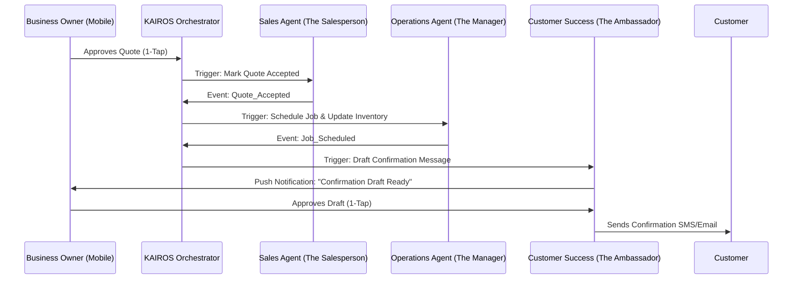

# Architecture Brief: AI Agent Department Architecture

## Title
AI Agent Department Architecture: Orchestrating Autonomous Business Operations

## Problem Statement
Small business owners—like Maya the baker, Carlos the handyman, and Fatima the food cart operator—need the power of an entire team (sales, marketing, customer service, operations, finance, etc.) without the cost, technical overhead, or management complexity. Currently, business tools are fragmented, requiring the owner to manually stitch together customer data, inventory, scheduling, and communication. The challenge is to architect a system of invisible, autonomous AI departments that handle this complexity seamlessly, mirroring a real-world business structure, while ensuring the owner retains control and trust.

## Research Report
### Context and Personas
The system must be evaluated against the needs of our core personas:
1.  **Maya (Home Baker, 28)**: Needs the Operations Agent to track complex, multi-day cake orders, and the Marketing Agent to automatically reply to Instagram DMs based on those operational capabilities.
2.  **Carlos (Handyman, 42)**: Requires the Sales Agent to generate quotes instantly, seamlessly handing off to Operations for scheduling once accepted.
3.  **Fatima (Food Cart Operator, 50)**: Relies on the Operations Agent for rapid, simple pre-order management, with the Customer Success Agent providing clear, multilingual pickup notifications.

### The 7 AI Agent Departments
To provide a familiar mental model, OHC's agents are structured into distinct "Departments":
1.  **Operations ("The Manager")**: Handles fulfillment, inventory tracking, booking management, and core business logistics.
2.  **Marketing & Advertising ("The Promoter")**: Creates storefronts, manages SEO, drafts social media posts, and generates promotional campaigns.
3.  **Sales & Acquisition ("The Salesperson")**: Generates quotes, follows up on leads, tracks referrals, and suggests upsells.
4.  **Customer Success ("The Ambassador")**: Replies to messages, sends order updates, requests reviews, and manages re-engagement.
5.  **Finance & Payments ("The Accountant")**: Processes payments, generates financial reports, manages subscriptions, and prepares tax summaries.
6.  **Legal & Compliance ("The Protector")**: Manages terms/policies, tracks GDPR compliance, and handles liability disclaimers.
7.  **Business Advisory ("The Advisor")**: Generates weekly health reports, suggests next actions, analyzes seasonal trends, and recommends pricing strategies.

### Cross-Department Coordination & Triggers
Agents do not operate in silos; they coordinate via the KAIROS Orchestrator. Triggers fall into three categories:
-   **Event-Driven**: The primary mechanism. For example, when Operations completes an order (Event: `Order_Ready`), Customer Success is triggered to notify the customer.
-   **Scheduled (Cron)**: Time-based actions, such as the Advisor generating a weekly health report every Monday morning.
-   **On-Demand**: Direct requests from the business owner via the mobile dashboard UI.

### Memory & Context Retention
To function effectively, agents need shared, long-term memory:
-   **Short-Term Context**: Awareness of the current task payload (e.g., specific order details).
-   **Long-Term Memory (AutoDream)**: Semantic memory storing past interactions, customer preferences, and seasonal trends, ensuring context is maintained across departments over time.

### Approval Workflows & Trust
Building trust with non-technical owners is paramount:
-   **Auto-Execute**: Low-risk, reversible actions (e.g., updating internal inventory counts).
-   **Draft-for-Review (1-Tap Approval)**: High-risk, external actions (e.g., sending emails, publishing social posts, issuing refunds). The agent drafts the action and requests a 1-tap approval from the owner via the mobile UI.

### Usage Budgeting & Throttling
Agent activity is gated by the multi-tenant SaaS tier:
-   Usage is tracked per tenant.
-   Soft limits dictate monthly AI actions (e.g., Free: 100 actions, Starter: 1,000 actions).
-   When limits are approached, the Business Advisory agent proactively suggests relevant upgrades.

## Design Doc

### Key Design Decisions
1.  **Orchestrated Handoffs**: The KAIROS Orchestrator acts as the central router. When an agent completes a task, it emits an event to the Teammate Mesh, which the Orchestrator uses to trigger the next logical department, ensuring collision-free handoffs.
2.  **Strict Multi-Tenancy**: Every agent action, memory retrieval, and event must be strictly scoped to the tenant ID. Agents operate in complete isolation between businesses.
3.  **Mobile-First Interaction**: All draft-for-review approvals and advisory reports are designed for immediate consumption and action on a mobile device (375px breakpoint). Information is presented in plain language ("Grandmother Test").
4.  **Fail-Safe Idempotency**: Agent actions must be idempotent. If the LLM API fails, the task enters a 'paused' state and notifies the owner, preventing cascading failures.

### Architecture Diagram (Mermaid.js)

### Mobile UX Flow (375px First)
1.  **The Activity Feed**: The core mobile view is not a complex dashboard, but a simple, chronological feed of agent activity and pending approvals.
2.  **The 1-Tap Approval Card**: When an agent drafts an action (e.g., an email reply), it appears as a card in the feed. The card shows a plain-language summary (e.g., "Reply to Sarah about vegan options") and a preview of the drafted text.
3.  **Interaction**: The owner has two primary buttons: "Approve & Send" (primary action) or "Edit" (secondary action). Tapping "Edit" opens a simple text input to modify the draft before sending.
4.  **Advisory Insights**: Weekly health reports are presented as visually engaging, simplified stories (similar to Instagram Stories), highlighting key metrics and suggesting one clear action item.

## Implementation Prompt
**To Implementer Agent:**
Implement the core execution routing for the AI Agent Departments within the KAIROS Orchestrator. Develop the event-driven mechanism that allows the Sales, Operations, and Customer Success agents to subscribe to state changes (e.g., `Quote_Accepted`, `Order_Ready`) and sequentially process tasks. Implement the "Draft-for-Review" state for high-risk actions, exposing an API endpoint that allows the mobile UI to fetch pending drafts and submit 1-tap approvals. Ensure that all agent operations strictly enforce a 60-second timeout, include retry logic (max 3 attempts), and correctly bubble up connection errors to a 'paused' state to comply with ML-Resilience rules. Do not prescribe specific database schemas or LLM inference details; focus on the robust orchestration and state management of these departmental handoffs.

## Priority
P0

## Estimated Scope
Large
