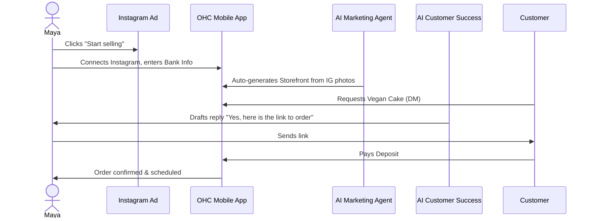
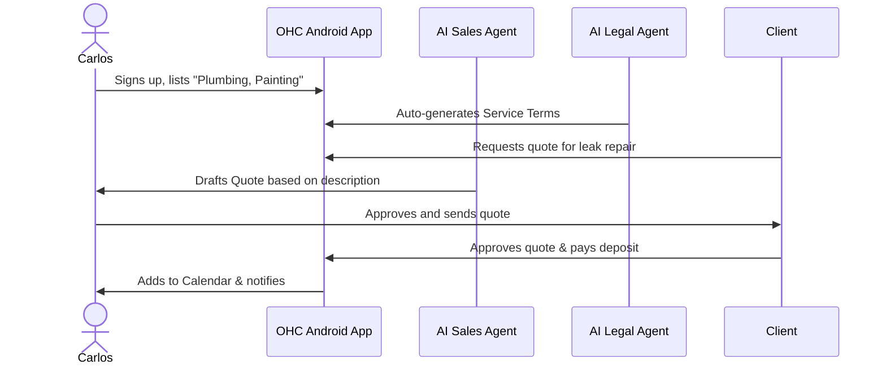
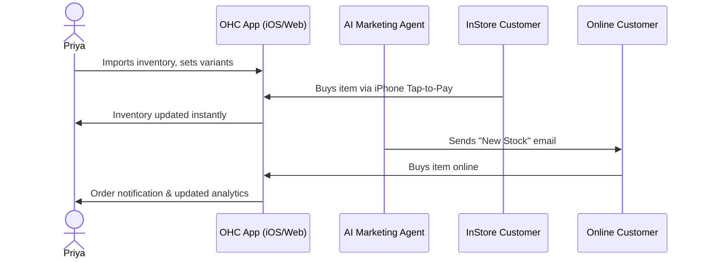
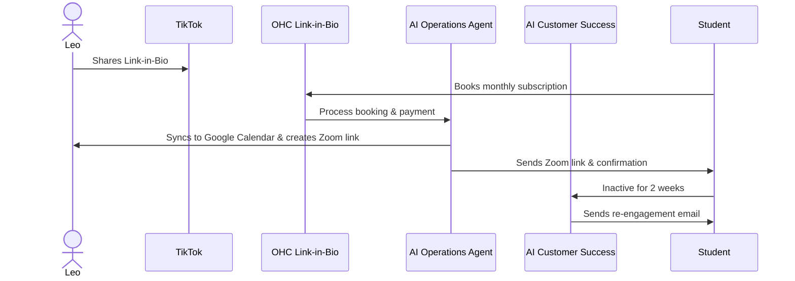
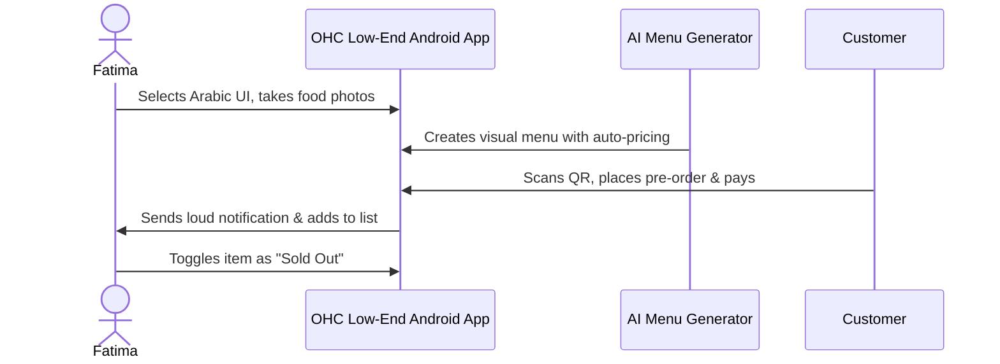

# [architecture] End-to-End Business Journey Architecture

## Title
Business Journey Architecture: End-to-End User Journeys for OHC Personas

## Problem Statement
Small business owners often lack the technical expertise, time, and budget to stitch together disparate software solutions (website builder, CRM, booking system, POS) to launch and run their operations. A baker, handyman, or food cart operator needs a simple, zero-jargon path to go from an idea to a live, money-making business in under 10 minutes. The existing fragmented market (Shopify, Wix, etc.) overwhelms these non-technical users with complexity and leaves them managing systems instead of their business.

## Research Report
The current small business software market features platforms tailored for specific verticals (e.g., Shopify for retail, Wix/Squarespace for portfolios, GoDaddy for domains). However, none provide a seamlessly integrated, mobile-first ecosystem where AI invisibly handles operations, marketing, sales, customer success, finance, and advisory.

- **Shopify:** Takes 30-60 minutes to set up, requires basic technical knowledge, and is primarily focused on e-commerce. AI is limited to "Sidekick" (a chat interface).
- **Wix/Squarespace:** Setup is 20-60 minutes. While they offer portfolio and store features, they often require managing complex desktop-first site builders.
- **OHC Opportunity:** A single platform providing a 10-minute setup, absolute mobile-first design, and background AI agents acting as a business "department" (Operations, Marketing, Sales, etc.).

## Design Doc

This design details the complete end-to-end user journey for five key personas across the Acquisition, Onboarding, Activation, Retention, Revenue, and Referral phases. Friction points are identified to ensure a zero-jargon, mobile-first experience.

### 1. Maya — The Home Baker (28, non-technical)

**Journey:**
- **Acquisition:** Discovers OHC via an Instagram ad highlighting "Sell your cakes directly from your DMs without a website." CTA: "Start selling in 2 minutes."
- **Onboarding:** Enters her Instagram handle; OHC AI Agent (Marketing) auto-generates a storefront using her photos and captions. Minimal input required: business name and bank account for deposits.
- **Activation:** Receives her first custom cake order with a pre-payment deposit via Stripe.
- **Retention:** Customer Success AI drafts replies to Instagram DMs ("Yes, I do vegan cakes!"). Weekly Business Advisory reports keep her engaged.
- **Revenue:** Upgrades from Free to Starter tier when she needs more than 10 products and automated DM replies.
- **Referral:** Adds an OHC link to her bio; shares her success story on Instagram, triggering a viral loop.

### 2. Carlos — The Freelance Handyman (42, non-technical)

**Journey:**
- **Acquisition:** Learns about OHC from a fellow tradesman. CTA: "Get paid faster and stop losing leads."
- **Onboarding:** Selects "Services" template. Inputs typical jobs (e.g., Plumbing Fixes, Painting). AI Agent (Legal) sets up standard service terms.
- **Activation:** Customer books a time slot and pays a deposit. AI Agent (Sales) auto-sends quotes based on customer descriptions.
- **Retention:** Uses the central inbox daily to review and approve AI-generated quotes.
- **Revenue:** Upgrades when he exceeds the free monthly AI actions (quotes).
- **Referral:** Sends a booking link to a client via SMS, which includes a "Powered by OHC" footer.

### 3. Priya — The Boutique Owner (35, semi-technical)

**Journey:**
- **Acquisition:** Searching Google for "easy POS and online store sync." CTA: "Sync your store and website instantly."
- **Onboarding:** Imports existing inventory spreadsheet. AI categorizes products and variants. Sets up Tap-to-Pay on her iPhone.
- **Activation:** Completes her first in-person sale using Tap-to-Pay and her first online sale the same day.
- **Retention:** Checks daily mobile analytics (revenue today vs. yesterday) and uses AI Marketing to auto-email customers when new stock arrives.
- **Revenue:** Reaches the 100-product limit on Starter and upgrades to Pro for unlimited products.
- **Referral:** Recommends OHC to a neighboring business owner directly.

### 4. Leo — The Music Tutor (22, non-technical)

**Journey:**
- **Acquisition:** Needs a link-in-bio for TikTok. Finds OHC via TikTok influencer. CTA: "Your booking page in 1 minute."
- **Onboarding:** Connects Google Calendar, sets up monthly subscription packages. AI Marketing generates a sleek link-in-bio page.
- **Activation:** First student signs up for a monthly package. AI Operations auto-generates the Zoom link.
- **Retention:** AI Customer Success follows up with students who haven't booked in 2 weeks. Leo manages his schedule easily.
- **Revenue:** Moves to a paid tier to access recurring billing features and custom domains.
- **Referral:** TikTok followers see his professional booking page and use it for their own services.

### 5. Fatima — The Food Cart Operator (50, non-technical, limited English)

**Journey:**
- **Acquisition:** Local community flyer or word-of-mouth. Needs a simple way to take pre-orders to reduce lines.
- **Onboarding:** Opens the app in Arabic. Takes photos of her food. AI Agent auto-prices and creates a visual menu.
- **Activation:** Customer places a pre-order. Fatima receives a loud, clear notification and a simple printable order list.
- **Retention:** Uses the app daily to toggle "sold out" items and manage pickups.
- **Revenue:** High volume of orders easily justifies a paid tier for advanced pickup scheduling.
- **Referral:** Customers in line scan a QR code to order, exposing them to the OHC ecosystem.

## Implementation Prompt
**To the Implementer:**
Using this Business Journey Architecture, implement the underlying data models and routing flows to support these personas. Your implementation must:
- Ensure the user onboarding flows for Acquisition and Activation require zero technical jargon and can be completed in under 10 minutes.
- Support deep linking for the various entry points (Instagram bio, QR code scan, direct URL).
- Utilize the Riverpod/Zustand state management carefully to handle optimistic UI updates, particularly for offline or low-data modes (e.g., Fatima's environment).
- Define the necessary AI agent prompt structures for the respective departments (Marketing, Customer Success, Legal, Sales, Operations) to facilitate the interactions detailed in the sequence diagrams.

## Priority
P0

## Estimated Scope
Large
