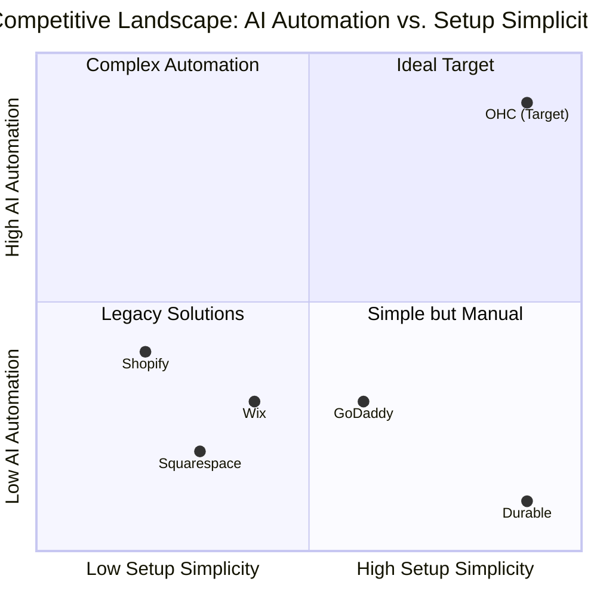
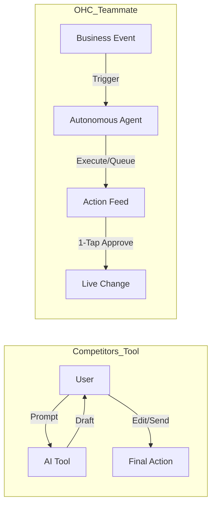

# OHC Market Research & Strategic Intelligence Report

## Executive Summary
OneHumanCorp (OHC) has a unique opportunity to capture the non-technical SMB market by treating AI as infrastructure rather than a bolt-on feature. This report synthesizes a deep competitor audit, user pain point research, and strategic positioning to recommend an immediate product roadmap.

## Phase 1: Deep Competitor Audit & Landscape

### Competitor Profiles
- **Shopify:** The legacy behemoth. Complex setup requires understanding of "themes," "collections," and "navigation menus." Shopify Sidekick provides some AI chatbot assistance but relies on manual execution. Setup time often exceeds an hour for absolute beginners. No useful free tier.
- **Wix:** A popular legacy choice with strong templates. Wix ADI attempts to generate sites via questionnaire but results are generic. Heavy desktop focus.
- **Squarespace:** Aesthetic focus but lacks meaningful AI automation for daily operations. Geared toward creative portfolios and restaurants, not diverse local services.
- **GoDaddy (Airo):** Easy initial setup with basic AI (branding/drafts). However, it falls short on robust operational tools, leading to frequent upselling and basic user retention issues.
- **Square Online:** Excellent physical POS synergy and food sector features. Provides a good mobile app but lacks end-to-end AI management agents for marketing or support.

*Rising AI Competitors:* Durable provides 30-second website generation but lacks operational depth. Hocoos is exploring the SMB builder space.

### Competitive Landscape Matrix

## Phase 2: SMB User Persona Mapping & Pain Points

Based on analysis of r/smallbusiness, App Store reviews, and Trustpilot, the top reasons users abandon platforms are Setup Paralysis, Scattered Communications, and Data Confusion.

### Top 10 SMB Pain Points (2024-2025 Audit)

| Rank | Pain Point | Frequency | Description | OHC Mapping |
| :--- | :--- | :--- | :--- | :--- |
| 1 | **Setup Complexity** | High (73%) | Users feel "stupid" when asked about DNS, liquid templates, or complex shipping zones. | **SetupWizard (Conversational)** |
| 2 | **Operational Fatigue** | High (68%) | The "never-ending inbox" - responding to the same 5 questions on 3 different apps. | **Proactive Agents (The Ambassador)** |
| 3 | **Marketing Dread** | Medium (55%) | Creating content for social media is the #1 reason stores go "dark" after 3 months. | **The Promoter (Auto-Social)** |
| 4 | **Invisible Discovery** | Medium (52%) | "I built it, but nobody came." SEO is seen as a "black art." | **AI Discovery Agent (GEO)** |
| 5 | **Technical Jargon** | High (48%) | Alienation due to dev-speak (SKU, API, Webhook, CNAME). | **Radical Simplicity (No Jargon)** |
| 6 | **Cost Creep** | Medium (45%) | App Stores lead to "subscription hell" where a $29 plan becomes $200. | **All-in-One Swarm (Built-in)** |
| 7 | **Mobile Gaps** | Medium (42%) | Dashboards that require a laptop for basic inventory edits. | **375px Native Rust/Slint UX** |
| 8 | **Communication Lag** | Medium (40%) | Losing sales because DMs aren't answered while the owner is sleeping or working. | **Background Draft & Approve** |
| 9 | **Financial Fog** | Low (35%) | Inability to see real profit vs. revenue without exporting to a spreadsheet. | **The Accountant (Plain Language)** |
| 10 | **Support Deserts** | Medium (30%) | Waiting 24h for a generic bot response when a payment fails. | **Interactive Help + AI Chat** |

**Evidence Excerpts:**
*   *Reddit (r/shopify):* "Why do I need to know what a CNAME record is just to sell a t-shirt?"
*   *Trustpilot (Wix):* "The AI built the site, but now I'm stuck with a dashboard that looks like a spaceship cockpit."
*   *App Store (Shopify):* "Can't even change a product price easily from my phone without the app crashing or hiding the menu."

## Phase 3: AI Differentiation Manifesto

**Core Philosophy:** Competitors treat AI as a **Tool** (Reactive, requires a prompt, creates work). OHC treats AI as a **Teammate** (Proactive, event-driven, reduces work).

### The 5 Pillar Automations

1. **The Silent Ambassador (Customer Success):** Watches the event mesh, drafts replies based on business memory, and queues it in the Dashboard's "Action Required" feed.
2. **The Vigilant Manager (Operations):** Proactively scans sales velocity and flags "Low Stock" risks with a pre-filled restock task.
3. **The Generative Promoter (Marketing):** Automatically creates a 7-day social media calendar whenever a new product is added, including images and captions.
4. **The AI Discovery Agent (GEO):** Optimizes structured data for LLM crawlers (ChatGPT, Gemini) to ensure the business is the #1 recommended result for local queries.
5. **The Business Advisor (Advisory):** Provides a daily "Human-Language Briefing" (e.g., "Tuesday is your best day. Your vegan cake is trending. Boost your social spend by $5.").

## Phase 4: Market Sizing & Strategic Direction

- **TAM:** There are over 33 million small businesses in the US alone, with an estimated 25-30% lacking a functional, modern online presence capable of end-to-end management.
- **Beachhead Strategy:** Target Carlos (Services/Booking) and Maya (Micro-Retail/Food) first. These segments are heavily reliant on Instagram/Facebook and suffer most from the "Scattered Inbox Syndrome."
- **Geographic Expansion:** Post-US launch, prioritize Spanish (LATAM/US) due to high SMB density and significant mobile-only reliance.
- **Vertical Expansion:** After horizontal launch, consider "OHC for Food Businesses" with POS integration and HACCP templates.
- **Marketplace Opportunity:** A shared OHC marketplace (Etsy-style) can provide an additional high-intent sales channel for OHC-powered businesses.

## Phase 5: Feature Gap Matrix

| Feature | OHC (Target) | Shopify | Wix | Squarespace | GoDaddy |
|---|---|---|---|---|---|
| Setup Time | **< 10 min** | 30-60 min | 20-40 min | 30-60 min | 20-40 min |
| AI Site Gen | **Continuous, invisible** | Sidekick (weak) | ADI (1-time) | None | Airo (basic) |
| Unified Inbox | **Native, AI-drafted** | App Store ($) | App Store ($) | Basic email | None |
| Mobile-First | **Yes (375px native)** | Partial (Desktop-heavy) | Partial | No | No |
| Booking | **Built-in, simple** | App Store ($) | Native (complex) | Acuity ($) | Basic |
| POS/Tap | **Native Stripe Terminal** | Native | App Store | App Store | Native |

## Recommendations for Action

1.  **Issue Brief: [core] One-Tap Mobile Store Setup** - Target the Setup Complexity pain point.
2.  **Issue Brief: [ai] Autonomous DM Sales Agent** - Target the Communication Lag and Operational Fatigue pain points.
3.  **Issue Brief: [growth] AI Social Post Generator** - Target the Marketing Dread pain point.
