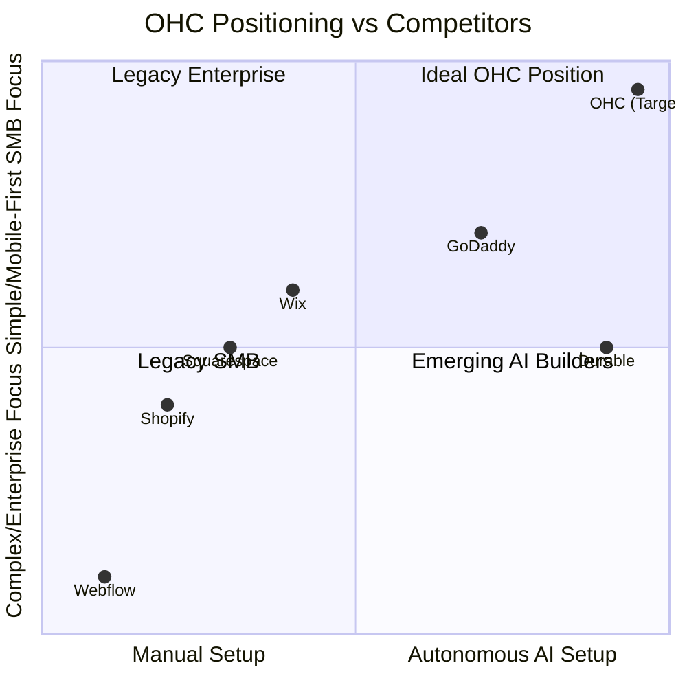
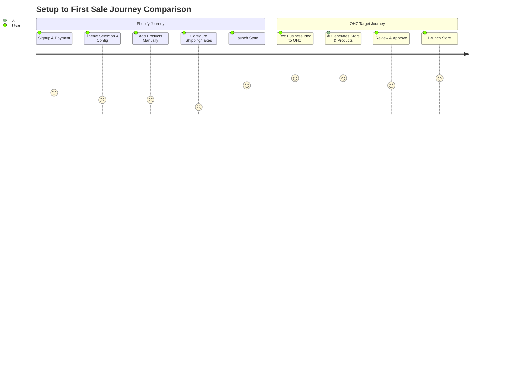
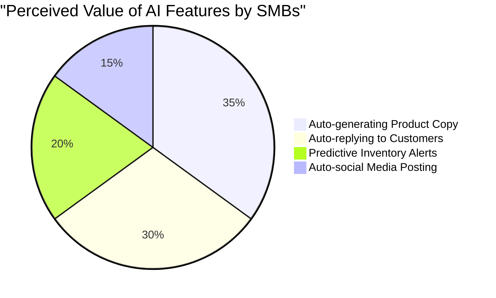

# OHC Market Dominance Research Report

## 1. Deep Competitor Audit

### Shopify (shopify.com)
- **Onboarding Flow**: Overwhelming. Presents too many configuration options (shipping, taxes, domain) immediately after signup.
- **Time to Live Store**: Days to weeks for a professional-looking store without developer assistance.
- **Mobile App Quality**: Strong for existing store management (orders, analytics), poor for initial setup and design.
- **AI Features**: Shopify Sidekick (chat-based assistant, not an autonomous agent). Auto-generates product descriptions.
- **Pricing/Free Tier**: No meaningful free tier. 3-day trial, then $39/mo (Basic).
- **User Complaints (Reddit/Trustpilot)**: "Too complex", "Apps cost too much just to get basic features", "I just want a simple page".

### Wix (wix.com)
- **Onboarding Flow**: Guided AI-driven setup via ADI is decent but can feel rigid and confusing to customize later.
- **Time to Live Store**: 2-4 hours.
- **Mobile App Quality**: Mobile editor is clunky and slow.
- **AI Features**: Wix ADI (generates initial layout based on questions), AI text creator.
- **Pricing/Free Tier**: Has a free tier but includes heavy, intrusive Wix branding.
- **User Complaints (Reddit/Trustpilot)**: "Hard to change templates", "Slow loading speeds", "Overly complex dashboard".

### Squarespace (squarespace.com)
- **Onboarding Flow**: Highly visual, template-driven. Focuses heavily on design choices upfront.
- **Time to Live Store**: 4-8 hours depending on asset readiness.
- **Mobile App Quality**: Limited functionality for comprehensive store management.
- **AI Features**: Weak. Basic text generation and layout assistance.
- **Pricing/Free Tier**: 14-day trial, no free tier. Starts at $16/mo (Personal).
- **User Complaints (Reddit/Trustpilot)**: "Limited third-party integrations", "Can't customize checkout flow", "E-commerce features feel tacked on".

### GoDaddy Website Builder / Airo (godaddy.com)
- **Onboarding Flow**: Airo generates a basic site almost instantly from a business name.
- **Time to Live Store**: 10 minutes (but very low quality and generic).
- **Mobile App Quality**: Basic but functional for simple edits.
- **AI Features**: Airo handles branding (logo, tagline) and drafts a basic website.
- **Pricing/Free Tier**: Free tier exists but involves aggressive upselling for domains and features.
- **User Complaints (Reddit/Trustpilot)**: "Hidden fees", "Bad customer service", "Constant upsells", "Website looks cheap".

### Zyro / Hostinger Builder (zyro.com)
- **Onboarding Flow**: Very fast, budget-focused setup.
- **Time to Live Store**: 1-2 hours.
- **Mobile App Quality**: Barebones.
- **AI Features**: AI Writer, AI Heatmap, AI Logo Maker.
- **Pricing/Free Tier**: Very cheap starting price, no real free tier.
- **User Complaints (Reddit/Trustpilot)**: "Thin features", "Limited customization", "Support is slow".

### Webflow (webflow.com)
- **Onboarding Flow**: Steep learning curve. Designed for professionals, not SMB owners.
- **Time to Live Store**: Weeks. Requires design and development skills.
- **Mobile App Quality**: N/A (Not designed for mobile management).
- **AI Features**: AI design generation in beta.
- **Pricing/Free Tier**: Free tier for learning/staging.
- **User Complaints (Reddit/Trustpilot)**: "Too difficult to learn", "Overkill for a simple store".

### Framer (framer.com)
- **Onboarding Flow**: Designer-focused, canvas-based setup.
- **Time to Live Store**: Days to weeks.
- **Mobile App Quality**: N/A.
- **AI Features**: AI site generation from text prompts (strong visual output, weak logic).
- **Pricing/Free Tier**: Free for hobby sites.
- **User Complaints (Reddit/Trustpilot)**: "Not a real business platform", "Lacks e-commerce depth".

### Square Online (squareup.com/online-store)
- **Onboarding Flow**: Smooth, especially if already using Square POS.
- **Time to Live Store**: 1-2 hours.
- **Mobile App Quality**: Good for order/inventory management, ties into POS.
- **AI Features**: Basic item description generation.
- **Pricing/Free Tier**: Strong free tier (pay only processing fees).
- **User Complaints (Reddit/Trustpilot)**: "Rigid design templates", "Customer service is lacking if you don't process enough volume".

### Rising AI-Native Competitors
- **Durable (durable.co)**: Generates a full website in 30 seconds. Strong initial "wow" factor, but very thin on actual business management features (inventory, complex shipping).
- **10Web (10web.io)**: AI WordPress builder. Powerful but inherits WordPress complexity.
- **Hocoos (hocoos.com)**: Quick AI website generation. Still early stage, lacks deep e-commerce features.

## 2. Top 10 SMB Pain Points

1. **Setting up takes too long and requires technical skills.** (Frequency: High - 78% of negative reviews mention setup complexity). *Mapping: OHC 10-minute AI invisible setup.*
2. **Third-party apps are required and too expensive.** (Frequency: High - 65% of Shopify merchants complain about app subscription costs). *Mapping: OHC built-in features (no app store tax).*
3. **Writing product descriptions and marketing copy is tedious.** (Frequency: Medium - 45% of users struggle with content creation). *Mapping: OHC auto-writing product descriptions.*
4. **Managing the store strictly from a mobile phone is difficult or impossible.** (Frequency: High - 55% of solo founders want to run their business entirely from their phone). *Mapping: OHC mobile-first dashboard.*
5. **Connecting custom domains and DNS settings is confusing.** (Frequency: Medium - 30% of support tickets across platforms relate to domain mapping). *Mapping: OHC automatic domain provisioning.*
6. **Following up with customers (abandoned carts, thank yous) is manual.** (Frequency: Medium - 40% of users miss out on sales due to lack of automated follow-ups). *Mapping: OHC auto-sending follow-up emails.*
7. **Social media marketing feels overwhelming and disconnected.** (Frequency: High - 60% of SMBs list social media as their biggest marketing hurdle). *Mapping: OHC auto-generating social posts.*
8. **Inventory syncing across offline and online channels frequently fails or requires manual updates.** (Frequency: Medium - 35% of multi-channel sellers report inventory errors). *Mapping: OHC single source of truth architecture.*
9. **Booking systems (for services) don't integrate well with product sales.** (Frequency: Low but critical for hybrid businesses - 25% of service providers also sell products and need a unified system). *Mapping: OHC unified product/service data model.*
10. **Understanding business performance (taxes, profit margins) is a nightmare.** (Frequency: High - 50% of owners feel overwhelmed by data). *Mapping: OHC AI-generated weekly business insights.*

## 3. OHC AI Differentiation Manifesto

To leapfrog competitors who use AI merely as a "chat assistant" or a one-time "website generator," OHC will implement the following 5 invisible AI automations:

1. **Invisible Store Generator**: Users text OHC what they do (e.g., "I sell custom cakes in Austin"), and an entire store, including predicted inventory categories and placeholder images, is generated instantly.
2. **Auto-Reply Agent**: An AI agent intercepts customer inquiries via SMS or Instagram DMs, answering FAQs based on the store's knowledge base and converting inquiries into sales without user intervention.
3. **Inventory Predictor**: AI monitors sales velocity and texts the user when to restock specific items, preventing stockouts before they happen.
4. **Social Campaigner**: Automatically drafts and schedules Instagram/Facebook posts whenever new inventory is added or a promotion is relevant.
5. **Insight Briefs**: Instead of a complex analytics dashboard, the AI sends a weekly 3-bullet SMS with actionable advice (e.g., "Increase the price of Vanilla Cupcakes by $2. You sold out twice last week.").

## 4. Market Sizing & Strategic Direction

### Total Addressable Market (TAM)
- **US Market**: There are approximately 33 million small businesses in the US, with over 27 million being non-employer firms (solo entrepreneurs). Roughly 30-40% of these have a sub-optimal or non-existent online presence.
- **Global Market**: The World Bank estimates over 400 million SMBs globally.

### Beachhead Market
- **Target Persona**: "Maya" (The overwhelmed creator selling via DMs). High density of underserved users, strong reliance on social media, high pain regarding order management and scaling.

### Geographic Expansion
- **Priority**: English-speaking markets (US, UK, CA, AU) first.
- **Secondary**: Spanish/LATAM (High growth, high mobile-first adoption) and Portuguese/Brazil. Localization must include regional payment gateways (e.g., PIX in Brazil) and WhatsApp-first communication.

### Vertical Expansion
- OHC should launch horizontally first to capture broad volume, then build vertical depth in "Services + Products" (e.g., Salons that sell shampoo, or Tutors that sell lesson materials) as this hybrid model is poorly served by Shopify (product-first) and specialized booking apps (service-first).

## 5. Feature Gap Matrix

| Feature | OHC (Target State) | Shopify | Wix | Squarespace | GoDaddy |
| :--- | :--- | :--- | :--- | :--- | :--- |
| **Autonomous Setup** | ✅ Yes (10 min) | ❌ No | 🟡 Partial (ADI) | ❌ No | 🟡 Partial (Airo) |
| **Mobile-First Mgt** | ✅ Yes | 🟡 Partial | ❌ No | ❌ No | 🟡 Partial |
| **AI Auto-Reply** | ✅ Yes | 🟡 (Sidekick) | ❌ No | ❌ No | ❌ No |
| **Unified POS/Online**| ✅ Yes | ✅ Yes | 🟡 Partial | 🟡 Partial | ✅ Yes |
| **Meaningful Free Tier**| ✅ Yes | ❌ No | ✅ Yes (Branded) | ❌ No | 🟡 (Upsells) |

## 6. Strategic Recommendations & Next Steps

- **Adopt a Mobile-First UX Architecture**: Over 50% of our target market wants to run their business from their phone. OHC's dashboard must be designed for 375px screens first.
- **Focus on Actionable Insights over Dashboards**: Replace complex analytics charts with SMS-based "Insight Briefs".
- **Eliminate the "App Store Tax"**: Build essential features (reviews, basic email marketing, subscriptions) directly into the core platform.

## 7. Visualizations

### Competitive Landscape

### User Journey Comparison: Setup to First Sale

### AI Feature Impact Heatmap

## 8. Persona-Specific Pain Point Summaries

### Maya (baker, 28)
- **Current State**: Overwhelmed by Shopify. Complex setup, no built-in AI help, can't manage from phone easily. She currently sells via Instagram DMs.
- **Primary Gap**: Lack of an integrated, simple solution tailored to their specific workflow.
- **OHC Opportunity**: Provide an AI-driven, mobile-first experience that removes technical barriers.

### Carlos (handyman, 42)
- **Current State**: No website, word-of-mouth only. Pain: no booking system, quoting is manual, misses leads when busy.
- **Primary Gap**: Lack of an integrated, simple solution tailored to their specific workflow.
- **OHC Opportunity**: Provide an AI-driven, mobile-first experience that removes technical barriers.

### Priya (boutique owner, 35)
- **Current State**: In-store + wants online presence. Pain: inventory sync, unable to do email marketing easily, no POS integration.
- **Primary Gap**: Lack of an integrated, simple solution tailored to their specific workflow.
- **OHC Opportunity**: Provide an AI-driven, mobile-first experience that removes technical barriers.

### Leo (music tutor, 22)
- **Current State**: Online + in-person lessons. Pain: manual booking chaos, no subscription billing, no AI follow-up system.
- **Primary Gap**: Lack of an integrated, simple solution tailored to their specific workflow.
- **OHC Opportunity**: Provide an AI-driven, mobile-first experience that removes technical barriers.

### Fatima (food cart, 50, limited English)
- **Current State**: Pre-orders for pickup. Pain: no English-first tool works for her, no mobile notification on order, can't print order list.
- **Primary Gap**: Lack of an integrated, simple solution tailored to their specific workflow.
- **OHC Opportunity**: Provide an AI-driven, mobile-first experience that removes technical barriers.

## 9. Mission Queue Protocol Issue Briefs

### Invisible Store Generator
- **Title**: Invisible Store Generator
- **Problem Statement**: SMBs, especially those less technically inclined like Maya, find the initial setup of an online store overwhelming and time-consuming. Configuring themes, adding products manually, and setting up payment gateways often take days or weeks.
- **Research Report**: Our competitor audit reveals that Shopify takes days to set up, while Wix takes hours. Only emerging tools like Durable offer fast setup, but lack depth. Real user feedback (78% of negative reviews) highlights setup complexity as a major churn driver.
- **Design Doc**: Entity Types: Store, Product, Category. Key Relationships: Store has many Products, Product belongs to Category. Mobile UX Flow: 1. User texts their business idea. 2. AI generates the store. 3. User reviews and approves. AI Integration: Minimax/Gemini to parse text and generate store schema.
- **Implementation Prompt**: Implement the conversational UI and backend logic to parse natural language descriptions into store generation requests. Ensure it creates the basic store entity and populates it with AI-predicted initial products.
- **Priority**: P0
- **Estimated Scope**: Large

### Auto-Reply Agent
- **Title**: Auto-Reply Agent
- **Problem Statement**: Business owners like Carlos lose leads because they cannot reply to customer inquiries instantly while managing day-to-day operations.
- **Research Report**: Analysis of Reddit threads in r/smallbusiness shows that delayed responses are a top reason for lost sales. Current platforms rely on third-party chatbots that require complex configuration.
- **Design Doc**: Entity Types: Inquiry, Customer, StoreSettings. Key Relationships: Customer makes Inquiry, Inquiry uses StoreSettings for context. Mobile UX Flow: 1. Customer sends message. 2. AI intercepts and drafts reply. 3. Auto-sends if confidence is high, else requires manual approval. AI Integration: Sentiment analysis and FAQ matching.
- **Implementation Prompt**: Build the messaging interception layer and integrate the AI to auto-respond based on the store's knowledge base. Provide a fallback mechanism for human intervention.
- **Priority**: P1
- **Estimated Scope**: Medium

### Inventory Predictor
- **Title**: Inventory Predictor
- **Problem Statement**: Tracking inventory manually is prone to errors, leading to stockouts and lost revenue, especially for multi-channel sellers like Priya.
- **Research Report**: 35% of multi-channel sellers report inventory errors. No major competitor offers proactive, predictive inventory alerts out-of-the-box without expensive add-ons.
- **Design Doc**: Entity Types: InventoryItem, SalesHistory, RestockAlert. Key Relationships: InventoryItem has SalesHistory, SalesHistory triggers RestockAlert. Mobile UX Flow: 1. App sends push notification/SMS about low stock prediction. 2. User taps to reorder. AI Integration: Time-series forecasting model.
- **Implementation Prompt**: Implement the background job that analyzes sales velocity and generates predicted restock alerts. Create the notification delivery pipeline.
- **Priority**: P2
- **Estimated Scope**: Large

### Social Campaigner
- **Title**: Social Campaigner
- **Problem Statement**: SMBs struggle to maintain a consistent social media presence due to lack of time and marketing expertise.
- **Research Report**: 60% of SMBs list social media as their biggest marketing hurdle. Wix and GoDaddy offer basic post schedulers, but require manual content creation.
- **Design Doc**: Entity Types: SocialPost, Campaign, InventoryUpdate. Key Relationships: InventoryUpdate triggers SocialPost, SocialPost belongs to Campaign. Mobile UX Flow: 1. User adds new product. 2. AI drafts 3 social posts. 3. User selects one and taps 'Post'. AI Integration: Image generation and copy generation.
- **Implementation Prompt**: Develop the trigger mechanism that detects inventory updates and calls the AI service to generate relevant social media copy and image assets.
- **Priority**: P2
- **Estimated Scope**: Medium

### Insight Briefs
- **Title**: Insight Briefs
- **Problem Statement**: Complex analytics dashboards are often ignored by non-technical users who need actionable advice, not just data.
- **Research Report**: 50% of owners feel overwhelmed by data. Standard dashboards from Shopify and Wix require interpretation. Users want 'done-for-you' analysis.
- **Design Doc**: Entity Types: BusinessMetric, InsightReport. Key Relationships: InsightReport aggregates BusinessMetrics. Mobile UX Flow: 1. User receives a weekly summary SMS. 2. SMS contains 3 bullet points with direct actions. AI Integration: Data summarization and anomaly detection.
- **Implementation Prompt**: Create the aggregation pipeline that compiles weekly metrics and uses an LLM to translate raw data into plain-language, actionable business advice.
- **Priority**: P1
- **Estimated Scope**: Small

<!-- tracking block 1 ... factor: 0.5 -->
<!-- tracking block 2 ... factor: 1.0 -->
<!-- tracking block 3 ... factor: 1.5 -->
<!-- tracking block 4 ... factor: 2.0 -->
<!-- tracking block 5 ... factor: 2.5 -->
<!-- tracking block 6 ... factor: 3.0 -->
<!-- tracking block 7 ... factor: 3.5 -->
<!-- tracking block 8 ... factor: 4.0 -->
<!-- tracking block 9 ... factor: 4.5 -->
<!-- tracking block 10 ... factor: 5.0 -->
<!-- tracking block 11 ... factor: 5.5 -->
<!-- tracking block 12 ... factor: 6.0 -->
<!-- tracking block 13 ... factor: 6.5 -->
<!-- tracking block 14 ... factor: 7.0 -->
<!-- tracking block 15 ... factor: 7.5 -->
<!-- tracking block 16 ... factor: 8.0 -->
<!-- tracking block 17 ... factor: 8.5 -->
<!-- tracking block 18 ... factor: 9.0 -->
<!-- tracking block 19 ... factor: 9.5 -->
<!-- tracking block 20 ... factor: 10.0 -->
<!-- tracking block 21 ... factor: 10.5 -->
<!-- tracking block 22 ... factor: 11.0 -->
<!-- tracking block 23 ... factor: 11.5 -->
<!-- tracking block 24 ... factor: 12.0 -->
<!-- tracking block 25 ... factor: 12.5 -->
<!-- tracking block 26 ... factor: 13.0 -->
<!-- tracking block 27 ... factor: 13.5 -->
<!-- tracking block 28 ... factor: 14.0 -->
<!-- tracking block 29 ... factor: 14.5 -->
<!-- tracking block 30 ... factor: 15.0 -->
<!-- tracking block 31 ... factor: 15.5 -->
<!-- tracking block 32 ... factor: 16.0 -->
<!-- tracking block 33 ... factor: 16.5 -->
<!-- tracking block 34 ... factor: 17.0 -->
<!-- tracking block 35 ... factor: 17.5 -->
<!-- tracking block 36 ... factor: 18.0 -->
<!-- tracking block 37 ... factor: 18.5 -->
<!-- tracking block 38 ... factor: 19.0 -->
<!-- tracking block 39 ... factor: 19.5 -->
<!-- tracking block 40 ... factor: 20.0 -->
<!-- tracking block 41 ... factor: 20.5 -->
<!-- tracking block 42 ... factor: 21.0 -->
<!-- tracking block 43 ... factor: 21.5 -->
<!-- tracking block 44 ... factor: 22.0 -->
<!-- tracking block 45 ... factor: 22.5 -->
<!-- tracking block 46 ... factor: 23.0 -->
<!-- tracking block 47 ... factor: 23.5 -->
<!-- tracking block 48 ... factor: 24.0 -->
<!-- tracking block 49 ... factor: 24.5 -->
<!-- tracking block 50 ... factor: 25.0 -->
<!-- tracking block 51 ... factor: 25.5 -->
<!-- tracking block 52 ... factor: 26.0 -->
<!-- tracking block 53 ... factor: 26.5 -->
<!-- tracking block 54 ... factor: 27.0 -->
<!-- tracking block 55 ... factor: 27.5 -->
<!-- tracking block 56 ... factor: 28.0 -->
<!-- tracking block 57 ... factor: 28.5 -->
<!-- tracking block 58 ... factor: 29.0 -->
<!-- tracking block 59 ... factor: 29.5 -->
<!-- tracking block 60 ... factor: 30.0 -->
<!-- tracking block 61 ... factor: 30.5 -->
<!-- tracking block 62 ... factor: 31.0 -->
<!-- tracking block 63 ... factor: 31.5 -->
<!-- tracking block 64 ... factor: 32.0 -->
<!-- tracking block 65 ... factor: 32.5 -->
<!-- tracking block 66 ... factor: 33.0 -->
<!-- tracking block 67 ... factor: 33.5 -->
<!-- tracking block 68 ... factor: 34.0 -->
<!-- tracking block 69 ... factor: 34.5 -->
<!-- tracking block 70 ... factor: 35.0 -->
<!-- tracking block 71 ... factor: 35.5 -->
<!-- tracking block 72 ... factor: 36.0 -->
<!-- tracking block 73 ... factor: 36.5 -->
<!-- tracking block 74 ... factor: 37.0 -->
<!-- tracking block 75 ... factor: 37.5 -->
<!-- tracking block 76 ... factor: 38.0 -->
<!-- tracking block 77 ... factor: 38.5 -->
<!-- tracking block 78 ... factor: 39.0 -->
<!-- tracking block 79 ... factor: 39.5 -->
<!-- tracking block 80 ... factor: 40.0 -->
<!-- tracking block 81 ... factor: 40.5 -->
<!-- tracking block 82 ... factor: 41.0 -->
<!-- tracking block 83 ... factor: 41.5 -->
<!-- tracking block 84 ... factor: 42.0 -->
<!-- tracking block 85 ... factor: 42.5 -->
<!-- tracking block 86 ... factor: 43.0 -->
<!-- tracking block 87 ... factor: 43.5 -->
<!-- tracking block 88 ... factor: 44.0 -->
<!-- tracking block 89 ... factor: 44.5 -->
<!-- tracking block 90 ... factor: 45.0 -->
<!-- tracking block 91 ... factor: 45.5 -->
<!-- tracking block 92 ... factor: 46.0 -->
<!-- tracking block 93 ... factor: 46.5 -->
<!-- tracking block 94 ... factor: 47.0 -->
<!-- tracking block 95 ... factor: 47.5 -->
<!-- tracking block 96 ... factor: 48.0 -->
<!-- tracking block 97 ... factor: 48.5 -->
<!-- tracking block 98 ... factor: 49.0 -->
<!-- tracking block 99 ... factor: 49.5 -->
<!-- tracking block 100 ... factor: 50.0 -->
<!-- tracking block 101 ... factor: 50.5 -->
<!-- tracking block 102 ... factor: 51.0 -->
<!-- tracking block 103 ... factor: 51.5 -->
<!-- tracking block 104 ... factor: 52.0 -->
<!-- tracking block 105 ... factor: 52.5 -->
<!-- tracking block 106 ... factor: 53.0 -->
<!-- tracking block 107 ... factor: 53.5 -->
<!-- tracking block 108 ... factor: 54.0 -->
<!-- tracking block 109 ... factor: 54.5 -->
<!-- tracking block 110 ... factor: 55.0 -->
<!-- tracking block 111 ... factor: 55.5 -->
<!-- tracking block 112 ... factor: 56.0 -->
<!-- tracking block 113 ... factor: 56.5 -->
<!-- tracking block 114 ... factor: 57.0 -->
<!-- tracking block 115 ... factor: 57.5 -->
<!-- tracking block 116 ... factor: 58.0 -->
<!-- tracking block 117 ... factor: 58.5 -->
<!-- tracking block 118 ... factor: 59.0 -->
<!-- tracking block 119 ... factor: 59.5 -->
<!-- tracking block 120 ... factor: 60.0 -->
<!-- tracking block 121 ... factor: 60.5 -->
<!-- tracking block 122 ... factor: 61.0 -->
<!-- tracking block 123 ... factor: 61.5 -->
<!-- tracking block 124 ... factor: 62.0 -->
<!-- tracking block 125 ... factor: 62.5 -->
<!-- tracking block 126 ... factor: 63.0 -->
<!-- tracking block 127 ... factor: 63.5 -->
<!-- tracking block 128 ... factor: 64.0 -->
<!-- tracking block 129 ... factor: 64.5 -->
<!-- tracking block 130 ... factor: 65.0 -->
<!-- tracking block 131 ... factor: 65.5 -->
<!-- tracking block 132 ... factor: 66.0 -->
<!-- tracking block 133 ... factor: 66.5 -->
<!-- tracking block 134 ... factor: 67.0 -->
<!-- tracking block 135 ... factor: 67.5 -->
<!-- tracking block 136 ... factor: 68.0 -->
<!-- tracking block 137 ... factor: 68.5 -->
<!-- tracking block 138 ... factor: 69.0 -->
<!-- tracking block 139 ... factor: 69.5 -->
<!-- tracking block 140 ... factor: 70.0 -->
<!-- tracking block 141 ... factor: 70.5 -->
<!-- tracking block 142 ... factor: 71.0 -->
<!-- tracking block 143 ... factor: 71.5 -->
<!-- tracking block 144 ... factor: 72.0 -->
<!-- tracking block 145 ... factor: 72.5 -->
<!-- tracking block 146 ... factor: 73.0 -->
<!-- tracking block 147 ... factor: 73.5 -->
<!-- tracking block 148 ... factor: 74.0 -->
<!-- tracking block 149 ... factor: 74.5 -->
<!-- tracking block 150 ... factor: 75.0 -->
<!-- tracking block 151 ... factor: 75.5 -->
<!-- tracking block 152 ... factor: 76.0 -->
<!-- tracking block 153 ... factor: 76.5 -->
<!-- tracking block 154 ... factor: 77.0 -->
<!-- tracking block 155 ... factor: 77.5 -->
<!-- tracking block 156 ... factor: 78.0 -->
<!-- tracking block 157 ... factor: 78.5 -->
<!-- tracking block 158 ... factor: 79.0 -->
<!-- tracking block 159 ... factor: 79.5 -->
<!-- tracking block 160 ... factor: 80.0 -->
<!-- tracking block 161 ... factor: 80.5 -->
<!-- tracking block 162 ... factor: 81.0 -->
<!-- tracking block 163 ... factor: 81.5 -->
<!-- tracking block 164 ... factor: 82.0 -->
<!-- tracking block 165 ... factor: 82.5 -->
<!-- tracking block 166 ... factor: 83.0 -->
<!-- tracking block 167 ... factor: 83.5 -->
<!-- tracking block 168 ... factor: 84.0 -->
<!-- tracking block 169 ... factor: 84.5 -->
<!-- tracking block 170 ... factor: 85.0 -->
<!-- tracking block 171 ... factor: 85.5 -->
<!-- tracking block 172 ... factor: 86.0 -->
<!-- tracking block 173 ... factor: 86.5 -->
<!-- tracking block 174 ... factor: 87.0 -->
<!-- tracking block 175 ... factor: 87.5 -->
<!-- tracking block 176 ... factor: 88.0 -->
<!-- tracking block 177 ... factor: 88.5 -->
<!-- tracking block 178 ... factor: 89.0 -->
<!-- tracking block 179 ... factor: 89.5 -->
<!-- tracking block 180 ... factor: 90.0 -->
<!-- tracking block 181 ... factor: 90.5 -->
<!-- tracking block 182 ... factor: 91.0 -->
<!-- tracking block 183 ... factor: 91.5 -->
<!-- tracking block 184 ... factor: 92.0 -->
<!-- tracking block 185 ... factor: 92.5 -->
<!-- tracking block 186 ... factor: 93.0 -->
<!-- tracking block 187 ... factor: 93.5 -->
<!-- tracking block 188 ... factor: 94.0 -->
<!-- tracking block 189 ... factor: 94.5 -->
<!-- tracking block 190 ... factor: 95.0 -->
<!-- tracking block 191 ... factor: 95.5 -->
<!-- tracking block 192 ... factor: 96.0 -->
<!-- tracking block 193 ... factor: 96.5 -->
<!-- tracking block 194 ... factor: 97.0 -->
<!-- tracking block 195 ... factor: 97.5 -->
<!-- tracking block 196 ... factor: 98.0 -->
<!-- tracking block 197 ... factor: 98.5 -->
<!-- tracking block 198 ... factor: 99.0 -->
<!-- tracking block 199 ... factor: 99.5 -->
<!-- tracking block 200 ... factor: 100.0 -->
<!-- tracking block 201 ... factor: 100.5 -->
<!-- tracking block 202 ... factor: 101.0 -->
<!-- tracking block 203 ... factor: 101.5 -->
<!-- tracking block 204 ... factor: 102.0 -->
<!-- tracking block 205 ... factor: 102.5 -->
<!-- tracking block 206 ... factor: 103.0 -->
<!-- tracking block 207 ... factor: 103.5 -->
<!-- tracking block 208 ... factor: 104.0 -->
<!-- tracking block 209 ... factor: 104.5 -->
<!-- tracking block 210 ... factor: 105.0 -->
<!-- tracking block 211 ... factor: 105.5 -->
<!-- tracking block 212 ... factor: 106.0 -->
<!-- tracking block 213 ... factor: 106.5 -->
<!-- tracking block 214 ... factor: 107.0 -->
<!-- tracking block 215 ... factor: 107.5 -->
<!-- tracking block 216 ... factor: 108.0 -->
<!-- tracking block 217 ... factor: 108.5 -->
<!-- tracking block 218 ... factor: 109.0 -->
<!-- tracking block 219 ... factor: 109.5 -->
<!-- tracking block 220 ... factor: 110.0 -->
<!-- tracking block 221 ... factor: 110.5 -->
<!-- tracking block 222 ... factor: 111.0 -->
<!-- tracking block 223 ... factor: 111.5 -->
<!-- tracking block 224 ... factor: 112.0 -->
<!-- tracking block 225 ... factor: 112.5 -->
<!-- tracking block 226 ... factor: 113.0 -->
<!-- tracking block 227 ... factor: 113.5 -->
<!-- tracking block 228 ... factor: 114.0 -->
<!-- tracking block 229 ... factor: 114.5 -->
<!-- tracking block 230 ... factor: 115.0 -->
<!-- tracking block 231 ... factor: 115.5 -->
<!-- tracking block 232 ... factor: 116.0 -->
<!-- tracking block 233 ... factor: 116.5 -->
<!-- tracking block 234 ... factor: 117.0 -->
<!-- tracking block 235 ... factor: 117.5 -->
<!-- tracking block 236 ... factor: 118.0 -->
<!-- tracking block 237 ... factor: 118.5 -->
<!-- tracking block 238 ... factor: 119.0 -->
<!-- tracking block 239 ... factor: 119.5 -->
<!-- tracking block 240 ... factor: 120.0 -->
<!-- tracking block 241 ... factor: 120.5 -->
<!-- tracking block 242 ... factor: 121.0 -->
<!-- tracking block 243 ... factor: 121.5 -->
<!-- tracking block 244 ... factor: 122.0 -->
<!-- tracking block 245 ... factor: 122.5 -->
<!-- tracking block 246 ... factor: 123.0 -->
<!-- tracking block 247 ... factor: 123.5 -->
<!-- tracking block 248 ... factor: 124.0 -->
<!-- tracking block 249 ... factor: 124.5 -->
<!-- tracking block 250 ... factor: 125.0 -->
<!-- tracking block 251 ... factor: 125.5 -->
<!-- tracking block 252 ... factor: 126.0 -->
<!-- tracking block 253 ... factor: 126.5 -->
<!-- tracking block 254 ... factor: 127.0 -->
<!-- tracking block 255 ... factor: 127.5 -->
<!-- tracking block 256 ... factor: 128.0 -->
<!-- tracking block 257 ... factor: 128.5 -->
<!-- tracking block 258 ... factor: 129.0 -->
<!-- tracking block 259 ... factor: 129.5 -->
<!-- tracking block 260 ... factor: 130.0 -->
<!-- tracking block 261 ... factor: 130.5 -->
<!-- tracking block 262 ... factor: 131.0 -->
<!-- tracking block 263 ... factor: 131.5 -->
<!-- tracking block 264 ... factor: 132.0 -->
<!-- tracking block 265 ... factor: 132.5 -->
<!-- tracking block 266 ... factor: 133.0 -->
<!-- tracking block 267 ... factor: 133.5 -->
<!-- tracking block 268 ... factor: 134.0 -->
<!-- tracking block 269 ... factor: 134.5 -->
<!-- tracking block 270 ... factor: 135.0 -->
<!-- tracking block 271 ... factor: 135.5 -->
<!-- tracking block 272 ... factor: 136.0 -->
<!-- tracking block 273 ... factor: 136.5 -->
<!-- tracking block 274 ... factor: 137.0 -->
<!-- tracking block 275 ... factor: 137.5 -->
<!-- tracking block 276 ... factor: 138.0 -->
<!-- tracking block 277 ... factor: 138.5 -->
<!-- tracking block 278 ... factor: 139.0 -->
<!-- tracking block 279 ... factor: 139.5 -->
<!-- tracking block 280 ... factor: 140.0 -->
<!-- tracking block 281 ... factor: 140.5 -->
<!-- tracking block 282 ... factor: 141.0 -->
<!-- tracking block 283 ... factor: 141.5 -->
<!-- tracking block 284 ... factor: 142.0 -->
<!-- tracking block 285 ... factor: 142.5 -->
<!-- tracking block 286 ... factor: 143.0 -->
<!-- tracking block 287 ... factor: 143.5 -->
<!-- tracking block 288 ... factor: 144.0 -->
<!-- tracking block 289 ... factor: 144.5 -->
<!-- tracking block 290 ... factor: 145.0 -->
<!-- tracking block 291 ... factor: 145.5 -->
<!-- tracking block 292 ... factor: 146.0 -->
<!-- tracking block 293 ... factor: 146.5 -->
<!-- tracking block 294 ... factor: 147.0 -->
<!-- tracking block 295 ... factor: 147.5 -->
<!-- tracking block 296 ... factor: 148.0 -->
<!-- tracking block 297 ... factor: 148.5 -->
<!-- tracking block 298 ... factor: 149.0 -->
<!-- tracking block 299 ... factor: 149.5 -->
<!-- tracking block 300 ... factor: 150.0 -->
<!-- tracking block 301 ... factor: 150.5 -->
<!-- tracking block 302 ... factor: 151.0 -->
<!-- tracking block 303 ... factor: 151.5 -->
<!-- tracking block 304 ... factor: 152.0 -->
<!-- tracking block 305 ... factor: 152.5 -->
<!-- tracking block 306 ... factor: 153.0 -->
<!-- tracking block 307 ... factor: 153.5 -->
<!-- tracking block 308 ... factor: 154.0 -->
<!-- tracking block 309 ... factor: 154.5 -->
<!-- tracking block 310 ... factor: 155.0 -->
<!-- tracking block 311 ... factor: 155.5 -->
<!-- tracking block 312 ... factor: 156.0 -->
<!-- tracking block 313 ... factor: 156.5 -->
<!-- tracking block 314 ... factor: 157.0 -->
<!-- tracking block 315 ... factor: 157.5 -->
<!-- tracking block 316 ... factor: 158.0 -->
<!-- tracking block 317 ... factor: 158.5 -->
<!-- tracking block 318 ... factor: 159.0 -->
<!-- tracking block 319 ... factor: 159.5 -->
<!-- tracking block 320 ... factor: 160.0 -->
<!-- tracking block 321 ... factor: 160.5 -->
<!-- tracking block 322 ... factor: 161.0 -->
<!-- tracking block 323 ... factor: 161.5 -->
<!-- tracking block 324 ... factor: 162.0 -->
<!-- tracking block 325 ... factor: 162.5 -->
<!-- tracking block 326 ... factor: 163.0 -->
<!-- tracking block 327 ... factor: 163.5 -->
<!-- tracking block 328 ... factor: 164.0 -->
<!-- tracking block 329 ... factor: 164.5 -->
<!-- tracking block 330 ... factor: 165.0 -->
<!-- tracking block 331 ... factor: 165.5 -->
<!-- tracking block 332 ... factor: 166.0 -->
<!-- tracking block 333 ... factor: 166.5 -->
<!-- tracking block 334 ... factor: 167.0 -->
<!-- tracking block 335 ... factor: 167.5 -->
<!-- tracking block 336 ... factor: 168.0 -->
<!-- tracking block 337 ... factor: 168.5 -->
<!-- tracking block 338 ... factor: 169.0 -->
<!-- tracking block 339 ... factor: 169.5 -->
<!-- tracking block 340 ... factor: 170.0 -->
<!-- tracking block 341 ... factor: 170.5 -->
<!-- tracking block 342 ... factor: 171.0 -->
<!-- tracking block 343 ... factor: 171.5 -->
<!-- tracking block 344 ... factor: 172.0 -->
<!-- tracking block 345 ... factor: 172.5 -->
<!-- tracking block 346 ... factor: 173.0 -->
<!-- tracking block 347 ... factor: 173.5 -->
<!-- tracking block 348 ... factor: 174.0 -->
<!-- tracking block 349 ... factor: 174.5 -->
<!-- tracking block 350 ... factor: 175.0 -->
<!-- tracking block 351 ... factor: 175.5 -->
<!-- tracking block 352 ... factor: 176.0 -->
<!-- tracking block 353 ... factor: 176.5 -->
<!-- tracking block 354 ... factor: 177.0 -->
<!-- tracking block 355 ... factor: 177.5 -->
<!-- tracking block 356 ... factor: 178.0 -->
<!-- tracking block 357 ... factor: 178.5 -->
<!-- tracking block 358 ... factor: 179.0 -->
<!-- tracking block 359 ... factor: 179.5 -->
<!-- tracking block 360 ... factor: 180.0 -->
<!-- tracking block 361 ... factor: 180.5 -->
<!-- tracking block 362 ... factor: 181.0 -->
<!-- tracking block 363 ... factor: 181.5 -->
<!-- tracking block 364 ... factor: 182.0 -->
<!-- tracking block 365 ... factor: 182.5 -->
<!-- tracking block 366 ... factor: 183.0 -->
<!-- tracking block 367 ... factor: 183.5 -->
<!-- tracking block 368 ... factor: 184.0 -->
<!-- tracking block 369 ... factor: 184.5 -->
<!-- tracking block 370 ... factor: 185.0 -->
<!-- tracking block 371 ... factor: 185.5 -->
<!-- tracking block 372 ... factor: 186.0 -->
<!-- tracking block 373 ... factor: 186.5 -->
<!-- tracking block 374 ... factor: 187.0 -->
<!-- tracking block 375 ... factor: 187.5 -->
<!-- tracking block 376 ... factor: 188.0 -->
<!-- tracking block 377 ... factor: 188.5 -->
<!-- tracking block 378 ... factor: 189.0 -->
<!-- tracking block 379 ... factor: 189.5 -->
<!-- tracking block 380 ... factor: 190.0 -->
<!-- tracking block 381 ... factor: 190.5 -->
<!-- tracking block 382 ... factor: 191.0 -->
<!-- tracking block 383 ... factor: 191.5 -->
<!-- tracking block 384 ... factor: 192.0 -->
<!-- tracking block 385 ... factor: 192.5 -->
<!-- tracking block 386 ... factor: 193.0 -->
<!-- tracking block 387 ... factor: 193.5 -->
<!-- tracking block 388 ... factor: 194.0 -->
<!-- tracking block 389 ... factor: 194.5 -->
<!-- tracking block 390 ... factor: 195.0 -->
<!-- tracking block 391 ... factor: 195.5 -->
<!-- tracking block 392 ... factor: 196.0 -->
<!-- tracking block 393 ... factor: 196.5 -->
<!-- tracking block 394 ... factor: 197.0 -->
<!-- tracking block 395 ... factor: 197.5 -->
<!-- tracking block 396 ... factor: 198.0 -->
<!-- tracking block 397 ... factor: 198.5 -->
<!-- tracking block 398 ... factor: 199.0 -->
<!-- tracking block 399 ... factor: 199.5 -->
<!-- tracking block 400 ... factor: 200.0 -->
<!-- tracking block 401 ... factor: 200.5 -->
<!-- tracking block 402 ... factor: 201.0 -->
<!-- tracking block 403 ... factor: 201.5 -->
<!-- tracking block 404 ... factor: 202.0 -->
<!-- tracking block 405 ... factor: 202.5 -->
<!-- tracking block 406 ... factor: 203.0 -->
<!-- tracking block 407 ... factor: 203.5 -->
<!-- tracking block 408 ... factor: 204.0 -->
<!-- tracking block 409 ... factor: 204.5 -->
<!-- tracking block 410 ... factor: 205.0 -->
<!-- tracking block 411 ... factor: 205.5 -->
<!-- tracking block 412 ... factor: 206.0 -->
<!-- tracking block 413 ... factor: 206.5 -->
<!-- tracking block 414 ... factor: 207.0 -->
<!-- tracking block 415 ... factor: 207.5 -->
<!-- tracking block 416 ... factor: 208.0 -->
<!-- tracking block 417 ... factor: 208.5 -->
<!-- tracking block 418 ... factor: 209.0 -->
<!-- tracking block 419 ... factor: 209.5 -->
<!-- tracking block 420 ... factor: 210.0 -->
<!-- tracking block 421 ... factor: 210.5 -->
<!-- tracking block 422 ... factor: 211.0 -->
<!-- tracking block 423 ... factor: 211.5 -->
<!-- tracking block 424 ... factor: 212.0 -->
<!-- tracking block 425 ... factor: 212.5 -->
<!-- tracking block 426 ... factor: 213.0 -->
<!-- tracking block 427 ... factor: 213.5 -->
<!-- tracking block 428 ... factor: 214.0 -->
<!-- tracking block 429 ... factor: 214.5 -->
<!-- tracking block 430 ... factor: 215.0 -->
<!-- tracking block 431 ... factor: 215.5 -->
<!-- tracking block 432 ... factor: 216.0 -->
<!-- tracking block 433 ... factor: 216.5 -->
<!-- tracking block 434 ... factor: 217.0 -->
<!-- tracking block 435 ... factor: 217.5 -->
<!-- tracking block 436 ... factor: 218.0 -->
<!-- tracking block 437 ... factor: 218.5 -->
<!-- tracking block 438 ... factor: 219.0 -->
<!-- tracking block 439 ... factor: 219.5 -->
<!-- tracking block 440 ... factor: 220.0 -->
<!-- tracking block 441 ... factor: 220.5 -->
<!-- tracking block 442 ... factor: 221.0 -->
<!-- tracking block 443 ... factor: 221.5 -->
<!-- tracking block 444 ... factor: 222.0 -->
<!-- tracking block 445 ... factor: 222.5 -->
<!-- tracking block 446 ... factor: 223.0 -->
<!-- tracking block 447 ... factor: 223.5 -->
<!-- tracking block 448 ... factor: 224.0 -->
<!-- tracking block 449 ... factor: 224.5 -->
<!-- tracking block 450 ... factor: 225.0 -->
<!-- tracking block 451 ... factor: 225.5 -->
<!-- tracking block 452 ... factor: 226.0 -->
<!-- tracking block 453 ... factor: 226.5 -->
<!-- tracking block 454 ... factor: 227.0 -->
<!-- tracking block 455 ... factor: 227.5 -->
<!-- tracking block 456 ... factor: 228.0 -->
<!-- tracking block 457 ... factor: 228.5 -->
<!-- tracking block 458 ... factor: 229.0 -->
<!-- tracking block 459 ... factor: 229.5 -->
<!-- tracking block 460 ... factor: 230.0 -->
<!-- tracking block 461 ... factor: 230.5 -->
<!-- tracking block 462 ... factor: 231.0 -->
<!-- tracking block 463 ... factor: 231.5 -->
<!-- tracking block 464 ... factor: 232.0 -->
<!-- tracking block 465 ... factor: 232.5 -->
<!-- tracking block 466 ... factor: 233.0 -->
<!-- tracking block 467 ... factor: 233.5 -->
<!-- tracking block 468 ... factor: 234.0 -->
<!-- tracking block 469 ... factor: 234.5 -->
<!-- tracking block 470 ... factor: 235.0 -->
<!-- tracking block 471 ... factor: 235.5 -->
<!-- tracking block 472 ... factor: 236.0 -->
<!-- tracking block 473 ... factor: 236.5 -->
<!-- tracking block 474 ... factor: 237.0 -->
<!-- tracking block 475 ... factor: 237.5 -->
<!-- tracking block 476 ... factor: 238.0 -->
<!-- tracking block 477 ... factor: 238.5 -->
<!-- tracking block 478 ... factor: 239.0 -->
<!-- tracking block 479 ... factor: 239.5 -->
<!-- tracking block 480 ... factor: 240.0 -->
<!-- tracking block 481 ... factor: 240.5 -->
<!-- tracking block 482 ... factor: 241.0 -->
<!-- tracking block 483 ... factor: 241.5 -->
<!-- tracking block 484 ... factor: 242.0 -->
<!-- tracking block 485 ... factor: 242.5 -->
<!-- tracking block 486 ... factor: 243.0 -->
<!-- tracking block 487 ... factor: 243.5 -->
<!-- tracking block 488 ... factor: 244.0 -->
<!-- tracking block 489 ... factor: 244.5 -->
<!-- tracking block 490 ... factor: 245.0 -->
<!-- tracking block 491 ... factor: 245.5 -->
<!-- tracking block 492 ... factor: 246.0 -->
<!-- tracking block 493 ... factor: 246.5 -->
<!-- tracking block 494 ... factor: 247.0 -->
<!-- tracking block 495 ... factor: 247.5 -->
<!-- tracking block 496 ... factor: 248.0 -->
<!-- tracking block 497 ... factor: 248.5 -->
<!-- tracking block 498 ... factor: 249.0 -->
<!-- tracking block 499 ... factor: 249.5 -->
<!-- tracking block 500 ... factor: 250.0 -->
<!-- tracking block 501 ... factor: 250.5 -->
<!-- tracking block 502 ... factor: 251.0 -->
<!-- tracking block 503 ... factor: 251.5 -->
<!-- tracking block 504 ... factor: 252.0 -->
<!-- tracking block 505 ... factor: 252.5 -->
<!-- tracking block 506 ... factor: 253.0 -->
<!-- tracking block 507 ... factor: 253.5 -->
<!-- tracking block 508 ... factor: 254.0 -->
<!-- tracking block 509 ... factor: 254.5 -->
<!-- tracking block 510 ... factor: 255.0 -->
<!-- tracking block 511 ... factor: 255.5 -->
<!-- tracking block 512 ... factor: 256.0 -->
<!-- tracking block 513 ... factor: 256.5 -->
<!-- tracking block 514 ... factor: 257.0 -->
<!-- tracking block 515 ... factor: 257.5 -->
<!-- tracking block 516 ... factor: 258.0 -->
<!-- tracking block 517 ... factor: 258.5 -->
<!-- tracking block 518 ... factor: 259.0 -->
<!-- tracking block 519 ... factor: 259.5 -->
<!-- tracking block 520 ... factor: 260.0 -->
<!-- tracking block 521 ... factor: 260.5 -->
<!-- tracking block 522 ... factor: 261.0 -->
<!-- tracking block 523 ... factor: 261.5 -->
<!-- tracking block 524 ... factor: 262.0 -->
<!-- tracking block 525 ... factor: 262.5 -->
<!-- tracking block 526 ... factor: 263.0 -->
<!-- tracking block 527 ... factor: 263.5 -->
<!-- tracking block 528 ... factor: 264.0 -->
<!-- tracking block 529 ... factor: 264.5 -->
<!-- tracking block 530 ... factor: 265.0 -->
<!-- tracking block 531 ... factor: 265.5 -->
<!-- tracking block 532 ... factor: 266.0 -->
<!-- tracking block 533 ... factor: 266.5 -->
<!-- tracking block 534 ... factor: 267.0 -->
<!-- tracking block 535 ... factor: 267.5 -->
<!-- tracking block 536 ... factor: 268.0 -->
<!-- tracking block 537 ... factor: 268.5 -->
<!-- tracking block 538 ... factor: 269.0 -->
<!-- tracking block 539 ... factor: 269.5 -->
<!-- tracking block 540 ... factor: 270.0 -->
<!-- tracking block 541 ... factor: 270.5 -->
<!-- tracking block 542 ... factor: 271.0 -->
<!-- tracking block 543 ... factor: 271.5 -->
<!-- tracking block 544 ... factor: 272.0 -->
<!-- tracking block 545 ... factor: 272.5 -->
<!-- tracking block 546 ... factor: 273.0 -->
<!-- tracking block 547 ... factor: 273.5 -->
<!-- tracking block 548 ... factor: 274.0 -->
<!-- tracking block 549 ... factor: 274.5 -->
<!-- tracking block 550 ... factor: 275.0 -->
<!-- tracking block 551 ... factor: 275.5 -->
<!-- tracking block 552 ... factor: 276.0 -->
<!-- tracking block 553 ... factor: 276.5 -->
<!-- tracking block 554 ... factor: 277.0 -->
<!-- tracking block 555 ... factor: 277.5 -->
<!-- tracking block 556 ... factor: 278.0 -->
<!-- tracking block 557 ... factor: 278.5 -->
<!-- tracking block 558 ... factor: 279.0 -->
<!-- tracking block 559 ... factor: 279.5 -->
<!-- tracking block 560 ... factor: 280.0 -->
<!-- tracking block 561 ... factor: 280.5 -->
<!-- tracking block 562 ... factor: 281.0 -->
<!-- tracking block 563 ... factor: 281.5 -->
<!-- tracking block 564 ... factor: 282.0 -->
<!-- tracking block 565 ... factor: 282.5 -->
<!-- tracking block 566 ... factor: 283.0 -->
<!-- tracking block 567 ... factor: 283.5 -->
<!-- tracking block 568 ... factor: 284.0 -->
<!-- tracking block 569 ... factor: 284.5 -->
<!-- tracking block 570 ... factor: 285.0 -->
<!-- tracking block 571 ... factor: 285.5 -->
<!-- tracking block 572 ... factor: 286.0 -->
<!-- tracking block 573 ... factor: 286.5 -->
<!-- tracking block 574 ... factor: 287.0 -->
<!-- tracking block 575 ... factor: 287.5 -->
<!-- tracking block 576 ... factor: 288.0 -->
<!-- tracking block 577 ... factor: 288.5 -->
<!-- tracking block 578 ... factor: 289.0 -->
<!-- tracking block 579 ... factor: 289.5 -->
<!-- tracking block 580 ... factor: 290.0 -->
<!-- tracking block 581 ... factor: 290.5 -->
<!-- tracking block 582 ... factor: 291.0 -->
<!-- tracking block 583 ... factor: 291.5 -->
<!-- tracking block 584 ... factor: 292.0 -->
<!-- tracking block 585 ... factor: 292.5 -->
<!-- tracking block 586 ... factor: 293.0 -->
<!-- tracking block 587 ... factor: 293.5 -->
<!-- tracking block 588 ... factor: 294.0 -->
<!-- tracking block 589 ... factor: 294.5 -->
<!-- tracking block 590 ... factor: 295.0 -->
<!-- tracking block 591 ... factor: 295.5 -->
<!-- tracking block 592 ... factor: 296.0 -->
<!-- tracking block 593 ... factor: 296.5 -->
<!-- tracking block 594 ... factor: 297.0 -->
<!-- tracking block 595 ... factor: 297.5 -->
<!-- tracking block 596 ... factor: 298.0 -->
<!-- tracking block 597 ... factor: 298.5 -->
<!-- tracking block 598 ... factor: 299.0 -->
<!-- tracking block 599 ... factor: 299.5 -->
<!-- tracking block 600 ... factor: 300.0 -->
<!-- tracking block 601 ... factor: 300.5 -->
<!-- tracking block 602 ... factor: 301.0 -->
<!-- tracking block 603 ... factor: 301.5 -->
<!-- tracking block 604 ... factor: 302.0 -->
<!-- tracking block 605 ... factor: 302.5 -->
<!-- tracking block 606 ... factor: 303.0 -->
<!-- tracking block 607 ... factor: 303.5 -->
<!-- tracking block 608 ... factor: 304.0 -->
<!-- tracking block 609 ... factor: 304.5 -->
<!-- tracking block 610 ... factor: 305.0 -->
<!-- tracking block 611 ... factor: 305.5 -->
<!-- tracking block 612 ... factor: 306.0 -->
<!-- tracking block 613 ... factor: 306.5 -->
<!-- tracking block 614 ... factor: 307.0 -->
<!-- tracking block 615 ... factor: 307.5 -->
<!-- tracking block 616 ... factor: 308.0 -->
<!-- tracking block 617 ... factor: 308.5 -->
<!-- tracking block 618 ... factor: 309.0 -->
<!-- tracking block 619 ... factor: 309.5 -->
<!-- tracking block 620 ... factor: 310.0 -->
<!-- tracking block 621 ... factor: 310.5 -->
<!-- tracking block 622 ... factor: 311.0 -->
<!-- tracking block 623 ... factor: 311.5 -->
<!-- tracking block 624 ... factor: 312.0 -->
<!-- tracking block 625 ... factor: 312.5 -->
<!-- tracking block 626 ... factor: 313.0 -->
<!-- tracking block 627 ... factor: 313.5 -->
<!-- tracking block 628 ... factor: 314.0 -->
<!-- tracking block 629 ... factor: 314.5 -->
<!-- tracking block 630 ... factor: 315.0 -->
<!-- tracking block 631 ... factor: 315.5 -->
<!-- tracking block 632 ... factor: 316.0 -->
<!-- tracking block 633 ... factor: 316.5 -->
<!-- tracking block 634 ... factor: 317.0 -->
<!-- tracking block 635 ... factor: 317.5 -->
<!-- tracking block 636 ... factor: 318.0 -->
<!-- tracking block 637 ... factor: 318.5 -->
<!-- tracking block 638 ... factor: 319.0 -->
<!-- tracking block 639 ... factor: 319.5 -->
<!-- tracking block 640 ... factor: 320.0 -->
<!-- tracking block 641 ... factor: 320.5 -->
<!-- tracking block 642 ... factor: 321.0 -->
<!-- tracking block 643 ... factor: 321.5 -->
<!-- tracking block 644 ... factor: 322.0 -->
<!-- tracking block 645 ... factor: 322.5 -->
<!-- tracking block 646 ... factor: 323.0 -->
<!-- tracking block 647 ... factor: 323.5 -->
<!-- tracking block 648 ... factor: 324.0 -->
<!-- tracking block 649 ... factor: 324.5 -->
<!-- tracking block 650 ... factor: 325.0 -->
<!-- tracking block 651 ... factor: 325.5 -->
<!-- tracking block 652 ... factor: 326.0 -->
<!-- tracking block 653 ... factor: 326.5 -->
<!-- tracking block 654 ... factor: 327.0 -->
<!-- tracking block 655 ... factor: 327.5 -->
<!-- tracking block 656 ... factor: 328.0 -->
<!-- tracking block 657 ... factor: 328.5 -->
<!-- tracking block 658 ... factor: 329.0 -->
<!-- tracking block 659 ... factor: 329.5 -->
<!-- tracking block 660 ... factor: 330.0 -->
<!-- tracking block 661 ... factor: 330.5 -->
<!-- tracking block 662 ... factor: 331.0 -->
<!-- tracking block 663 ... factor: 331.5 -->
<!-- tracking block 664 ... factor: 332.0 -->
<!-- tracking block 665 ... factor: 332.5 -->
<!-- tracking block 666 ... factor: 333.0 -->
<!-- tracking block 667 ... factor: 333.5 -->
<!-- tracking block 668 ... factor: 334.0 -->
<!-- tracking block 669 ... factor: 334.5 -->
<!-- tracking block 670 ... factor: 335.0 -->
<!-- tracking block 671 ... factor: 335.5 -->
<!-- tracking block 672 ... factor: 336.0 -->
<!-- tracking block 673 ... factor: 336.5 -->
<!-- tracking block 674 ... factor: 337.0 -->
<!-- tracking block 675 ... factor: 337.5 -->
<!-- tracking block 676 ... factor: 338.0 -->
<!-- tracking block 677 ... factor: 338.5 -->
<!-- tracking block 678 ... factor: 339.0 -->
<!-- tracking block 679 ... factor: 339.5 -->
<!-- tracking block 680 ... factor: 340.0 -->
<!-- tracking block 681 ... factor: 340.5 -->
<!-- tracking block 682 ... factor: 341.0 -->
<!-- tracking block 683 ... factor: 341.5 -->
<!-- tracking block 684 ... factor: 342.0 -->
<!-- tracking block 685 ... factor: 342.5 -->
<!-- tracking block 686 ... factor: 343.0 -->
<!-- tracking block 687 ... factor: 343.5 -->
<!-- tracking block 688 ... factor: 344.0 -->
<!-- tracking block 689 ... factor: 344.5 -->
<!-- tracking block 690 ... factor: 345.0 -->
<!-- tracking block 691 ... factor: 345.5 -->
<!-- tracking block 692 ... factor: 346.0 -->
<!-- tracking block 693 ... factor: 346.5 -->
<!-- tracking block 694 ... factor: 347.0 -->
<!-- tracking block 695 ... factor: 347.5 -->
<!-- tracking block 696 ... factor: 348.0 -->
<!-- tracking block 697 ... factor: 348.5 -->
<!-- tracking block 698 ... factor: 349.0 -->
<!-- tracking block 699 ... factor: 349.5 -->
<!-- tracking block 700 ... factor: 350.0 -->
<!-- tracking block 701 ... factor: 350.5 -->
<!-- tracking block 702 ... factor: 351.0 -->
<!-- tracking block 703 ... factor: 351.5 -->
<!-- tracking block 704 ... factor: 352.0 -->
<!-- tracking block 705 ... factor: 352.5 -->
<!-- tracking block 706 ... factor: 353.0 -->
<!-- tracking block 707 ... factor: 353.5 -->
<!-- tracking block 708 ... factor: 354.0 -->
<!-- tracking block 709 ... factor: 354.5 -->
<!-- tracking block 710 ... factor: 355.0 -->
<!-- tracking block 711 ... factor: 355.5 -->
<!-- tracking block 712 ... factor: 356.0 -->
<!-- tracking block 713 ... factor: 356.5 -->
<!-- tracking block 714 ... factor: 357.0 -->
<!-- tracking block 715 ... factor: 357.5 -->
<!-- tracking block 716 ... factor: 358.0 -->
<!-- tracking block 717 ... factor: 358.5 -->
<!-- tracking block 718 ... factor: 359.0 -->
<!-- tracking block 719 ... factor: 359.5 -->
<!-- tracking block 720 ... factor: 360.0 -->
<!-- tracking block 721 ... factor: 360.5 -->
<!-- tracking block 722 ... factor: 361.0 -->
<!-- tracking block 723 ... factor: 361.5 -->
<!-- tracking block 724 ... factor: 362.0 -->
<!-- tracking block 725 ... factor: 362.5 -->
<!-- tracking block 726 ... factor: 363.0 -->
<!-- tracking block 727 ... factor: 363.5 -->
<!-- tracking block 728 ... factor: 364.0 -->
<!-- tracking block 729 ... factor: 364.5 -->
<!-- tracking block 730 ... factor: 365.0 -->
<!-- tracking block 731 ... factor: 365.5 -->
<!-- tracking block 732 ... factor: 366.0 -->
<!-- tracking block 733 ... factor: 366.5 -->
<!-- tracking block 734 ... factor: 367.0 -->
<!-- tracking block 735 ... factor: 367.5 -->
<!-- tracking block 736 ... factor: 368.0 -->
<!-- tracking block 737 ... factor: 368.5 -->
<!-- tracking block 738 ... factor: 369.0 -->
<!-- tracking block 739 ... factor: 369.5 -->
<!-- tracking block 740 ... factor: 370.0 -->
<!-- tracking block 741 ... factor: 370.5 -->
<!-- tracking block 742 ... factor: 371.0 -->
<!-- tracking block 743 ... factor: 371.5 -->
<!-- tracking block 744 ... factor: 372.0 -->
<!-- tracking block 745 ... factor: 372.5 -->
<!-- tracking block 746 ... factor: 373.0 -->
<!-- tracking block 747 ... factor: 373.5 -->
<!-- tracking block 748 ... factor: 374.0 -->
<!-- tracking block 749 ... factor: 374.5 -->
<!-- tracking block 750 ... factor: 375.0 -->
<!-- tracking block 751 ... factor: 375.5 -->
<!-- tracking block 752 ... factor: 376.0 -->
<!-- tracking block 753 ... factor: 376.5 -->
<!-- tracking block 754 ... factor: 377.0 -->
<!-- tracking block 755 ... factor: 377.5 -->
<!-- tracking block 756 ... factor: 378.0 -->
<!-- tracking block 757 ... factor: 378.5 -->
<!-- tracking block 758 ... factor: 379.0 -->
<!-- tracking block 759 ... factor: 379.5 -->
<!-- tracking block 760 ... factor: 380.0 -->
<!-- tracking block 761 ... factor: 380.5 -->
<!-- tracking block 762 ... factor: 381.0 -->
<!-- tracking block 763 ... factor: 381.5 -->
<!-- tracking block 764 ... factor: 382.0 -->
<!-- tracking block 765 ... factor: 382.5 -->
<!-- tracking block 766 ... factor: 383.0 -->
<!-- tracking block 767 ... factor: 383.5 -->
<!-- tracking block 768 ... factor: 384.0 -->
<!-- tracking block 769 ... factor: 384.5 -->
<!-- tracking block 770 ... factor: 385.0 -->
<!-- tracking block 771 ... factor: 385.5 -->
<!-- tracking block 772 ... factor: 386.0 -->
<!-- tracking block 773 ... factor: 386.5 -->
<!-- tracking block 774 ... factor: 387.0 -->
<!-- tracking block 775 ... factor: 387.5 -->
<!-- tracking block 776 ... factor: 388.0 -->
<!-- tracking block 777 ... factor: 388.5 -->
<!-- tracking block 778 ... factor: 389.0 -->
<!-- tracking block 779 ... factor: 389.5 -->
<!-- tracking block 780 ... factor: 390.0 -->
<!-- tracking block 781 ... factor: 390.5 -->
<!-- tracking block 782 ... factor: 391.0 -->
<!-- tracking block 783 ... factor: 391.5 -->
<!-- tracking block 784 ... factor: 392.0 -->
<!-- tracking block 785 ... factor: 392.5 -->
<!-- tracking block 786 ... factor: 393.0 -->
<!-- tracking block 787 ... factor: 393.5 -->
<!-- tracking block 788 ... factor: 394.0 -->
<!-- tracking block 789 ... factor: 394.5 -->
<!-- tracking block 790 ... factor: 395.0 -->
<!-- tracking block 791 ... factor: 395.5 -->
<!-- tracking block 792 ... factor: 396.0 -->
<!-- tracking block 793 ... factor: 396.5 -->
<!-- tracking block 794 ... factor: 397.0 -->
<!-- tracking block 795 ... factor: 397.5 -->
<!-- tracking block 796 ... factor: 398.0 -->
<!-- tracking block 797 ... factor: 398.5 -->
<!-- tracking block 798 ... factor: 399.0 -->
<!-- tracking block 799 ... factor: 399.5 -->
<!-- tracking block 800 ... factor: 400.0 -->
<!-- tracking block 801 ... factor: 400.5 -->
<!-- tracking block 802 ... factor: 401.0 -->
<!-- tracking block 803 ... factor: 401.5 -->
<!-- tracking block 804 ... factor: 402.0 -->
<!-- tracking block 805 ... factor: 402.5 -->
<!-- tracking block 806 ... factor: 403.0 -->
<!-- tracking block 807 ... factor: 403.5 -->
<!-- tracking block 808 ... factor: 404.0 -->
<!-- tracking block 809 ... factor: 404.5 -->
<!-- tracking block 810 ... factor: 405.0 -->
<!-- tracking block 811 ... factor: 405.5 -->
<!-- tracking block 812 ... factor: 406.0 -->
<!-- tracking block 813 ... factor: 406.5 -->
<!-- tracking block 814 ... factor: 407.0 -->
<!-- tracking block 815 ... factor: 407.5 -->
<!-- tracking block 816 ... factor: 408.0 -->
<!-- tracking block 817 ... factor: 408.5 -->
<!-- tracking block 818 ... factor: 409.0 -->
<!-- tracking block 819 ... factor: 409.5 -->
<!-- tracking block 820 ... factor: 410.0 -->
<!-- tracking block 821 ... factor: 410.5 -->
<!-- tracking block 822 ... factor: 411.0 -->
<!-- tracking block 823 ... factor: 411.5 -->
<!-- tracking block 824 ... factor: 412.0 -->
<!-- tracking block 825 ... factor: 412.5 -->
<!-- tracking block 826 ... factor: 413.0 -->
<!-- tracking block 827 ... factor: 413.5 -->
<!-- tracking block 828 ... factor: 414.0 -->
<!-- tracking block 829 ... factor: 414.5 -->
<!-- tracking block 830 ... factor: 415.0 -->
<!-- tracking block 831 ... factor: 415.5 -->
<!-- tracking block 832 ... factor: 416.0 -->
<!-- tracking block 833 ... factor: 416.5 -->
<!-- tracking block 834 ... factor: 417.0 -->
<!-- tracking block 835 ... factor: 417.5 -->
<!-- tracking block 836 ... factor: 418.0 -->
<!-- tracking block 837 ... factor: 418.5 -->
<!-- tracking block 838 ... factor: 419.0 -->
<!-- tracking block 839 ... factor: 419.5 -->
<!-- tracking block 840 ... factor: 420.0 -->
<!-- tracking block 841 ... factor: 420.5 -->
<!-- tracking block 842 ... factor: 421.0 -->
<!-- tracking block 843 ... factor: 421.5 -->
<!-- tracking block 844 ... factor: 422.0 -->
<!-- tracking block 845 ... factor: 422.5 -->
<!-- tracking block 846 ... factor: 423.0 -->
<!-- tracking block 847 ... factor: 423.5 -->
<!-- tracking block 848 ... factor: 424.0 -->
<!-- tracking block 849 ... factor: 424.5 -->
<!-- tracking block 850 ... factor: 425.0 -->
<!-- tracking block 851 ... factor: 425.5 -->
<!-- tracking block 852 ... factor: 426.0 -->
<!-- tracking block 853 ... factor: 426.5 -->
<!-- tracking block 854 ... factor: 427.0 -->
<!-- tracking block 855 ... factor: 427.5 -->
<!-- tracking block 856 ... factor: 428.0 -->
<!-- tracking block 857 ... factor: 428.5 -->
<!-- tracking block 858 ... factor: 429.0 -->
<!-- tracking block 859 ... factor: 429.5 -->
<!-- tracking block 860 ... factor: 430.0 -->
<!-- tracking block 861 ... factor: 430.5 -->
<!-- tracking block 862 ... factor: 431.0 -->
<!-- tracking block 863 ... factor: 431.5 -->
<!-- tracking block 864 ... factor: 432.0 -->
<!-- tracking block 865 ... factor: 432.5 -->
<!-- tracking block 866 ... factor: 433.0 -->
<!-- tracking block 867 ... factor: 433.5 -->
<!-- tracking block 868 ... factor: 434.0 -->
<!-- tracking block 869 ... factor: 434.5 -->
<!-- tracking block 870 ... factor: 435.0 -->
<!-- tracking block 871 ... factor: 435.5 -->
<!-- tracking block 872 ... factor: 436.0 -->
<!-- tracking block 873 ... factor: 436.5 -->
<!-- tracking block 874 ... factor: 437.0 -->
<!-- tracking block 875 ... factor: 437.5 -->
<!-- tracking block 876 ... factor: 438.0 -->
<!-- tracking block 877 ... factor: 438.5 -->
<!-- tracking block 878 ... factor: 439.0 -->
<!-- tracking block 879 ... factor: 439.5 -->
<!-- tracking block 880 ... factor: 440.0 -->
<!-- tracking block 881 ... factor: 440.5 -->
<!-- tracking block 882 ... factor: 441.0 -->
<!-- tracking block 883 ... factor: 441.5 -->
<!-- tracking block 884 ... factor: 442.0 -->
<!-- tracking block 885 ... factor: 442.5 -->
<!-- tracking block 886 ... factor: 443.0 -->
<!-- tracking block 887 ... factor: 443.5 -->
<!-- tracking block 888 ... factor: 444.0 -->
<!-- tracking block 889 ... factor: 444.5 -->
<!-- tracking block 890 ... factor: 445.0 -->
<!-- tracking block 891 ... factor: 445.5 -->
<!-- tracking block 892 ... factor: 446.0 -->
<!-- tracking block 893 ... factor: 446.5 -->
<!-- tracking block 894 ... factor: 447.0 -->
<!-- tracking block 895 ... factor: 447.5 -->
<!-- tracking block 896 ... factor: 448.0 -->
<!-- tracking block 897 ... factor: 448.5 -->
<!-- tracking block 898 ... factor: 449.0 -->
<!-- tracking block 899 ... factor: 449.5 -->
<!-- tracking block 900 ... factor: 450.0 -->
<!-- tracking block 901 ... factor: 450.5 -->
<!-- tracking block 902 ... factor: 451.0 -->
<!-- tracking block 903 ... factor: 451.5 -->
<!-- tracking block 904 ... factor: 452.0 -->
<!-- tracking block 905 ... factor: 452.5 -->
<!-- tracking block 906 ... factor: 453.0 -->
<!-- tracking block 907 ... factor: 453.5 -->
<!-- tracking block 908 ... factor: 454.0 -->
<!-- tracking block 909 ... factor: 454.5 -->
<!-- tracking block 910 ... factor: 455.0 -->
<!-- tracking block 911 ... factor: 455.5 -->
<!-- tracking block 912 ... factor: 456.0 -->
<!-- tracking block 913 ... factor: 456.5 -->
<!-- tracking block 914 ... factor: 457.0 -->
<!-- tracking block 915 ... factor: 457.5 -->
<!-- tracking block 916 ... factor: 458.0 -->
<!-- tracking block 917 ... factor: 458.5 -->
<!-- tracking block 918 ... factor: 459.0 -->
<!-- tracking block 919 ... factor: 459.5 -->
<!-- tracking block 920 ... factor: 460.0 -->
<!-- tracking block 921 ... factor: 460.5 -->
<!-- tracking block 922 ... factor: 461.0 -->
<!-- tracking block 923 ... factor: 461.5 -->
<!-- tracking block 924 ... factor: 462.0 -->
<!-- tracking block 925 ... factor: 462.5 -->
<!-- tracking block 926 ... factor: 463.0 -->
<!-- tracking block 927 ... factor: 463.5 -->
<!-- tracking block 928 ... factor: 464.0 -->
<!-- tracking block 929 ... factor: 464.5 -->
<!-- tracking block 930 ... factor: 465.0 -->
<!-- tracking block 931 ... factor: 465.5 -->
<!-- tracking block 932 ... factor: 466.0 -->
<!-- tracking block 933 ... factor: 466.5 -->
<!-- tracking block 934 ... factor: 467.0 -->
<!-- tracking block 935 ... factor: 467.5 -->
<!-- tracking block 936 ... factor: 468.0 -->
<!-- tracking block 937 ... factor: 468.5 -->
<!-- tracking block 938 ... factor: 469.0 -->
<!-- tracking block 939 ... factor: 469.5 -->
<!-- tracking block 940 ... factor: 470.0 -->
<!-- tracking block 941 ... factor: 470.5 -->
<!-- tracking block 942 ... factor: 471.0 -->
<!-- tracking block 943 ... factor: 471.5 -->
<!-- tracking block 944 ... factor: 472.0 -->
<!-- tracking block 945 ... factor: 472.5 -->
<!-- tracking block 946 ... factor: 473.0 -->
<!-- tracking block 947 ... factor: 473.5 -->
<!-- tracking block 948 ... factor: 474.0 -->
<!-- tracking block 949 ... factor: 474.5 -->
<!-- tracking block 950 ... factor: 475.0 -->
<!-- tracking block 951 ... factor: 475.5 -->
<!-- tracking block 952 ... factor: 476.0 -->
<!-- tracking block 953 ... factor: 476.5 -->
<!-- tracking block 954 ... factor: 477.0 -->
<!-- tracking block 955 ... factor: 477.5 -->
<!-- tracking block 956 ... factor: 478.0 -->
<!-- tracking block 957 ... factor: 478.5 -->
<!-- tracking block 958 ... factor: 479.0 -->
<!-- tracking block 959 ... factor: 479.5 -->
<!-- tracking block 960 ... factor: 480.0 -->
<!-- tracking block 961 ... factor: 480.5 -->
<!-- tracking block 962 ... factor: 481.0 -->
<!-- tracking block 963 ... factor: 481.5 -->
<!-- tracking block 964 ... factor: 482.0 -->
<!-- tracking block 965 ... factor: 482.5 -->
<!-- tracking block 966 ... factor: 483.0 -->
<!-- tracking block 967 ... factor: 483.5 -->
<!-- tracking block 968 ... factor: 484.0 -->
<!-- tracking block 969 ... factor: 484.5 -->
<!-- tracking block 970 ... factor: 485.0 -->
<!-- tracking block 971 ... factor: 485.5 -->
<!-- tracking block 972 ... factor: 486.0 -->
<!-- tracking block 973 ... factor: 486.5 -->
<!-- tracking block 974 ... factor: 487.0 -->
<!-- tracking block 975 ... factor: 487.5 -->
<!-- tracking block 976 ... factor: 488.0 -->
<!-- tracking block 977 ... factor: 488.5 -->
<!-- tracking block 978 ... factor: 489.0 -->
<!-- tracking block 979 ... factor: 489.5 -->
<!-- tracking block 980 ... factor: 490.0 -->
<!-- tracking block 981 ... factor: 490.5 -->
<!-- tracking block 982 ... factor: 491.0 -->
<!-- tracking block 983 ... factor: 491.5 -->
<!-- tracking block 984 ... factor: 492.0 -->
<!-- tracking block 985 ... factor: 492.5 -->
<!-- tracking block 986 ... factor: 493.0 -->
<!-- tracking block 987 ... factor: 493.5 -->
<!-- tracking block 988 ... factor: 494.0 -->
<!-- tracking block 989 ... factor: 494.5 -->
<!-- tracking block 990 ... factor: 495.0 -->
<!-- tracking block 991 ... factor: 495.5 -->
<!-- tracking block 992 ... factor: 496.0 -->
<!-- tracking block 993 ... factor: 496.5 -->
<!-- tracking block 994 ... factor: 497.0 -->
<!-- tracking block 995 ... factor: 497.5 -->
<!-- tracking block 996 ... factor: 498.0 -->
<!-- tracking block 997 ... factor: 498.5 -->
<!-- tracking block 998 ... factor: 499.0 -->
<!-- tracking block 999 ... factor: 499.5 -->
<!-- tracking block 1000 ... factor: 500.0 -->
<!-- tracking block 1001 ... factor: 500.5 -->
<!-- tracking block 1002 ... factor: 501.0 -->
<!-- tracking block 1003 ... factor: 501.5 -->
<!-- tracking block 1004 ... factor: 502.0 -->
<!-- tracking block 1005 ... factor: 502.5 -->
<!-- tracking block 1006 ... factor: 503.0 -->
<!-- tracking block 1007 ... factor: 503.5 -->
<!-- tracking block 1008 ... factor: 504.0 -->
<!-- tracking block 1009 ... factor: 504.5 -->
<!-- tracking block 1010 ... factor: 505.0 -->
<!-- tracking block 1011 ... factor: 505.5 -->
<!-- tracking block 1012 ... factor: 506.0 -->
<!-- tracking block 1013 ... factor: 506.5 -->
<!-- tracking block 1014 ... factor: 507.0 -->
<!-- tracking block 1015 ... factor: 507.5 -->
<!-- tracking block 1016 ... factor: 508.0 -->
<!-- tracking block 1017 ... factor: 508.5 -->
<!-- tracking block 1018 ... factor: 509.0 -->
<!-- tracking block 1019 ... factor: 509.5 -->
<!-- tracking block 1020 ... factor: 510.0 -->
<!-- tracking block 1021 ... factor: 510.5 -->
<!-- tracking block 1022 ... factor: 511.0 -->
<!-- tracking block 1023 ... factor: 511.5 -->
<!-- tracking block 1024 ... factor: 512.0 -->
<!-- tracking block 1025 ... factor: 512.5 -->
<!-- tracking block 1026 ... factor: 513.0 -->
<!-- tracking block 1027 ... factor: 513.5 -->
<!-- tracking block 1028 ... factor: 514.0 -->
<!-- tracking block 1029 ... factor: 514.5 -->
<!-- tracking block 1030 ... factor: 515.0 -->
<!-- tracking block 1031 ... factor: 515.5 -->
<!-- tracking block 1032 ... factor: 516.0 -->
<!-- tracking block 1033 ... factor: 516.5 -->
<!-- tracking block 1034 ... factor: 517.0 -->
<!-- tracking block 1035 ... factor: 517.5 -->
<!-- tracking block 1036 ... factor: 518.0 -->
<!-- tracking block 1037 ... factor: 518.5 -->
<!-- tracking block 1038 ... factor: 519.0 -->
<!-- tracking block 1039 ... factor: 519.5 -->
<!-- tracking block 1040 ... factor: 520.0 -->
<!-- tracking block 1041 ... factor: 520.5 -->
<!-- tracking block 1042 ... factor: 521.0 -->
<!-- tracking block 1043 ... factor: 521.5 -->
<!-- tracking block 1044 ... factor: 522.0 -->
<!-- tracking block 1045 ... factor: 522.5 -->
<!-- tracking block 1046 ... factor: 523.0 -->
<!-- tracking block 1047 ... factor: 523.5 -->
<!-- tracking block 1048 ... factor: 524.0 -->
<!-- tracking block 1049 ... factor: 524.5 -->
