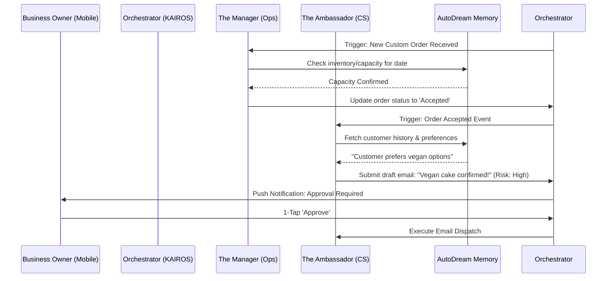

**Title:** [architecture] AI Agent Department Architecture & Coordination System

**Problem Statement:**
Business owners like Maya (the baker) or Carlos (the handyman) do not want to "configure LLMs," "build agent pipelines," or "manage prompts." They simply want a "Manager" who handles their inventory, a "Salesperson" who follows up on quotes, and an "Ambassador" who replies to Instagram DMs while they sleep. Currently, running a small business requires constant context-switching and manual data entry across multiple apps. We need our AI to invisibly act as these distinct business departments, knowing exactly when to act, when to pass context to another department, and when to ask the business owner for a simple "1-tap approval" on their phone before doing something risky (like sending a customer email or publishing a social post).

**Research Report:**
*   **Findings & Competitive Analysis:** Existing platforms (Shopify, Wix, Squarespace, GoDaddy) offer basic "AI assistants," but these are overwhelmingly reactive text generators (e.g., "Shopify Magic" writing product descriptions or GoDaddy generating promotional copy). None of them act autonomously across a stateful lifecycle to actually *run* the operations of the business.
*   **Key Advantages:** OHC's Hybrid Agentic OS moves beyond reactive text generation by modeling true autonomous "Departments." This fulfills our Unfair Advantage of giving a solo entrepreneur the operational capacity of a 10-person company.
*   **Risks:** The primary risk is AI hallucination in external communications, which could damage a small business's reputation. This is mitigated through our strict "Draft-for-Review" approval mechanism for any high-risk actions.
*   **Rough Pricing Estimate:** Inference and vector retrieval costs are estimated at ~$0.02 - $0.05 per complex multi-agent coordination flow. This is easily sustainable within the limits of the Free/Starter tiers and highly profitable on the $29/mo Pro tier.
*   **Cloud/Standalone Compatibility:** The architecture must fully support both Cloud and Standalone modes. In Cloud mode, background agent workers scale horizontally. In Standalone mode, the local KAIROS runtime utilizes the local embedded SQLite/SIPDB for state transitions and queues tasks for local execution without blocking the main UI thread.

**Design Doc:**
*   **Architecture Diagram:**

*   **Mobile UX Flow (375px First):**
    1. The business owner receives a standard native push notification: "✨ The Ambassador drafted a reply to Sarah's custom cake request."
    2. Tapping it opens the OHC mobile app straight to a "Review" screen.
    3. The screen uses premium Glassmorphism design tokens (Outfit + Inter typography, subtle blurred background layers).
    4. The AI's drafted response is clearly displayed.
    5. Two massive touch targets (>= 44x44px) are presented: A primary "Approve & Send" button and a secondary "Edit Draft" button. This passes the 30-second "grandmother test" — zero jargon, instantly understandable.
*   **AI Agent Integration Points:**
    *   **The Departments:** Operations (Manager), Marketing (Promoter), Sales (Salesperson), Customer Success (Ambassador), Finance (Accountant), Legal (Protector), Advisory (Advisor).
    *   **Triggers:** Agents are triggered via event-driven hooks (e.g., an order state change), schedules (weekly advisory sync), or on-demand questions.
    *   **Coordination:** Agents hand off tasks invisibly via the Orchestrator. When "The Salesperson" closes a quote, it signals "The Manager" to create the order block, who signals "The Accountant" to expect a deposit.
    *   **Memory:** All departments read from and write to the unified AutoDream long-term memory layer, ensuring "The Ambassador" knows about a refund processed by "The Accountant."

**Implementation Prompt:**
Implement the core AI Agent Department coordination engine and the mobile Draft-for-Review UI.
*   **User Journey (CUJ):** Maya receives a complex customer request via her storefront. "The Ambassador" reads the request, checks with "The Manager" for capacity, and drafts a reply. Maya receives a push notification on her phone, opens the app, sees the perfectly crafted response in a clean, glassmorphic UI, and taps "Approve & Send."
*   **Acceptance Criteria:**
    *   Agent departments are distinct personas that can register for specific system events.
    *   Event-driven handoffs between at least two departments work seamlessly.
    *   Low-risk actions auto-execute; high-risk actions (external comms) automatically enter a `pending_approval` state.
    *   The pending approval mobile UI strictly adheres to the Visual Excellence Mandate (Glassmorphism, Outfit/Inter fonts, touch targets >= 44x44px, plain language).
    *   Agent actions respect the multi-tenant SaaS tier limits (e.g., rejecting triggers if the monthly AI action budget is exhausted).

**Priority:** P0

**Estimated Scope:** Large
