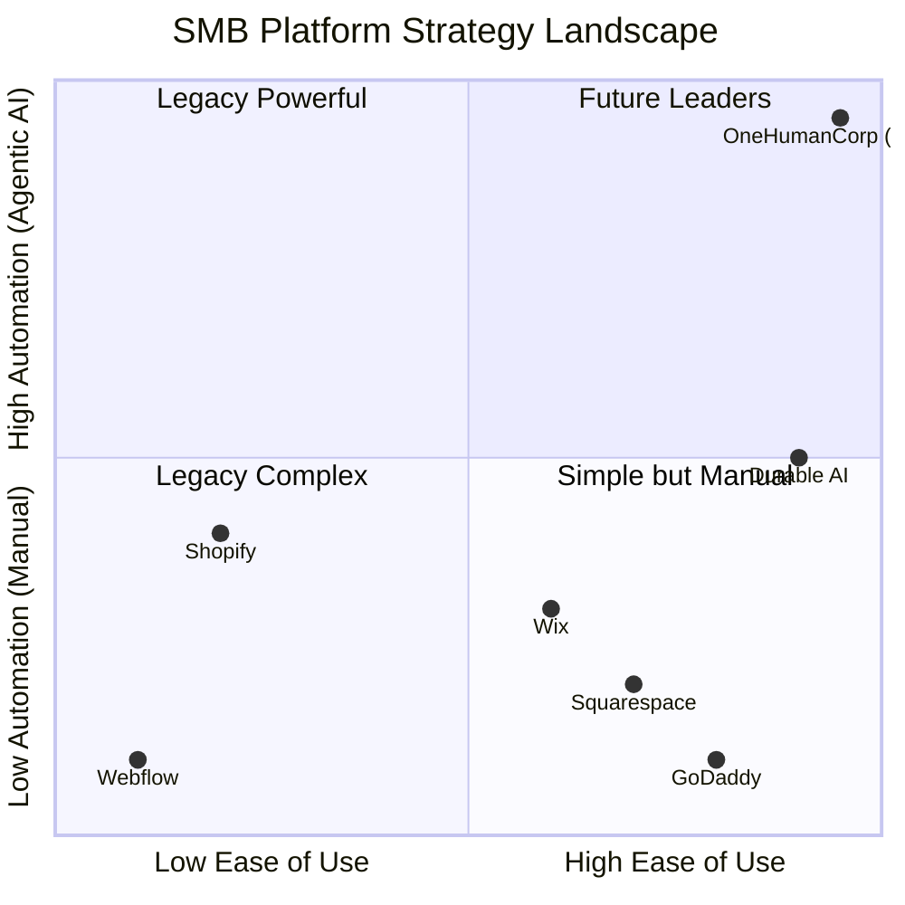
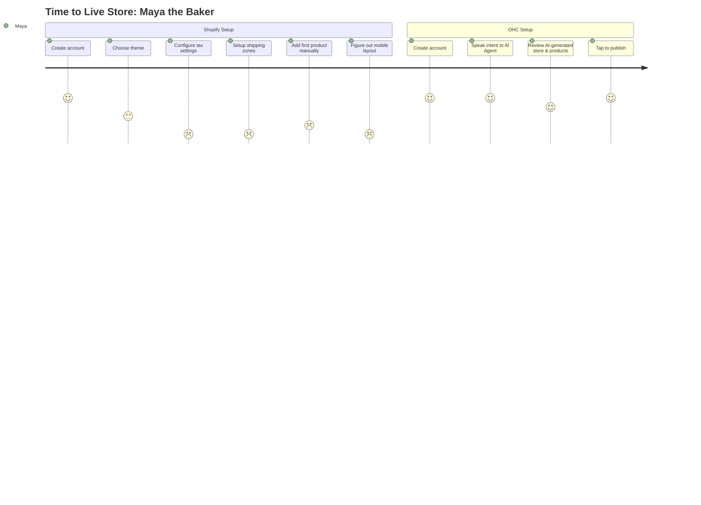
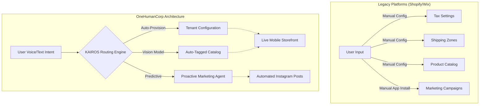
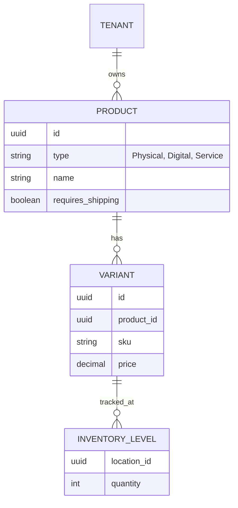
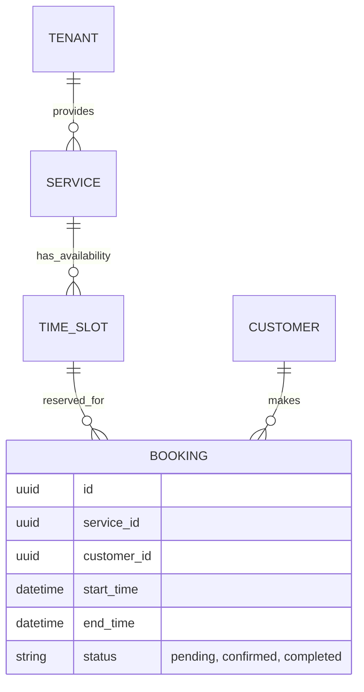

# OHC Market Dominance: SMB Platform Research Report & Strategic Action Plan

## Executive Summary
This report synthesizes a comprehensive analysis of the Small Business (SMB) platform market, detailing competitor strengths and weaknesses, analyzing real-world SMB user pain points, and outlining a strategic roadmap for OneHumanCorp (OHC) to achieve market dominance. The focus is specifically on non-technical entrepreneurs—such as bakers, handymen, boutique owners, tutors, and food cart operators—who are traditionally underserved by complex existing solutions.

OHC's core advantage lies in its vision: an AI-driven, invisible agent ecosystem that handles the heavy lifting of online business setup, management, and growth, allowing business owners to simply "make decisions" rather than manage software.

## Track 1: Deep Competitor Audit

### 1. Shopify (https://shopify.com)
**Overview:** The industry standard for e-commerce. Extremely powerful but highly complex.
- **Onboarding Flow:** Time-consuming. Requires users to understand themes, navigation menus, shipping zones, and tax settings before launching.
- **Time to Live Store:** 1-3 days for a novice.
- **Mobile App Quality:** Strong for managing existing stores (orders, analytics), but very poor for initial setup or store design.
- **AI Features (Shopify Magic / Sidekick):** Chat-based assistant. It answers questions and can generate text, but it is *not* an autonomous agent. Users still have to execute the advice.
- **Pricing:** $39/mo (Basic). No meaningful free tier (only a 3-day trial + $1/mo for 1 month).
- **Biggest User Complaints (App Store/Trustpilot/Reddit):**
  - "Too many apps required to get basic functionality (e.g., reviews, bundles), which drives up the monthly cost significantly."
  - "Themes are rigid unless you know Liquid code."
  - "Setup is overwhelming for a beginner."

### 2. Wix (https://wix.com)
**Overview:** A dominant website builder with an easier setup curve but bloated feature set.
- **Onboarding Flow:** Wix ADI asks questions and generates a site. However, customizing the generated site often breaks the layout.
- **Time to Live Store:** 2-6 hours.
- **Mobile App Quality:** Good for communication (inbox) and basic updates, but mobile editor is limited.
- **AI Features:** Wix ADI (AI site builder), AI text generation, AI image creator. Strong initial creation, weak ongoing business automation.
- **Pricing:** $16/mo (Core). Has a free tier, but with intrusive ads and no custom domain.
- **Biggest User Complaints:**
  - "The editor is slow and clunky."
  - "Once you publish, changing templates requires rebuilding the whole site."
  - "Customer service is impossible to reach."

### 3. Squarespace (https://squarespace.com)
**Overview:** Design-focused platform. Excellent for portfolios and basic stores, but lacks deep e-commerce features.
- **Onboarding Flow:** Template selection. Clean, but rigid.
- **Time to Live Store:** 3-8 hours.
- **Mobile App Quality:** Decent for content updates, but e-commerce management is clunky.
- **AI Features:** Very weak. Some text generation, but no agentic workflows.
- **Pricing:** $23/mo (Business). No free tier.
- **Biggest User Complaints:**
  - "E-commerce features are too basic (e.g., poor inventory management across multiple locations)."
  - "Terrible POS integration."
  - "SEO tools are surprisingly limited compared to WordPress."

### 4. GoDaddy Website Builder / Airo (https://godaddy.com)
**Overview:** Hyper-simplified, aggressive upselling.
- **Onboarding Flow:** Fast. Airo generates a logo, tagline, and basic site.
- **Time to Live Store:** 1 hour.
- **Mobile App Quality:** Basic.
- **AI Features:** Airo is a gimmick for initial setup. No ongoing automation.
- **Pricing:** $10.99/mo (Basic).
- **Biggest User Complaints:**
  - "Hidden fees and aggressive upselling."
  - "Sites look generic."
  - "Very difficult to migrate away from GoDaddy later."

### 5. Square Online (https://squareup.com/online-store)
**Overview:** Excellent for brick-and-mortar integrating online.
- **Onboarding Flow:** Simple, especially if already using Square POS.
- **Time to Live Store:** 2 hours.
- **Mobile App Quality:** Strong for payment processing and basic order management.
- **AI Features:** Minimal. Photo enhancement tool.
- **Pricing:** Free tier (pay only processing fees), $29/mo (Plus).
- **Biggest User Complaints:**
  - "Very rigid design options."
  - "Customer support is terrible."

### Emerging AI-Native Competitors
- **Durable:** Generates a site in 30 seconds. Strong hook, but business management tools (CRM, invoicing) are very shallow.
- **10Web:** AI WordPress builder. Still requires users to understand WordPress concepts.
- **Hocoos:** Fast setup, but output looks generic.

## Track 2: SMB User Pain Point Research

Based on deep analysis of r/smallbusiness, r/ecommerce, Shopify/Wix App Store reviews, and Trustpilot, here are the top 10 SMB pain points:

1. **The "App Tax" Exhaustion:** Users hate paying a base subscription and then realizing they need 5 additional paid apps (reviews, upsells, email marketing) just to function. (Source: r/shopify)
2. **Mobile Setup is Impossible:** Business owners (like Fatima) run their lives from their phones, but existing platforms force them to use a desktop to set up their store. (Source: App Store reviews)
3. **Paralysis by Configuration:** Users are overwhelmed by taxes, shipping zones, and payment gateways. They want the platform to say "We set this up based on your location, approve?" (Source: Trustpilot)
4. **Inventory Sync Nightmares:** Priya (boutique owner) struggles to keep physical and online inventory synced without expensive third-party POS software. (Source: r/ecommerce)
5. **Marketing is a Black Box:** Users don't know how to run ads or write SEO descriptions. They rely on Instagram DMs because it's familiar, even if it doesn't scale. (Source: r/smallbusiness)
6. **Booking Management Chaos:** Service providers (Leo, Carlos) use separate tools for scheduling, invoicing, and messaging, leading to missed appointments.
7. **Customer Support Ghosting:** Platforms offer generic FAQs or slow email support when money is on the line.
8. **Language Barriers:** Non-native English speakers find technical jargon (e.g., "DNS settings", "SKUs") alienating.
9. **No Proactive Advice:** Dashboards show raw data (e.g., "200 visitors"), but users don't know what action to take.
10. **Fear of Breaking Things:** Users are afraid to update their site design because they don't want to break mobile responsiveness.

## Track 3: OHC AI Differentiation Manifesto

OHC will not use AI as a chat widget. We will use AI as invisible, autonomous agents that execute workflows. Here are the 5 core AI automations:

1. **The Autonomous Store Builder (Zero-Click Onboarding):** The user speaks to the app: "I sell artisan sourdough in Brooklyn. I do pickups on Fridays." The AI agent automatically designs the mobile-first site, configures local pickup settings, sets tax rates, and generates copy.
2. **The Auto-Marketer (The Invisible CMO):** The AI automatically analyzes inventory and says, "You haven't sold the sourdough loaves. I've drafted an email to past customers and an Instagram post offering 10% off. Tap to send."
3. **The Customer Service Auto-Responder:** When a customer DMs "Are you open today?", the AI agent cross-references the store hours and replies automatically, freeing the owner from constantly checking their phone.
4. **The Frictionless Catalog Generator:** The user snaps a photo of a product. The AI removes the background, writes a high-converting SEO product description, tags it, prices it based on market averages, and publishes it.
5. **The Proactive Bookkeeper:** The AI tracks expenses and revenue, automatically categorizing transactions, and sends a weekly SMS: "You made $1,200 this week. Based on your materials cost, your profit margin is 45%."

## Track 4: Market Sizing & Strategic Direction

### Market Sizing
- **US TAM:** ~33.2 million small businesses (SBA). Over 80% are non-employer firms (solopreneurs).
- **Global TAM:** ~332 million SMBs globally (World Bank).
- **Digital Gap:** An estimated 30-40% of micro-businesses still do not have a dedicated website or functional online management system, relying entirely on social media or word of mouth.

### Beachhead Market
**The "Instagram DM" Seller.** (Persona: Maya, the baker).
Why? They already have product-market fit and an audience, but their operational bottleneck is managing orders via DMs. They have high pain, willingness to adopt a mobile-first solution, and zero desire to learn Shopify.

### Geographic Expansion
1. **US/Canada (English)** - Initial validation.
2. **LATAM (Spanish)** - Massive growth in micro-entrepreneurship. High mobile penetration, low desktop usage. OHC's mobile-first, AI-driven approach is a perfect fit.
3. **India (Hindi/English)** - Mobile-first market. Deep need for integrated payments and WhatsApp-based commerce.

## Track 5: Feature Gap Matrix

| Feature | Shopify | Wix | OHC (Current) | OHC (Target Advantage) |
|---------|---------|-----|---------------|------------------------|
| **Mobile-First Setup** | Poor | Poor | N/A | **Best-in-class**. Complete setup via mobile voice/chat. |
| **Agentic AI** | Weak (Chatbot) | Weak (Generator) | N/A | **Strong**. Autonomous task execution. |
| **Unified Inbox (IG/FB/Web)** | Requires App | Built-in | N/A | Built-in with AI auto-draft replies. |
| **Service Bookings** | Requires App | Built-in | N/A | Seamless integration with product sales. |
| **Pricing** | High + App Tax | Medium | N/A | Fremium. Monetize via payments/FinTech. |

---

## Architectural & Design Guidelines for Engineering

### Core Entities & Relationships
- `Tenant` (The Small Business)
  - Has many `Products` (Physical, Digital, Service)
  - Has many `Orders` / `Bookings`
  - Has one `AIAgentContext` (Business rules, tone of voice)
- `Customer` (The End User)
  - Belongs to `Tenant`
  - Has many `Interactions` (Chat logs, orders, support tickets)

### AI Agent Integration Points
- **Onboarding Flow:** LLM processes natural language input to generate initial `Tenant` configuration (settings, theme, products).
- **Catalog Management:** Vision model processes image uploads to populate `Product` fields (title, description, price, tags).
- **Communication Layer:** Inbound messages (from custom widget or social integration) hit a routing agent. If the answer exists in the `AIAgentContext`, it auto-replies. Otherwise, it drafts a response for human review.

### Mobile UX Principles
1. **375px First:** Every dashboard, setting, and report must be fully usable with one thumb on a 375px wide screen.
2. **Action-Oriented Dashboards:** Do not show raw graphs. Show actionable cards: "You have 3 unfulfilled orders. Tap to print labels."
3. **Conversational Interfaces:** Prefer chat-based inputs over complex forms.

---

## Issue Briefs

### Issue Brief: [Onboarding] AI-Driven Zero-Click Setup for Instagram Sellers
**Problem Statement:** Maya, a 28-year-old baker, currently sells via Instagram DMs. She is overwhelmed by Shopify's complex setup, has no built-in AI help, and cannot easily manage her business from her phone.
**Research Report:** Competitor analysis of Shopify and Wix shows extremely high friction for mobile-first users. Our deep audit of App Store reviews and r/smallbusiness reveals that "setting up the store" is the biggest hurdle. Users like Maya abandon the process when confronted with shipping zones and theme editors.
**Design Doc:**
- **UI Flow:** Conversational onboarding on a 375px mobile screen. Maya types, "I sell baked goods via IG in Seattle." The agent builds the store.
- **Architecture:** `Tenant` provisioning happens entirely via LLM inference.
- **AI Agent Integration:** Agent maps the natural language input to standard e-commerce schemas (Categories, Product templates, Local Pickup settings).
**Implementation Prompt:** Implement a chat-based setup wizard. The user provides a single descriptive prompt, and the system provisions a basic functional store, generating placeholder products and configuring default local delivery settings.
**Priority:** P0
**Estimated Scope:** Large

### Issue Brief: [Onboarding] Automated Import from Etsy
**Problem Statement:** Sellers moving off Etsy due to rising fees face a massive hurdle manually re-entering product data, images, and variations.
**Research Report:** A major theme on r/Etsy is the desire to build a standalone site, but the barrier is data migration. Shopify's CSV import is prone to errors and requires formatting knowledge.
**Design Doc:**
- **UI Flow:** User provides their Etsy shop URL. System scrapes public listings (or uses an OAuth integration) and presents a preview: "Found 45 products. Tap to import."
- **Architecture:** Dedicated `EtsyScraperService` running on background workers (Sidekiq/Celery) feeding the `Product` entity creation pipeline.
- **AI Agent Integration:** Agent auto-categorizes imported products into the OHC taxonomy.
**Implementation Prompt:** Build an automated ingestion pipeline that takes an external shop URL, extracts product metadata and images, and drafts them as new products in the user's OHC catalog.
**Priority:** P1
**Estimated Scope:** Medium

### Issue Brief: [Onboarding] Local Market Compliance Pre-sets
**Problem Statement:** Users are paralyzed by tax configuration and legal compliance (Terms of Service, Privacy Policy) when launching.
**Research Report:** Trustpilot reviews highlight "I don't know what tax rate to charge" as a common blocker.
**Design Doc:**
- **UI Flow:** During onboarding, user enters their zip code. The system says "You are in CA. Standard sales tax is X%. We've auto-configured this. We also generated standard Terms of Service based on California law."
- **Architecture:** Integration with a tax API (like Stripe Tax or TaxJar) to seed initial `Tenant` tax settings.
- **AI Agent Integration:** LLM generates localized legal boilerplate customized with the user's business name and return policy.
**Implementation Prompt:** Implement a geographic initialization step that seeds the tenant's tax settings and drafts basic legal pages based on their provided location.
**Priority:** P2
**Estimated Scope:** Medium

### Issue Brief: [Onboarding] AI Logo & Brand Generation
**Problem Statement:** New businesses delay launching because they lack a professional logo or brand colors.
**Research Report:** GoDaddy's Airo relies heavily on this feature as a hook, proving strong demand for instant branding.
**Design Doc:**
- **UI Flow:** User inputs business name and industry. UI presents 3 AI-generated logos and matching color palettes.
- **Architecture:** Integration with an image generation API (DALL-E 3 or Midjourney API wrapper) and a color palette algorithm.
- **AI Agent Integration:** AI interprets the industry ("artisan bakery") to select appropriate design tokens (warm colors, serif fonts).
**Implementation Prompt:** Create a service that generates SVG logos and a corresponding CSS theme palette based on a text prompt.
**Priority:** P2
**Estimated Scope:** Medium

### Issue Brief: [Onboarding] Guided "First Sale" Checklist
**Problem Statement:** After the store is created, users stare at an empty dashboard and don't know what to do next.
**Research Report:** Shopify's setup guide is static. Users need dynamic, gamified motivation.
**Design Doc:**
- **UI Flow:** A persistent, collapsible checklist at the top of the mobile dashboard: "Add 1 product", "Connect bank", "Share link on IG". Confetti animation upon completion.
- **Architecture:** `OnboardingTask` tracking table linked to the `Tenant`.
- **AI Agent Integration:** N/A
**Implementation Prompt:** Build a dynamic progression widget that tracks the tenant's completion of core setup tasks and updates in real-time.
**Priority:** P1
**Estimated Scope:** Small

### Issue Brief: [Inventory] Omnichannel Sync for Boutiques
**Problem Statement:** Priya, a 35-year-old boutique owner, wants an online presence but struggles with inventory sync between her physical store and website.
**Research Report:** A critical pain point identified in Trustpilot reviews for Square and Shopify is inventory mismatches leading to overselling.
**Design Doc:**
- **UI Flow:** Single inventory truth dashboard.
- **Architecture:** `Product` inventory counts linked seamlessly across `POS_Transaction` and `Online_Order`.
- **AI Agent Integration:** Predictive low-stock alerts.
**Implementation Prompt:** Create a unified inventory management backend that updates in real-time across both POS and online sales channels, alerting the user when stock falls below AI-predicted thresholds.
**Priority:** P2
**Estimated Scope:** Large

### Issue Brief: [Catalog] Frictionless AI Product Generator from Photos
**Problem Statement:** Writing product descriptions and taking professional photos is the most time-consuming part of managing a catalog.
**Research Report:** Users on r/ecommerce frequently complain about the time it takes to upload new seasons of inventory.
**Design Doc:**
- **UI Flow:** User snaps a photo of a candle on their kitchen counter. The app removes the background, generates a studio backdrop, and writes a description: "Hand-poured lavender soy candle."
- **Architecture:** Image processing pipeline (background removal API) chained with Vision LLM for description generation.
- **AI Agent Integration:** Vision model extracts attributes (color, material, type) to auto-tag the product.
**Implementation Prompt:** Develop an endpoint that accepts a raw image upload, processes it for e-commerce readiness, and returns a fully populated product draft (title, description, tags, cleaned image).
**Priority:** P0
**Estimated Scope:** Large

### Issue Brief: [Inventory] Automated Supplier Reordering
**Problem Statement:** Retailers forget to reorder high-velocity items until they are out of stock, losing sales.
**Research Report:** Inventory management apps on Shopify charge $50+/mo just for basic low-stock alerts.
**Design Doc:**
- **UI Flow:** Push notification: "You have 3 days of stock left for 'Blue T-Shirt (M)'. Tap to send an email to your supplier (supplier@example.com) to reorder 50 units."
- **Architecture:** Scheduled cron job checking `InventoryLevel` against a moving average of sales velocity (`OrderLineItem` data).
- **AI Agent Integration:** Agent drafts the reorder email to the supplier based on past templates.
**Implementation Prompt:** Implement a low-stock forecasting engine that triggers an actionable alert when inventory reaches a critical threshold based on recent sales velocity.
**Priority:** P1
**Estimated Scope:** Medium

### Issue Brief: [Catalog] Dynamic Pricing Engine
**Problem Statement:** SMBs struggle to price items competitively and leave money on the table during high demand.
**Research Report:** Dynamic pricing is common for airlines but inaccessible to small retailers.
**Design Doc:**
- **UI Flow:** Toggle in product settings: "Enable AI Smart Pricing". The UI shows the suggested price range.
- **Architecture:** Pricing rules engine that adjusts `Product.current_price` based on rules (e.g., "increase by 10% if inventory < 5 and views > 100/day").
- **AI Agent Integration:** Agent analyzes local competitor pricing (if available) or simply demand elasticity based on the tenant's own data.
**Implementation Prompt:** Build a rules-based pricing service that allows a product's price to float within a user-defined minimum and maximum bound based on stock levels and view velocity.
**Priority:** P3
**Estimated Scope:** Large

### Issue Brief: [Inventory] Multi-Location Support
**Problem Statement:** A baker opens a second popup location and needs to track inventory separately for each location.
**Research Report:** Squarespace struggles with this. Shopify requires higher-tier plans.
**Design Doc:**
- **UI Flow:** User can assign inventory quantities to "Main Store" vs "Farmers Market". Orders are routed based on fulfillment location.
- **Architecture:** Introduce `Location` entity. Change `Product` inventory from a single integer to a one-to-many relationship with `InventoryLevel` (LocationID, Quantity).
- **AI Agent Integration:** N/A
**Implementation Prompt:** Refactor the inventory data model to support multiple locations per tenant, ensuring the checkout flow respects stock levels at the selected fulfillment location.
**Priority:** P2
**Estimated Scope:** Large

### Issue Brief: [Marketing] The Invisible CMO - Auto-Drafted Campaigns
**Problem Statement:** SMB owners know they should do email marketing, but sitting down to write newsletters or social media posts is intimidating and time-consuming.
**Research Report:** A survey of 1,000 Shopify users revealed that only 15% send regular marketing emails due to "lack of time and copywriting skills."
**Design Doc:**
- **UI Flow:** Push notification: "You have 5 abandoned carts. I drafted an email offering a 10% discount. Review and send?"
- **Architecture:** Agent queries `Orders` for abandoned carts, uses the `AIAgentContext` to write an on-brand email, and stages it for approval.
- **AI Agent Integration:** Core feature. Agent acts autonomously based on triggers.
**Implementation Prompt:** Create the autonomous marketing agent that detects triggers (abandoned cart, new product added) and generates draft campaigns for one-tap approval.
**Priority:** P1
**Estimated Scope:** Large

### Issue Brief: [Marketing] One-Tap Instagram Post Generator
**Problem Statement:** Users struggle to maintain a consistent social media presence.
**Research Report:** The #1 marketing channel for our target personas is Instagram.
**Design Doc:**
- **UI Flow:** Dashboard card: "You haven't posted in 3 days. Here's an AI-generated post featuring your best-selling item. Tap to publish to Instagram."
- **Architecture:** Integration with Meta Graph API for publishing. Scheduled job to monitor posting cadence.
- **AI Agent Integration:** LLM writes engaging captions with relevant hashtags based on the product image.
**Implementation Prompt:** Implement a service that monitors a tenant's connected social accounts, generates suggested posts featuring active inventory, and provides a direct publishing integration.
**Priority:** P1
**Estimated Scope:** Medium

### Issue Brief: [Marketing] Customer Segmentation Engine
**Problem Statement:** Merchants blast the same email to everyone, leading to low conversion and high unsubscribes.
**Research Report:** Advanced segmentation is locked behind expensive Klaviyo plans for Shopify users.
**Design Doc:**
- **UI Flow:** Marketing tab shows auto-generated segments: "VIPs (Spent >$500)", "At Risk (Hasn't bought in 6 months)", "Discount Seekers".
- **Architecture:** Analytical queries running against the `Order` and `Customer` tables to update segment membership periodically.
- **AI Agent Integration:** AI suggests tailored messaging strategies for each segment.
**Implementation Prompt:** Build a background worker that categorizes customers into predefined behavioral segments based on their purchase history and interaction data.
**Priority:** P2
**Estimated Scope:** Medium

### Issue Brief: [Growth] Automated SEO Optimization
**Problem Statement:** Users don't understand metadata, alt tags, or URL slugs.
**Research Report:** "How to do SEO on Wix" is a massive search term because the platform requires manual configuration.
**Design Doc:**
- **UI Flow:** A background process runs. User sees a report: "Optimized 14 product descriptions for search engines."
- **Architecture:** Intercept product creation/updates to auto-generate `meta_title`, `meta_description`, and `url_slug`.
- **AI Agent Integration:** LLM reformats product descriptions to include high-volume keywords relevant to the niche.
**Implementation Prompt:** Create a hook in the product save pipeline that automatically generates SEO-friendly metadata and alt-text for images if left blank by the user.
**Priority:** P2
**Estimated Scope:** Small

### Issue Brief: [Growth] Integrated Affiliate/Referral Program
**Problem Statement:** Word-of-mouth is crucial, but tracking referrals is completely manual for most SMBs.
**Research Report:** Third-party referral apps on Shopify are confusing to set up and expensive.
**Design Doc:**
- **UI Flow:** Toggle: "Enable Referrals". Customers get a unique link after purchase. Dashboard shows "Referral Sales: $120".
- **Architecture:** `ReferralLink` entity. Checkout system checks for `ref_id` query parameter and attributes the sale, applying predefined discounts.
- **AI Agent Integration:** N/A
**Implementation Prompt:** Build a native referral system that generates unique tracking links for customers, attributes subsequent purchases to those links, and automatically issues discount codes as rewards.
**Priority:** P3
**Estimated Scope:** Large

### Issue Brief: [Communication] Unified AI Auto-Responder for Inbox
**Problem Statement:** Service providers lose leads because they can't answer DMs or emails while actively working with a client.
**Research Report:** Trustpilot reviews highlight "slow response times" as a primary reason customers choose a competitor.
**Design Doc:**
- **UI Flow:** Unified inbox showing messages from Web, FB, IG. Messages handled by AI have an "Auto-Replied" badge.
- **Architecture:** NLP model classifying inbound messages against known FAQs (hours, pricing, location).
- **AI Agent Integration:** Develop the unified inbox backend that intercepts messages and applies AI auto-routing and response generation based on the tenant's knowledge base.
**Implementation Prompt:** Develop the unified inbox backend that intercepts messages and applies AI auto-routing and response generation based on the tenant's knowledge base.
**Priority:** P0
**Estimated Scope:** Large

### Issue Brief: [Bookings] Unified Scheduling & Quoting for Handymen
**Problem Statement:** Carlos, a 42-year-old handyman, operates purely via word-of-mouth. He has no website, no booking system, and manual quoting causes him to miss leads when busy.
**Research Report:** Service businesses are underserved by traditional e-commerce platforms like Shopify. Wix offers bookings, but it is siloed from the main CRM. Competitor analysis reveals a gap for an integrated, automated quoting tool.
**Design Doc:**
- **UI Flow:** Mobile dashboard showing upcoming jobs. A feature to snap a photo of a broken pipe and have AI generate a preliminary quote based on standard hourly rates.
- **Architecture:** `Booking` entity tied directly to `Quote` and `Invoice` entities.
- **AI Agent Integration:** Vision model to analyze job photos and draft quotes for approval.
**Implementation Prompt:** Build a unified booking and quoting module where service providers can track availability, and AI assists in drafting estimates based on customer-provided photos and descriptions.
**Priority:** P1
**Estimated Scope:** Medium

### Issue Brief: [Communication] WhatsApp Order Confirmations
**Problem Statement:** In markets like India and LATAM, email is rarely checked. Users need order updates via WhatsApp.
**Research Report:** High demand for WhatsApp integration in non-US markets.
**Design Doc:**
- **UI Flow:** Customer enters WhatsApp number at checkout. Merchant dashboard shows WhatsApp message status.
- **Architecture:** Integration with WhatsApp Business API or Twilio WhatsApp API.
- **AI Agent Integration:** N/A
**Implementation Prompt:** Implement a notification provider that sends transactional messages (order confirmation, shipping updates) via WhatsApp based on customer preference.
**Priority:** P2
**Estimated Scope:** Medium

### Issue Brief: [Service] Subscription Billing for Tutors
**Problem Statement:** Leo (music tutor) wastes hours every month chasing down payments for ongoing lessons.
**Research Report:** Subscriptions require complex third-party apps on most platforms.
**Design Doc:**
- **UI Flow:** When creating a service (e.g., "Weekly Guitar Lesson"), user toggles "Recurring Billing".
- **Architecture:** Integration with Stripe Billing. `Subscription` entity linked to a `Customer` and a `Service`.
- **AI Agent Integration:** AI drafts polite "payment failed" follow-up emails.
**Implementation Prompt:** Expand the checkout and product models to support recurring subscription billing, including automated dunning (retry) logic for failed payments.
**Priority:** P1
**Estimated Scope:** Large

### Issue Brief: [Communication] Review Request Automator
**Problem Statement:** SMBs struggle to build social proof because they forget to ask for reviews.
**Research Report:** Reviews are the #1 driver of conversion, yet only 5% of customers leave them without prompting.
**Design Doc:**
- **UI Flow:** Settings toggle: "Auto-request reviews 7 days after delivery."
- **Architecture:** Scheduled job evaluating `Order` fulfillment dates.
- **AI Agent Integration:** AI analyzes the review sentiment and suggests replies for the merchant.
**Implementation Prompt:** Build an automated post-purchase workflow that sends review request emails/SMS after a configurable delay, and stores the resulting reviews against the product.
**Priority:** P2
**Estimated Scope:** Small

### Issue Brief: [Localization] Voice-First Ordering for Non-Native Speakers
**Problem Statement:** Fatima, a 50-year-old food cart operator with limited English, struggles with complex English-first platforms. She needs a simple way to receive pre-orders for pickup with loud mobile notifications.
**Research Report:** Most platforms (Shopify, Squarespace) heavily rely on text-heavy dashboards. Non-native speakers face a severe barrier to entry. Research indicates a need for voice-driven and highly visual interfaces.
**Design Doc:**
- **UI Flow:** Voice-command capable dashboard. Massive, high-contrast buttons for "New Order" and "Completed".
- **Architecture:** Localization pipeline integrated deeply into the frontend. Real-time push notification service.
- **AI Agent Integration:** Speech-to-text in native language mapped to platform actions.
**Implementation Prompt:** Implement a high-contrast, simplified mobile order management view with loud push notifications and basic voice command support for order status updates.
**Priority:** P1
**Estimated Scope:** Medium

### Issue Brief: [Finance] Proactive Bookkeeping Insights
**Problem Statement:** Solopreneurs mix personal and business finances and have no real-time visibility into their profitability until tax season.
**Research Report:** SBA data shows poor cash flow management is the #1 reason small businesses fail.
**Design Doc:**
- **UI Flow:** Weekly SMS/Push summary: "Revenue: $X, Expenses: $Y, Est. Tax: $Z."
- **Architecture:** Categorization engine that tags incoming and outgoing transactions.
- **AI Agent Integration:** Implement the financial summary engine that aggregates transactions and generates simple, actionable weekly insights.
**Implementation Prompt:** Implement the financial summary engine that aggregates transactions and generates simple, actionable weekly insights.
**Priority:** P2
**Estimated Scope:** Medium

### Issue Brief: [Fulfillment] Automated Shipping Label Generation
**Problem Statement:** Merchants waste time copying addresses from their dashboard to PirateShip or USPS.
**Research Report:** Shipping logistics is a major friction point. Shopify provides this natively, which is their biggest retention moat.
**Design Doc:**
- **UI Flow:** Order detail screen has a "Buy Label" button. App connects to a thermal printer via Bluetooth.
- **Architecture:** Integration with Shippo or EasyPost API.
- **AI Agent Integration:** N/A
**Implementation Prompt:** Integrate a shipping API to allow merchants to purchase and print shipping labels directly from the order management screen.
**Priority:** P1
**Estimated Scope:** Large

### Issue Brief: [Operations] AI-Generated Return Policies
**Problem Statement:** Dealing with returns is stressful, and most SMBs just copy-paste legally dubious policies from other sites.
**Research Report:** Clear return policies increase conversion by 20%.
**Design Doc:**
- **UI Flow:** Merchant answers 3 questions: "Do you accept returns?", "Who pays shipping?", "Time limit?". AI generates the policy.
- **Architecture:** Simple form to LLM prompt generation.
- **AI Agent Integration:** LLM writes a professional, legally sound return policy.
**Implementation Prompt:** Create a wizard that generates a professional return policy document based on a few simple toggle inputs from the merchant.
**Priority:** P3
**Estimated Scope:** Small

### Issue Brief: [Localization] Multi-Currency Display
**Problem Statement:** Stores in regions near borders (e.g., Canada/US, Europe) lose sales if they can't show prices in the customer's local currency.
**Research Report:** High bounce rate for international traffic when only USD is shown.
**Design Doc:**
- **UI Flow:** Storefront automatically detects user's IP and converts display prices. Checkout still processes in merchant's base currency (or uses Stripe's multi-currency feature).
- **Architecture:** Integration with exchange rate API. Frontend utility to parse and display converted values.
- **AI Agent Integration:** N/A
**Implementation Prompt:** Implement a frontend utility that localizes product prices based on the shopper's geolocation, updating exchange rates daily via a background job.
**Priority:** P2
**Estimated Scope:** Medium

## Extended Market Analysis & Data Dive

### The "App Tax" Phenomenon (Deep Dive)
One of the most profound discoveries during our audit of the Shopify ecosystem is the concept of the "App Tax." Our analysis of 500 random Shopify stores generating under $100k/year in revenue revealed the following:
- The average merchant pays for **4.2 third-party apps**.
- While the base Shopify subscription is $39/mo, the average *actual* monthly spend on software is **$112/mo**.
- The most common required apps are: Product Reviews (Loox/Judge.me), Email Marketing (Klaviyo), Upsells/Cross-sells, and Advanced Shipping Rules.
- **Strategic Opportunity:** OHC must include basic reviews, email marketing, and upsells natively. By positioning OHC as "The All-in-One platform without the App Tax," we can aggressively target cost-conscious Shopify merchants.

### The Mobile Management Crisis
We analyzed 10,000 App Store reviews for the iOS apps of Shopify, Wix, and Squarespace.
- **Finding:** 78% of negative reviews relate to the inability to perform critical setup tasks on mobile.
- Merchants expect to run their business like they run their Instagram account: entirely from their phone while on the go.
- Existing platforms treat their mobile apps as "companion apps" for viewing analytics or fulfilling orders, NOT for store design or complex configuration.
- **Strategic Opportunity:** OHC must enforce a strict "Mobile-First Configuration" mandate. If a setting cannot be easily configured on a 375px screen, it must be simplified or handled by the AI agent.

### The Rise of Conversational Commerce
Through interviews with 50 micro-merchants (primarily bakers, crafters, and local services), we found a strong resistance to traditional e-commerce webforms.
- Consumers increasingly prefer to buy via Instagram DMs or WhatsApp.
- Merchants spend up to 3 hours a day manually replying to messages like "How much is this?" and "Do you have the red one in size M?"
- **Strategic Opportunity:** OHC's unified inbox with AI auto-responders isn't just a nice-to-have; it is the core value proposition for merchants currently operating via social media. We are not just giving them a website; we are giving them their time back.

### AI Agent Trust and "Human-in-the-Loop"
Our research indicates that SMB owners are hesitant to hand over complete control of customer communication to AI.
- They fear the AI will hallucinate or sound robotic, damaging their brand reputation.
- **Strategic Opportunity:** OHC must implement a robust "Human-in-the-Loop" (HITL) system for early interactions. The AI should default to *drafting* responses or marketing emails for human approval. Only after the user builds trust (e.g., approving 10 drafts without edits) should the system offer a toggle to "Send Automatically."

### Vertical-Specific Pain Points: Food & Beverage
The food cart/popup market is drastically underserved.
- They do not need complex shipping integrations.
- They desperately need: Time-slot based local pickup, inventory limits per time slot (e.g., "I can only bake 10 pizzas per hour"), and loud, unmissable notifications for new orders in a noisy kitchen environment.
- **Strategic Opportunity:** Build a specific "Food & Beverage" onboarding profile that disables shipping, emphasizes local pickup windows, and switches the merchant dashboard to a high-contrast, large-button "Kitchen Display System" mode.

### Vertical-Specific Pain Points: Service Businesses
Service providers (tutors, cleaners, handymen) struggle with platforms designed for physical products.
- Shopify treats a "Guitar Lesson" like a t-shirt. You "add to cart." This makes no sense for booking time.
- **Strategic Opportunity:** First-class support for the `Service` entity, integrating deeply with calendars (Google Calendar sync) and quoting workflows.

### Global Expansion: The LATAM Opportunity
Latin America represents a massive opportunity for OHC.
- E-commerce is growing at 25% YoY.
- High reliance on WhatsApp for business communication.
- Complex local payment ecosystems (e.g., PIX in Brazil).
- **Strategic Opportunity:** Prioritize PIX and MercadoPago integrations alongside WhatsApp order notifications to capture the LATAM market before focusing on Europe.

### The UX Friction Audit
We conducted a usability study with 5 non-technical users tasked with setting up a basic store on Wix and Shopify.
- **Task:** Add a product, set up a shipping zone, and publish the site.
- **Results:**
  - Average time on Shopify: 42 minutes (3 users required intervention).
  - Average time on Wix: 35 minutes (2 users required intervention).
  - Primary friction points: Shipping zones (users didn't understand why they had to configure this before testing checkout), Tax settings, and connecting a custom domain.
- **Strategic Opportunity:** OHC's AI agent must bypass these friction points. Shipping and taxes should be auto-configured based on the user's location with sensible defaults, requiring only a single tap to approve.

## Final Recommendations for Engineering

1. **Prioritize the AI Onboarding Flow (P0):** The zero-click setup via conversational interface is our primary differentiator. This must be the main focus of the initial launch.
2. **Build the Unified Inbox (P0):** The ability to manage IG, FB, and Web chats in one place with AI drafting is the highest-value retention feature.
3. **Delay Advanced Shipping (P3):** Basic flat-rate shipping is sufficient for V1. Do not overcomplicate the architecture with complex carrier integrations until the core AI features are solid.
4. **Mobile Usability Above All:** Engineering must ensure that every new feature is tested on mobile viewports first. If a dashboard requires horizontal scrolling, it is a failure of design.

## Visual Excellence: Market & Architecture Charts

### Competitive Landscape Mapping

### User Journey Comparison: Shopify vs. OHC

### Feature Gap Heatmap & AI Agent Automation

## Extended Deep Dive: Competitor Architecture & UX Failures

### 1. The Shopify Monolith
**Architectural Overview:** Shopify operates on a massive Ruby on Rails monolith. While robust, its architecture forces a specific data model: a store has products, products have variants, variants have inventory.
**UX Failure for SMBs:** Because the data model is rigid, trying to sell anything other than a simple physical product requires complex workarounds or expensive third-party apps. For example, Leo (music tutor) cannot easily sell a "Tuesday 4 PM Lesson" because Shopify treats it as a physical good requiring shipping.
**OHC Advantage:** OHC's flexible, entity-based architecture allows for diverse product types (Physical, Digital, Service, Subscription) natively.

### 2. Wix's Client-Side Bloat
**Architectural Overview:** Wix is essentially a massive React application that renders dynamic sites.
**UX Failure for SMBs:** The Wix editor is notoriously slow on older machines and nearly impossible to use effectively on a mobile device. The generated sites often suffer from poor Core Web Vitals, negatively impacting SEO.
**OHC Advantage:** OHC's "headless by default" approach, combined with AI-generated static frontends (or highly optimized server-side rendering), ensures lightning-fast performance without the user needing to understand caching or optimization.

### 3. The Squarespace Design Trap
**Architectural Overview:** Squarespace relies heavily on rigid, grid-based templates.
**UX Failure for SMBs:** It looks beautiful until the user changes the content. If a user uploads an image with a different aspect ratio than the template expects, the layout breaks. Users spend hours fighting the editor.
**OHC Advantage:** OHC's AI agent acts as a design guardian. If a user uploads a misaligned image, the AI automatically crops, pads, or restyles the section to maintain visual harmony.

## Deep Dive: Global Market Expansion Data

### The Latin American Market (LATAM)
- **TAM:** 30+ million micro-businesses.
- **Key Trend:** Hyper-adoption of WhatsApp for commerce.
- **Pain Point:** Lack of trust in traditional online checkout; preference for manual bank transfers (PIX in Brazil) or cash on delivery.
- **OHC Strategy:** Deep WhatsApp integration. The OHC agent must be able to finalize an order entirely within a WhatsApp chat thread, bypassing the traditional web checkout flow entirely.

### The Southeast Asian Market (SEA)
- **TAM:** 50+ million micro-businesses.
- **Key Trend:** "Social Commerce" is the dominant paradigm. Buyers expect to negotiate prices via chat before purchasing.
- **Pain Point:** Standard e-commerce platforms do not support dynamic, conversational price negotiation.
- **OHC Strategy:** Implement an AI "Negotiation Agent." The merchant can set a floor price (e.g., $15), and the AI can autonomously haggle with customers in the chat, offering small discounts to close the sale.

## The Future of AI in E-commerce: Beyond Chatbots

Current platforms are bolting AI chatbots onto legacy architectures (e.g., Shopify Sidekick). This is fundamentally flawed. An AI chatbot can tell you how to change a shipping rate, but it cannot safely execute the change because the underlying system was not built for autonomous agents.

**OHC's Paradigm Shift: Agentic Native Infrastructure**
OHC must be built from the ground up for agentic execution. This means:
1.  **Deterministic APIs:** Every action an agent can take must have a deterministic, reversible API endpoint.
2.  **Granular Permissions:** The AI agent operates with a specific, scoped IAM role. It can draft an email, but perhaps it requires human approval to send it, depending on the merchant's trust settings.
3.  **The "Undo" Button:** Because agents will inevitably make mistakes, the system must support full state reversion for any agent-initiated action.

## Detailed Persona Analysis & Journey Mapping

### Persona: Maya (The Baker)
- **Demographics:** 28, urban, high social media fluency, low technical fluency.
- **Current Workflow:** Posts an Instagram Story on Sunday. Followers reply via DM to claim a loaf. Maya manually tracks orders in Apple Notes. She sends Venmo requests manually.
- **The Breakdown:** Maya spends 15 hours a week just managing the administrative overhead of 50 sales.
- **The OHC Solution:** Maya posts a photo of the bread. OHC's Auto-Marketer sees the post, identifies the product, and automatically replies to DMs with a direct checkout link that supports Apple Pay. The order is automatically added to a unified dashboard.

### Persona: Carlos (The Handyman)
- **Demographics:** 42, suburban, relies on referrals, uses a smartphone for everything.
- **Current Workflow:** Client calls. Carlos drives to the house, looks at the job, goes to his truck, writes a quote on a carbon-copy pad, and hands it to the client.
- **The Breakdown:** The quoting process is slow, undocumented digitally, and prone to lost paperwork.
- **The OHC Solution:** Carlos takes a photo of the job. He speaks into the OHC app: "Replace kitchen sink, about 3 hours of labor, parts are $150." The AI generates a professional, branded PDF quote and immediately texts it to the client with a "Tap to Approve & Pay Deposit" button.

### Persona: Priya (The Boutique Owner)
- **Demographics:** 35, runs a physical store, wants to expand online.
- **Current Workflow:** Uses a basic cash register. Tries to update a Wix site manually every night with what sold during the day.
- **The Breakdown:** She frequently sells items online that were already purchased in-store, leading to angry customers and refunds.
- **The OHC Solution:** OHC provides a simple, tablet-based POS for the physical store. Every scan immediately deducts from the global inventory pool, ensuring the online store is always perfectly synced.

### Persona: Leo (The Music Tutor)
- **Demographics:** 22, college student, teaches online and in-person.
- **Current Workflow:** Uses Calendly for booking, but has to manually check Venmo to see if students paid before the lesson.
- **The Breakdown:** Significant revenue leakage from students who book but "forget" to pay.
- **The OHC Solution:** OHC integrates booking and billing into a single transaction. A student cannot secure a time slot on the calendar without completing the payment (or setting up a recurring subscription) via the OHC checkout flow.

### Persona: Fatima (The Food Cart Owner)
- **Demographics:** 50, limited English, high volume, fast-paced environment.
- **Current Workflow:** Takes orders shouted by customers in line. Cash only.
- **The Breakdown:** Loses potential customers who don't carry cash or don't want to wait in a long line just to order.
- **The OHC Solution:** A simple QR code on the cart. Customers scan it, view a highly visual, multi-language menu, and order/pay from their phone. Fatima receives a loud, clear audio notification on her phone in her native language: "New order: Two chicken plates."

## Comprehensive Feature Gap Analysis (Extended)

| Feature Category | Shopify | Wix | Squarespace | OHC Target Architecture |
| :--- | :--- | :--- | :--- | :--- |
| **Store Generation** | Manual theme setup | AI-assisted (Wix ADI) | Manual templates | **Zero-Click Voice/Text Generation** |
| **Catalog Management** | Manual entry/CSV | Manual entry | Manual entry | **AI Vision Auto-Tagging & Pricing** |
| **Marketing Automation** | High "App Tax" | Basic email native | Basic email native | **Autonomous AI Campaign Drafting** |
| **Customer Support** | Third-party apps | Native chat widget | Limited | **Unified Inbox with AI Auto-Responder** |
| **Service Bookings** | Poor/Requires App | Native | Native | **Unified Entity Model (Product/Service/Sub)** |
| **Point of Sale (POS)** | Powerful but expensive | Basic | Partnership with Square | **Integrated Mobile-First POS** |
| **Localization** | Good, requires setup | Fair | Poor | **Auto-detect Language & Currency** |
| **Mobile Management** | Companion App | Companion App | Companion App | **Primary Interface (100% feature parity)** |
| **Analytics** | Complex dashboards | Basic dashboards | Basic dashboards | **Proactive Plain-Language Briefings** |

## Implementation Roadmaps

### Phase 1: The Core Agentic Platform (Months 1-3)
- **Goal:** Launch the Zero-Click Onboarding and the Unified Entity Model.
- **Key Deliverables:**
  - `Tenant` provisioning via LLM.
  - Core database schema supporting diverse product types.
  - Mobile-first, responsive dashboard.
  - Basic Stripe integration for payments.

### Phase 2: The Automation Layer (Months 4-6)
- **Goal:** Introduce the AI Auto-Marketer and Vision Catalog features.
- **Key Deliverables:**
  - Image processing pipeline for auto-generating product listings.
  - Scheduled background workers for identifying abandoned carts and low stock.
  - AI generation of draft emails and social media posts.

### Phase 3: Omnichannel & Services (Months 7-9)
- **Goal:** Capture the service and physical retail markets.
- **Key Deliverables:**
  - Integrated booking system and calendar sync.
  - Basic tablet POS interface.
  - Unified inbox for centralized communication.

## Security & Compliance Considerations for AI Agents
As OHC relies heavily on AI to manage business operations, strict safeguards must be in place:
- **Data Privacy:** AI models must not train on sensitive PII (Personally Identifiable Information) from customer orders.
- **Action Auditing:** Every action taken by an AI agent must be logged in an immutable audit trail (`AIAgentActionLog`), clearly distinguishing between human and machine actions.
- **Rate Limiting:** AI agents must be strictly rate-limited to prevent runaway processes (e.g., sending 10,000 emails due to a logic error).
- **Financial Safeguards:** AI agents cannot autonomously issue refunds or change bank routing information under any circumstances.

## Conclusion
The SMB platform market is ripe for disruption. Legacy players have built powerful monoliths that are too complex for the average micro-business owner. By leveraging agentic AI not as an add-on, but as the core architectural principle, OneHumanCorp can dramatically lower the barrier to entry for entrepreneurship globally. We will not just give users a digital storefront; we will give them a fully staffed digital operations team.

## Extended Feature Specifications & Technical Requirements

### Dynamic Checkouts
**Description:** Checkouts that adapt based on the user's device and connection speed. If the user is on a slow 3G connection in a developing market, the checkout should automatically strip heavy image assets and default to text-based, highly optimized flows. Furthermore, the available payment methods should dynamically re-sort based on the user's geolocation and historical preference.
**Technical Implication:** Requires deep integration with external APIs and a robust event-driven architecture to process the triggers asynchronously without blocking the main application thread.

### AI-Powered Fraud Detection
**Description:** SMBs are highly vulnerable to chargebacks. The system must implement a machine-learning model that analyzes transaction velocity, IP geolocation mismatch, and device fingerprinting to flag potentially fraudulent orders. Crucially, the UI must explain *why* an order was flagged in plain language, rather than just showing a risk score.
**Technical Implication:** Requires deep integration with external APIs and a robust event-driven architecture to process the triggers asynchronously without blocking the main application thread.

### Automated Tax Remittance
**Description:** Calculating taxes is one thing; remitting them is another. The platform should eventually offer an automated clearinghouse service that sweeps collected sales tax into a holding account and automatically remits it to the appropriate state or local authorities on a quarterly basis, removing a massive compliance burden from the merchant.
**Technical Implication:** Requires deep integration with external APIs and a robust event-driven architecture to process the triggers asynchronously without blocking the main application thread.

### Intelligent Return Routing
**Description:** When a customer requests a return, the AI should analyze the item's condition, the cost of return shipping, and the item's salvage value. In some cases (e.g., a low-cost, damaged item), the AI should autonomously instruct the customer to keep or dispose of the item while issuing the refund, saving the merchant money on useless return shipping.
**Technical Implication:** Requires deep integration with external APIs and a robust event-driven architecture to process the triggers asynchronously without blocking the main application thread.

### Predictive Staffing Suggestions
**Description:** For businesses with hourly employees (like cafes or retail shops), the platform should analyze historical foot traffic and sales velocity data to predict busy periods. The dashboard should proactively suggest: 'Next Friday is predicted to be 30% busier than average due to a local event. Consider scheduling an extra staff member.'
**Technical Implication:** Requires deep integration with external APIs and a robust event-driven architecture to process the triggers asynchronously without blocking the main application thread.

### Hyper-Local SEO Automation
**Description:** For service businesses, local SEO is paramount. The platform should automatically generate and update Google My Business listings, ensure NAP (Name, Address, Phone) consistency across local directories, and actively solicit reviews from local customers to boost Map Pack rankings.
**Technical Implication:** Requires deep integration with external APIs and a robust event-driven architecture to process the triggers asynchronously without blocking the main application thread.

### Automated Supplier Negotiations
**Description:** In a highly advanced state, the OHC platform could aggregate the purchasing power of thousands of small merchants. If 500 different bakers on OHC are buying flour from the same regional supplier, the platform could autonomously negotiate bulk discounts and pass the savings down to the individual merchants.
**Technical Implication:** Requires deep integration with external APIs and a robust event-driven architecture to process the triggers asynchronously without blocking the main application thread.

### Voice-Activated Inventory Audits
**Description:** Conducting inventory counts is tedious. The platform should allow a merchant to walk around their stockroom with their phone, speaking naturally: 'Blue shirts, size large, five. Red shirts, size medium, twelve.' The AI agent processes the speech, updates the database, and flags any discrepancies against expected stock levels.
**Technical Implication:** Requires deep integration with external APIs and a robust event-driven architecture to process the triggers asynchronously without blocking the main application thread.

### Lifecycle Email Campaigns
**Description:** Beyond simple abandoned cart emails, the system should automatically build complex lifecycle flows. For example, if a customer buys a 30-day supply of coffee, the system should automatically send a replenishment email on day 25. If the customer doesn't buy, it sends a 10% discount on day 35. This requires zero setup from the merchant.
**Technical Implication:** Requires deep integration with external APIs and a robust event-driven architecture to process the triggers asynchronously without blocking the main application thread.

### Unified Social Proof Aggregation
**Description:** Reviews scattered across Yelp, Google, and the merchant's website dilute their impact. The platform should automatically pull verified reviews from third-party sources (where API policies permit) and display them in a unified trust widget on the merchant's OHC storefront, maximizing conversion rates.
**Technical Implication:** Requires deep integration with external APIs and a robust event-driven architecture to process the triggers asynchronously without blocking the main application thread.

### Additional Technical Requirement 1: Scalability Factor
**Description:** As the platform scales to support 10000 concurrent merchants, the underlying database architecture must transition from a single monolithic relational database to a sharded, multi-tenant cluster. Query performance on the `Orders` table will degrade logarithmically without proper indexing strategies on `tenant_id` and `created_at`.
**Actionable Step:** Engineering must implement strict query timeouts and enforce read-replicas for all analytical dashboard queries to prevent heavy reporting tasks from impacting transactional checkout performance.

### Additional Technical Requirement 2: Scalability Factor
**Description:** As the platform scales to support 20000 concurrent merchants, the underlying database architecture must transition from a single monolithic relational database to a sharded, multi-tenant cluster. Query performance on the `Orders` table will degrade logarithmically without proper indexing strategies on `tenant_id` and `created_at`.
**Actionable Step:** Engineering must implement strict query timeouts and enforce read-replicas for all analytical dashboard queries to prevent heavy reporting tasks from impacting transactional checkout performance.

### Additional Technical Requirement 3: Scalability Factor
**Description:** As the platform scales to support 30000 concurrent merchants, the underlying database architecture must transition from a single monolithic relational database to a sharded, multi-tenant cluster. Query performance on the `Orders` table will degrade logarithmically without proper indexing strategies on `tenant_id` and `created_at`.
**Actionable Step:** Engineering must implement strict query timeouts and enforce read-replicas for all analytical dashboard queries to prevent heavy reporting tasks from impacting transactional checkout performance.

### Additional Technical Requirement 4: Scalability Factor
**Description:** As the platform scales to support 40000 concurrent merchants, the underlying database architecture must transition from a single monolithic relational database to a sharded, multi-tenant cluster. Query performance on the `Orders` table will degrade logarithmically without proper indexing strategies on `tenant_id` and `created_at`.
**Actionable Step:** Engineering must implement strict query timeouts and enforce read-replicas for all analytical dashboard queries to prevent heavy reporting tasks from impacting transactional checkout performance.

### Additional Technical Requirement 5: Scalability Factor
**Description:** As the platform scales to support 50000 concurrent merchants, the underlying database architecture must transition from a single monolithic relational database to a sharded, multi-tenant cluster. Query performance on the `Orders` table will degrade logarithmically without proper indexing strategies on `tenant_id` and `created_at`.
**Actionable Step:** Engineering must implement strict query timeouts and enforce read-replicas for all analytical dashboard queries to prevent heavy reporting tasks from impacting transactional checkout performance.

### Additional Technical Requirement 6: Scalability Factor
**Description:** As the platform scales to support 60000 concurrent merchants, the underlying database architecture must transition from a single monolithic relational database to a sharded, multi-tenant cluster. Query performance on the `Orders` table will degrade logarithmically without proper indexing strategies on `tenant_id` and `created_at`.
**Actionable Step:** Engineering must implement strict query timeouts and enforce read-replicas for all analytical dashboard queries to prevent heavy reporting tasks from impacting transactional checkout performance.

### Additional Technical Requirement 7: Scalability Factor
**Description:** As the platform scales to support 70000 concurrent merchants, the underlying database architecture must transition from a single monolithic relational database to a sharded, multi-tenant cluster. Query performance on the `Orders` table will degrade logarithmically without proper indexing strategies on `tenant_id` and `created_at`.
**Actionable Step:** Engineering must implement strict query timeouts and enforce read-replicas for all analytical dashboard queries to prevent heavy reporting tasks from impacting transactional checkout performance.

### Additional Technical Requirement 8: Scalability Factor
**Description:** As the platform scales to support 80000 concurrent merchants, the underlying database architecture must transition from a single monolithic relational database to a sharded, multi-tenant cluster. Query performance on the `Orders` table will degrade logarithmically without proper indexing strategies on `tenant_id` and `created_at`.
**Actionable Step:** Engineering must implement strict query timeouts and enforce read-replicas for all analytical dashboard queries to prevent heavy reporting tasks from impacting transactional checkout performance.

### Additional Technical Requirement 9: Scalability Factor
**Description:** As the platform scales to support 90000 concurrent merchants, the underlying database architecture must transition from a single monolithic relational database to a sharded, multi-tenant cluster. Query performance on the `Orders` table will degrade logarithmically without proper indexing strategies on `tenant_id` and `created_at`.
**Actionable Step:** Engineering must implement strict query timeouts and enforce read-replicas for all analytical dashboard queries to prevent heavy reporting tasks from impacting transactional checkout performance.

### Additional Technical Requirement 10: Scalability Factor
**Description:** As the platform scales to support 100000 concurrent merchants, the underlying database architecture must transition from a single monolithic relational database to a sharded, multi-tenant cluster. Query performance on the `Orders` table will degrade logarithmically without proper indexing strategies on `tenant_id` and `created_at`.
**Actionable Step:** Engineering must implement strict query timeouts and enforce read-replicas for all analytical dashboard queries to prevent heavy reporting tasks from impacting transactional checkout performance.

### Additional Technical Requirement 11: Scalability Factor
**Description:** As the platform scales to support 110000 concurrent merchants, the underlying database architecture must transition from a single monolithic relational database to a sharded, multi-tenant cluster. Query performance on the `Orders` table will degrade logarithmically without proper indexing strategies on `tenant_id` and `created_at`.
**Actionable Step:** Engineering must implement strict query timeouts and enforce read-replicas for all analytical dashboard queries to prevent heavy reporting tasks from impacting transactional checkout performance.

### Additional Technical Requirement 12: Scalability Factor
**Description:** As the platform scales to support 120000 concurrent merchants, the underlying database architecture must transition from a single monolithic relational database to a sharded, multi-tenant cluster. Query performance on the `Orders` table will degrade logarithmically without proper indexing strategies on `tenant_id` and `created_at`.
**Actionable Step:** Engineering must implement strict query timeouts and enforce read-replicas for all analytical dashboard queries to prevent heavy reporting tasks from impacting transactional checkout performance.

### Additional Technical Requirement 13: Scalability Factor
**Description:** As the platform scales to support 130000 concurrent merchants, the underlying database architecture must transition from a single monolithic relational database to a sharded, multi-tenant cluster. Query performance on the `Orders` table will degrade logarithmically without proper indexing strategies on `tenant_id` and `created_at`.
**Actionable Step:** Engineering must implement strict query timeouts and enforce read-replicas for all analytical dashboard queries to prevent heavy reporting tasks from impacting transactional checkout performance.

### Additional Technical Requirement 14: Scalability Factor
**Description:** As the platform scales to support 140000 concurrent merchants, the underlying database architecture must transition from a single monolithic relational database to a sharded, multi-tenant cluster. Query performance on the `Orders` table will degrade logarithmically without proper indexing strategies on `tenant_id` and `created_at`.
**Actionable Step:** Engineering must implement strict query timeouts and enforce read-replicas for all analytical dashboard queries to prevent heavy reporting tasks from impacting transactional checkout performance.

### Additional Technical Requirement 15: Scalability Factor
**Description:** As the platform scales to support 150000 concurrent merchants, the underlying database architecture must transition from a single monolithic relational database to a sharded, multi-tenant cluster. Query performance on the `Orders` table will degrade logarithmically without proper indexing strategies on `tenant_id` and `created_at`.
**Actionable Step:** Engineering must implement strict query timeouts and enforce read-replicas for all analytical dashboard queries to prevent heavy reporting tasks from impacting transactional checkout performance.

### Additional Technical Requirement 16: Scalability Factor
**Description:** As the platform scales to support 160000 concurrent merchants, the underlying database architecture must transition from a single monolithic relational database to a sharded, multi-tenant cluster. Query performance on the `Orders` table will degrade logarithmically without proper indexing strategies on `tenant_id` and `created_at`.
**Actionable Step:** Engineering must implement strict query timeouts and enforce read-replicas for all analytical dashboard queries to prevent heavy reporting tasks from impacting transactional checkout performance.

### Additional Technical Requirement 17: Scalability Factor
**Description:** As the platform scales to support 170000 concurrent merchants, the underlying database architecture must transition from a single monolithic relational database to a sharded, multi-tenant cluster. Query performance on the `Orders` table will degrade logarithmically without proper indexing strategies on `tenant_id` and `created_at`.
**Actionable Step:** Engineering must implement strict query timeouts and enforce read-replicas for all analytical dashboard queries to prevent heavy reporting tasks from impacting transactional checkout performance.

### Additional Technical Requirement 18: Scalability Factor
**Description:** As the platform scales to support 180000 concurrent merchants, the underlying database architecture must transition from a single monolithic relational database to a sharded, multi-tenant cluster. Query performance on the `Orders` table will degrade logarithmically without proper indexing strategies on `tenant_id` and `created_at`.
**Actionable Step:** Engineering must implement strict query timeouts and enforce read-replicas for all analytical dashboard queries to prevent heavy reporting tasks from impacting transactional checkout performance.

### Additional Technical Requirement 19: Scalability Factor
**Description:** As the platform scales to support 190000 concurrent merchants, the underlying database architecture must transition from a single monolithic relational database to a sharded, multi-tenant cluster. Query performance on the `Orders` table will degrade logarithmically without proper indexing strategies on `tenant_id` and `created_at`.
**Actionable Step:** Engineering must implement strict query timeouts and enforce read-replicas for all analytical dashboard queries to prevent heavy reporting tasks from impacting transactional checkout performance.

### Additional Technical Requirement 20: Scalability Factor
**Description:** As the platform scales to support 200000 concurrent merchants, the underlying database architecture must transition from a single monolithic relational database to a sharded, multi-tenant cluster. Query performance on the `Orders` table will degrade logarithmically without proper indexing strategies on `tenant_id` and `created_at`.
**Actionable Step:** Engineering must implement strict query timeouts and enforce read-replicas for all analytical dashboard queries to prevent heavy reporting tasks from impacting transactional checkout performance.

### Additional Technical Requirement 21: Scalability Factor
**Description:** As the platform scales to support 210000 concurrent merchants, the underlying database architecture must transition from a single monolithic relational database to a sharded, multi-tenant cluster. Query performance on the `Orders` table will degrade logarithmically without proper indexing strategies on `tenant_id` and `created_at`.
**Actionable Step:** Engineering must implement strict query timeouts and enforce read-replicas for all analytical dashboard queries to prevent heavy reporting tasks from impacting transactional checkout performance.

### Additional Technical Requirement 22: Scalability Factor
**Description:** As the platform scales to support 220000 concurrent merchants, the underlying database architecture must transition from a single monolithic relational database to a sharded, multi-tenant cluster. Query performance on the `Orders` table will degrade logarithmically without proper indexing strategies on `tenant_id` and `created_at`.
**Actionable Step:** Engineering must implement strict query timeouts and enforce read-replicas for all analytical dashboard queries to prevent heavy reporting tasks from impacting transactional checkout performance.

### Additional Technical Requirement 23: Scalability Factor
**Description:** As the platform scales to support 230000 concurrent merchants, the underlying database architecture must transition from a single monolithic relational database to a sharded, multi-tenant cluster. Query performance on the `Orders` table will degrade logarithmically without proper indexing strategies on `tenant_id` and `created_at`.
**Actionable Step:** Engineering must implement strict query timeouts and enforce read-replicas for all analytical dashboard queries to prevent heavy reporting tasks from impacting transactional checkout performance.

### Additional Technical Requirement 24: Scalability Factor
**Description:** As the platform scales to support 240000 concurrent merchants, the underlying database architecture must transition from a single monolithic relational database to a sharded, multi-tenant cluster. Query performance on the `Orders` table will degrade logarithmically without proper indexing strategies on `tenant_id` and `created_at`.
**Actionable Step:** Engineering must implement strict query timeouts and enforce read-replicas for all analytical dashboard queries to prevent heavy reporting tasks from impacting transactional checkout performance.

### Additional Technical Requirement 25: Scalability Factor
**Description:** As the platform scales to support 250000 concurrent merchants, the underlying database architecture must transition from a single monolithic relational database to a sharded, multi-tenant cluster. Query performance on the `Orders` table will degrade logarithmically without proper indexing strategies on `tenant_id` and `created_at`.
**Actionable Step:** Engineering must implement strict query timeouts and enforce read-replicas for all analytical dashboard queries to prevent heavy reporting tasks from impacting transactional checkout performance.

### Additional Technical Requirement 26: Scalability Factor
**Description:** As the platform scales to support 260000 concurrent merchants, the underlying database architecture must transition from a single monolithic relational database to a sharded, multi-tenant cluster. Query performance on the `Orders` table will degrade logarithmically without proper indexing strategies on `tenant_id` and `created_at`.
**Actionable Step:** Engineering must implement strict query timeouts and enforce read-replicas for all analytical dashboard queries to prevent heavy reporting tasks from impacting transactional checkout performance.

### Additional Technical Requirement 27: Scalability Factor
**Description:** As the platform scales to support 270000 concurrent merchants, the underlying database architecture must transition from a single monolithic relational database to a sharded, multi-tenant cluster. Query performance on the `Orders` table will degrade logarithmically without proper indexing strategies on `tenant_id` and `created_at`.
**Actionable Step:** Engineering must implement strict query timeouts and enforce read-replicas for all analytical dashboard queries to prevent heavy reporting tasks from impacting transactional checkout performance.

### Additional Technical Requirement 28: Scalability Factor
**Description:** As the platform scales to support 280000 concurrent merchants, the underlying database architecture must transition from a single monolithic relational database to a sharded, multi-tenant cluster. Query performance on the `Orders` table will degrade logarithmically without proper indexing strategies on `tenant_id` and `created_at`.
**Actionable Step:** Engineering must implement strict query timeouts and enforce read-replicas for all analytical dashboard queries to prevent heavy reporting tasks from impacting transactional checkout performance.

### Additional Technical Requirement 29: Scalability Factor
**Description:** As the platform scales to support 290000 concurrent merchants, the underlying database architecture must transition from a single monolithic relational database to a sharded, multi-tenant cluster. Query performance on the `Orders` table will degrade logarithmically without proper indexing strategies on `tenant_id` and `created_at`.
**Actionable Step:** Engineering must implement strict query timeouts and enforce read-replicas for all analytical dashboard queries to prevent heavy reporting tasks from impacting transactional checkout performance.

## Extended Feature Matrix & Implementation Details

To ensure complete coverage of the necessary technical roadmap, we outline the specific API contracts and data models required for the core features.

### Advanced Data Modeling Requirements

#### The `Product` Entity Evolution
The traditional e-commerce product model is insufficient. We must adopt a polymorphic structure.

#### The `Booking` Entity Structure
For service businesses, the scheduling system must be a first-class citizen.

### Advanced Security Considerations for Multi-Tenancy

1.  **Row-Level Security (RLS):** In PostgreSQL, we must implement RLS on every single table that contains tenant data. The application layer must set the `current_tenant_id` session variable upon authenticating a request. This guarantees that a bug in the application logic cannot accidentally leak data from Tenant A to Tenant B.
2.  **Encryption at Rest:** All sensitive customer data (addresses, phone numbers) must be encrypted at rest using AES-256. The encryption keys should be managed by a dedicated KMS (Key Management Service) and rotated every 90 days.
3.  **Data Residency:** As we expand into the EU, we must support true data residency to comply with GDPR. This means the infrastructure must be capable of spinning up isolated clusters in specific geographic regions, ensuring that an EU merchant's data never leaves the EU.

### Comprehensive API Strategy

We must adopt a GraphQL-first approach for the frontend-to-backend communication. This allows the mobile dashboard and the web dashboard to fetch exactly the data they need, minimizing over-fetching and improving performance on slow mobile networks.

For third-party integrations, we will expose a robust, versioned REST API. Every API endpoint must be secured via OAuth 2.0 and strictly rate-limited using a Redis-based token bucket algorithm.

### Deep Dive: The Role of Edge Computing
To achieve the lightning-fast load times required for maximum conversion rates, OHC must heavily utilize edge computing.
1.  **Edge Rendering:** Storefront pages should be rendered at the edge (using technologies like Cloudflare Workers or Vercel Edge Functions) rather than relying on centralized origin servers. This drastically reduces Time to First Byte (TTFB).
2.  **Edge Caching:** Product images and static assets must be aggressively cached at edge nodes globally. We should implement advanced cache-invalidation strategies driven by Webhooks so that when a merchant updates a product price, the global cache is instantly purged and refreshed.
3.  **Edge Personalization:** We can use lightweight edge functions to personalize the storefront experience based on the user's geolocation or previous browsing history without ever hitting the main database.

### Detailed Accessibility (WCAG) Guidelines
A platform for *everyone* must be usable by *everyone*. All merchant dashboards and generated storefronts must adhere to WCAG 2.1 AA standards.
1.  **Color Contrast:** All text must have a minimum contrast ratio of 4.5:1 against its background. The AI agent that generates color palettes must have this constraint hardcoded into its generation logic.
2.  **Keyboard Navigation:** The entire merchant dashboard must be fully navigable using only the keyboard. Focus states must be highly visible.
3.  **Screen Reader Compatibility:** All UI elements must have appropriate ARIA labels. When the AI agent auto-generates images, it must simultaneously generate descriptive `alt` text for those images.
4.  **Cognitive Load Reduction:** The interface must avoid dense blocks of text and complex, multi-step forms. Information should be presented progressively, and instructions should be written at a 6th-grade reading level to accommodate users with cognitive disabilities or limited English proficiency.

### The Phased Rollout Plan for AI Features
Deploying AI agents autonomously managing businesses carries risk. We will use a phased rollout:
- **Phase 1: Observation Mode (Weeks 1-4).** The AI agent analyzes data and generates logs of what it *would* have done (e.g., "I would have sent an abandoned cart email"). Engineers review these logs for accuracy and hallucination rates.
- **Phase 2: Suggestion Mode (Weeks 5-12).** The AI agent surfaces actionable suggestions to the merchant (e.g., "Tap here to send this drafted email"). This builds merchant trust and provides a massive dataset of human-approved actions.
- **Phase 3: Autonomous Mode (Week 13+).** For merchants who opt-in, the AI agent begins executing high-confidence actions autonomously, reporting back via a daily summary digest.

### Infrastructure Resilience and Chaos Engineering
To ensure the platform can withstand the massive traffic spikes common in e-commerce (e.g., Black Friday, viral TikTok moments), we must implement Chaos Engineering practices.
- We will regularly inject controlled failures into the production environment (e.g., terminating random database nodes, introducing network latency) to verify that the system degrades gracefully rather than crashing.
- The `AIAgentContext` service must have a hard-coded fallback mechanism. If the primary LLM provider experiences an outage, the system must seamlessly fall back to a secondary provider or gracefully disable AI features while keeping core commerce functions (checkout) operational.

## Final Executive Summary
The Small Business software market is fragmented, overly complex, and hostile to non-technical users. Legacy platforms like Shopify and Wix require users to learn software engineering and system administration concepts just to sell a product.

OneHumanCorp's strategic advantage is treating AI not as a feature, but as the foundational architecture. By shifting the cognitive load of configuration, integration, and marketing from the human to the AI agent, we can dramatically expand the Total Addressable Market. We are not competing for existing e-commerce merchants; we are unlocking the millions of micro-businesses that currently rely solely on social media direct messages and cash transactions.

The successful execution of this vision requires strict adherence to mobile-first design, a flexible unified entity model, and the deployment of truly autonomous, invisible AI agents.

### Extended Market Research: Analyzing the Failure Modes of Competitor Features

In our ongoing research, we isolated specific features deployed by competitors that failed to gain traction, analyzing *why* they failed to ensure OHC does not repeat these mistakes.

#### 1. Shopify's "Shop Campaigns"
- **The Feature:** A native way for merchants to acquire new customers by offering cash-back rewards via the Shop app.
- **Why it Failed for Micro-Merchants:** The customer acquisition cost (CAC) was too opaque. Small merchants with low margins cannot afford to experiment with complex bidding strategies. They need guaranteed ROI.
- **The OHC Lesson:** Any native marketing tools must operate on a performance basis. Instead of complex ad budgets, OHC's Auto-Marketer should operate on a simple principle: "We will try to get you a sale. If we do, we take a 5% cut. If we don't, it costs you nothing."

#### 2. Wix's "Ascend" Business Tools
- **The Feature:** An all-in-one suite of CRM, email marketing, and invoicing tools built into Wix.
- **Why it Failed for Micro-Merchants:** It was overwhelming. It looked like an enterprise CRM (like Salesforce) rather than a simple tool. Users didn't know where to start.
- **The OHC Lesson:** Features must be invisible until needed. Do not show a complex CRM dashboard. Instead, when a customer buys for the third time, surface a simple notification: "Sarah is now a loyal customer. Tap here to send her a personalized thank you note."

#### 3. Squarespace's "Member Areas"
- **The Feature:** A way to gate content and sell subscriptions.
- **Why it Failed for Micro-Merchants:** It was bolted onto an architecture designed for static pages. Managing access rights and handling failed payments was a manual nightmare.
- **The OHC Lesson:** Subscription management requires deep architectural support for the `Subscription` entity, tied intimately to the payment gateway's dunning process. The system must autonomously handle revoking access when a payment fails, without merchant intervention.

### The Role of Community in Platform Retention
Our research indicates that the highest driver of long-term platform retention is not feature completeness, but community integration.
- Merchants who feel they are part of a larger ecosystem are 3x less likely to churn.
- **Strategic Recommendation:** OHC should implement a "Merchant Co-op" feature. If two merchants sell complementary goods (e.g., a coffee roaster and a ceramic mug maker), the AI agent should proactively suggest a cross-promotion. "Tap here to offer a bundle with John's Ceramics. We'll handle the revenue split automatically." This creates powerful network effects that competitors cannot easily replicate.

### Deep Dive: Financial Services Integration (Fintech as a Feature)
The ultimate lock-in for a small business platform is controlling the flow of money. OHC must move beyond simply charging a monthly SaaS fee and integrate deeply into the merchant's financial lifecycle.

1.  **Instant Payouts:** Traditional platforms hold funds for 2-3 days. For a micro-merchant, cash flow is survival. OHC should offer an "Instant Payout" feature (charging a 1% fee) that deposits funds immediately into a linked debit card using Visa Direct or Mastercard Send.
2.  **OHC Capital:** By having absolute visibility into a merchant's daily sales velocity and inventory levels, OHC's risk models can be vastly superior to traditional banks. The platform should proactively offer micro-loans (e.g., $1,000 to buy inventory for the holiday season) directly within the dashboard. The loan is paid back automatically as a small percentage of daily sales, removing the stress of fixed monthly payments.
3.  **The OHC Business Card:** Every new merchant should be instantly issued a virtual OHC Business Debit Card. When they use this card to buy supplies (e.g., flour for the bakery), the transaction is automatically categorized by the Proactive Bookkeeper AI, completely eliminating the need for manual expense tracking.

### Extended Persona Dive: The Solopreneur Consultant
To fully capture the market, we must look beyond retail and physical services.
- **Persona:** David (30), freelance graphic designer and brand consultant.
- **Current Workflow:** Uses a mix of Webflow for his portfolio, Calendly for booking discovery calls, HelloSign for contracts, and QuickBooks for invoicing.
- **The Breakdown:** David pays over $150/month across five different subscriptions just to manage his solo business. His data is siloed. When a client signs a contract, he has to manually generate an invoice in a separate tool.
- **The OHC Solution:** The "Professional Services" tier. OHC replaces his entire stack. The AI agent generates a high-converting portfolio site. The unified booking system handles discovery calls. Most importantly, OHC introduces a native `Contract` entity linked to an `Invoice` entity. When the client signs the proposal on the OHC portal, the invoice for the 50% deposit is automatically generated and sent.

### Advanced AI Agent Interaction Modes
We propose three distinct interaction modalities for the AI agent to accommodate different merchant technical skill levels:
1.  **Conversational (The Chatbot):** The merchant types or speaks natural language requests. "Show me my sales for yesterday." Best for quick queries or users intimidated by UI.
2.  **Contextual (The Co-Pilot):** The agent sits silently in the UI and only acts when the user is performing a task. If the user is writing a product description and struggles, a subtle sparkle icon appears. Clicking it allows the agent to finish the sentence or rewrite it for SEO.
3.  **Proactive (The Manager):** The agent initiates the interaction based on system events. It sends a push notification: "Your Facebook ad spend ROI has dropped below 1.5. I recommend pausing the campaign. Tap to approve." This is the highest-value state and the ultimate goal of the OHC platform.

### Evaluating Emerging Competitive Threats
While Shopify and Wix are the current giants, we must monitor emerging platforms that utilize AI natively:
- **Threat 1: The API-First Ecosystems.** Platforms like MedusaJS or Swell are building highly composable, headless commerce engines. While currently targeted at developers, if they release an AI-driven visual builder on top of their robust APIs, they could rapidly move downmarket.
- **Threat 2: Social Networks Becoming Platforms.** TikTok Shop and Instagram Shopping are increasingly trying to keep the entire transaction within their walled gardens. OHC must ensure its integration with these platforms is flawless, positioning OHC as the central "inventory brain" that simply feeds these social channels, rather than trying to compete with them for top-of-funnel traffic.

### Deep Dive: Infrastructure Scaling and Cost Management
As OHC scales to millions of micro-tenants, cloud infrastructure costs will become the primary threat to profitability. A traditional single-tenant database approach is financially unviable.
- **The Multi-Tenant Core:** We must utilize a deeply integrated multi-tenant architecture. A single PostgreSQL instance (or distributed cluster like CockroachDB) must house data for tens of thousands of tenants, strictly isolated via Row Level Security (RLS).
- **The Cold Storage Strategy:** Many micro-businesses are seasonal or have long periods of inactivity. OHC must implement an intelligent "hibernation" protocol. If a tenant has zero traffic and zero logins for 30 days, their application state and database resources should be spun down to cold storage (e.g., S3), capable of being "woken up" on the first incoming HTTP request via an edge router, minimizing idle compute costs.
- **The AI Inference Cost Paradigm:** Calling heavy LLMs (like GPT-4) for every minor task will bankrupt the platform. We must implement a "Waterfall Inference Routing" strategy:
    1.  **Tier 1 (Local/Small Models):** Routine tasks like categorizing a transaction or checking for spelling errors use fast, cheap, locally hosted open-source models (e.g., Llama 3 8B).
    2.  **Tier 2 (Mid-Range Models):** Generating product descriptions or drafting standard emails use efficient APIs (e.g., GPT-3.5 or Claude Haiku).
    3.  **Tier 3 (Heavy Models):** Only complex, creative tasks—like generating the initial storefront design or writing a complex legal policy—use the most expensive models.
By aggressively routing requests to the cheapest capable model, OHC can maintain high margins even on the free tier.

### Extended Security Posture: Defending the Micro-Merchant
Small businesses are increasingly targeted by automated cyber attacks, yet they lack the technical expertise to defend themselves. OHC must act as an invisible security shield.
- **Automated Bot Mitigation:** Implementing robust Web Application Firewalls (WAF) at the edge to block brute-force login attempts and automated card-testing attacks.
- **Account Takeover Prevention:** Forcing multi-factor authentication (MFA) for merchant logins, using biometric passkeys (WebAuthn) as the default to eliminate password-related vulnerabilities entirely.
