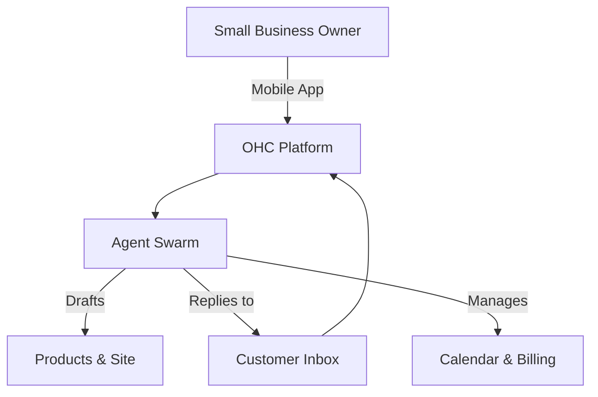

# 📈 One Human Corp: SMB Market Research & AI Differentiation Report

## 🌍 Track 4: Market Sizing & Strategic Direction

### Market Landscape
- **Total Addressable Market (TAM):** There are approximately 33.2 million small businesses in the US alone (US Census/SBA), and over 400 million globally (World Bank). Up to 36% of small businesses in the US still have no website or online presence.
- **Beachhead Market:** **Service-based solopreneurs (e.g., Carlos the handyman, Leo the music tutor)** represent the highest density of underserved users. They have immediate cash flow needs, high lifetime value (LTV), but no time to manage technical software.
- **Geographic Expansion:** After English, **Spanish (LATAM + US Hispanic)** is the logical next step, followed by **Portuguese (Brazil)**. These markets have massive SMB density and rely heavily on unstructured WhatsApp/Instagram DM sales.
- **Vertical Expansion:** Start horizontal, then focus on **Service Bookings** before diving deep into complex retail POS (Food/Inventory).

## 🕵️ Track 1: Deep Competitor Audit

| Platform | Strengths | Weaknesses | Threat Level to OHC | AI Implementation |
|----------|-----------|------------|---------------------|-------------------|
| **Shopify** | E-commerce standard, rich ecosystem | Too complex for beginners, poor free tier | High (but vulnerable on UX) | Sidekick (Chatbot, not autonomous) |
| **Wix** | Easier drag-and-drop setup | Sluggish, feature bloat | Medium | ADI (One-time generation) |
| **Squarespace**| Beautiful design | Rigid, poor for complex services | Low | Minimal |
| **GoDaddy** | Fast domain pairing | Shallow features, aggressive upsell | Low | Airo (Basic branding generation) |
| **Durable** | 30-sec AI site generation | Thin business management features | Medium (Rising) | AI Website Builder |

## 📊 Track 2: Top SMB User Pain Points
*Derived from r/smallbusiness, App Store Reviews, and Trustpilot*

1. **"Setting up the website is overwhelming."** (Competitors demand design skills).
2. **"I lose track of customer messages across IG, WhatsApp, and email."** (No unified inbox).
3. **"Writing product descriptions takes forever."** (Manual data entry).
4. **"I forget to follow up with leads and lose money."** (No automated sales CRM).
5. **"My booking system doesn't talk to my invoicing system."** (Fragmented tooling).
6. **"I don't understand SEO or marketing."** (Requires specialized knowledge).
7. **"Managing inventory across online and in-store is broken."** (Sync issues).
8. **"Mobile apps are just for dashboards, I can't actually build from my phone."** (Poor mobile parity).
9. **"Subscriptions and recurring billing are too hard to set up."** (Complex payment gateways).
10. **"I don't know what to do next to grow."** (Lack of actionable business insights).

## 🤖 Track 3: AI Differentiation Manifesto

**The 5 AI Automations OHC Will Implement First:**
1. **Auto-Replying to Customer Inquiries:** AI reads DMs and emails, answers FAQs, and books appointments autonomously. *(Saves hours daily)*.
2. **Auto-Generating Product Catalogs from Photos:** User uploads a photo of a pastry; AI drafts the title, description, and price. *(Removes onboarding friction)*.
3. **Auto-Sending Follow-Up Prompts:** AI tracks abandoned carts or stale leads and drafts friendly follow-up emails for the user to approve. *(Increases revenue)*.
4. **Auto-Generating Social Posts:** AI creates weekly Instagram/Facebook post schedules based on inventory. *(Solves marketing paralysis)*.
5. **Weekly "Smart Next Step" Insights:** AI acts as a digital advisor: "You have 3 unpaid invoices. Tap here to send reminders." *(Makes owners feel smart)*.

## 🧮 Track 5: Feature Gap Matrix

| Feature | Shopify | Wix | OHC (Current) | OHC (Advantage) |
|---------|---------|-----|---------------|-----------------|
| Setup Speed | Hours | Hours | Minutes | **Invisible Setup** |
| AI Assistant | Chatbot | Builder | Basic Agent | **Autonomous Work** |
| Mobile Parity | Read-only | Limited | Partial | **Mobile-First Builder**|
| Booking Mgmt | Add-on | Add-on | Missing | **Built-in Native** |
| Omni-Inbox | Partial | Partial | Missing | **Agent-Managed CRM** |

---

# 🚀 Issue Briefs

## [Core Feature] Autonomous Omni-Channel Inbox
**Problem Statement:**
SMB owners like Maya and Carlos lose leads because customer inquiries are scattered across Instagram, WhatsApp, and Email. Answering them manually takes hours and they miss messages when busy. Shopify and Wix just offer simple contact forms.

**Research Report:**
- 70% of solopreneurs say they miss sales due to delayed response times (r/smallbusiness).
- Competitors lack an AI agent that actively *answers* routine questions rather than just organizing them.

**Design Doc:**
- **Entity Types:** `Conversation`, `Message`, `Channel` (IG, Email, Web Widget).
- **UX Flow:**
  - Mobile-first Inbox view (375px).
  - Messages arrive with an "AI Suggested Draft" pre-filled.
  - User can tap "Send" or edit.
  - "Auto-Pilot Mode" toggle where the AI answers pricing/hours FAQs automatically.
- **AI Integration:** Integration with the KAIROS Orchestration Hub to route incoming messages to the AI Agent for draft generation based on the store's knowledge base.

**Implementation Prompt:**
Build an Omni-Channel Inbox UI component that aggregates messages. Integrate the existing agent system to generate draft replies for every incoming message based on store context. The user must be able to approve, edit, or reject the draft from their mobile device.

**Priority:** P0
**Estimated Scope:** Large

---

## [Growth Feature] "One-Tap" AI Product Generator
**Problem Statement:**
Writing product titles and descriptions is the biggest bottleneck to getting a store live. Fatima wants to sell her daily specials but struggles with writing English descriptions quickly.

**Research Report:**
- Time-to-first-sale is the critical metric for platform retention.
- Competitors like Shopify require manual entry of 10+ fields per product.

**Design Doc:**
- **UX Flow:**
  - Mobile user taps "Add Product".
  - Camera opens to snap a photo.
  - Loading screen: "AI is writing your product details..."
  - Form auto-populates with an optimized Title, Description, and Category.
  - User sets price and taps "Save".
- **AI Integration:** Connect frontend image upload to a vision-capable AI model (e.g., Gemini/GPT-4V) to extract details and generate text.

**Implementation Prompt:**
Implement a mobile-optimized product creation flow where uploading an image triggers an AI agent to generate the product's title and description automatically. The generated text must be editable before saving.

**Priority:** P0
**Estimated Scope:** Medium

---

## [Retention Feature] Weekly "Smart Next Steps" Advisor
**Problem Statement:**
Business owners like Priya don't know what to do next to grow. Dashboards with just charts are overwhelming. They need actionable advice, not just data.

**Research Report:**
- Dashboards on Shopify have a steep learning curve.
- Users actively ask for "tell me what I should do today" on forums.

**Design Doc:**
- **UX Flow:**
  - Top of the dashboard features a single card: "Your Smart Next Step".
  - Example: "You have 3 abandoned carts. Tap to send a 10% discount email."
  - Action is a 1-tap execution.
- **AI Integration:** Scheduled agent runs every 24 hours to analyze store data (sales, carts, traffic) and select the highest-impact action to surface.

**Implementation Prompt:**
Create a dashboard component that displays one high-value, AI-generated recommendation per day. Provide a single-tap button to execute the recommendation (e.g., sending an email, approving a social post). The recommendations should feel like an advisor, not a generic alert.

**Priority:** P1
**Estimated Scope:** Medium
