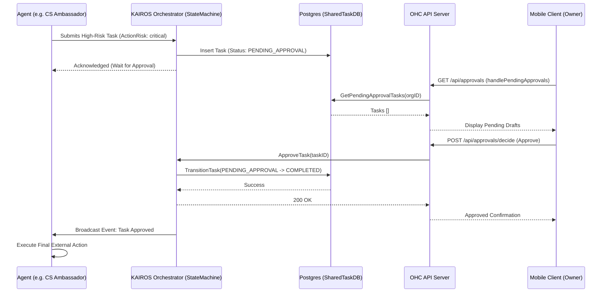

# Issue Brief: AI Agent Approval Workflow Engine

## Title
Implement AI Agent Approval Workflow Engine

## Problem Statement
Small business owners rely on AI agents to manage their day-to-day operations seamlessly. However, certain actions performed by AI agents carry high risk and consequence, such as executing financial refunds, sending sensitive customer emails, or publishing marketing campaigns. While autonomous behavior is desired for routine tasks, these high-risk actions must have a "human-in-the-loop" safeguard. Currently, there isn't a robust, unified way for the Orchestrator to pause a high-risk task, prompt the non-technical owner via a simple mobile UI for approval, and then seamlessly resume execution. Small business owners like Maya and Carlos need a reliable, transparent way to double-check and approve these critical agent actions with a simple 1-tap interaction before they go live.

## Research Report
### Current State & Architecture Observations
- OHC employs the `KAIROS` Orchestrator with an event-driven `SharedTaskDB` state machine.
- The `shared_tasks` table schema (and subsequent versions like `v4`, `master`) currently supports a `PENDING_APPROVAL` status state natively within the `StateMachine`.
- Migration `20260429000000_kairos_approval_workflow.sql` introduced specific columns for this purpose: `action_risk`, `approval_status`, and `proposed_content` on `shared_tasks`.
- The `TasksDB` module (`src/server/orchestration/tasks_db.go`) successfully implements `GetPendingApprovalTasks`, `ApproveTask`, and `RejectTask`. `ApproveTask` correctly transitions tasks to `COMPLETED`, while `RejectTask` transitions them back to `IN_PROGRESS` with reasons.
- **The Gap:** While the orchestration layer is correctly modeled, the HTTP API handler layer and client integration are disjointed. The `Server` handlers in `src/server/dashboard/server.go` route `/api/approvals`, `/api/approvals/decide`, and `/api/approvals/request` to `handlers_b2b.go`. `handlers_b2b.go` currently uses an in-memory slice `s.approvals` (mock behavior) instead of the robust, persistent `s.hub.TasksDB()` implementation.
- This results in a disconnected experience where high-risk agent drafts stored in PostgreSQL are not properly served to or actioned by the mobile dashboard client.

### Competitive Analysis
- **Shopify & Wix:** These platforms generally require the user to explicitly initiate high-risk actions manually. Their AI sidekicks primarily act as chat-based advisors rather than autonomous actors drafting system changes.
- **OHC's Differentiation:** OHC's agents operate autonomously in the background. Providing a clear "Draft-for-Review" capability allows OHC to maintain its "invisible heavy lifting" promise while building immense trust with the business owner through oversight and transparency.

## Design Doc
### Architecture Diagram

### Mobile UX Flow (375px First)
1. **Home Screen Feed:** The dashboard features an "Action Required" section prominently displaying pending approvals with high-level summaries (e.g., "Draft Email to Maya: Review needed").
2. **Review Screen:** Tapping an item opens a clean review card. It displays the `proposed_content` (the email draft, the refund amount, etc.) in a clear, plain-language format.
3. **Action:** The screen provides clear, chunky touch targets (≥ 44x44px): a primary "Approve & Send" button and a secondary "Edit / Reject" button.
4. **Execution:** Tapping "Approve" triggers an optimistic UI update, marking the item as processing and dismissing the card, while the background API call completes.

### AI Agent Integration Points
- Agents must enrich their mission payloads by determining the `ActionRisk` based on the context (e.g., financial > $50 is high risk).
- When a task enters `PENDING_APPROVAL`, the agent is notified via the Teammate Mesh and can yield processing time to other duties until the owner acts.

### Key Design Decisions
- **Rely on `shared_tasks`:** Migrate entirely away from the in-memory `s.approvals` slice in the Dashboard server. The database is the source of truth, ensuring resilience across hybrid mode switching and node restarts.
- **Leverage Existing Transitions:** Utilize the existing `ApproveTask` and `RejectTask` methods within `TasksDB` which cleanly integrate with the KAIROS state machine and audit logs.

## Implementation Prompt
Update the Dashboard API server to fully integrate the KAIROS AI Agent Approval Workflow. Currently, approval endpoints in the Dashboard use an in-memory mock slice (`s.approvals`) located in `handlers_b2b.go`. You need to replace this logic to use the robust database layer. Create or modify the necessary HTTP handlers (e.g., `handlePendingApprovals`, `handleApproveTask`, `handleRejectTask`) to interact directly with `s.hub.TasksDB().GetPendingApprovalTasks`, `s.hub.TasksDB().ApproveTask`, and `s.hub.TasksDB().RejectTask`. Update `server.go` to route the `/api/approvals` and `/api/approvals/decide` endpoints to these new database-backed handlers. Ensure the `approvalId` from the client maps to the database `taskID`. The goal is to provide a seamless, persistent mechanism for agents to submit high-risk drafts and for users to confidently approve or reject them via the UI.

## Priority
P1

## Estimated Scope
Medium
