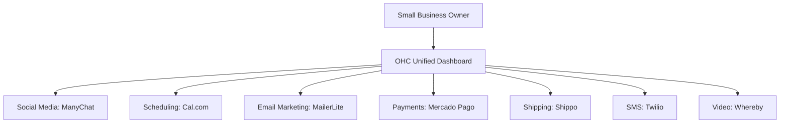

# OHC Tool Integration Research Report

## Executive Summary
This report evaluates 7 categories of tools designed to help small business owners streamline their operations. The goal is to integrate these tools into OHC, supporting both Cloud and Standalone environments, to provide a seamless, unified experience for our users.



## Comparative Landscape Heatmap
| Tool | Ease of Use | Cost-Effectiveness | Cloud Ready | Standalone Ready |
|------|-------------|--------------------|-------------|------------------|
| ManyChat | High | Medium | Yes | Yes (Webhooks) |
| Cal.com | High | High | Yes | Yes (Self-hosted/API) |
| MailerLite | High | High | Yes | Yes (API) |
| Mercado Pago | Medium | Medium | Yes | Yes (API) |
| Shippo | High | High | Yes | Yes (API) |
| Twilio | Medium | Medium | Yes | Yes (API) |
| Whereby | High | High | Yes | Yes (API/iFrame) |

---

## 1. Social Media Integration: ManyChat

**Problem Statement**
Small business owners struggle to keep up with customer messages scattered across Instagram, Facebook, and WhatsApp. They lose sales because they miss DMs or reply too late. They need a single, easy-to-use inbox.

**Research Report**
ManyChat is a leading chat marketing platform that aggregates messages from Meta platforms.
*   **Ease of Use:** Very high for non-technical users. Visual flow builder.
*   **Pricing:** Free tier available; Pro starts at $15/month.
*   **Reputation:** Highly trusted by small e-commerce and local businesses.
*   **OHC Integration:** OHC should do ManyChat integration because it reliably handles Meta's complex APIs and provides a unified webhook stream for incoming messages.

**Design Doc**
*   **Trigger:** User connects their ManyChat account via OAuth in the OHC settings page.
*   **Action:** OHC listens for new messages via webhooks. When a customer messages the business on IG/FB, it appears in the OHC unified inbox.
*   **UX:** A simple "Connect Instagram/Facebook" button. The unified inbox shows the platform icon next to the customer's name.
*   **Mobile UX:**
    ```mermaid
    graph TD
        A[Home] --> B[Inbox]
        B --> C[List of Messages with IG/FB icons]
        C --> D[Chat Thread]
        D --> E[Reply Button]
    ```

**Implementation Prompt**
Create a seamless connection flow where the business owner clicks "Connect Meta", logs into ManyChat, and is redirected back to OHC. Incoming messages from Instagram and Facebook should populate real-time in the OHC unified inbox. Replies from OHC should be routed back to the correct platform. Acceptance Criteria: End-to-end message sending and receiving without leaving OHC.

**Priority**: P0
**Estimated Scope**: Large

---

## 2. Calendar & Scheduling: Cal.com

**Problem Statement**
Coaches, consultants, and service providers waste hours on back-and-forth emails trying to find a time to meet. They need a simple link to send to clients that respects their availability.

**Research Report**
Cal.com is an open-source scheduling infrastructure.
*   **Ease of Use:** High. Clean interface.
*   **Pricing:** Free for individuals. Teams $12/user/month.
*   **Reputation:** Modern, developer-friendly, and privacy-focused alternative to Calendly.
*   **OHC Integration:** OHC should integrate Cal.com because its open-source nature aligns well with OHC's Standalone mode, allowing for deep, customizable integrations.

**Design Doc**
*   **Trigger:** User enables the Calendar module in OHC.
*   **Action:** OHC generates a unique booking link based on the user's availability (synced via Cal.com APIs).
*   **UX:** A "My Booking Link" card on the dashboard. Users can set their working hours directly inside OHC.
*   **Mobile UX:** A simple calendar view showing upcoming bookings and a prominent "Share Link" button.

**Implementation Prompt**
Build a scheduling interface within OHC that allows the business owner to define working hours. Generate a public-facing booking page (powered by Cal.com under the hood). When a client books a time, it should appear on the OHC dashboard calendar and trigger a notification to the owner. Acceptance Criteria: Booking a meeting successfully blocks out the time and notifies the owner.

**Priority**: P1
**Estimated Scope**: Medium

---

## 3. Email Marketing: MailerLite

**Problem Statement**
Small businesses want to send newsletters and promotional emails to their customer list but find tools like Mailchimp too complex and expensive.

**Research Report**
MailerLite focuses on simplicity and affordability.
*   **Ease of Use:** Extremely high. Excellent drag-and-drop builder.
*   **Pricing:** Free up to 1,000 subscribers and 12,000 emails/month.
*   **Reputation:** Known for great customer support and strict anti-spam compliance.
*   **OHC Integration:** OHC should integrate MailerLite because it caters perfectly to the non-technical small business owner who just wants to send beautiful emails easily.

**Design Doc**
*   **Trigger:** User selects a customer segment in OHC and clicks "Send Email Campaign".
*   **Action:** OHC syncs the selected contacts to a MailerLite group and opens the MailerLite campaign builder (or an embedded simplified version).
*   **UX:** A "Marketing" tab showing recent campaign performance (open rates, clicks) pulled from MailerLite.

**Implementation Prompt**
Implement a two-way contact sync between OHC's customer database and MailerLite. Provide a dashboard widget that displays basic analytics for the latest sent campaigns. Acceptance Criteria: Adding a customer in OHC automatically adds them to the MailerLite list; campaign stats are visible in OHC.

**Priority**: P2
**Estimated Scope**: Medium

---

## 4. Payment Processing: Mercado Pago

**Problem Statement**
Business owners in LATAM struggle with Stripe's limited availability and high cross-border fees. They need a trusted, local payment processor that supports alternative payment methods (like Pix in Brazil or cash payments).

**Research Report**
Mercado Pago is the dominant payment gateway in Latin America.
*   **Ease of Use:** Medium. Verification can be strict.
*   **Pricing:** Variable by country, generally competitive locally.
*   **Reputation:** The undisputed leader in LATAM e-commerce.
*   **OHC Integration:** OHC should integrate Mercado Pago because supporting local payment methods is critical for global adoption, especially in emerging markets.

**Design Doc**
*   **Trigger:** User generates an invoice or checkout link in OHC.
*   **Action:** OHC creates a Mercado Pago payment preference and returns the payment URL.
*   **UX:** When creating an invoice, the user sees "Mercado Pago" as an available payment method. Paid invoices automatically update their status in OHC.

**Implementation Prompt**
Add Mercado Pago as a payment provider option. Allow the business owner to input their API credentials. When an invoice is created, generate a Mercado Pago checkout link. Listen for payment webhooks to mark the invoice as "Paid" in OHC. Acceptance Criteria: Successful payment via the Mercado Pago test environment updates the OHC invoice status.

**Priority**: P0
**Estimated Scope**: Large

---

## 5. Shipping & Logistics: Shippo

**Problem Statement**
E-commerce sellers waste time copying and pasting addresses into carrier websites to buy shipping labels. They need to generate labels and get tracking numbers with one click.

**Research Report**
Shippo is a multi-carrier shipping API and web app.
*   **Ease of Use:** High. Simplifies complex carrier rules.
*   **Pricing:** Pay-as-you-go (5¢ per label) or $19/month for Pro.
*   **Reputation:** Reliable, excellent carrier coverage (USPS, UPS, FedEx, DHL).
*   **OHC Integration:** OHC should integrate Shippo because it instantly gives small businesses access to negotiated carrier rates and automates the most tedious part of fulfillment.

**Design Doc**
*   **Trigger:** An order is marked as "Ready to Ship" in OHC.
*   **Action:** OHC sends package dimensions and weight to Shippo to fetch rates, then generates a printable PDF label.
*   **UX:** An "Orders" view. Clicking an order reveals a "Buy Shipping Label" button. Once bought, the tracking number is displayed and optionally emailed to the customer.

**Implementation Prompt**
Integrate the Shippo API to fetch shipping rates based on order details and a default package size. Allow the business owner to purchase a label with one click. Display the tracking link on the order details page. Acceptance Criteria: Successfully generate a test shipping label PDF and retrieve a tracking number.

**Priority**: P1
**Estimated Scope**: Medium

---

## 6. SMS & Notifications: Twilio

**Problem Statement**
For businesses serving populations with low English proficiency or limited email usage, SMS is the only reliable way to send appointment reminders or order updates.

**Research Report**
Twilio is the industry standard for programmable SMS.
*   **Ease of Use:** Medium (Requires technical setup for A2P 10DLC compliance in the US).
*   **Pricing:** Pay-as-you-go (approx. $0.0079 per message in the US).
*   **Reputation:** Highly reliable, global reach.
*   **OHC Integration:** OHC should integrate Twilio because SMS reliability is non-negotiable for appointment reminders and critical alerts.

**Design Doc**
*   **Trigger:** An appointment is approaching, or an order is ready for pickup.
*   **Action:** OHC sends a templated SMS message via the Twilio API.
*   **UX:** A "Notifications" settings page where the owner can toggle "Send SMS Reminders" and edit the message template.

**Implementation Prompt**
Create an SMS notification service within OHC using the Twilio API. Provide a settings page for the business owner to input Twilio credentials and customize reminder templates. Ensure phone numbers are validated before sending. Acceptance Criteria: A test SMS is successfully delivered to a verified phone number when a scheduled event occurs.

**Priority**: P1
**Estimated Scope**: Medium

---

## 7. Video Conferencing: Whereby

**Problem Statement**
Online tutors and consultants need to generate video meeting links automatically without forcing clients to download bulky software like Zoom.

**Research Report**
Whereby provides browser-based video meetings with a simple API.
*   **Ease of Use:** Extremely high. No downloads required for hosts or guests.
*   **Pricing:** Free tier available; Pro starts at $6.99/month.
*   **Reputation:** Loved for its beautiful UI and frictionless guest experience.
*   **OHC Integration:** OHC should integrate Whereby because it can be seamlessly embedded into the OHC platform using iFrames, providing a branded experience.

**Design Doc**
*   **Trigger:** A virtual meeting is booked in the OHC Calendar.
*   **Action:** OHC calls the Whereby API to generate a unique room URL.
*   **UX:** The meeting details in OHC include a "Join Video Call" button. Clicking it opens the Whereby room directly within the OHC dashboard (embedded view) or in a new tab.

**Implementation Prompt**
Integrate the Whereby API to automatically create a meeting room whenever a virtual appointment is scheduled. Store the room URL with the appointment record and display a "Join Call" button on the UI for both the owner and the client. Acceptance Criteria: A unique Whereby link is generated and accessible when a new virtual appointment is created.

**Priority**: P2
**Estimated Scope**: Small
