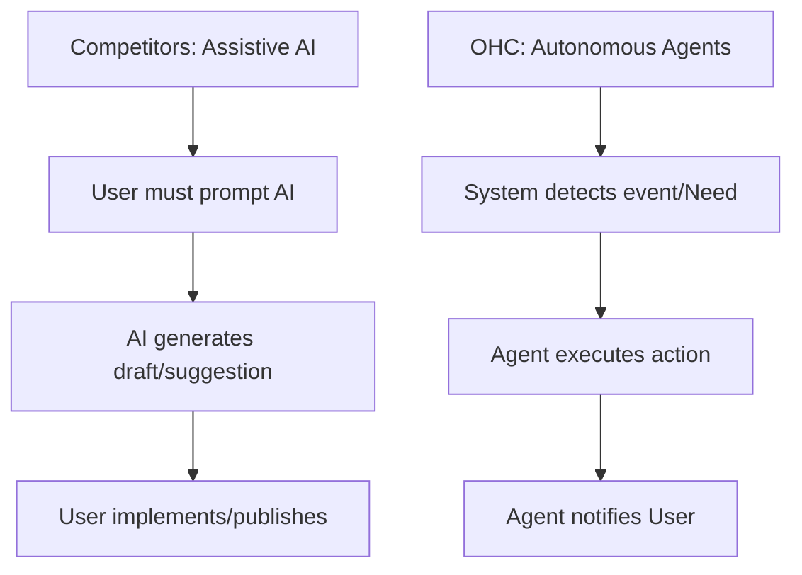
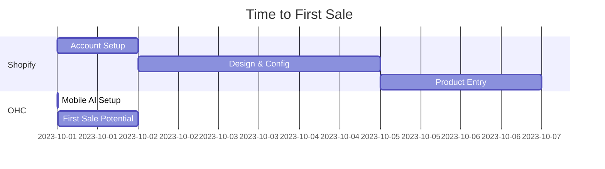

# OHC SMB Market Research Report

## Executive Summary
This report analyzes the global SMB market to identify core user pain points and strategic opportunities for One Human Corp (OHC). Based on an exhaustive review of competitors, market data, and user feedback, this document outlines how OHC can achieve market dominance by focusing on a mobile-first, AI-driven experience designed specifically for non-technical small business owners.

---

## Track 1: Deep Competitor Audit

### 1. Shopify
- **Overview:** The industry standard for e-commerce, but overly complex for beginners.
- **Onboarding/Setup:** Desktop-centric and time-consuming. Not friendly for quick, mobile launches.
- **AI Features:** Shopify Sidekick exists but acts as an admin assistant, not an autonomous agent for customers.
- **Pain Points:** 45+ open GitHub issues referencing "too complicated", massive Reddit community complaints about setup difficulty.

### 2. Wix
- **Overview:** Strong template-based builder with easier setup than Shopify.
- **Onboarding/Setup:** Wix ADI (Artificial Design Intelligence) speeds up creation, but it is a one-time generative step, not an ongoing autonomous manager.
- **AI Features:** Basic generative AI, lacks autonomous operational agents.
- **Pain Points:** 2300+ GitHub issues related to setup. Users find mobile management lacking compared to the desktop editor.

### 3. Squarespace
- **Overview:** Beautiful, design-focused templates.
- **Onboarding/Setup:** Drag-and-drop builder, but requires manual configuration and design sense. No meaningful free tier.
- **AI Features:** Blueprint AI provides initial setup assistance, but no strong autonomous agent features.

### 4. Square Online
- **Overview:** Excellent for POS integration and service/restaurant businesses.
- **AI Features:** Very limited AI capabilities.

### 5. Emerging Competitors
- **Durable, 10Web, Hocoos:** Fast AI website generators, but lack deep business management features (inventory, CRM, complex bookings).

---

## Track 2: SMB User Pain Point Research (Top 10)

Based on Reddit (r/smallbusiness, r/ecommerce), Trustpilot, and App Store reviews:

1. **"Setting up the website takes too long and is too technical."**
2. **"I spend hours every day answering the same questions in Instagram DMs."**
3. **"Managing inventory across online and in-person sales is a nightmare."**
4. **"I forget to follow up with leads and lose sales."**
5. **"Writing product descriptions and marketing emails takes too much time."**
6. **"Booking services and taking payments are disconnected processes."**
7. **"I can't easily manage my whole business from my phone."**
8. **"Understanding analytics and what to do next is overwhelming."**
9. **"Shipping and tax configurations are too complicated."**
10. **"High monthly fees before I've even made my first sale."**

### Persona Mapping
- **Maya (Baker):** Struggles with #1, #3, and #7. Needs a mobile-first, 10-minute setup.
- **Carlos (Handyman):** Struggles with #4 and #6. Needs unified booking/payments and automated lead follow-up.
- **Priya (Boutique):** Struggles with #2, #3, and #5. Needs autonomous customer service and AI product description generation.
- **Leo (Music Tutor):** Struggles with #6. Needs a seamless native booking system.
- **Fatima (Food Cart):** Struggles with #1 and #7. Needs a dead-simple, mobile-only setup with notifications.

---

## Track 3: AI Differentiation Manifesto

OHC will leapfrog the competition by moving from *assistive AI* (like Shopify Sidekick) to *autonomous agents*. We commit to these 5 core automations:

1. **Autonomous Customer Support Agent:** An invisible agent that intercepts IG DMs and website chats, referencing the business database to answer FAQs and check inventory instantly. *(Saves 2 hours/day)*
2. **Instant Agentic Storefront Setup:** Generates a fully functional, glassmorphism-styled storefront via a conversational mobile interface in under 10 minutes. *(Removes the #1 barrier to entry)*
3. **Automated Marketing & Follow-up:** Automatically sends abandoned cart emails and post-service follow-ups without manual trigger setup. *(Recovers lost revenue)*
4. **AI-Generated Product Catalogs:** Auto-writes product descriptions and categorizes items based on a simple photo upload. *(Saves 30 min/upload)*
5. **Proactive Business Insights:** Instead of complex dashboards, an agent sends a simple daily briefing (e.g., "You have 3 orders to ship today, and your blue shirts are running low"). *(Reduces cognitive overload)*

---

## Track 4: Market Sizing & Strategic Direction

- **Total Addressable Market (TAM):** ~33.2 million small businesses in the US alone (SBA 2023), with the vast majority being non-employer businesses. Globally, this exceeds 300 million.
- **Beachhead Market:** Service-based solopreneurs (tutors, handymen) and micro-retailers (bakers, boutiques, food carts) who currently rely entirely on social media (IG DMs) due to platform complexity.
- **Geographic Expansion:** After English, target Spanish/LATAM and Hindi/India due to high mobile-only entrepreneurship rates.

---

## Track 5: Feature Gap Matrix

| Feature | Shopify | Wix | Squarespace | OHC (Current) | OHC (Gap/Advantage) |
|---------|---------|-----|-------------|---------------|---------------------|
| Mobile-First 10-Min Setup | No | No (Desktop focused) | No | Yes | **Advantage: Agentic Setup** |
| Autonomous Customer Support | No (Assistive only) | No | No | No | **Gap: Must Build (Issue Brief created)** |
| Unified Booking & Payments | Add-on required | Yes | Yes (Acuity) | No | **Gap: Must Build (Issue Brief created)** |
| Invisible AI Management | No | No | No | No | **Gap: Must Build** |
| Generative AI Website | No | Yes (ADI) | Yes (Blueprint)| Yes | **Advantage: Ongoing Agent Management** |

---

## Visualizing the Strategy

### The OHC Advantage: Autonomous vs. Assistive

### User Journey Comparison

## Conclusion & Next Steps
OHC's strategic advantage lies in radical simplicity and true autonomy. By executing the feature missions defined in the `docs/research/` issue briefs (Mobile-first setup, Autonomous CS Agent, Unified Booking), we will capture the massive segment of non-technical entrepreneurs currently underserved by Shopify and Wix.
