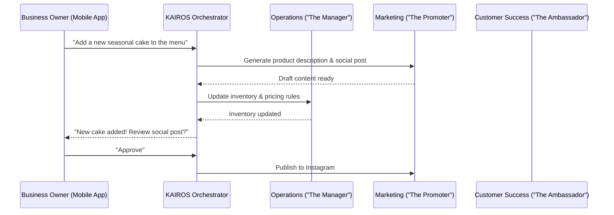

# Research Report: AI Agent Department Architecture

## Title
AI Agent Department Architecture

## Problem Statement
Small business owners (bakers, handymen, food cart operators) face overwhelming complexity managing daily operations, marketing, sales, and finances. They lack the time and technical expertise to coordinate these functions manually. They need an invisible, automated workforce that mirrors a real business structure—handling tasks autonomously while presenting a simple, understandable interface.

## Research Report
Current SaaS platforms (Shopify, Wix, Squarespace) offer fragmented tools requiring manual configuration. Wix and Squarespace have basic AI copy generation, but no autonomous agents. Shopify's "Sidekick" is a reactive chatbot, not a proactive department.
Small business owners conceptually understand "departments" (e.g., Marketing, Sales). Organizing AI agents into these familiar roles reduces cognitive load.
Key findings:
- Users want proactive suggestions, not just reactive answers.
- Trust is paramount; high-stakes actions (refunds, large payments) require manual approval workflows initially.
- Context sharing between departments is critical (e.g., Operations knows an order is delayed, Customer Success proactively emails the customer).

## Design Doc

### Architecture Diagram

### UI Wireframes / Screen Flow
- **Home/Dashboard (375px):** A daily feed of "Activity Cards" from different departments. E.g., a card from "The Promoter" saying "Drafted an Instagram post for your new service." with an "Approve" button.
- **Department Settings:** Simple toggles for autonomy levels per department (e.g., "Operations: Auto-approve orders < $100").
- **Agent Chat:** A unified chat interface to talk to the Orchestrator, which routes requests to the appropriate department.

### AI Agent Integration Points
- **Event Bus:** Agents subscribe to domain events (e.g., `OrderPlaced`, `InventoryLow`).
- **Shared Memory Context:** A centralized vector store/knowledge graph per tenant, ensuring all departments share the same business context.
- **Approval Workflow Engine:** Middleware to intercept actions requiring human approval before execution.

### Key Design Decisions
- **Department Metaphor:** Organizing agents by business function rather than technical capability to match user mental models.
- **Progressive Autonomy:** Starting with "Draft-for-review" mode and allowing users to unlock "Auto-execute" as trust builds.
- **Centralized Orchestration:** The user interacts primarily with a single Orchestrator agent, which delegates to specialized department agents, avoiding the need for the user to "manage" the AI team.

## Implementation Prompt
Implement the backend architecture for the AI Agent Departments.
- Define the `Department` and `Agent` entities.
- Implement the Event Bus mechanism for inter-department communication.
- Create the core Approval Workflow Engine.
- Ensure the Orchestrator can route natural language requests to the correct department.
- **Acceptance Criteria:** A test suite demonstrating an event triggered in the Operations department successfully queuing a draft action in the Customer Success department, requiring simulated user approval to proceed.

## Priority
P0

## Estimated Scope
Large
