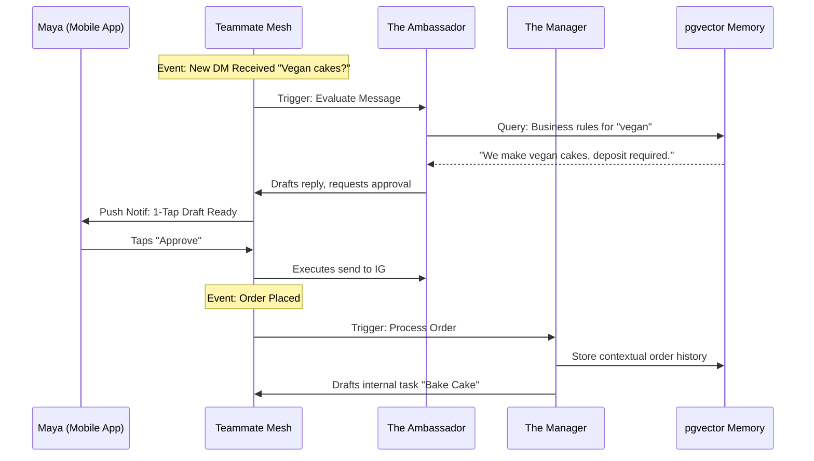

# 🔮 Oracle: AI Agent Department Architecture & Teammate Mesh Coordination

## Title
Architectural Blueprint: AI Agent Departments as Proactive Teammates for Zero-Friction Business Management

## Problem Statement
Small business owners (Maya the Baker, Carlos the Handyman, Priya the Boutique Owner, Leo the Music Tutor, Fatima the Food Cart Operator) are overwhelmed by the administrative burden of running a business. Traditional software requires users to be "prompters" or active managers, treating AI as a reactive tool. This creates cognitive load and friction. OHC requires a system where AI acts as a proactive "Teammate"—working invisibly in the background to handle operations, marketing, sales, customer success, finance, legal, and advisory tasks—allowing founders to manage everything via 1-tap approvals on their phone.

## Research Report
The fundamental shift is from AI as a "Tool" to AI as a "Teammate".

*   **Competitor Baseline (Shopify/Wix):** AI is a tool. Users must prompt an AI to write a description or draft an email. It creates work before it saves work.
*   **OHC Paradigm:** AI is autonomous and event-driven. It watches the business context (Teammate Mesh) and queues up ready-to-execute actions for the owner's review.

### Persona Analysis & Pain Points
1.  **Maya (Baker)**: Loses sales while sleeping because she can't answer DMs about custom cakes. Needs an "Ambassador" agent.
2.  **Carlos (Handyman)**: Struggles with writing professional quotes quickly after a site visit. Needs a "Salesperson" agent.
3.  **Priya (Boutique)**: Doesn't know how to analyze sales data to decide what to restock. Needs an "Advisor" and "Manager" agent.
4.  **Leo (Music Tutor)**: Forgetful about sending lesson follow-ups and re-engaging inactive students. Needs an "Ambassador" agent.
5.  **Fatima (Food Cart)**: Needs an ultra-simple, localized way to handle rushes without looking at a screen constantly. Needs an "Operations" agent with loud, clear, simple notifications.

### The 7 AI Departments
1.  **Operations ("The Manager")**: Order processing, inventory, fulfillment.
2.  **Marketing & Advertising ("The Promoter")**: SEO, social media, storefront updates.
3.  **Sales & Acquisition ("The Salesperson")**: Quotes, lead follow-ups.
4.  **Customer Success ("The Ambassador")**: Inbox, DMs, review requests.
5.  **Finance & Payments ("The Accountant")**: Billing, reports.
6.  **Legal & Compliance ("The Protector")**: Policies, compliance.
7.  **Business Advisory ("The Advisor")**: Daily plain-language briefings and strategy.

## Design Doc

### Key Architectural Decisions
*   **Event-Driven Coordination:** Departments do not call each other via direct APIs. They coordinate via the KAIROS Orchestrator's shared Task List and the Teammate Mesh, responding to domain events (e.g., `tenant.order.created`).
*   **Proactive Drafts:** High-risk actions (customer communication, publishing) are placed in a `DRAFT` state, surfaced on the mobile dashboard for 1-tap approval. Low-risk actions (internal tagging) auto-execute.
*   **Unified Agent Memory:** Agents share context via `pgvector` stored memories (AutoDream), ensuring "The Ambassador" knows what "The Manager" did with an order.
*   **Mobile Parity & Visual Excellence:** The approval feed must load instantly (LCP < 1.5s on 4G) and utilize Glassmorphism cards with clear, non-technical summaries ("Approve Quote for Carlos" instead of "Execute Task ID 492").
*   **Multi-Tenancy:** All agent execution and memory access is strictly scoped via PostgreSQL RLS `tenant_id`.
*   **AI Usage Budgeting & Throttling:** Usage is metered by tenant tier. The Orchestrator intercepts execution tasks and checks against the monthly quota (e.g., 100 actions for Free, 1,000 for Starter). When a limit is reached, draft actions are paused with a clear, non-technical upgrade prompt.

### UI Wireframes & Mobile UX Flow (375px First)
*   **Home Dashboard (Action Feed):** A vertically scrolling feed of Glassmorphism cards on a unified background. Each card represents a pending high-risk action (e.g., "The Ambassador: Drafted reply to Maya").
*   **Card Interaction:** Swiping right or tapping "Approve" immediately triggers an optimistic UI update, turning the card green with a subtle checkmark animation before it disappears. Tapping "Edit" opens a native bottom-sheet to tweak the draft before approval.
*   **Status Header:** A sticky top header shows the overall health metric (e.g., "2 Actions Required", "All Clear").

### AI Department Interaction Architecture (Mermaid.js)

## Implementation Prompt
**To Implementer Agent:**
Implement the core KAIROS task routing and approval workflow for the "Ambassador" and "Manager" departments.
1. Build the Teammate Mesh listener that routes system events to the correct agent department worker based on the event payload.
2. Implement the `Draft-for-Review` mechanism: when an agent proposes a high-risk action (e.g., a customer reply), it must create a pending Task record in the database instead of executing immediately.
3. Develop the mobile-first (375px) Dashboard UI component ("Action Feed") that displays these pending tasks as Glassmorphism cards with a 1-tap "Approve" or "Reject" button.
4. Ensure all database queries utilize the `tenant_id` context for strict RLS isolation.
5. Write Playwright E2E tests validating the complete flow: from simulated event trigger -> agent draft creation -> dashboard visibility -> 1-tap approval execution.
Do not prescribe specific LLM inference engines; focus on the orchestrator routing and approval UX.

## Priority
P0

## Estimated Scope
Large
