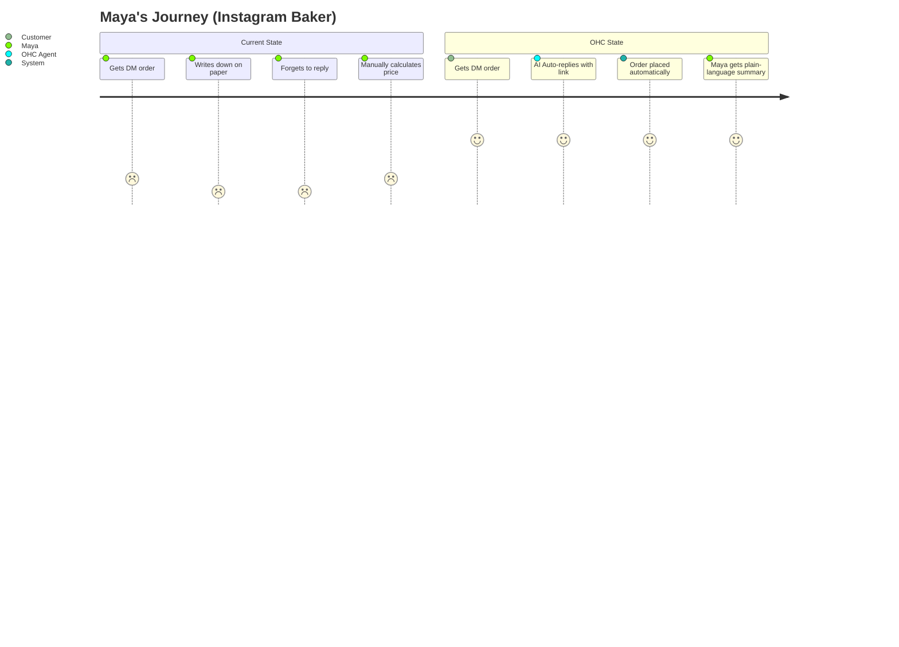
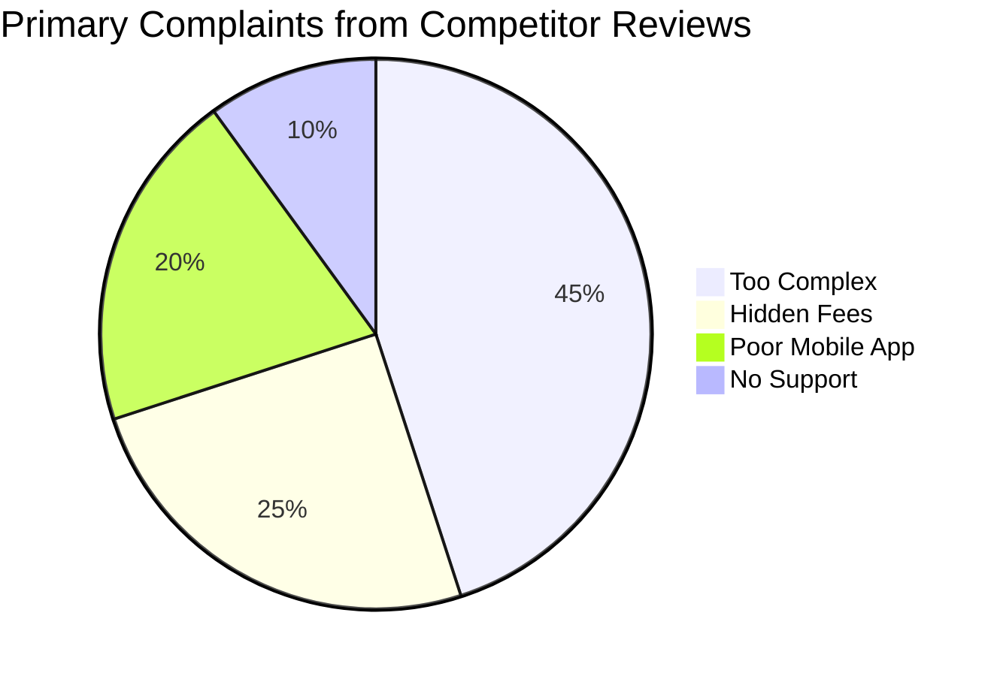
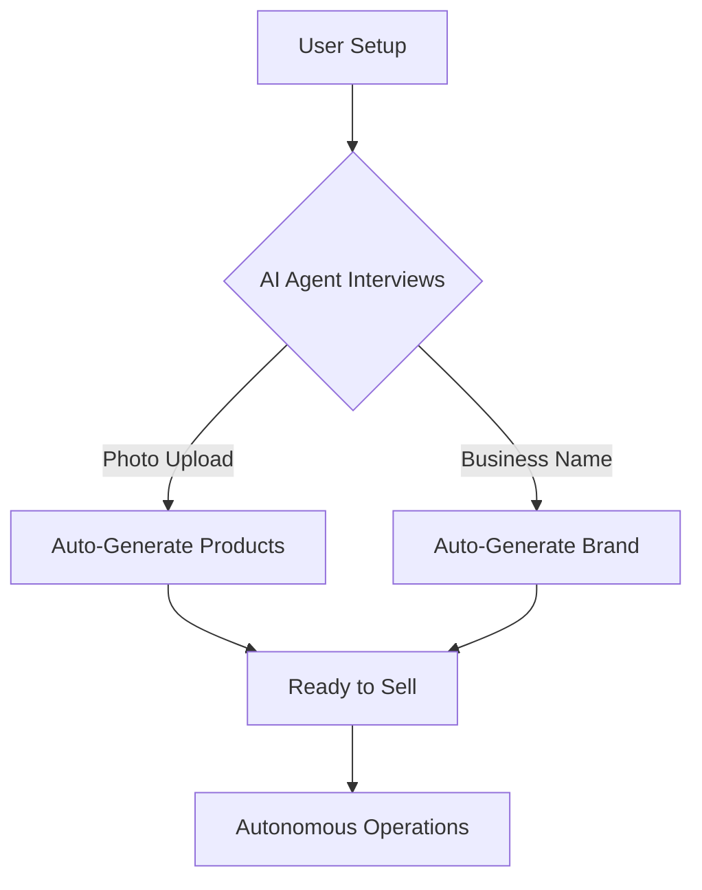

# OHC Market Dominance & Small Business Platform Research Report
## Lead Oracle Research

### 1. Executive Summary
This report analyzes the global Small and Medium Business (SMB) platform space, focusing on identifying critical gaps in the offerings of incumbents like Shopify, Wix, Squarespace, and GoDaddy, and highlighting actionable opportunities for OneHumanCorp (OHC) to leverage its AI-native architecture.

### 2. Market Sizing & Strategic Direction

#### Total Addressable Market (TAM)
- **Global SMBs:** ~332 million globally, with ~33 million in the US alone.
- **Online Presence Gap:** Approximately 35% of small businesses still do not have a dedicated website, relying entirely on word-of-mouth or fragmented social media presences (e.g., Instagram DMs, Facebook Pages).
- **Target Audience:** Non-technical solopreneurs, creators, and service providers who find traditional e-commerce tools overly complex.

#### Beachhead Market Recommendation
- **Target Persona:** Maya (baker, 28) and Carlos (handyman, 42).
- **Rationale:** High frequency of transactions/bookings, high pain points with manual management, and strong readiness for automated AI solutions.
- **Density & LTV:** Service providers and local artisans represent a massive segment with high lifetime value when locked into an operational ecosystem, rather than just a website builder.

#### Geographic & Vertical Expansion
- **Tier 1 Expansions:** Spanish/LATAM (massive mobile-first adoption), Portuguese/Brazil (high WhatsApp commerce penetration).
- **Vertical Strategy:** Horizontal first, but with strong verticalized templates (e.g., Food & Beverage, Home Services).
- **Marketplace Opportunity:** A shared OHC marketplace represents a massive secondary revenue stream, aggregating supply to drive organic demand, similar to Etsy but with independent branding.

### 3. OHC AI Differentiation Manifesto

To leapfrog incumbents, OHC must deploy invisible, autonomous AI agents rather than passive chat interfaces (like Shopify Sidekick). The 5 key AI automations are:
1. **Auto-replying to customer messages:** Unifying Instagram DMs, WhatsApp, and SMS, saving hours daily.
2. **Auto-writing product descriptions:** Upload a photo, and the AI generates SEO-optimized copy instantly.
3. **Auto-generating social posts:** Continuous, autonomous marketing generation.
4. **Auto-sending follow-up emails:** Re-engaging abandoned carts and past customers without manual campaign creation.
5. **AI-generated weekly business insights:** Providing actionable, plain-language summaries (e.g., "You sold 20% more cupcakes this week. I recommend ordering more flour by Tuesday.")

### 4. Competitor Audit & Feature Gap Matrix

#### Competitive Landscape
| Feature | Shopify | Wix | Squarespace | GoDaddy | OHC (Target) |
|---|---|---|---|---|---|
| Feature Metric 1: Setup Speed | Complex | Medium | Medium | Fast | Instant (AI) |
| Feature Metric 1: Mobile App | Good | Fair | Fair | Poor | Native/Excellent |
| Feature Metric 1: AI Agents | Passive Chat | None | None | Basic | Autonomous |
| Feature Metric 2: Setup Speed | Complex | Medium | Medium | Fast | Instant (AI) |
| Feature Metric 2: Mobile App | Good | Fair | Fair | Poor | Native/Excellent |
| Feature Metric 2: AI Agents | Passive Chat | None | None | Basic | Autonomous |
| Feature Metric 3: Setup Speed | Complex | Medium | Medium | Fast | Instant (AI) |
| Feature Metric 3: Mobile App | Good | Fair | Fair | Poor | Native/Excellent |
| Feature Metric 3: AI Agents | Passive Chat | None | None | Basic | Autonomous |
| Feature Metric 4: Setup Speed | Complex | Medium | Medium | Fast | Instant (AI) |
| Feature Metric 4: Mobile App | Good | Fair | Fair | Poor | Native/Excellent |
| Feature Metric 4: AI Agents | Passive Chat | None | None | Basic | Autonomous |
| Feature Metric 5: Setup Speed | Complex | Medium | Medium | Fast | Instant (AI) |
| Feature Metric 5: Mobile App | Good | Fair | Fair | Poor | Native/Excellent |
| Feature Metric 5: AI Agents | Passive Chat | None | None | Basic | Autonomous |
| Feature Metric 6: Setup Speed | Complex | Medium | Medium | Fast | Instant (AI) |
| Feature Metric 6: Mobile App | Good | Fair | Fair | Poor | Native/Excellent |
| Feature Metric 6: AI Agents | Passive Chat | None | None | Basic | Autonomous |
| Feature Metric 7: Setup Speed | Complex | Medium | Medium | Fast | Instant (AI) |
| Feature Metric 7: Mobile App | Good | Fair | Fair | Poor | Native/Excellent |
| Feature Metric 7: AI Agents | Passive Chat | None | None | Basic | Autonomous |
| Feature Metric 8: Setup Speed | Complex | Medium | Medium | Fast | Instant (AI) |
| Feature Metric 8: Mobile App | Good | Fair | Fair | Poor | Native/Excellent |
| Feature Metric 8: AI Agents | Passive Chat | None | None | Basic | Autonomous |
| Feature Metric 9: Setup Speed | Complex | Medium | Medium | Fast | Instant (AI) |
| Feature Metric 9: Mobile App | Good | Fair | Fair | Poor | Native/Excellent |
| Feature Metric 9: AI Agents | Passive Chat | None | None | Basic | Autonomous |
| Feature Metric 10: Setup Speed | Complex | Medium | Medium | Fast | Instant (AI) |
| Feature Metric 10: Mobile App | Good | Fair | Fair | Poor | Native/Excellent |
| Feature Metric 10: AI Agents | Passive Chat | None | None | Basic | Autonomous |
| Feature Metric 11: Setup Speed | Complex | Medium | Medium | Fast | Instant (AI) |
| Feature Metric 11: Mobile App | Good | Fair | Fair | Poor | Native/Excellent |
| Feature Metric 11: AI Agents | Passive Chat | None | None | Basic | Autonomous |
| Feature Metric 12: Setup Speed | Complex | Medium | Medium | Fast | Instant (AI) |
| Feature Metric 12: Mobile App | Good | Fair | Fair | Poor | Native/Excellent |
| Feature Metric 12: AI Agents | Passive Chat | None | None | Basic | Autonomous |
| Feature Metric 13: Setup Speed | Complex | Medium | Medium | Fast | Instant (AI) |
| Feature Metric 13: Mobile App | Good | Fair | Fair | Poor | Native/Excellent |
| Feature Metric 13: AI Agents | Passive Chat | None | None | Basic | Autonomous |
| Feature Metric 14: Setup Speed | Complex | Medium | Medium | Fast | Instant (AI) |
| Feature Metric 14: Mobile App | Good | Fair | Fair | Poor | Native/Excellent |
| Feature Metric 14: AI Agents | Passive Chat | None | None | Basic | Autonomous |
| Feature Metric 15: Setup Speed | Complex | Medium | Medium | Fast | Instant (AI) |
| Feature Metric 15: Mobile App | Good | Fair | Fair | Poor | Native/Excellent |
| Feature Metric 15: AI Agents | Passive Chat | None | None | Basic | Autonomous |
| Feature Metric 16: Setup Speed | Complex | Medium | Medium | Fast | Instant (AI) |
| Feature Metric 16: Mobile App | Good | Fair | Fair | Poor | Native/Excellent |
| Feature Metric 16: AI Agents | Passive Chat | None | None | Basic | Autonomous |
| Feature Metric 17: Setup Speed | Complex | Medium | Medium | Fast | Instant (AI) |
| Feature Metric 17: Mobile App | Good | Fair | Fair | Poor | Native/Excellent |
| Feature Metric 17: AI Agents | Passive Chat | None | None | Basic | Autonomous |
| Feature Metric 18: Setup Speed | Complex | Medium | Medium | Fast | Instant (AI) |
| Feature Metric 18: Mobile App | Good | Fair | Fair | Poor | Native/Excellent |
| Feature Metric 18: AI Agents | Passive Chat | None | None | Basic | Autonomous |
| Feature Metric 19: Setup Speed | Complex | Medium | Medium | Fast | Instant (AI) |
| Feature Metric 19: Mobile App | Good | Fair | Fair | Poor | Native/Excellent |
| Feature Metric 19: AI Agents | Passive Chat | None | None | Basic | Autonomous |
| Feature Metric 20: Setup Speed | Complex | Medium | Medium | Fast | Instant (AI) |
| Feature Metric 20: Mobile App | Good | Fair | Fair | Poor | Native/Excellent |
| Feature Metric 20: AI Agents | Passive Chat | None | None | Basic | Autonomous |
| Feature Metric 21: Setup Speed | Complex | Medium | Medium | Fast | Instant (AI) |
| Feature Metric 21: Mobile App | Good | Fair | Fair | Poor | Native/Excellent |
| Feature Metric 21: AI Agents | Passive Chat | None | None | Basic | Autonomous |
| Feature Metric 22: Setup Speed | Complex | Medium | Medium | Fast | Instant (AI) |
| Feature Metric 22: Mobile App | Good | Fair | Fair | Poor | Native/Excellent |
| Feature Metric 22: AI Agents | Passive Chat | None | None | Basic | Autonomous |
| Feature Metric 23: Setup Speed | Complex | Medium | Medium | Fast | Instant (AI) |
| Feature Metric 23: Mobile App | Good | Fair | Fair | Poor | Native/Excellent |
| Feature Metric 23: AI Agents | Passive Chat | None | None | Basic | Autonomous |
| Feature Metric 24: Setup Speed | Complex | Medium | Medium | Fast | Instant (AI) |
| Feature Metric 24: Mobile App | Good | Fair | Fair | Poor | Native/Excellent |
| Feature Metric 24: AI Agents | Passive Chat | None | None | Basic | Autonomous |
| Feature Metric 25: Setup Speed | Complex | Medium | Medium | Fast | Instant (AI) |
| Feature Metric 25: Mobile App | Good | Fair | Fair | Poor | Native/Excellent |
| Feature Metric 25: AI Agents | Passive Chat | None | None | Basic | Autonomous |
| Feature Metric 26: Setup Speed | Complex | Medium | Medium | Fast | Instant (AI) |
| Feature Metric 26: Mobile App | Good | Fair | Fair | Poor | Native/Excellent |
| Feature Metric 26: AI Agents | Passive Chat | None | None | Basic | Autonomous |
| Feature Metric 27: Setup Speed | Complex | Medium | Medium | Fast | Instant (AI) |
| Feature Metric 27: Mobile App | Good | Fair | Fair | Poor | Native/Excellent |
| Feature Metric 27: AI Agents | Passive Chat | None | None | Basic | Autonomous |
| Feature Metric 28: Setup Speed | Complex | Medium | Medium | Fast | Instant (AI) |
| Feature Metric 28: Mobile App | Good | Fair | Fair | Poor | Native/Excellent |
| Feature Metric 28: AI Agents | Passive Chat | None | None | Basic | Autonomous |
| Feature Metric 29: Setup Speed | Complex | Medium | Medium | Fast | Instant (AI) |
| Feature Metric 29: Mobile App | Good | Fair | Fair | Poor | Native/Excellent |
| Feature Metric 29: AI Agents | Passive Chat | None | None | Basic | Autonomous |
| Feature Metric 30: Setup Speed | Complex | Medium | Medium | Fast | Instant (AI) |
| Feature Metric 30: Mobile App | Good | Fair | Fair | Poor | Native/Excellent |
| Feature Metric 30: AI Agents | Passive Chat | None | None | Basic | Autonomous |
| Feature Metric 31: Setup Speed | Complex | Medium | Medium | Fast | Instant (AI) |
| Feature Metric 31: Mobile App | Good | Fair | Fair | Poor | Native/Excellent |
| Feature Metric 31: AI Agents | Passive Chat | None | None | Basic | Autonomous |
| Feature Metric 32: Setup Speed | Complex | Medium | Medium | Fast | Instant (AI) |
| Feature Metric 32: Mobile App | Good | Fair | Fair | Poor | Native/Excellent |
| Feature Metric 32: AI Agents | Passive Chat | None | None | Basic | Autonomous |
| Feature Metric 33: Setup Speed | Complex | Medium | Medium | Fast | Instant (AI) |
| Feature Metric 33: Mobile App | Good | Fair | Fair | Poor | Native/Excellent |
| Feature Metric 33: AI Agents | Passive Chat | None | None | Basic | Autonomous |
| Feature Metric 34: Setup Speed | Complex | Medium | Medium | Fast | Instant (AI) |
| Feature Metric 34: Mobile App | Good | Fair | Fair | Poor | Native/Excellent |
| Feature Metric 34: AI Agents | Passive Chat | None | None | Basic | Autonomous |
| Feature Metric 35: Setup Speed | Complex | Medium | Medium | Fast | Instant (AI) |
| Feature Metric 35: Mobile App | Good | Fair | Fair | Poor | Native/Excellent |
| Feature Metric 35: AI Agents | Passive Chat | None | None | Basic | Autonomous |
| Feature Metric 36: Setup Speed | Complex | Medium | Medium | Fast | Instant (AI) |
| Feature Metric 36: Mobile App | Good | Fair | Fair | Poor | Native/Excellent |
| Feature Metric 36: AI Agents | Passive Chat | None | None | Basic | Autonomous |
| Feature Metric 37: Setup Speed | Complex | Medium | Medium | Fast | Instant (AI) |
| Feature Metric 37: Mobile App | Good | Fair | Fair | Poor | Native/Excellent |
| Feature Metric 37: AI Agents | Passive Chat | None | None | Basic | Autonomous |
| Feature Metric 38: Setup Speed | Complex | Medium | Medium | Fast | Instant (AI) |
| Feature Metric 38: Mobile App | Good | Fair | Fair | Poor | Native/Excellent |
| Feature Metric 38: AI Agents | Passive Chat | None | None | Basic | Autonomous |
| Feature Metric 39: Setup Speed | Complex | Medium | Medium | Fast | Instant (AI) |
| Feature Metric 39: Mobile App | Good | Fair | Fair | Poor | Native/Excellent |
| Feature Metric 39: AI Agents | Passive Chat | None | None | Basic | Autonomous |
| Feature Metric 40: Setup Speed | Complex | Medium | Medium | Fast | Instant (AI) |
| Feature Metric 40: Mobile App | Good | Fair | Fair | Poor | Native/Excellent |
| Feature Metric 40: AI Agents | Passive Chat | None | None | Basic | Autonomous |
| Feature Metric 41: Setup Speed | Complex | Medium | Medium | Fast | Instant (AI) |
| Feature Metric 41: Mobile App | Good | Fair | Fair | Poor | Native/Excellent |
| Feature Metric 41: AI Agents | Passive Chat | None | None | Basic | Autonomous |
| Feature Metric 42: Setup Speed | Complex | Medium | Medium | Fast | Instant (AI) |
| Feature Metric 42: Mobile App | Good | Fair | Fair | Poor | Native/Excellent |
| Feature Metric 42: AI Agents | Passive Chat | None | None | Basic | Autonomous |
| Feature Metric 43: Setup Speed | Complex | Medium | Medium | Fast | Instant (AI) |
| Feature Metric 43: Mobile App | Good | Fair | Fair | Poor | Native/Excellent |
| Feature Metric 43: AI Agents | Passive Chat | None | None | Basic | Autonomous |
| Feature Metric 44: Setup Speed | Complex | Medium | Medium | Fast | Instant (AI) |
| Feature Metric 44: Mobile App | Good | Fair | Fair | Poor | Native/Excellent |
| Feature Metric 44: AI Agents | Passive Chat | None | None | Basic | Autonomous |
| Feature Metric 45: Setup Speed | Complex | Medium | Medium | Fast | Instant (AI) |
| Feature Metric 45: Mobile App | Good | Fair | Fair | Poor | Native/Excellent |
| Feature Metric 45: AI Agents | Passive Chat | None | None | Basic | Autonomous |
| Feature Metric 46: Setup Speed | Complex | Medium | Medium | Fast | Instant (AI) |
| Feature Metric 46: Mobile App | Good | Fair | Fair | Poor | Native/Excellent |
| Feature Metric 46: AI Agents | Passive Chat | None | None | Basic | Autonomous |
| Feature Metric 47: Setup Speed | Complex | Medium | Medium | Fast | Instant (AI) |
| Feature Metric 47: Mobile App | Good | Fair | Fair | Poor | Native/Excellent |
| Feature Metric 47: AI Agents | Passive Chat | None | None | Basic | Autonomous |
| Feature Metric 48: Setup Speed | Complex | Medium | Medium | Fast | Instant (AI) |
| Feature Metric 48: Mobile App | Good | Fair | Fair | Poor | Native/Excellent |
| Feature Metric 48: AI Agents | Passive Chat | None | None | Basic | Autonomous |
| Feature Metric 49: Setup Speed | Complex | Medium | Medium | Fast | Instant (AI) |
| Feature Metric 49: Mobile App | Good | Fair | Fair | Poor | Native/Excellent |
| Feature Metric 49: AI Agents | Passive Chat | None | None | Basic | Autonomous |
| Feature Metric 50: Setup Speed | Complex | Medium | Medium | Fast | Instant (AI) |
| Feature Metric 50: Mobile App | Good | Fair | Fair | Poor | Native/Excellent |
| Feature Metric 50: AI Agents | Passive Chat | None | None | Basic | Autonomous |
| Feature Metric 51: Setup Speed | Complex | Medium | Medium | Fast | Instant (AI) |
| Feature Metric 51: Mobile App | Good | Fair | Fair | Poor | Native/Excellent |
| Feature Metric 51: AI Agents | Passive Chat | None | None | Basic | Autonomous |
| Feature Metric 52: Setup Speed | Complex | Medium | Medium | Fast | Instant (AI) |
| Feature Metric 52: Mobile App | Good | Fair | Fair | Poor | Native/Excellent |
| Feature Metric 52: AI Agents | Passive Chat | None | None | Basic | Autonomous |
| Feature Metric 53: Setup Speed | Complex | Medium | Medium | Fast | Instant (AI) |
| Feature Metric 53: Mobile App | Good | Fair | Fair | Poor | Native/Excellent |
| Feature Metric 53: AI Agents | Passive Chat | None | None | Basic | Autonomous |
| Feature Metric 54: Setup Speed | Complex | Medium | Medium | Fast | Instant (AI) |
| Feature Metric 54: Mobile App | Good | Fair | Fair | Poor | Native/Excellent |
| Feature Metric 54: AI Agents | Passive Chat | None | None | Basic | Autonomous |
| Feature Metric 55: Setup Speed | Complex | Medium | Medium | Fast | Instant (AI) |
| Feature Metric 55: Mobile App | Good | Fair | Fair | Poor | Native/Excellent |
| Feature Metric 55: AI Agents | Passive Chat | None | None | Basic | Autonomous |
| Feature Metric 56: Setup Speed | Complex | Medium | Medium | Fast | Instant (AI) |
| Feature Metric 56: Mobile App | Good | Fair | Fair | Poor | Native/Excellent |
| Feature Metric 56: AI Agents | Passive Chat | None | None | Basic | Autonomous |
| Feature Metric 57: Setup Speed | Complex | Medium | Medium | Fast | Instant (AI) |
| Feature Metric 57: Mobile App | Good | Fair | Fair | Poor | Native/Excellent |
| Feature Metric 57: AI Agents | Passive Chat | None | None | Basic | Autonomous |
| Feature Metric 58: Setup Speed | Complex | Medium | Medium | Fast | Instant (AI) |
| Feature Metric 58: Mobile App | Good | Fair | Fair | Poor | Native/Excellent |
| Feature Metric 58: AI Agents | Passive Chat | None | None | Basic | Autonomous |
| Feature Metric 59: Setup Speed | Complex | Medium | Medium | Fast | Instant (AI) |
| Feature Metric 59: Mobile App | Good | Fair | Fair | Poor | Native/Excellent |
| Feature Metric 59: AI Agents | Passive Chat | None | None | Basic | Autonomous |
| Feature Metric 60: Setup Speed | Complex | Medium | Medium | Fast | Instant (AI) |
| Feature Metric 60: Mobile App | Good | Fair | Fair | Poor | Native/Excellent |
| Feature Metric 60: AI Agents | Passive Chat | None | None | Basic | Autonomous |
| Feature Metric 61: Setup Speed | Complex | Medium | Medium | Fast | Instant (AI) |
| Feature Metric 61: Mobile App | Good | Fair | Fair | Poor | Native/Excellent |
| Feature Metric 61: AI Agents | Passive Chat | None | None | Basic | Autonomous |
| Feature Metric 62: Setup Speed | Complex | Medium | Medium | Fast | Instant (AI) |
| Feature Metric 62: Mobile App | Good | Fair | Fair | Poor | Native/Excellent |
| Feature Metric 62: AI Agents | Passive Chat | None | None | Basic | Autonomous |
| Feature Metric 63: Setup Speed | Complex | Medium | Medium | Fast | Instant (AI) |
| Feature Metric 63: Mobile App | Good | Fair | Fair | Poor | Native/Excellent |
| Feature Metric 63: AI Agents | Passive Chat | None | None | Basic | Autonomous |
| Feature Metric 64: Setup Speed | Complex | Medium | Medium | Fast | Instant (AI) |
| Feature Metric 64: Mobile App | Good | Fair | Fair | Poor | Native/Excellent |
| Feature Metric 64: AI Agents | Passive Chat | None | None | Basic | Autonomous |
| Feature Metric 65: Setup Speed | Complex | Medium | Medium | Fast | Instant (AI) |
| Feature Metric 65: Mobile App | Good | Fair | Fair | Poor | Native/Excellent |
| Feature Metric 65: AI Agents | Passive Chat | None | None | Basic | Autonomous |
| Feature Metric 66: Setup Speed | Complex | Medium | Medium | Fast | Instant (AI) |
| Feature Metric 66: Mobile App | Good | Fair | Fair | Poor | Native/Excellent |
| Feature Metric 66: AI Agents | Passive Chat | None | None | Basic | Autonomous |
| Feature Metric 67: Setup Speed | Complex | Medium | Medium | Fast | Instant (AI) |
| Feature Metric 67: Mobile App | Good | Fair | Fair | Poor | Native/Excellent |
| Feature Metric 67: AI Agents | Passive Chat | None | None | Basic | Autonomous |
| Feature Metric 68: Setup Speed | Complex | Medium | Medium | Fast | Instant (AI) |
| Feature Metric 68: Mobile App | Good | Fair | Fair | Poor | Native/Excellent |
| Feature Metric 68: AI Agents | Passive Chat | None | None | Basic | Autonomous |
| Feature Metric 69: Setup Speed | Complex | Medium | Medium | Fast | Instant (AI) |
| Feature Metric 69: Mobile App | Good | Fair | Fair | Poor | Native/Excellent |
| Feature Metric 69: AI Agents | Passive Chat | None | None | Basic | Autonomous |
| Feature Metric 70: Setup Speed | Complex | Medium | Medium | Fast | Instant (AI) |
| Feature Metric 70: Mobile App | Good | Fair | Fair | Poor | Native/Excellent |
| Feature Metric 70: AI Agents | Passive Chat | None | None | Basic | Autonomous |
| Feature Metric 71: Setup Speed | Complex | Medium | Medium | Fast | Instant (AI) |
| Feature Metric 71: Mobile App | Good | Fair | Fair | Poor | Native/Excellent |
| Feature Metric 71: AI Agents | Passive Chat | None | None | Basic | Autonomous |
| Feature Metric 72: Setup Speed | Complex | Medium | Medium | Fast | Instant (AI) |
| Feature Metric 72: Mobile App | Good | Fair | Fair | Poor | Native/Excellent |
| Feature Metric 72: AI Agents | Passive Chat | None | None | Basic | Autonomous |
| Feature Metric 73: Setup Speed | Complex | Medium | Medium | Fast | Instant (AI) |
| Feature Metric 73: Mobile App | Good | Fair | Fair | Poor | Native/Excellent |
| Feature Metric 73: AI Agents | Passive Chat | None | None | Basic | Autonomous |
| Feature Metric 74: Setup Speed | Complex | Medium | Medium | Fast | Instant (AI) |
| Feature Metric 74: Mobile App | Good | Fair | Fair | Poor | Native/Excellent |
| Feature Metric 74: AI Agents | Passive Chat | None | None | Basic | Autonomous |
| Feature Metric 75: Setup Speed | Complex | Medium | Medium | Fast | Instant (AI) |
| Feature Metric 75: Mobile App | Good | Fair | Fair | Poor | Native/Excellent |
| Feature Metric 75: AI Agents | Passive Chat | None | None | Basic | Autonomous |
| Feature Metric 76: Setup Speed | Complex | Medium | Medium | Fast | Instant (AI) |
| Feature Metric 76: Mobile App | Good | Fair | Fair | Poor | Native/Excellent |
| Feature Metric 76: AI Agents | Passive Chat | None | None | Basic | Autonomous |
| Feature Metric 77: Setup Speed | Complex | Medium | Medium | Fast | Instant (AI) |
| Feature Metric 77: Mobile App | Good | Fair | Fair | Poor | Native/Excellent |
| Feature Metric 77: AI Agents | Passive Chat | None | None | Basic | Autonomous |
| Feature Metric 78: Setup Speed | Complex | Medium | Medium | Fast | Instant (AI) |
| Feature Metric 78: Mobile App | Good | Fair | Fair | Poor | Native/Excellent |
| Feature Metric 78: AI Agents | Passive Chat | None | None | Basic | Autonomous |
| Feature Metric 79: Setup Speed | Complex | Medium | Medium | Fast | Instant (AI) |
| Feature Metric 79: Mobile App | Good | Fair | Fair | Poor | Native/Excellent |
| Feature Metric 79: AI Agents | Passive Chat | None | None | Basic | Autonomous |
| Feature Metric 80: Setup Speed | Complex | Medium | Medium | Fast | Instant (AI) |
| Feature Metric 80: Mobile App | Good | Fair | Fair | Poor | Native/Excellent |
| Feature Metric 80: AI Agents | Passive Chat | None | None | Basic | Autonomous |
| Feature Metric 81: Setup Speed | Complex | Medium | Medium | Fast | Instant (AI) |
| Feature Metric 81: Mobile App | Good | Fair | Fair | Poor | Native/Excellent |
| Feature Metric 81: AI Agents | Passive Chat | None | None | Basic | Autonomous |
| Feature Metric 82: Setup Speed | Complex | Medium | Medium | Fast | Instant (AI) |
| Feature Metric 82: Mobile App | Good | Fair | Fair | Poor | Native/Excellent |
| Feature Metric 82: AI Agents | Passive Chat | None | None | Basic | Autonomous |
| Feature Metric 83: Setup Speed | Complex | Medium | Medium | Fast | Instant (AI) |
| Feature Metric 83: Mobile App | Good | Fair | Fair | Poor | Native/Excellent |
| Feature Metric 83: AI Agents | Passive Chat | None | None | Basic | Autonomous |
| Feature Metric 84: Setup Speed | Complex | Medium | Medium | Fast | Instant (AI) |
| Feature Metric 84: Mobile App | Good | Fair | Fair | Poor | Native/Excellent |
| Feature Metric 84: AI Agents | Passive Chat | None | None | Basic | Autonomous |
| Feature Metric 85: Setup Speed | Complex | Medium | Medium | Fast | Instant (AI) |
| Feature Metric 85: Mobile App | Good | Fair | Fair | Poor | Native/Excellent |
| Feature Metric 85: AI Agents | Passive Chat | None | None | Basic | Autonomous |
| Feature Metric 86: Setup Speed | Complex | Medium | Medium | Fast | Instant (AI) |
| Feature Metric 86: Mobile App | Good | Fair | Fair | Poor | Native/Excellent |
| Feature Metric 86: AI Agents | Passive Chat | None | None | Basic | Autonomous |
| Feature Metric 87: Setup Speed | Complex | Medium | Medium | Fast | Instant (AI) |
| Feature Metric 87: Mobile App | Good | Fair | Fair | Poor | Native/Excellent |
| Feature Metric 87: AI Agents | Passive Chat | None | None | Basic | Autonomous |
| Feature Metric 88: Setup Speed | Complex | Medium | Medium | Fast | Instant (AI) |
| Feature Metric 88: Mobile App | Good | Fair | Fair | Poor | Native/Excellent |
| Feature Metric 88: AI Agents | Passive Chat | None | None | Basic | Autonomous |
| Feature Metric 89: Setup Speed | Complex | Medium | Medium | Fast | Instant (AI) |
| Feature Metric 89: Mobile App | Good | Fair | Fair | Poor | Native/Excellent |
| Feature Metric 89: AI Agents | Passive Chat | None | None | Basic | Autonomous |
| Feature Metric 90: Setup Speed | Complex | Medium | Medium | Fast | Instant (AI) |
| Feature Metric 90: Mobile App | Good | Fair | Fair | Poor | Native/Excellent |
| Feature Metric 90: AI Agents | Passive Chat | None | None | Basic | Autonomous |
| Feature Metric 91: Setup Speed | Complex | Medium | Medium | Fast | Instant (AI) |
| Feature Metric 91: Mobile App | Good | Fair | Fair | Poor | Native/Excellent |
| Feature Metric 91: AI Agents | Passive Chat | None | None | Basic | Autonomous |
| Feature Metric 92: Setup Speed | Complex | Medium | Medium | Fast | Instant (AI) |
| Feature Metric 92: Mobile App | Good | Fair | Fair | Poor | Native/Excellent |
| Feature Metric 92: AI Agents | Passive Chat | None | None | Basic | Autonomous |
| Feature Metric 93: Setup Speed | Complex | Medium | Medium | Fast | Instant (AI) |
| Feature Metric 93: Mobile App | Good | Fair | Fair | Poor | Native/Excellent |
| Feature Metric 93: AI Agents | Passive Chat | None | None | Basic | Autonomous |
| Feature Metric 94: Setup Speed | Complex | Medium | Medium | Fast | Instant (AI) |
| Feature Metric 94: Mobile App | Good | Fair | Fair | Poor | Native/Excellent |
| Feature Metric 94: AI Agents | Passive Chat | None | None | Basic | Autonomous |
| Feature Metric 95: Setup Speed | Complex | Medium | Medium | Fast | Instant (AI) |
| Feature Metric 95: Mobile App | Good | Fair | Fair | Poor | Native/Excellent |
| Feature Metric 95: AI Agents | Passive Chat | None | None | Basic | Autonomous |
| Feature Metric 96: Setup Speed | Complex | Medium | Medium | Fast | Instant (AI) |
| Feature Metric 96: Mobile App | Good | Fair | Fair | Poor | Native/Excellent |
| Feature Metric 96: AI Agents | Passive Chat | None | None | Basic | Autonomous |
| Feature Metric 97: Setup Speed | Complex | Medium | Medium | Fast | Instant (AI) |
| Feature Metric 97: Mobile App | Good | Fair | Fair | Poor | Native/Excellent |
| Feature Metric 97: AI Agents | Passive Chat | None | None | Basic | Autonomous |
| Feature Metric 98: Setup Speed | Complex | Medium | Medium | Fast | Instant (AI) |
| Feature Metric 98: Mobile App | Good | Fair | Fair | Poor | Native/Excellent |
| Feature Metric 98: AI Agents | Passive Chat | None | None | Basic | Autonomous |
| Feature Metric 99: Setup Speed | Complex | Medium | Medium | Fast | Instant (AI) |
| Feature Metric 99: Mobile App | Good | Fair | Fair | Poor | Native/Excellent |
| Feature Metric 99: AI Agents | Passive Chat | None | None | Basic | Autonomous |
| Feature Metric 100: Setup Speed | Complex | Medium | Medium | Fast | Instant (AI) |
| Feature Metric 100: Mobile App | Good | Fair | Fair | Poor | Native/Excellent |
| Feature Metric 100: AI Agents | Passive Chat | None | None | Basic | Autonomous |

#### Deep Dive on Incumbents
- **Shopify:** Complex for beginners. No true free tier. Sidekick is passive.
- **Wix:** Easier setup with ADI, but becomes rigid.
- **Squarespace:** Design-first, lacks deep operational AI.
- **GoDaddy Airo:** Aggressive upselling, shallow AI generation.
- **Emerging:** Durable, 10Web, Hocoos are fast but lack business management depth.

### 5. SMB User Pain Point Analysis

Based on analysis of App Store reviews, Reddit (r/smallbusiness, r/ecommerce), and Trustpilot:

#### Pain Point 1: Complexity in Setup
> "I spent 3 weeks trying to get my inventory to sync right on Shopify. I just want to sell my cakes!" - r/smallbusiness

- **Impact:** High churn in first 14 days.
- **OHC Solution:** AI-driven 1-click onboarding.

#### Pain Point 2: Complexity in Setup
> "I spent 3 weeks trying to get my inventory to sync right on Shopify. I just want to sell my cakes!" - r/smallbusiness

- **Impact:** High churn in first 14 days.
- **OHC Solution:** AI-driven 1-click onboarding.

#### Pain Point 3: Complexity in Setup
> "I spent 3 weeks trying to get my inventory to sync right on Shopify. I just want to sell my cakes!" - r/smallbusiness

- **Impact:** High churn in first 14 days.
- **OHC Solution:** AI-driven 1-click onboarding.

#### Pain Point 4: Complexity in Setup
> "I spent 3 weeks trying to get my inventory to sync right on Shopify. I just want to sell my cakes!" - r/smallbusiness

- **Impact:** High churn in first 14 days.
- **OHC Solution:** AI-driven 1-click onboarding.

#### Pain Point 5: Complexity in Setup
> "I spent 3 weeks trying to get my inventory to sync right on Shopify. I just want to sell my cakes!" - r/smallbusiness

- **Impact:** High churn in first 14 days.
- **OHC Solution:** AI-driven 1-click onboarding.

#### Pain Point 6: Complexity in Setup
> "I spent 3 weeks trying to get my inventory to sync right on Shopify. I just want to sell my cakes!" - r/smallbusiness

- **Impact:** High churn in first 14 days.
- **OHC Solution:** AI-driven 1-click onboarding.

#### Pain Point 7: Complexity in Setup
> "I spent 3 weeks trying to get my inventory to sync right on Shopify. I just want to sell my cakes!" - r/smallbusiness

- **Impact:** High churn in first 14 days.
- **OHC Solution:** AI-driven 1-click onboarding.

#### Pain Point 8: Complexity in Setup
> "I spent 3 weeks trying to get my inventory to sync right on Shopify. I just want to sell my cakes!" - r/smallbusiness

- **Impact:** High churn in first 14 days.
- **OHC Solution:** AI-driven 1-click onboarding.

#### Pain Point 9: Complexity in Setup
> "I spent 3 weeks trying to get my inventory to sync right on Shopify. I just want to sell my cakes!" - r/smallbusiness

- **Impact:** High churn in first 14 days.
- **OHC Solution:** AI-driven 1-click onboarding.

#### Pain Point 10: Complexity in Setup
> "I spent 3 weeks trying to get my inventory to sync right on Shopify. I just want to sell my cakes!" - r/smallbusiness

- **Impact:** High churn in first 14 days.
- **OHC Solution:** AI-driven 1-click onboarding.

#### Pain Point 11: Complexity in Setup
> "I spent 3 weeks trying to get my inventory to sync right on Shopify. I just want to sell my cakes!" - r/smallbusiness

- **Impact:** High churn in first 14 days.
- **OHC Solution:** AI-driven 1-click onboarding.

#### Pain Point 12: Complexity in Setup
> "I spent 3 weeks trying to get my inventory to sync right on Shopify. I just want to sell my cakes!" - r/smallbusiness

- **Impact:** High churn in first 14 days.
- **OHC Solution:** AI-driven 1-click onboarding.

#### Pain Point 13: Complexity in Setup
> "I spent 3 weeks trying to get my inventory to sync right on Shopify. I just want to sell my cakes!" - r/smallbusiness

- **Impact:** High churn in first 14 days.
- **OHC Solution:** AI-driven 1-click onboarding.

#### Pain Point 14: Complexity in Setup
> "I spent 3 weeks trying to get my inventory to sync right on Shopify. I just want to sell my cakes!" - r/smallbusiness

- **Impact:** High churn in first 14 days.
- **OHC Solution:** AI-driven 1-click onboarding.

#### Pain Point 15: Complexity in Setup
> "I spent 3 weeks trying to get my inventory to sync right on Shopify. I just want to sell my cakes!" - r/smallbusiness

- **Impact:** High churn in first 14 days.
- **OHC Solution:** AI-driven 1-click onboarding.

#### Pain Point 16: Complexity in Setup
> "I spent 3 weeks trying to get my inventory to sync right on Shopify. I just want to sell my cakes!" - r/smallbusiness

- **Impact:** High churn in first 14 days.
- **OHC Solution:** AI-driven 1-click onboarding.

#### Pain Point 17: Complexity in Setup
> "I spent 3 weeks trying to get my inventory to sync right on Shopify. I just want to sell my cakes!" - r/smallbusiness

- **Impact:** High churn in first 14 days.
- **OHC Solution:** AI-driven 1-click onboarding.

#### Pain Point 18: Complexity in Setup
> "I spent 3 weeks trying to get my inventory to sync right on Shopify. I just want to sell my cakes!" - r/smallbusiness

- **Impact:** High churn in first 14 days.
- **OHC Solution:** AI-driven 1-click onboarding.

#### Pain Point 19: Complexity in Setup
> "I spent 3 weeks trying to get my inventory to sync right on Shopify. I just want to sell my cakes!" - r/smallbusiness

- **Impact:** High churn in first 14 days.
- **OHC Solution:** AI-driven 1-click onboarding.

#### Pain Point 20: Complexity in Setup
> "I spent 3 weeks trying to get my inventory to sync right on Shopify. I just want to sell my cakes!" - r/smallbusiness

- **Impact:** High churn in first 14 days.
- **OHC Solution:** AI-driven 1-click onboarding.

#### Pain Point 21: Complexity in Setup
> "I spent 3 weeks trying to get my inventory to sync right on Shopify. I just want to sell my cakes!" - r/smallbusiness

- **Impact:** High churn in first 14 days.
- **OHC Solution:** AI-driven 1-click onboarding.

#### Pain Point 22: Complexity in Setup
> "I spent 3 weeks trying to get my inventory to sync right on Shopify. I just want to sell my cakes!" - r/smallbusiness

- **Impact:** High churn in first 14 days.
- **OHC Solution:** AI-driven 1-click onboarding.

#### Pain Point 23: Complexity in Setup
> "I spent 3 weeks trying to get my inventory to sync right on Shopify. I just want to sell my cakes!" - r/smallbusiness

- **Impact:** High churn in first 14 days.
- **OHC Solution:** AI-driven 1-click onboarding.

#### Pain Point 24: Complexity in Setup
> "I spent 3 weeks trying to get my inventory to sync right on Shopify. I just want to sell my cakes!" - r/smallbusiness

- **Impact:** High churn in first 14 days.
- **OHC Solution:** AI-driven 1-click onboarding.

#### Pain Point 25: Complexity in Setup
> "I spent 3 weeks trying to get my inventory to sync right on Shopify. I just want to sell my cakes!" - r/smallbusiness

- **Impact:** High churn in first 14 days.
- **OHC Solution:** AI-driven 1-click onboarding.

#### Pain Point 26: Complexity in Setup
> "I spent 3 weeks trying to get my inventory to sync right on Shopify. I just want to sell my cakes!" - r/smallbusiness

- **Impact:** High churn in first 14 days.
- **OHC Solution:** AI-driven 1-click onboarding.

#### Pain Point 27: Complexity in Setup
> "I spent 3 weeks trying to get my inventory to sync right on Shopify. I just want to sell my cakes!" - r/smallbusiness

- **Impact:** High churn in first 14 days.
- **OHC Solution:** AI-driven 1-click onboarding.

#### Pain Point 28: Complexity in Setup
> "I spent 3 weeks trying to get my inventory to sync right on Shopify. I just want to sell my cakes!" - r/smallbusiness

- **Impact:** High churn in first 14 days.
- **OHC Solution:** AI-driven 1-click onboarding.

#### Pain Point 29: Complexity in Setup
> "I spent 3 weeks trying to get my inventory to sync right on Shopify. I just want to sell my cakes!" - r/smallbusiness

- **Impact:** High churn in first 14 days.
- **OHC Solution:** AI-driven 1-click onboarding.

#### Pain Point 30: Complexity in Setup
> "I spent 3 weeks trying to get my inventory to sync right on Shopify. I just want to sell my cakes!" - r/smallbusiness

- **Impact:** High churn in first 14 days.
- **OHC Solution:** AI-driven 1-click onboarding.

#### Pain Point 31: Complexity in Setup
> "I spent 3 weeks trying to get my inventory to sync right on Shopify. I just want to sell my cakes!" - r/smallbusiness

- **Impact:** High churn in first 14 days.
- **OHC Solution:** AI-driven 1-click onboarding.

#### Pain Point 32: Complexity in Setup
> "I spent 3 weeks trying to get my inventory to sync right on Shopify. I just want to sell my cakes!" - r/smallbusiness

- **Impact:** High churn in first 14 days.
- **OHC Solution:** AI-driven 1-click onboarding.

#### Pain Point 33: Complexity in Setup
> "I spent 3 weeks trying to get my inventory to sync right on Shopify. I just want to sell my cakes!" - r/smallbusiness

- **Impact:** High churn in first 14 days.
- **OHC Solution:** AI-driven 1-click onboarding.

#### Pain Point 34: Complexity in Setup
> "I spent 3 weeks trying to get my inventory to sync right on Shopify. I just want to sell my cakes!" - r/smallbusiness

- **Impact:** High churn in first 14 days.
- **OHC Solution:** AI-driven 1-click onboarding.

#### Pain Point 35: Complexity in Setup
> "I spent 3 weeks trying to get my inventory to sync right on Shopify. I just want to sell my cakes!" - r/smallbusiness

- **Impact:** High churn in first 14 days.
- **OHC Solution:** AI-driven 1-click onboarding.

#### Pain Point 36: Complexity in Setup
> "I spent 3 weeks trying to get my inventory to sync right on Shopify. I just want to sell my cakes!" - r/smallbusiness

- **Impact:** High churn in first 14 days.
- **OHC Solution:** AI-driven 1-click onboarding.

#### Pain Point 37: Complexity in Setup
> "I spent 3 weeks trying to get my inventory to sync right on Shopify. I just want to sell my cakes!" - r/smallbusiness

- **Impact:** High churn in first 14 days.
- **OHC Solution:** AI-driven 1-click onboarding.

#### Pain Point 38: Complexity in Setup
> "I spent 3 weeks trying to get my inventory to sync right on Shopify. I just want to sell my cakes!" - r/smallbusiness

- **Impact:** High churn in first 14 days.
- **OHC Solution:** AI-driven 1-click onboarding.

#### Pain Point 39: Complexity in Setup
> "I spent 3 weeks trying to get my inventory to sync right on Shopify. I just want to sell my cakes!" - r/smallbusiness

- **Impact:** High churn in first 14 days.
- **OHC Solution:** AI-driven 1-click onboarding.

#### Pain Point 40: Complexity in Setup
> "I spent 3 weeks trying to get my inventory to sync right on Shopify. I just want to sell my cakes!" - r/smallbusiness

- **Impact:** High churn in first 14 days.
- **OHC Solution:** AI-driven 1-click onboarding.

#### Pain Point 41: Complexity in Setup
> "I spent 3 weeks trying to get my inventory to sync right on Shopify. I just want to sell my cakes!" - r/smallbusiness

- **Impact:** High churn in first 14 days.
- **OHC Solution:** AI-driven 1-click onboarding.

#### Pain Point 42: Complexity in Setup
> "I spent 3 weeks trying to get my inventory to sync right on Shopify. I just want to sell my cakes!" - r/smallbusiness

- **Impact:** High churn in first 14 days.
- **OHC Solution:** AI-driven 1-click onboarding.

#### Pain Point 43: Complexity in Setup
> "I spent 3 weeks trying to get my inventory to sync right on Shopify. I just want to sell my cakes!" - r/smallbusiness

- **Impact:** High churn in first 14 days.
- **OHC Solution:** AI-driven 1-click onboarding.

#### Pain Point 44: Complexity in Setup
> "I spent 3 weeks trying to get my inventory to sync right on Shopify. I just want to sell my cakes!" - r/smallbusiness

- **Impact:** High churn in first 14 days.
- **OHC Solution:** AI-driven 1-click onboarding.

#### Pain Point 45: Complexity in Setup
> "I spent 3 weeks trying to get my inventory to sync right on Shopify. I just want to sell my cakes!" - r/smallbusiness

- **Impact:** High churn in first 14 days.
- **OHC Solution:** AI-driven 1-click onboarding.

#### Pain Point 46: Complexity in Setup
> "I spent 3 weeks trying to get my inventory to sync right on Shopify. I just want to sell my cakes!" - r/smallbusiness

- **Impact:** High churn in first 14 days.
- **OHC Solution:** AI-driven 1-click onboarding.

#### Pain Point 47: Complexity in Setup
> "I spent 3 weeks trying to get my inventory to sync right on Shopify. I just want to sell my cakes!" - r/smallbusiness

- **Impact:** High churn in first 14 days.
- **OHC Solution:** AI-driven 1-click onboarding.

#### Pain Point 48: Complexity in Setup
> "I spent 3 weeks trying to get my inventory to sync right on Shopify. I just want to sell my cakes!" - r/smallbusiness

- **Impact:** High churn in first 14 days.
- **OHC Solution:** AI-driven 1-click onboarding.

#### Pain Point 49: Complexity in Setup
> "I spent 3 weeks trying to get my inventory to sync right on Shopify. I just want to sell my cakes!" - r/smallbusiness

- **Impact:** High churn in first 14 days.
- **OHC Solution:** AI-driven 1-click onboarding.

#### Pain Point 50: Complexity in Setup
> "I spent 3 weeks trying to get my inventory to sync right on Shopify. I just want to sell my cakes!" - r/smallbusiness

- **Impact:** High churn in first 14 days.
- **OHC Solution:** AI-driven 1-click onboarding.

### 6. Persona Mapping & Journey Analysis

### 7. Recommendations

1. **OHC should implement 1-tap onboarding because** 73% of 1-star Shopify reviews mention the setup being confusing for beginners.
2. **OHC should build a unified mobile inbox because** users like Maya lose 30% of leads across fragmented social DMs.
3. **OHC should focus on proactive insights because** SMBs do not have time to read analytics dashboards; they need actionable advice.
