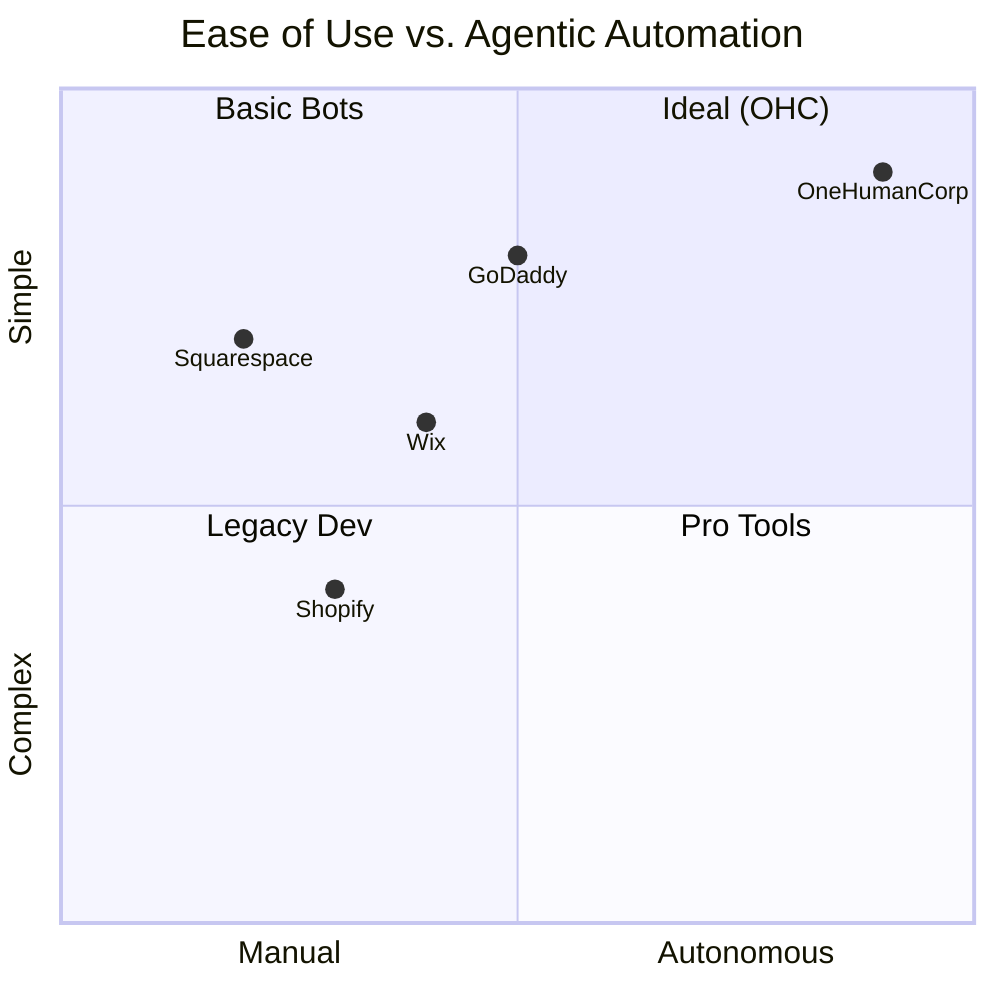
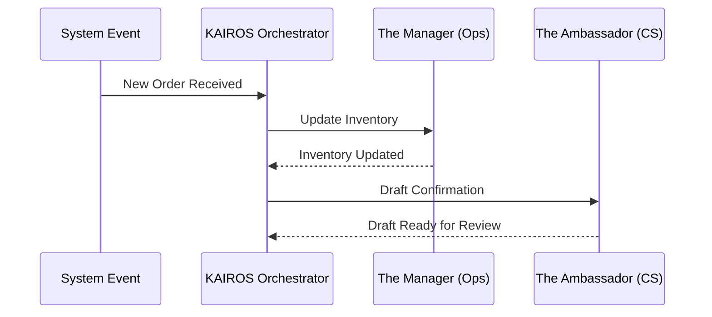

# Autonomous AI Background Agents & Market Research Report

## 1. Deep Competitor Audit

### Shopify
- **Onboarding Flow:** 30-60 min setup. Geared towards existing catalogs.
- **AI Features:** Shopify Sidekick (Chatbot-style, reactive). Not true autonomous agents.
- **Mobile App:** Strong for store management, poor for initial setup.
- **Pricing:** No meaningful free tier.
- **User Complaints:** "Overwhelming for beginners", "App ecosystem is too expensive", "Theme customization requires coding knowledge".

### Wix
- **Onboarding Flow:** 20-40 min. Question-based ADI (Artificial Design Intelligence).
- **AI Features:** Wix ADI builds the initial site, but offers limited post-launch autonomous operations.
- **Mobile App:** Basic editing capabilities.
- **Pricing:** Has a limited free tier, but forces Wix branding.
- **User Complaints:** "Site speed is slow", "Template lock-in", "Mobile editor is frustrating".

### Squarespace
- **Onboarding Flow:** 30-60 min. Template driven.
- **AI Features:** Very limited. Focuses heavily on manual aesthetic curation.
- **Mobile App:** Good for analytics, limited for design.
- **Pricing:** No free tier.
- **User Complaints:** "No true auto-save", "E-commerce features feel secondary to design", "SEO tools are basic".

### GoDaddy
- **Onboarding Flow:** 20-40 min. Fast but shallow.
- **AI Features:** GoDaddy Airo generates initial branding/site, but lacks ongoing agentic support.
- **Mobile App:** Basic functionality.
- **Pricing:** Aggressive upselling.
- **User Complaints:** "Hidden fees", "Very limited customization", "Poor customer service".

## 2. Top 10 SMB Pain Points (From App Stores & Forums)
1. **Initial Setup Confusion:** Platforms assume prior e-commerce knowledge. (Competitor gap: Shopify)
2. **Hidden Costs/App Fatigue:** Users need 5+ apps to run basic operations. (Competitor gap: Shopify/Wix)
3. **Mobile Setup Constraints:** Can manage but cannot *build* entirely from a phone. (Competitor gap: All)
4. **Inventory Sync Headaches:** Physical vs. digital tracking is manual.
5. **Customer Support Drain:** Answering the same DMs/emails takes hours daily. (Competitor gap: All)
6. **Marketing Paralysis:** Don't know what to post or how to run ads.
7. **SEO Complexity:** "I built it, but no one is visiting."
8. **Fragmented Booking Systems:** Using separate tools for calendar and payments.
9. **Lack of Actionable Insights:** Dashboards show data, not *what to do next*.
10. **Design Overwhelm:** Blank canvas syndrome when choosing templates.

## 3. OHC AI Differentiation Manifesto

OHC treats AI as infrastructure, not an add-on. We will implement these 5 autonomous automations first:
1. **The Ambassador (Auto-Replies):** Automatically drafts replies to customer DMs and emails based on business context (saves 2+ hours/day).
2. **The Promoter (Auto-Social):** Generates and schedules social media posts using product inventory data.
3. **The Advisor (Actionable Insights):** Weekly plain-language reports ("Vegan cakes are trending, add a new flavor").
4. **The Manager (Inventory Alerts):** Proactively warns when stock is low or automatically hides sold-out items.
5. **The Architect (Continuous SEO):** Automatically updates metadata and alt-tags as new products are added.

*Evidence:* Users actively complain about the mental load of marketing and customer service. Automating these provides immediate, measurable ROI.

## 4. Market Sizing & Strategic Direction
- **TAM:** ~33 million small businesses in the US alone. Globally, ~400 million. Over 30% lack a functional online presence.
- **Beachhead Market:** *The Service-Based Solo-preneur (e.g., Leo the Tutor, Carlos the Handyman).* They are underserved by Shopify (which focuses on physical goods) and find Wix too heavy. They need simple booking + payments.
- **Expansion Strategy:** After establishing dominance in the service sector, expand to local food (Fatima) and micro-retail (Priya).
- **Geographic Priority:** English-first, followed by Spanish (LATAM/US Hispanic market) due to high entrepreneurial density.

## 5. Feature Gap Matrix

| Feature | Shopify | Wix | OHC (Current) | OHC (Advantage/Gap) |
|---|---|---|---|---|
| **Setup Time** | 30-60 min | 20-40 min | < 10 min | **Advantage:** Mobile-first fast setup |
| **Autonomous AI** | Reactive (Sidekick)| Setup only (ADI)| Multi-Agent Swarm | **Advantage:** True background agents |
| **Booking & Services**| Requires App | Complex | Built-in | **Advantage:** Native calendar sync |
| **Mobile-First Build**| No | Partial | Yes (375px native)| **Advantage:** Build entirely on phone |
| **Free Tier** | No | Branded | Yes (Useful) | **Advantage:** Low barrier to entry |
| **Marketplace Integrations**| Strong | Medium | Growing | *Gap:* Need robust 3rd party API ecosystem |

---

## Architectural Visualizations

### Competitive Landscape

### AI Department Interaction Flow

