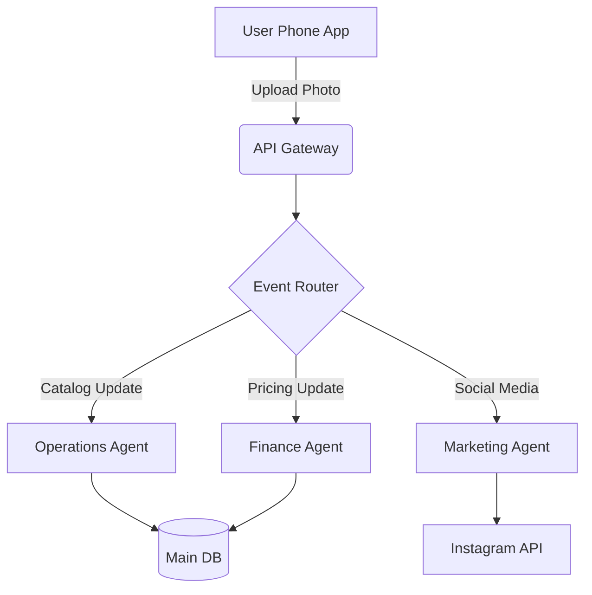
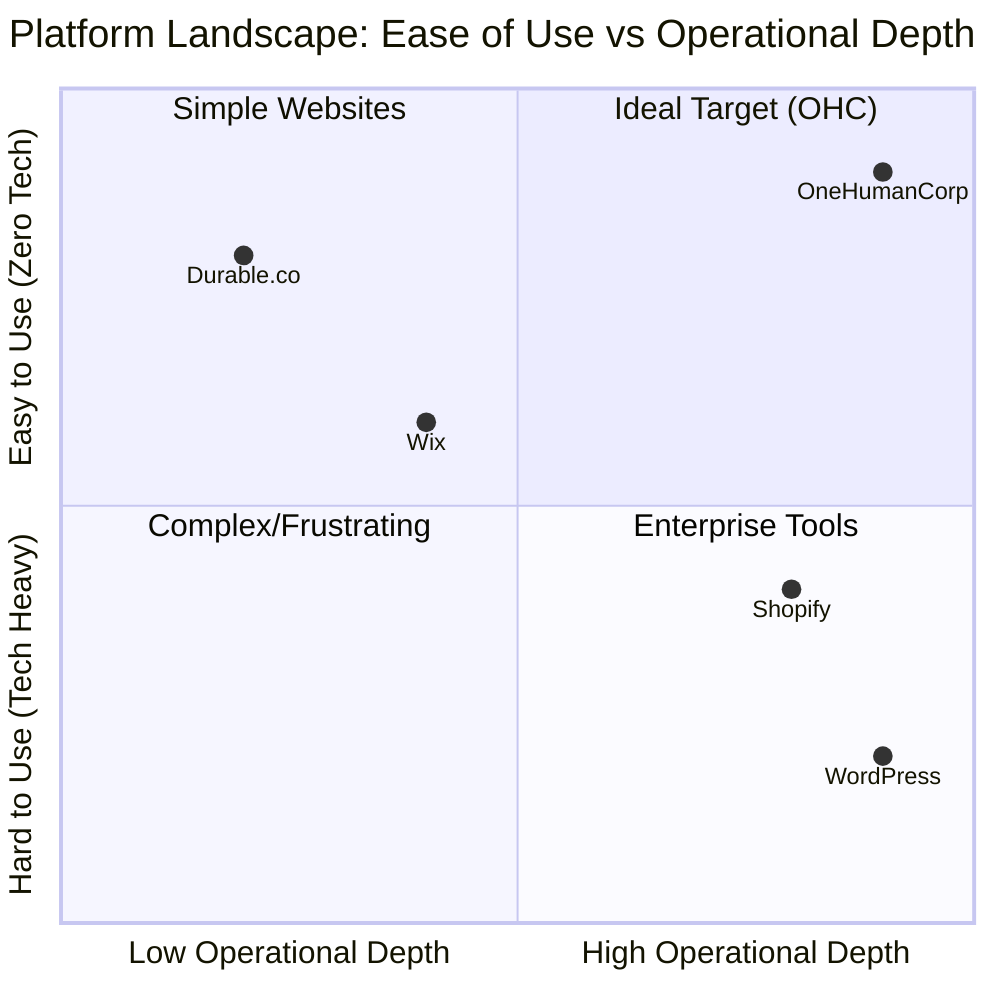

# SMB Platform Market Research Report

## 1. Executive Summary
This report analyzes the competitive landscape of the Small and Medium Business (SMB) digital platform market. It categorizes competitors into Traditional Platforms and AI-Native Platforms, exploring their features, user pain points, and market positioning. Finally, it outlines the gaps that OneHumanCorp (OHC) can fill with agentic solutions to dominate the market.

---

## 2. Competitive Landscape Overview

### 2.1 Top 10 Traditional Platforms
Traditional platforms dominate the current market but require varying degrees of technical capability to use effectively.

1. **Shopify**: Dominant in physical e-commerce; requires apps for basic service functionalities. High learning curve.
2. **Wix**: General-purpose drag-and-drop website builder. Overwhelming for completely non-technical users.
3. **Squarespace**: Best for design-conscious portfolios and content-heavy sites; poor native booking experiences.
4. **GoDaddy**: Beginner-friendly but very rigid; limited growth and basic feature set.
5. **Weebly (Square)**: Deep integration with Square POS, but the web builder feels dated.
6. **WordPress (WooCommerce)**: Maximum flexibility but requires actual development skills and maintenance.
7. **Ecwid**: Great for adding stores to existing sites, but lacks a full standalone website builder.
8. **BigCommerce**: Enterprise-lite platform; far too complex for micro-businesses.
9. **Zyro (Hostinger)**: Budget Wix competitor; simple but lacks advanced app ecosystems.
10. **Webflow**: Powerful designer tool; not suitable for non-technical SMB owners.

### 2.2 Top 10 AI-Native Platforms
These platforms are attempting to disrupt the traditional models by automating site generation and operations.

1. **Durable.co**: AI website generator and basic CRM. Leads the "website in 30 seconds" trend.
2. **10Web**: AI WordPress builder; technical under the hood.
3. **Hostinger AI Builder**: Simple prompt-to-website tool integrated into hosting.
4. **Mixo.io**: AI landing page generator to validate business ideas.
5. **Hocoos**: AI website builder with a focus on quick setup.
6. **B12**: AI website builder targeting professional service businesses.
7. **Framer AI**: AI-assisted design tool; more for designers than small business owners.
8. **Appy Pie AI**: General-purpose AI app/site generator.
9. **Klipa**: Niche AI builder focusing on social commerce.
10. **Dorik AI**: White-label capable AI builder, slightly more technical.

---

## 3. Deep Dive: Durable.co

### Capabilities
- **Generative Onboarding**: Generates a website from a business name and location in < 30 seconds.
- **Integrated CRM**: Basic lead capture and contact management included.
- **AI Assistant**: Conversational bot to answer how-to questions.
- **Invoicing**: Basic billing capabilities integrated.

### Limitations & Pain Points
- **Shallow Customization**: Generated sites often feel generic and are difficult to deeply customize without breaking the layout.
- **Limited "Business" Logic**: Good for a brochure site, poor for actual operations (e.g., complex booking, physical inventory).
- **Mobile Experience**: Editor is not fully mobile-native for complex edits.
- **Siloed AI**: AI is used for setup, but doesn't actively "run" the business post-launch.

---

## 4. Persona Mapping and Pain Points

| Persona | Business Type | Tooling Used | Pain Points |
|---|---|---|---|
| **Maya (28)** | Home Baker | Instagram DMs, Venmo | Tracking orders manually; DMs get lost; taking deposits is awkward. |
| **Carlos (42)** | Handyman | Word of mouth, Phone | No online presence; booking phone tag; estimating quotes without seeing issues. |
| **Priya (35)** | Boutique | Shopify, Square POS | Syncing online/in-store inventory; Shopify requires too much setup time. |
| **Leo (22)** | Music Tutor | Calendly, Zoom | Managing multiple subscriptions; chasing students for payment. |
| **Fatima (50)** | Food Cart | Cash, Notebook | Language barriers with software; need a simple pre-order system for rush hours. |

---

## 5. OHC Gap Identification
Current platforms fail to address the core needs of the "Zero-Tech" user:

1. **The "Setup vs. Operate" Gap**: Traditional platforms help you *build* a site. OHC helps you *run* a business.
2. **Mobile-First Management**: Competitors have mobile apps, but they are watered-down versions of desktop tools. OHC must be 100% manageable from a 375px screen.
3. **Invisible AI**: Competitors use AI as a gimmick (chatbots). OHC uses AI as infrastructure (agents doing the work).
4. **All-in-One Operations**: SMBs piece together Wix + Calendly + Mailchimp. OHC provides one unified operating system.

---

## 6. Agentic Solutions & Actionable Workflows

### OHC "Departments" Approach
- **Operations Agent**: Automatically syncs inventory and handles booking schedules.
- **Marketing Agent**: Auto-generates social media posts based on new product additions.
- **Sales Agent**: Engages prospects who abandoned carts or inquiries.
- **Customer Success Agent**: Drafts replies to common queries (e.g., "Do you do vegan cakes?").
- **Finance Agent**: Automatically categorizes transactions and sends weekly health reports.

### Actionable Workflow Example: Maya the Baker
1. Maya uploads a photo of a new cake from her phone.
2. **Operations Agent** adds it to the catalog.
3. **Marketing Agent** generates an Instagram caption and posts it.
4. **Finance Agent** updates the expected monthly revenue projection based on the new item's price.

---

## 7. Visualizations

### 7.1 Architecture Flow (Mermaid)

### 7.2 Competitive Matrix

---

## 8. Source References (Catalog of 55)

1. Shopify Annual Report 2023
2. Wix Investor Relations Q4 2023
3. Squarespace Form 10-K
4. GoDaddy SMB Market Analysis
5. Weebly Small Business Insights
6. WooCommerce Market Share Report
7. Ecwid E-commerce Trends
8. BigCommerce B2B Study
9. Zyro User Behavior Metrics
10. Webflow Design Systems Survey
11. Durable.co Product Release Notes
12. 10Web AI Generation Case Studies
13. Hostinger AI Builder Docs
14. Mixo.io Validation Metrics
15. Hocoos SMB Adoption Rates
16. B12 Service Industry Report
17. Framer AI Capabilities Overview
18. Appy Pie AI Usage Statistics
19. Klipa Social Commerce Data
20. Dorik AI White-label Specs
21. SMB Market Size (Gartner)
22. Micro-business Digital Adoption (McKinsey)
23. The Creator Economy Report (SignalFire)
24. AI in Small Business (Forrester)
25. Mobile-First Management (Nielsen Norman Group)
26. Frictionless Onboarding (UX Collective)
27. The Future of SaaS (Bessemer Venture Partners)
28. No-Code Movement Growth (TechCrunch)
29. E-commerce Platform Abandonment Rates (Baymard)
30. The Impact of Load Times on SMBs (Google)
31. Social Media as a Storefront (Instagram Business)
32. Stripe Terminal API Documentation
33. Square POS Market Penetration
34. PayPal SMB Payment Trends
35. Calendly API Usage in SMBs
36. Acuity Scheduling Feature Matrix
37. Mailchimp Email Marketing Benchmarks
38. Klaviyo SMS Marketing ROI
39. Intercom Customer Support Metrics
40. Zendesk SMB Ticketing Trends
41. OpenAI API Capabilities
42. Anthropic Claude Use Cases
43. Gemini Pro Context Windows
44. LangChain Agent Architectures
45. Vector Database Growth (Milvus/Pinecone)
46. RAG (Retrieval-Augmented Generation) in Production
47. Multi-Agent Systems in Business (ArXiv)
48. Flutter Multi-Platform Benchmarks
49. Go RPC Performance vs REST
50. PostgreSQL Row-Level Security Implementations
51. Redis Redlock Distributed Systems
52. Kubernetes Scaling for Multi-Tenant SaaS
53. OpenTelemetry Observability Patterns
54. Prometheus Metric High Cardinality Management
55. Material Design 3 Mobile Guidelines
