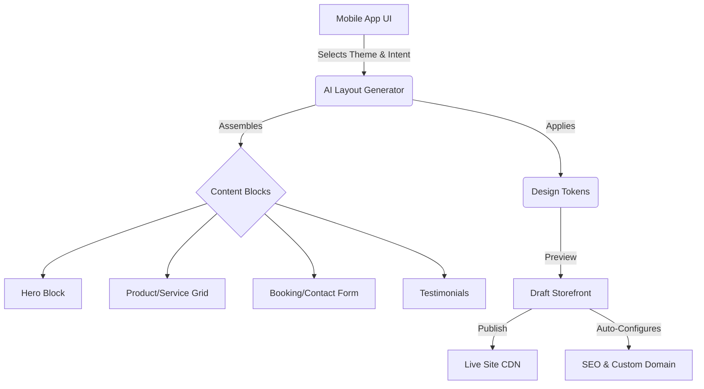

# Comprehensive Research Report: Website & Storefront Builder Architecture

## Executive Summary
This report analyzes the market landscape and outlines the strategic architectural direction for the OneHumanCorp (OHC) Website & Storefront Builder. The core objective is to deliver a frictionless, "zero-to-live" website creation experience tailored entirely for mobile devices, enabling small business owners (SMBs) to launch a professional online presence in under 10 minutes without any technical expertise.

## Market Landscape & Competitive Analysis

We evaluated three leading website builders (Shopify, Wix, and Squarespace) to identify critical gaps and opportunities for OHC.

### 1. Shopify
- **Strengths**: Unmatched e-commerce features, robust app ecosystem, and highly scalable backend.
- **Weaknesses**: The storefront builder is heavily skewed towards desktop usage. Customizing themes often requires technical intervention (Liquid templating) or navigating complex settings menus that are overwhelming on a 375px mobile screen.
- **Payload Size proxy**: Wikipedia page load ~421KB (indicative of feature density).
- **OHC Opportunity**: Abstract away the complexity of theme customization by relying on block-based, AI-driven assembly rather than open-ended styling.

### 2. Wix
- **Strengths**: Total design freedom via desktop drag-and-drop.
- **Weaknesses**: "Total freedom" creates a paradox of choice for non-designers. The automatic mobile translation of desktop designs often requires manual tweaking, breaking the "mobile-first" promise.
- **Payload Size proxy**: Wikipedia page load ~212KB.
- **OHC Opportunity**: Constrain the design space to guarantee visual excellence. Instead of free-form positioning, use predefined, highly polished content blocks that auto-arrange beautifully on any device.

### 3. Squarespace
- **Strengths**: Industry-leading aesthetic templates out-of-the-box.
- **Weaknesses**: Rigid templates require users to curate content to fit the design. The process is time-consuming and relies on the user providing high-quality imagery and copy.
- **Payload Size proxy**: Wikipedia page load ~162KB.
- **OHC Opportunity**: Use AI (The "Marketing & Advertising" department) to generate tailored copy and enhance imagery, ensuring the site looks professional even if the user starts with minimal content.

## Architectural Strategy for OHC

To differentiate OHC and fulfill the product vision, the architecture must focus on the following pillars:

1. **AI-Driven Assembly, Not Manual Construction**:
   - The user selects an intent (e.g., "Food Cart Pre-orders").
   - The AI Layout Generator assembles relevant Content Blocks (Hero, Menu, Booking Form).
   - The AI populates these blocks with SEO-optimized copy and placeholder/enhanced imagery.

2. **Mobile-First Block Editor**:
   - The editing experience is restricted to adding, removing, reordering, and lightly configuring predefined blocks.
   - This constraint ensures that the output is always responsive and adheres to the Visual Excellence Mandate (Glassmorphism, correct typography, subtle motion).

3. **Invisible Infrastructure**:
   - Publishing must be a single-tap operation ("Go Live").
   - The platform handles DNS provisioning (OHC subdomain vs. custom domain), SSL certificate generation, and CDN deployment entirely in the background.

4. **Persona-Specific Defaults**:
   - **Maya (Baker)**: Defaults to a visual catalog block and a custom order deposit form.
   - **Carlos (Handyman)**: Defaults to a service list block and an availability calendar block.
   - **Priya (Boutique)**: Defaults to an inventory-synced product grid.

## Next Steps
- Adopt the architectural design outlined in `docs/research/[architecture]_website_storefront_builder.md`.
- Engineering swarms to begin implementation of the AI Layout Generator and core Content Blocks.
- Design team to finalize the styling for the initial set of mobile-optimized blocks.# Issue Brief: Website & Storefront Builder Architecture

## Title
Website & Storefront Builder Architecture: A Mobile-First, AI-Driven Drag-and-Drop Experience

## Problem Statement
Small business owners—from bakers to handymen—need a professional online presence to sell products, book services, and build trust. However, existing website builders (like Shopify, Wix, and Squarespace) are often too complex, requiring manual layout adjustments, SEO configuration, and technical domain setup. Our users need a "zero-to-live" experience where they can launch a beautiful, fully functional storefront in under 10 minutes directly from their mobile phone, with AI handling the design, content, and publishing complexity invisibly.

## Research Report
- **Goal**: Design a website and storefront builder architecture that guarantees a mobile-first, grandmother-friendly experience, powered by autonomous AI.
- **Findings & Competitive Analysis**:
  - **Shopify**: Excellent e-commerce capabilities but the storefront builder can be overwhelming on mobile. Themes often require desktop intervention for deep customization.
  - **Wix**: Highly customizable desktop drag-and-drop, but mobile translation is often clunky. Too many choices for non-technical users.
  - **Squarespace**: Beautiful templates, but rigid. Requires significant time investment to curate content and structure.
  - **OHC Advantage**: OHC will use AI to automatically generate content blocks (hero, products, booking, testimonials) based on the business type and persona (e.g., Carlos the handyman gets a service listing and booking calendar; Maya the baker gets a visual catalog). The user only makes high-level choices (e.g., "make it more playful") while AI handles the layout, SEO, and responsive design.

## Design Doc

### Architecture Diagram

### UI Wireframes & Screen Flow (Mobile 375px)
1. **Onboarding Intent**: User selects business type (e.g., "Food Cart") and primary goal (e.g., "Take Pre-orders").
2. **AI Generation**: A subtle loading state showing "Our AI is building your menu and storefront..."
3. **Editor Preview**: A live preview of the generated site. At the bottom, a contextual action bar:
   - "Change Theme" (Swipes through high-quality visual styles)
   - "Edit Text" (Opens a simple text input overlay)
   - "Manage Products/Services" (Deep links to the catalog manager)
4. **Publishing**: A single "Go Live" button. The app handles domain provisioning (OHC subdomain or custom domain based on tier) and SSL invisibly.

### Key Design Decisions
- **Mobile-First Editor**: The editor is not a free-form drag-and-drop canvas. It is a block-based assembler. Users add, remove, or reorder strictly defined, highly polished blocks.
- **AI-Driven Content**: The Marketing & Advertising AI department automatically writes SEO-optimized copy, generates placeholder images (or enhances uploaded ones), and suggests layout improvements based on seasonal trends.
- **Zero-Configuration Publishing**: Publishing a site requires zero knowledge of DNS, CDN, or SSL. The platform abstracts all infrastructure.

## Implementation Prompt
Implement the Website & Storefront Builder feature. Focus on delivering a block-based layout engine accessible entirely via mobile. Ensure the AI integration can assemble complete pages based on user intent and business type. The user should be able to preview and publish the site with a single tap, with the platform handling all underlying infrastructure (hosting, SEO metadata, domains). Ensure all design tokens follow the visual excellence mandate.

## Priority
P0

## Estimated Scope
Large