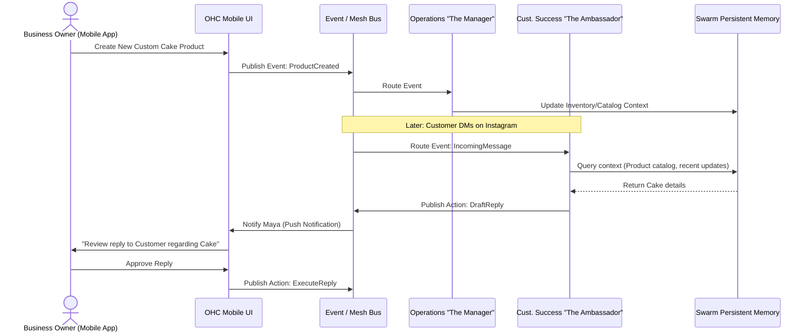

# [Architecture] AI Agent Department Architecture

## Problem Statement
Small business owners—like Maya the baker, Carlos the handyman, and Fatima the food cart operator—face cognitive overload when dealing with the operational complexities of running a business. They shouldn't need to understand complex automation flows, AI prompt engineering, or job queues. They think in terms of business roles: "I need someone to manage orders," "I need someone to promote my stuff," or "I need an accountant."

Currently, our platform capabilities (like generating website copy or handling custom bookings) exist, but they lack a cohesive, understandable structure that maps directly to the mental model of a non-technical small business owner. Without a clear "Department" metaphor, AI capabilities feel disjointed, technical, and overwhelming rather than supportive and invisible.

## Research Report
**Market Analysis:**
- **Shopify / Wix / Squarespace:** Offer disjointed "AI features" (e.g., an AI copywriter for product descriptions, or an AI chatbot app you have to install separately). They don't offer an integrated "staff" that manages the business holistically.
- **GoDaddy:** Focuses on single-purpose AI setup wizards but lacks ongoing, proactive business management.
- **OHC's Opportunity:** By organizing AI agents into familiar "Departments" (The Manager, The Promoter, The Salesperson, The Ambassador, The Accountant, The Protector, The Advisor), we abstract away the technical "how" (LLMs, vector DBs, cron jobs) and deliver the business "what" (operations, marketing, finance). This aligns perfectly with our vision of a "Hybrid Agentic OS" where agents work invisibly in the background.

**User Pain Points Addressed:**
- **Maya (Baker):** Overwhelmed by DMs while baking. Needs "The Customer Success Ambassador" to handle initial inquiries and "The Manager" to track custom order deposits.
- **Carlos (Handyman):** Forgets to follow up on quotes. Needs "The Salesperson" to automatically nudge leads.
- **Fatima (Food Cart):** Doesn't speak English well. Needs "The Manager" to translate pre-orders seamlessly and notify her in Arabic.

## Design Doc

### Key Architectural Concepts
1. **Department Isolation & Specialization:** Each AI Department is a specialized domain of logic. They listen to specific events, have access to specific context, and perform specific actions.
2. **Event-Driven & Scheduled Triggers:** Departments aren't just chatbots; they act proactively based on system events (e.g., "New Order Created") or schedules (e.g., "Weekly Health Check").
3. **Approval Workflows:** Actions have risk profiles. A low-risk action (replying to a basic FAQ) can be `AutoExecute`. A high-risk action (issuing a refund, sending a mass email) requires `DraftForReview` by the business owner.
4. **Shared Swarm Memory:** Departments share a persistent memory context. If "The Promoter" runs an Instagram campaign, "The Ambassador" knows about it when a customer asks a question.

### Architecture Diagram

### Mobile UX Flows
- **The Dashboard (375px):** A unified feed of "Department Updates." Instead of raw notifications, Maya sees:
  - 🟢 **The Manager:** "3 new custom cake orders confirmed."
  - 🟡 **The Ambassador:** "Drafted 2 replies to Instagram DMs. Tap to review."
  - 🔵 **The Advisor:** "Weekly insight: Vegan cakes are trending locally."
- **Action Approval Flow:**
  - Push notification arrives: "The Ambassador drafted a response to Sarah."
  - Maya taps notification.
  - Screen displays Sarah's original message and the AI's proposed reply.
  - Large, thumb-friendly buttons at the bottom: **[Send]** **[Edit]** **[Discard]**
- **Settings & Throttling:** Simple sliders. "How much autonomy should The Ambassador have?" (Strictly Drafts <-> Fully Autonomous).

### Key Design Decisions
- **Decision:** Use a semantic event bus for inter-department communication instead of direct RPC.
  - **Why:** Ensures loose coupling. If we add a new department (e.g., HR), it just subscribes to the bus without changing existing departments.
- **Decision:** Implement Risk-Based Approvals (AutoExecute vs. DraftForReview).
  - **Why:** Builds trust. Owners won't use the system if they fear the AI will make a costly mistake (like an accidental refund).
- **Decision:** Mobile-first unified feed.
  - **Why:** Owners check their phones on the go. They need an aggregated view of "What is my staff doing right now?" not a scattered list of logs.

## Implementation Prompt
**For the Implementer Agent:**
Implement the foundational event-driven infrastructure for AI Departments.
- You must create the core interfaces that allow a Department (e.g., `Operations`, `CustomerSuccess`) to subscribe to business events, query shared context, and propose actions.
- Implement the `DraftForReview` vs `AutoExecute` approval routing mechanism.
- Ensure that the resulting UI for reviewing drafted actions is mobile-first, utilizing OHC premium CSS tokens (Glassmorphism, Outfit/Inter typography).
- The user journey must allow a business owner to view a drafted action from a Department on their mobile device and approve it with a single tap.
- Do NOT prescribe the specific underlying message broker (e.g., Redis, RabbitMQ) or the LLM integration layer; focus on the business logic, event definitions, and the approval UX flow.

## Priority
**P0 (Critical)** - This is the core operating system architecture that differentiates OHC from standard website builders.

## Estimated Scope
**Large** - Requires foundational event bus scaffolding, state management for approvals, and mobile UI implementation.

