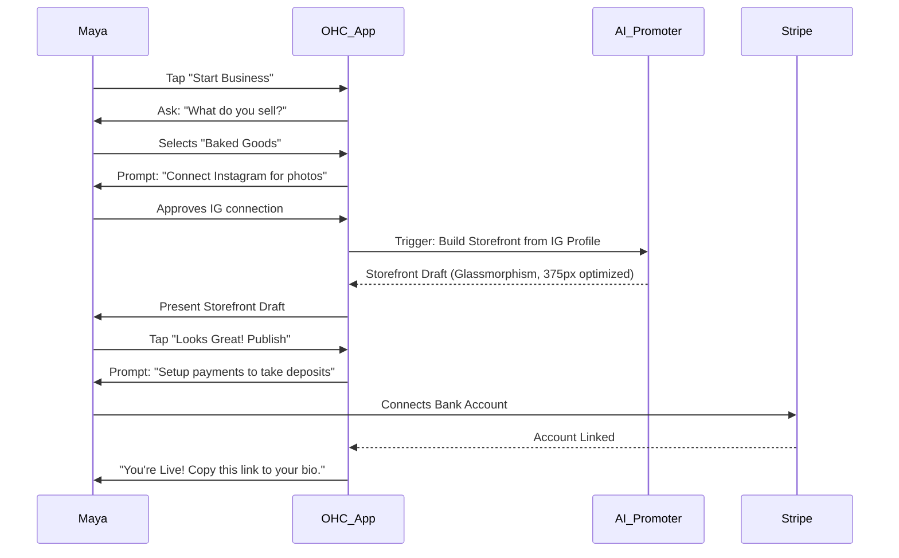
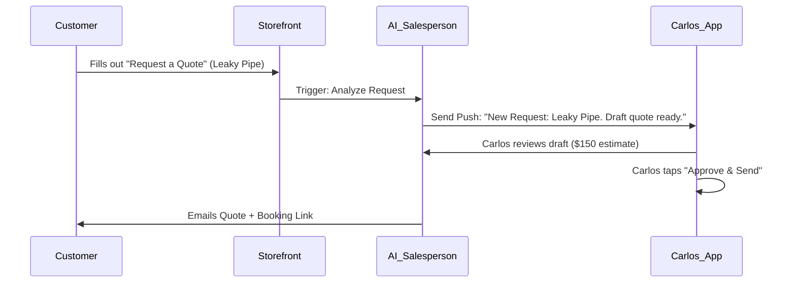

# OHC Business Journey Architecture Research Report

## 1. Problem Statement
Small business owners—from bakers to handymen to food cart operators—frequently abandon existing platforms (like Shopify, Wix, or Squarespace) because the journey from initial sign-up to a fully functioning, money-making business is too complex, fragmented, and technical. These platforms are designed for e-commerce administrators, not craftspeople. There is a critical need to map out and streamline the end-to-end business journey for our core personas, identifying friction points and designing a "zero to live in 10 minutes" experience that leverages our AI agents invisibly.

## 2. Research Report
Based on user personas and competitive analysis:
- **Shopify/Wix/Squarespace:** The onboarding flow requires manual configuration of shipping, taxes, complex storefront design on a desktop, and manual product entry. It takes hours or days.
- **User Pain Points:** Users like Maya (Baker) and Carlos (Handyman) get stuck on design paralysis, setting up integrations (calendars, forms), and managing post-launch marketing.
- **Opportunity:** OHC can differentiate by offering a completely guided, AI-driven, mobile-first onboarding where the system *interviews* the user and builds the business infrastructure for them, then continues to act as a proactive partner across the activation, retention, and revenue phases.

## 3. Design Doc: Business Journey Maps

### 3.1 Overall Journey Stages
1.  **Acquisition:** How the user discovers OHC.
2.  **Onboarding:** The "Zero to Live in 10 Minutes" flow.
3.  **Activation:** The first successful transaction or key engagement metric.
4.  **Retention:** What keeps the user coming back to the OHC app daily.
5.  **Revenue & Upgrades:** Transitioning from free to paid tiers based on value.
6.  **Referral:** The viral loop of recommending OHC.

### 3.2 Persona Journey: Maya the Baker (Physical Products / Custom Orders)

**Acquisition:**
- Discovers OHC via an Instagram ad showing a baker managing custom orders entirely from an iPhone.
- Landing Page CTA: "Start selling your cakes in 5 minutes. No computer needed."

**Onboarding (Mobile-First AI Interview):**
- **Step 1:** "What's the name of your business?" (Input: Maya's Cakes)
- **Step 2:** "What do you sell?" (Select: Baked Goods / Custom Orders)
- **Step 3:** "Connect your Instagram to import your best photos." (OAuth flow)
- **Step 4:** AI Promoter Agent instantly generates a storefront using imported photos.
- **Step 5:** "Connect a bank account to receive deposits." (Stripe Connect flow)
- *Result:* Live storefront with a custom order form + deposit payment integration. Time elapsed: < 8 minutes.

**Activation:**
- Maya shares her new OHC link in her Instagram bio.
- **Aha Moment:** She receives her first custom order request with a pre-paid $50 deposit.

**Retention (Daily Use):**
- **Morning Check-in:** Push notification from the Operations Agent: "You have 3 cake orders due this weekend."
- **Ongoing:** The Customer Success Agent drafts replies to Instagram DMs ("Yes, we do vegan! Here is the order link..."), which Maya approves with one tap.

**Revenue & Upgrades:**
- Maya hits her 100th AI action limit on the Free tier.
- Prompt: "Your AI assistants are working hard! Upgrade to Starter ($9/mo) to unlock 1,000 more actions and a custom domain."

**Referral:**
- Maya loves the system. OHC provides a "Give a month, get a month" referral link that she shares in a Facebook group for local bakers.

#### Mermaid Sequence: Maya's Onboarding

### 3.3 Persona Journey: Carlos the Handyman (Services & Bookings)

**Acquisition:**
- Word of mouth from another contractor, or searching Google for "easy way to accept handyman payments".

**Onboarding:**
- Enters basic services ("Plumbing, Painting").
- Connects Google Calendar to sync availability.
- AI generates a clean service listing page with a booking widget.

**Activation:**
- First customer books a time slot and pays a deposit.

**Retention:**
- Uses the OHC app inbox to view lead inquiries. AI Salesperson Agent auto-drafts quotes based on customer problem descriptions.

**Revenue & Upgrades:**
- Upgrades to Business tier when he starts hiring subcontractors and needs advanced calendar features.

#### Mermaid Sequence: Carlos's Lead Flow

### 3.4 Friction Points & Mitigation (Crucial Design Decisions)
- **Friction:** Designing the site.
  - *Mitigation:* Zero manual design required initially. AI pulls from existing social profiles or prompts for 3 basic inputs to generate a beautiful, premium (Glassmorphism) site.
- **Friction:** Writing copy.
  - *Mitigation:* The AI Promoter handles all copywriting based on brief keywords.
- **Friction:** Setting up complex shipping/taxes.
  - *Mitigation:* Defer complexity. Ask for a flat rate or default to "pickup/local delivery" until the first actual out-of-state order occurs.
- **Friction:** Connecting payments.
  - *Mitigation:* Must be integrated into the core onboarding wizard, not hidden in a settings menu.

## 4. Implementation Prompt
Implement the initial mobile-first AI Onboarding Wizard (the "Zero to Live" flow). The wizard should be a guided, chat-like interface (or very simple sequential screens) that asks the user for their business name, category, and preferred style, and then triggers the `AI_Promoter` agent to generate a draft storefront structure in the database. Ensure the UI adheres to the OHC Premium Token library (Glassmorphism, 375px constraints).

## 5. Priority
P0

## 6. Estimated Scope
Large
