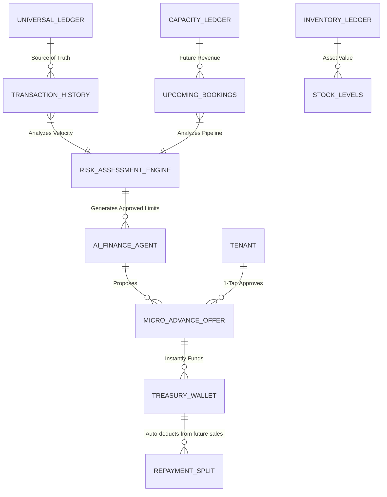

# Issue Brief: Autonomous Working Capital & Micro-Advance Engine

## Title
Autonomous Working Capital & Micro-Advance Engine

## Problem Statement
Small business owners—particularly those dealing with physical inventory like Fatima (food cart) or Maya (baker)—suffer from brutal cash flow crunches. They often need to purchase raw materials or equipment *before* they get paid by their customers. Traditional bank loans or credit cards are slow, require complex applications, demand high credit scores, and charge predatory interest rates. Current platforms like Shopify Capital or Square Loans exist, but they are often opaque, require separate applications, or are only offered to top-tier merchants based on trailing 6-12 month revenue. They lack real-time, context-aware micro-advances. If Fatima needs $300 *today* to buy extra inventory for a weekend festival she just got accepted into, she has no integrated, instant way to leverage her future sales or existing ledger history to secure that capital autonomously and seamlessly within the app.

## Research Report
*   **Current Architecture Limits:** OHC tracks revenue and handles instant payouts via the `Autonomous Treasury & Instant Payout Wallet`, but it does not proactively offer credit or advances based on upcoming bookings or historical sales velocity.
*   **Competitor Analysis:**
    *   *Shopify Capital / Square Loans / Stripe Capital:* Industry leaders in embedded finance. They offer loans based on transaction history, repaid as a percentage of daily sales. However, the offers are often batched/pre-computed offline and presented as static dashboard banners. They are not highly contextual or conversational.
    *   *Wix / Squarespace:* Basic integrations with third-party lenders, high friction.
*   **Gap Identified (The OHC Differentiator):** A real-time, AI-driven micro-advance system. Because OHC integrates the CRM, Calendar (future revenue), Inventory, and Ledger, the **Finance Agent** can autonomously detect a cash-flow gap (e.g., "Carlos has $2,000 in invoiced work scheduled next week, but only $150 in his Treasury wallet") and proactively offer a context-aware micro-advance (e.g., "$500 advance for materials, repaid automatically from next week's invoices") via a simple push notification and a 1-tap approval.

## Design Doc

### Architecture Diagram

### Mobile UX Flow (375px First)
1. **The Proactive Nudge (Contextual Trigger):** Carlos creates a $1,500 quote for a large basement repair job. The AI Finance Agent detects this is larger than his typical jobs and checks his Treasury balance.
2. **Push Notification:** "Need materials for the Smith job? Tap to access a $400 instant advance."
3. **The Offer Card (Translucent Glass UI):** Carlos taps the notification. A clean, frosted card appears.
    *   *Header:* "Material Advance: $400"
    *   *Terms (Plain Language):* "Get $400 in your wallet instantly. We'll automatically deduct 15% from your daily card sales until $420 (including a $20 flat fee) is repaid. No hidden interest."
    *   *Action:* A massive, thumb-friendly "Accept & Fund Wallet" button.
4. **Instant Funding:** Upon tapping, the $400 is immediately credited to his OHC Treasury Wallet, available to spend via his virtual/physical debit card.
5. **Invisible Repayment:** As Carlos completes jobs and processes payments through OHC, the system automatically routes 15% of the gross transaction to the repayment ledger until settled.

### AI Agent Integration Points
*   **Finance Department:** The core orchestrator. Continuously runs underwriting models in the background using the Universal Ledger. Formulates the flat-fee pricing and maximum safe advance limits.
*   **Operations Department:** Provides context. If Operations detects Maya just received a huge wholesale order for 500 cookies, it signals Finance that she might need capital for flour/butter immediately.
*   **Customer Success Department:** Handles inquiries if the user asks questions in the inbox like "How much do I still owe on my advance?"

### Key Design Decisions
*   **Contextual vs. Static:** Capital offers are triggered by business events (large quote sent, sudden spike in inventory demand) rather than just sitting statically on a dashboard.
*   **Flat Fee, No Interest:** To pass the Grandmother Test and adhere to transparent, ethical lending (and support Islamic finance principles / Halal loans where applicable for personas like Fatima), the engine uses a transparent flat fee rather than compounding APR.
*   **Zero-Friction Repayment:** Repayment is strictly through a percentage of future sales (split routing at the payment gateway level) to prevent the business owner from having to remember to make manual loan payments or worrying about defaulting on a slow month.

## Implementation Prompt
**To the Implementer Swarm:**
Implement the backend architecture for the "Autonomous Working Capital & Micro-Advance Engine."
Design the data models required to support underwriting based on the Universal Ledger and Capacity/Booking ledgers. Create a background worker (via the Job Queue) that periodically evaluates tenant risk and generates pre-approved `CreditLimit` entities.
Implement the API endpoints for the AI Finance Agent to generate a specific `MicroAdvanceOffer` contextualized to a recent business event (like a new large booking), and the endpoint for the merchant to accept the offer, which must transactionally credit their `TreasuryWallet` and establish a `RepaymentSplit` rule on their future payment processing events.
Do not integrate with a real external lending bank API yet; simulate the funding source internally. Ensure all data models strictly enforce multi-tenant Zero-Trust isolation. Focus on the state machine of the advance (Proposed -> Accepted -> Funded -> Repaying -> Settled).

## Priority
P1

## Estimated Scope
Large
