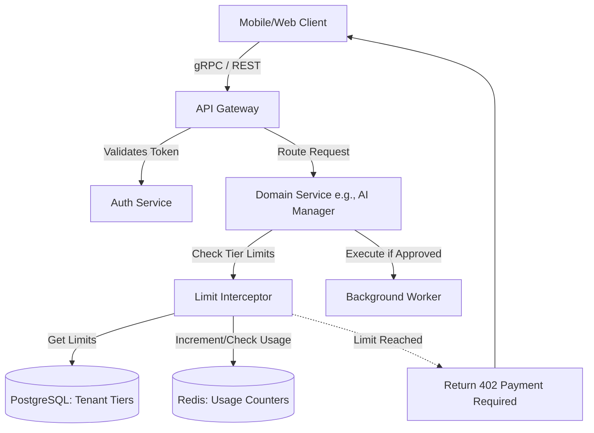

# Research Brief: SaaS Pricing Tier Architecture

## Problem Statement
Small business owners coming to OneHumanCorp (OHC) need a simple, clear, and transparent upgrade path as their business grows. The current multi-tenant architecture needs a robust design to enforce and manage these limits seamlessly, matching user expectations without overwhelming them with technical jargon. Competitor platforms (Shopify, Wix, Squarespace) offer a mix of tiered feature gating, seat limits, and credit models, but OHC aims to differentiate with an integrated "AI agents as employees" model. The challenge is designing a SaaS Tier architecture that transparently and efficiently limits features, AI agent usage, and resource consumption (storage/domains) while remaining purely mobile-first and intuitive.

## Research Report

### Competitive Analysis

| Platform | Entry Tier | Key Limit 1 | Key Limit 2 | Key Limit 3 | Notes |
| :--- | :--- | :--- | :--- | :--- | :--- |
| **Shopify** | Basic ($29/mo) | 2.9% + 30¢ online fee | Up to $5k credits | Millions of AI tokens | Focuses heavily on payment processing discounts at higher tiers. AI assistant (Sidekick) is included. |
| **Wix** | Light ($17/mo) | 2 collaborators | 2GB Storage | No Ecommerce | eCommerce is completely gated to the Core ($29/mo) plan and above. |
| **Squarespace**| Personal ($16/mo)| 2 contributors | No eCommerce | Basic Analytics | Like Wix, completely gates eCommerce to higher tiers (Business, $23/mo). |
| **OHC (Proposed)**| Free ($0/mo) | 10 Products | 1 AI Department | 100 Actions/mo | Offers useful free tier including eCommerce, differentiating strongly by letting anyone sell immediately. Limits are agent/product based. |

### Key Findings
1. **Competitor Gating is Binary**: Both Wix and Squarespace gate *commerce entirely* out of their entry-level plans. OHC's key differentiation is letting users sell on the *Free* tier (up to 10 products), radically lowering the barrier to entry for the "Maya" and "Fatima" personas.
2. **AI as the Scaling Metric**: Shopify includes its AI (Sidekick) broadly but focuses on transaction fees for scaling. OHC's model uses "AI Departments" and "AI Actions" as the primary scaling metrics. As a business grows, they "hire" more AI departments (Starter gets 3, Pro gets 10).
3. **Usage Throttling Needs to be Polite**: If a user hits the 100 AI actions/month limit on the Free tier, the app must gracefully degrade (e.g., "Operations Manager is resting until next month, or upgrade to Starter to keep them running") rather than abruptly throwing 403 errors to the end-user.

## Design Doc

### Architecture Overview

The Multi-Tenant SaaS Tier system relies on three core components:
1. **`TenantTierConfiguration`**: A structured PostgreSQL table storing the current tier definition limits.
2. **`TenantUsageCounters`**: Redis-backed counters tracking ephemeral usage (e.g., AI actions this month) flushed to Postgres for billing.
3. **`Enforcement Interceptors`**: gRPC interceptors and database triggers that validate actions against limits before execution.

#### Premium Mermaid.js Diagram

### Core Data Entities

1. **`tiers` Table**: Defines the plans.
   - `id`, `name` (Free, Starter, Pro, Business), `monthly_price`, `max_products`, `max_ai_departments`, `max_ai_actions_per_month`, `max_storage_mb`, `custom_domain_allowed`.
2. **`tenants` Table (Updated)**:
   - Add `current_tier_id` (FK to `tiers`).
   - Add `billing_period_start`, `billing_period_end`.
3. **`tenant_usage` Table**:
   - `tenant_id`, `ai_actions_count`, `storage_used_mb`, `products_count`, `billing_period_id`.

### AI Integration Points

- **The Advisor Agent (Business Advisory)**: Monitors the `tenant_usage` table. When a user approaches 80% of their AI action limit or product limit, the Advisor Agent proactively sends a polite, plain-language mobile notification: *"Hey Maya! Your Operations Agent has been working hard and is almost out of energy for this month. Want to upgrade to the Starter plan to keep things running smoothly?"*
- **The Protector Agent (Legal & Compliance)**: Automatically updates terms of service and billing agreements on the user's public storefront when they upgrade tiers and unlock new features.

### Mobile UX Flow
1. User hits a limit (e.g., tries to add an 11th product on the Free plan).
2. Instead of an error, a smooth bottom sheet (Glassmorphism design, Outfit font) slides up: *"You've reached your product limit for the Free plan! Upgrade to Starter to add 100 more products and unlock 2 new AI departments."*
3. The UI presents a clean, mobile-optimized comparison toggle (Monthly vs. Yearly).
4. Upgrade uses native mobile payment (Apple Pay / Google Pay via Stripe integration) for a 1-tap upgrade.

## Implementation Prompt

**Role:** Backend / UI Implementer

**Task:** Implement the SaaS Tier Enforcement and Upgrade Flow for OHC.

**User Journey (CUJ):**
As a Free tier user (e.g., Maya), I want to try adding an 11th product to my store. I should be intercepted by a beautiful mobile-first upgrade prompt explaining my limits. Upon upgrading to the "Starter" tier using a 1-tap payment, I should immediately be able to add my 11th product, and my AI Action limit should automatically increase from 100 to 1,000.

**Acceptance Criteria:**
1. **Backend**: Introduce the tier definitions (Free, Starter, Pro, Business) into the PostgreSQL schema.
2. **Backend**: Implement a gRPC interceptor or middleware that checks `max_products` and `max_ai_actions` against the tenant's current usage before allowing write operations.
3. **Backend**: Return a specific, structured error code (e.g., `RESOURCE_EXHAUSTED` with rich metadata) when a limit is reached.
4. **Frontend (Flutter/Slint)**: Catch the `RESOURCE_EXHAUSTED` error globally and trigger a reusable "Upgrade Tier" bottom sheet UI.
5. **Frontend**: The Upgrade UI must perfectly match the OHC Premium Token design system (Glassmorphism, 375px native constraints, no horizontal scrolling).
6. **Testing**: 100% unit test coverage for the limit enforcement logic. At least one E2E Playwright/Slint test asserting the full flow: login as Free user -> hit limit -> see upgrade UI -> upgrade mock -> successfully perform action.

**Constraints:**
- Do not hardcode limits in the application logic; read them from the database/tier configuration.
- Ensure all usage counters (especially AI actions) handle concurrency gracefully (e.g., using Redis INCR or Postgres atomic updates).

## Priority
**P0** (Critical) - Required before public launch to ensure revenue generation and prevent abuse.

## Estimated Scope
**Large** (Touches DB, API gateway, core logic, and frontend UI).
