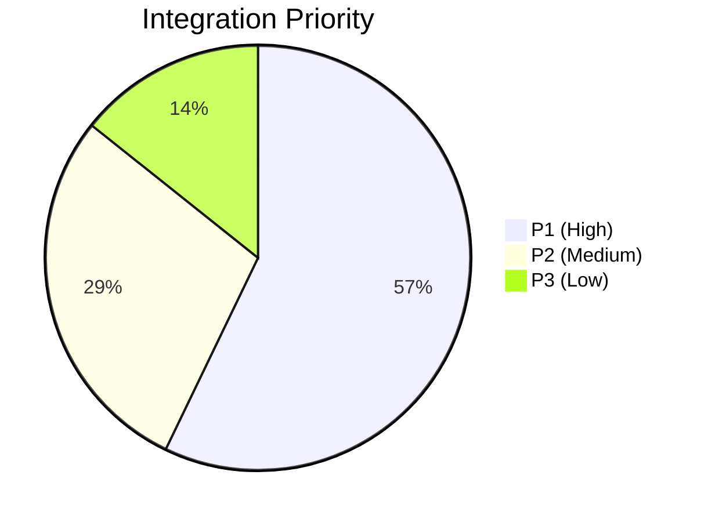

# 🔍 Scout: Tool Integration Research Report

## Executive Summary
This report evaluates new tool integrations across 7 categories to support small business owners. It focuses strictly on non-technical user experiences, addressing pain points, and avoiding implementation prescriptions.

| Category | Tool | Priority | Scope |
|---|---|---|---|
| Social Media | TikTok | P1 | Medium |
| Calendar | Outlook | P1 | Medium |
| Email | MailerLite | P2 | Small |
| Payment | Alipay | P3 | Large |
| Shipping | ShipStation | P1 | Medium |
| SMS | MessageBird | P2 | Small |
| Video | Daily.co | P1 | Medium |

---

## 1. Social Media Integration
**Title**: Unified Inbox View for TikTok Engagement
**Problem Statement**: Small business owners lose engagement because they can't manage TikTok comments alongside other channels. They need a single place to view and respond to their community.
**Research Report**:
- TikTok is critical for product discovery but fragmented for communication. Managing comments natively requires jumping between apps.
- **Advantages**: Consolidating comments into OHC saves time and prevents missed opportunities.
- **Risks**: Third-party social platform connection reliability varies.
- **Pricing**: Free tier expected.
- **Compatibility**: Cloud & Standalone.
**Design Doc**:
- Users navigate to "Operations" and select "Connect TikTok".
- They authorize the connection through a simple login screen.
- Incoming TikTok comments appear automatically in their OHC Unified Inbox alongside emails and other messages.
**Implementation Prompt**: Enable users to view and reply to TikTok comments directly from their existing OHC Unified Inbox without needing to manage API configurations.
**Priority**: P1
**Estimated Scope**: Medium

## 2. Calendar & Scheduling
**Title**: Seamless Appointment Booking via Outlook Sync
**Problem Statement**: Not all customers use Google. Users relying on Outlook need their availability to stay perfectly in sync to avoid double booking and unhappy clients.
**Research Report**:
- **Advantages**: Expands the addressable market to traditional enterprise and legacy users.
- **Risks**: Microsoft authentication flows can be confusing for end-users.
- **Pricing**: Free sync.
- **Compatibility**: Cloud & Standalone.
**Design Doc**:
- During setup, users choose "Connect Microsoft Calendar".
- Their public booking widget immediately reflects their busy times.
- New appointments booked via OHC appear on their phone's Outlook app.
**Implementation Prompt**: Provide a simple toggle to link an Outlook account so that availability is accurately reflected on the public booking page.
**Priority**: P1
**Estimated Scope**: Medium

## 3. Email Marketing
**Title**: Simple Customer Newsletters with MailerLite
**Problem Statement**: Traditional email tools are too complex and expensive for simple monthly updates. Users need an easy way to email their customer list without learning complicated marketing software.
**Research Report**:
- **Advantages**: Extremely simple, clean interface tailored for beginners.
- **Risks**: Less sophisticated automation rules.
- **Pricing**: Generous free tier for small lists.
- **Compatibility**: Cloud.
**Design Doc**:
- A "Send Newsletter" button appears in the customer management tab.
- OHC automatically keeps the mailing list up-to-date in the background.
**Implementation Prompt**: Automate the synchronization of OHC customer contacts to MailerLite so the user can send updates without manual exports.
**Priority**: P2
**Estimated Scope**: Small

## 4. Payment Processing
**Title**: Global Checkout Options via Alipay Support
**Problem Statement**: Businesses selling internationally miss out on crucial Asian demographics when they only offer Western credit card options at checkout.
**Research Report**:
- **Advantages**: Essential for reaching a massive global customer base.
- **Risks**: Additional setup steps for cross-border merchants.
- **Pricing**: Standard localized fees.
- **Compatibility**: Cloud & Standalone.
**Design Doc**:
- When setting up their store, users see "Enable International Payments".
- The checkout page intelligently displays Alipay to relevant customers.
**Implementation Prompt**: Ensure the storefront checkout seamlessly offers Alipay as a payment method for international transactions.
**Priority**: P3
**Estimated Scope**: Large

## 5. Shipping & Logistics
**Title**: Automated Label Printing with ShipStation
**Problem Statement**: Manually calculating shipping rates and copy-pasting addresses into different carrier websites causes delays and shipping errors for physical goods sellers.
**Research Report**:
- **Advantages**: Aggregates all major carriers into one dashboard.
- **Risks**: Adds an extra subscription cost for the business.
- **Pricing**: Tiered subscription based on volume.
- **Compatibility**: Cloud.
**Design Doc**:
- When an order is marked "Paid", it automatically appears in a "Ready to Ship" list.
- Users can click "Print Label" without re-entering customer details.
**Implementation Prompt**: Streamline the fulfillment process so that paid orders are instantly ready for label generation without duplicate data entry.
**Priority**: P1
**Estimated Scope**: Medium

## 6. SMS & Notifications
**Title**: Reliable Global Text Alerts via MessageBird
**Problem Statement**: International business owners need to ensure critical order updates reach customers via SMS, but current providers are too focused on the US market.
**Research Report**:
- **Advantages**: Excellent global reach and reliability.
- **Risks**: Billing structures can be confusing.
- **Pricing**: Pay-as-you-go per message.
- **Compatibility**: Cloud & Standalone.
**Design Doc**:
- In "Notification Settings", users enable "Send SMS Updates".
- Customers automatically receive texts when their order status changes.
**Implementation Prompt**: Add a reliable international SMS provider option so all customers receive timely order notifications regardless of their country.
**Priority**: P2
**Estimated Scope**: Small

## 7. Video Conferencing
**Title**: Integrated Video Consultations with Daily.co
**Problem Statement**: Forcing clients to download separate apps or dig through emails for links causes friction and missed meetings for service providers like tutors.
**Research Report**:
- **Advantages**: Video happens directly on the OHC booking page, keeping the brand consistent.
- **Risks**: Dependent on browser compatibility.
- **Pricing**: High-quality free tier.
- **Compatibility**: Cloud.
**Design Doc**:
- When a consultation is booked, the confirmation page includes a "Join Call" button.
- The video call opens directly within the OHC interface at the scheduled time.
**Implementation Prompt**: Embed the video call experience directly into the OHC appointment confirmation flow, eliminating the need for external meeting apps.
**Priority**: P1
**Estimated Scope**: Medium

