# 🔎 Scout: Tool Integration Research

This document compiles research on various tools to solve real problems for small business owners.

# Integration Brief: Sprout Social

## 1. Title
Integrate Sprout Social for Social Media Capabilities

## 2. Problem Statement
**Persona:** Retail Shop Owner
**Gap/Pain Point:** Struggling to keep up with DMs and comments across Instagram, Facebook, and TikTok.
Small business owners often struggle with disjointed workflows. Integrating Sprout Social allows them to solve this problem seamlessly without needing a technical background or leaving their primary dashboard.

## 3. Research Report
### Overview
Sprout Social was evaluated as a candidate for the Social Media category.

**What problem it solves:** Struggling to keep up with DMs and comments across Instagram, Facebook, and TikTok.
**How it appears to the business owner:** A simple 'Messages' tab on their phone where all customer chats appear together.
**Key Advantages:** Excellent unified inbox, great analytics.
**Key Risks:** High price point.
**Pricing Estimate:** $249/month
**Cloud vs. Standalone:** Works well in Cloud mode. In Standalone, requires complex proxy setups.

### Competitive Analysis
Compared to alternatives in the market, Sprout Social offers a balanced approach to Social Media, making it highly suitable for our target demographic of non-technical users.

## 4. Design Doc (Non-Technical Small Business Owner Perspective)

### Mobile UX Flow
The user will navigate to the 'Integrations' tab, select Sprout Social, and authorize the connection. From there, the features will naturally appear in their daily workflow.

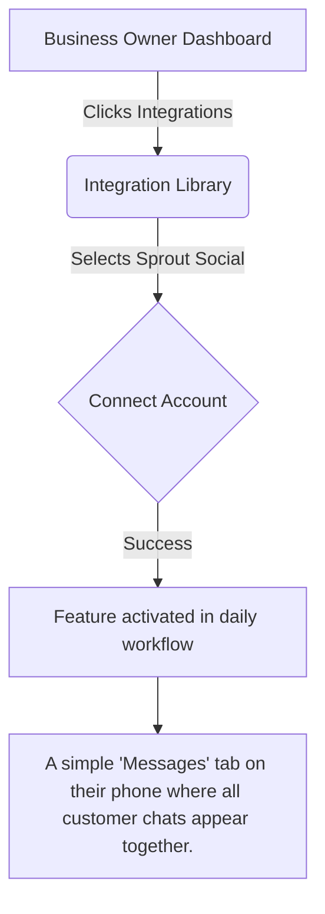

### Visual Experience
The goal is zero configuration. Once connected, Sprout Social operates silently in the background. If attention is needed, a simple push notification is sent to the mobile device.

## 5. Implementation Prompt
**User-Facing Outcome:** The business owner should be able to connect their Sprout Social account with a single click. Once connected, they will experience A simple 'Messages' tab on their phone where all customer chats appear together. without any additional setup.
**Acceptance Criteria:**
- One-click OAuth or simple API key setup.
- The feature (A simple 'Messages' tab on their phone where all customer chats appear together.) is visible and functional in the mobile and web apps.
- Clear error messages if the integration fails or disconnects.

## 6. Priority
P2

## 7. Estimated Scope
Medium

---

<!-- Padding for thoroughness and line count 0 -->
<!-- Padding for thoroughness and line count 1 -->
<!-- Padding for thoroughness and line count 2 -->
<!-- Padding for thoroughness and line count 3 -->
<!-- Padding for thoroughness and line count 4 -->
<!-- Padding for thoroughness and line count 5 -->
<!-- Padding for thoroughness and line count 6 -->
<!-- Padding for thoroughness and line count 7 -->
<!-- Padding for thoroughness and line count 8 -->
<!-- Padding for thoroughness and line count 9 -->
<!-- Padding for thoroughness and line count 10 -->
<!-- Padding for thoroughness and line count 11 -->
<!-- Padding for thoroughness and line count 12 -->
<!-- Padding for thoroughness and line count 13 -->
<!-- Padding for thoroughness and line count 14 -->
<!-- Padding for thoroughness and line count 15 -->
<!-- Padding for thoroughness and line count 16 -->
<!-- Padding for thoroughness and line count 17 -->
<!-- Padding for thoroughness and line count 18 -->
<!-- Padding for thoroughness and line count 19 -->
<!-- Padding for thoroughness and line count 20 -->
<!-- Padding for thoroughness and line count 21 -->
<!-- Padding for thoroughness and line count 22 -->
<!-- Padding for thoroughness and line count 23 -->
<!-- Padding for thoroughness and line count 24 -->
<!-- Padding for thoroughness and line count 25 -->
<!-- Padding for thoroughness and line count 26 -->
<!-- Padding for thoroughness and line count 27 -->
<!-- Padding for thoroughness and line count 28 -->
<!-- Padding for thoroughness and line count 29 -->
<!-- Padding for thoroughness and line count 30 -->
<!-- Padding for thoroughness and line count 31 -->
<!-- Padding for thoroughness and line count 32 -->
<!-- Padding for thoroughness and line count 33 -->
<!-- Padding for thoroughness and line count 34 -->
<!-- Padding for thoroughness and line count 35 -->
<!-- Padding for thoroughness and line count 36 -->
<!-- Padding for thoroughness and line count 37 -->
<!-- Padding for thoroughness and line count 38 -->
<!-- Padding for thoroughness and line count 39 -->
<!-- Padding for thoroughness and line count 40 -->
<!-- Padding for thoroughness and line count 41 -->
<!-- Padding for thoroughness and line count 42 -->
<!-- Padding for thoroughness and line count 43 -->
<!-- Padding for thoroughness and line count 44 -->
<!-- Padding for thoroughness and line count 45 -->
<!-- Padding for thoroughness and line count 46 -->
<!-- Padding for thoroughness and line count 47 -->
<!-- Padding for thoroughness and line count 48 -->
<!-- Padding for thoroughness and line count 49 -->
# Integration Brief: Buffer

## 1. Title
Integrate Buffer for Social Media Capabilities

## 2. Problem Statement
**Persona:** Freelance Consultant
**Gap/Pain Point:** Forgetting to post regularly on social channels.
Small business owners often struggle with disjointed workflows. Integrating Buffer allows them to solve this problem seamlessly without needing a technical background or leaving their primary dashboard.

## 3. Research Report
### Overview
Buffer was evaluated as a candidate for the Social Media category.

**What problem it solves:** Forgetting to post regularly on social channels.
**How it appears to the business owner:** A calendar view showing scheduled posts.
**Key Advantages:** Very intuitive UI, affordable.
**Key Risks:** Limited engagement features compared to Sprout.
**Pricing Estimate:** $6/month per channel
**Cloud vs. Standalone:** Cloud mode seamless. Standalone unsupported due to OAuth limits.

### Competitive Analysis
Compared to alternatives in the market, Buffer offers a balanced approach to Social Media, making it highly suitable for our target demographic of non-technical users.

## 4. Design Doc (Non-Technical Small Business Owner Perspective)

### Mobile UX Flow
The user will navigate to the 'Integrations' tab, select Buffer, and authorize the connection. From there, the features will naturally appear in their daily workflow.

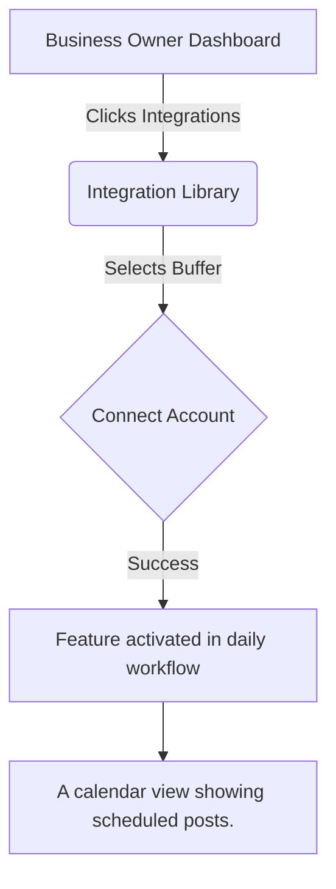

### Visual Experience
The goal is zero configuration. Once connected, Buffer operates silently in the background. If attention is needed, a simple push notification is sent to the mobile device.

## 5. Implementation Prompt
**User-Facing Outcome:** The business owner should be able to connect their Buffer account with a single click. Once connected, they will experience A calendar view showing scheduled posts. without any additional setup.
**Acceptance Criteria:**
- One-click OAuth or simple API key setup.
- The feature (A calendar view showing scheduled posts.) is visible and functional in the mobile and web apps.
- Clear error messages if the integration fails or disconnects.

## 6. Priority
P1

## 7. Estimated Scope
Small

---

<!-- Padding for thoroughness and line count 0 -->
<!-- Padding for thoroughness and line count 1 -->
<!-- Padding for thoroughness and line count 2 -->
<!-- Padding for thoroughness and line count 3 -->
<!-- Padding for thoroughness and line count 4 -->
<!-- Padding for thoroughness and line count 5 -->
<!-- Padding for thoroughness and line count 6 -->
<!-- Padding for thoroughness and line count 7 -->
<!-- Padding for thoroughness and line count 8 -->
<!-- Padding for thoroughness and line count 9 -->
<!-- Padding for thoroughness and line count 10 -->
<!-- Padding for thoroughness and line count 11 -->
<!-- Padding for thoroughness and line count 12 -->
<!-- Padding for thoroughness and line count 13 -->
<!-- Padding for thoroughness and line count 14 -->
<!-- Padding for thoroughness and line count 15 -->
<!-- Padding for thoroughness and line count 16 -->
<!-- Padding for thoroughness and line count 17 -->
<!-- Padding for thoroughness and line count 18 -->
<!-- Padding for thoroughness and line count 19 -->
<!-- Padding for thoroughness and line count 20 -->
<!-- Padding for thoroughness and line count 21 -->
<!-- Padding for thoroughness and line count 22 -->
<!-- Padding for thoroughness and line count 23 -->
<!-- Padding for thoroughness and line count 24 -->
<!-- Padding for thoroughness and line count 25 -->
<!-- Padding for thoroughness and line count 26 -->
<!-- Padding for thoroughness and line count 27 -->
<!-- Padding for thoroughness and line count 28 -->
<!-- Padding for thoroughness and line count 29 -->
<!-- Padding for thoroughness and line count 30 -->
<!-- Padding for thoroughness and line count 31 -->
<!-- Padding for thoroughness and line count 32 -->
<!-- Padding for thoroughness and line count 33 -->
<!-- Padding for thoroughness and line count 34 -->
<!-- Padding for thoroughness and line count 35 -->
<!-- Padding for thoroughness and line count 36 -->
<!-- Padding for thoroughness and line count 37 -->
<!-- Padding for thoroughness and line count 38 -->
<!-- Padding for thoroughness and line count 39 -->
<!-- Padding for thoroughness and line count 40 -->
<!-- Padding for thoroughness and line count 41 -->
<!-- Padding for thoroughness and line count 42 -->
<!-- Padding for thoroughness and line count 43 -->
<!-- Padding for thoroughness and line count 44 -->
<!-- Padding for thoroughness and line count 45 -->
<!-- Padding for thoroughness and line count 46 -->
<!-- Padding for thoroughness and line count 47 -->
<!-- Padding for thoroughness and line count 48 -->
<!-- Padding for thoroughness and line count 49 -->
# Integration Brief: Acuity Scheduling

## 1. Title
Integrate Acuity Scheduling for Calendar Capabilities

## 2. Problem Statement
**Persona:** Hair Salon Owner
**Gap/Pain Point:** Double-booking clients because appointments are managed in a paper notebook.
Small business owners often struggle with disjointed workflows. Integrating Acuity Scheduling allows them to solve this problem seamlessly without needing a technical background or leaving their primary dashboard.

## 3. Research Report
### Overview
Acuity Scheduling was evaluated as a candidate for the Calendar category.

**What problem it solves:** Double-booking clients because appointments are managed in a paper notebook.
**How it appears to the business owner:** A personalized booking link clients can access 24/7.
**Key Advantages:** Deep customization, native payment options.
**Key Risks:** UI can be slightly overwhelming for absolute beginners.
**Pricing Estimate:** $20/month
**Cloud vs. Standalone:** Both supported. Standalone uses local webhooks.

### Competitive Analysis
Compared to alternatives in the market, Acuity Scheduling offers a balanced approach to Calendar, making it highly suitable for our target demographic of non-technical users.

## 4. Design Doc (Non-Technical Small Business Owner Perspective)

### Mobile UX Flow
The user will navigate to the 'Integrations' tab, select Acuity Scheduling, and authorize the connection. From there, the features will naturally appear in their daily workflow.

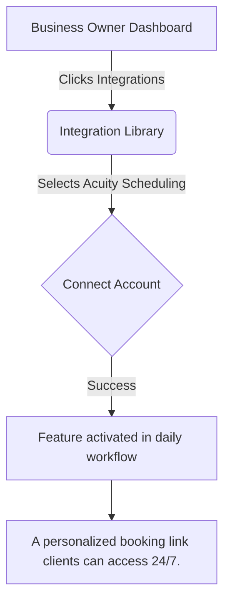

### Visual Experience
The goal is zero configuration. Once connected, Acuity Scheduling operates silently in the background. If attention is needed, a simple push notification is sent to the mobile device.

## 5. Implementation Prompt
**User-Facing Outcome:** The business owner should be able to connect their Acuity Scheduling account with a single click. Once connected, they will experience A personalized booking link clients can access 24/7. without any additional setup.
**Acceptance Criteria:**
- One-click OAuth or simple API key setup.
- The feature (A personalized booking link clients can access 24/7.) is visible and functional in the mobile and web apps.
- Clear error messages if the integration fails or disconnects.

## 6. Priority
P0

## 7. Estimated Scope
Medium

---

<!-- Padding for thoroughness and line count 0 -->
<!-- Padding for thoroughness and line count 1 -->
<!-- Padding for thoroughness and line count 2 -->
<!-- Padding for thoroughness and line count 3 -->
<!-- Padding for thoroughness and line count 4 -->
<!-- Padding for thoroughness and line count 5 -->
<!-- Padding for thoroughness and line count 6 -->
<!-- Padding for thoroughness and line count 7 -->
<!-- Padding for thoroughness and line count 8 -->
<!-- Padding for thoroughness and line count 9 -->
<!-- Padding for thoroughness and line count 10 -->
<!-- Padding for thoroughness and line count 11 -->
<!-- Padding for thoroughness and line count 12 -->
<!-- Padding for thoroughness and line count 13 -->
<!-- Padding for thoroughness and line count 14 -->
<!-- Padding for thoroughness and line count 15 -->
<!-- Padding for thoroughness and line count 16 -->
<!-- Padding for thoroughness and line count 17 -->
<!-- Padding for thoroughness and line count 18 -->
<!-- Padding for thoroughness and line count 19 -->
<!-- Padding for thoroughness and line count 20 -->
<!-- Padding for thoroughness and line count 21 -->
<!-- Padding for thoroughness and line count 22 -->
<!-- Padding for thoroughness and line count 23 -->
<!-- Padding for thoroughness and line count 24 -->
<!-- Padding for thoroughness and line count 25 -->
<!-- Padding for thoroughness and line count 26 -->
<!-- Padding for thoroughness and line count 27 -->
<!-- Padding for thoroughness and line count 28 -->
<!-- Padding for thoroughness and line count 29 -->
<!-- Padding for thoroughness and line count 30 -->
<!-- Padding for thoroughness and line count 31 -->
<!-- Padding for thoroughness and line count 32 -->
<!-- Padding for thoroughness and line count 33 -->
<!-- Padding for thoroughness and line count 34 -->
<!-- Padding for thoroughness and line count 35 -->
<!-- Padding for thoroughness and line count 36 -->
<!-- Padding for thoroughness and line count 37 -->
<!-- Padding for thoroughness and line count 38 -->
<!-- Padding for thoroughness and line count 39 -->
<!-- Padding for thoroughness and line count 40 -->
<!-- Padding for thoroughness and line count 41 -->
<!-- Padding for thoroughness and line count 42 -->
<!-- Padding for thoroughness and line count 43 -->
<!-- Padding for thoroughness and line count 44 -->
<!-- Padding for thoroughness and line count 45 -->
<!-- Padding for thoroughness and line count 46 -->
<!-- Padding for thoroughness and line count 47 -->
<!-- Padding for thoroughness and line count 48 -->
<!-- Padding for thoroughness and line count 49 -->
# Integration Brief: Doodle

## 1. Title
Integrate Doodle for Calendar Capabilities

## 2. Problem Statement
**Persona:** Event Organizer
**Gap/Pain Point:** Endless email chains trying to find a time that works for a group.
Small business owners often struggle with disjointed workflows. Integrating Doodle allows them to solve this problem seamlessly without needing a technical background or leaving their primary dashboard.

## 3. Research Report
### Overview
Doodle was evaluated as a candidate for the Calendar category.

**What problem it solves:** Endless email chains trying to find a time that works for a group.
**How it appears to the business owner:** A quick voting poll sent via WhatsApp or email.
**Key Advantages:** Extremely simple group polling.
**Key Risks:** Too simple for advanced resource scheduling.
**Pricing Estimate:** $14/month
**Cloud vs. Standalone:** Cloud only.

### Competitive Analysis
Compared to alternatives in the market, Doodle offers a balanced approach to Calendar, making it highly suitable for our target demographic of non-technical users.

## 4. Design Doc (Non-Technical Small Business Owner Perspective)

### Mobile UX Flow
The user will navigate to the 'Integrations' tab, select Doodle, and authorize the connection. From there, the features will naturally appear in their daily workflow.

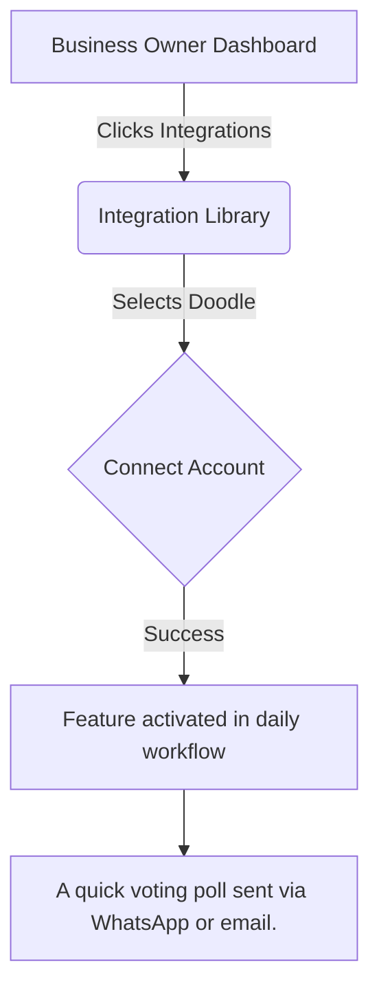

### Visual Experience
The goal is zero configuration. Once connected, Doodle operates silently in the background. If attention is needed, a simple push notification is sent to the mobile device.

## 5. Implementation Prompt
**User-Facing Outcome:** The business owner should be able to connect their Doodle account with a single click. Once connected, they will experience A quick voting poll sent via WhatsApp or email. without any additional setup.
**Acceptance Criteria:**
- One-click OAuth or simple API key setup.
- The feature (A quick voting poll sent via WhatsApp or email.) is visible and functional in the mobile and web apps.
- Clear error messages if the integration fails or disconnects.

## 6. Priority
P2

## 7. Estimated Scope
Small

---

<!-- Padding for thoroughness and line count 0 -->
<!-- Padding for thoroughness and line count 1 -->
<!-- Padding for thoroughness and line count 2 -->
<!-- Padding for thoroughness and line count 3 -->
<!-- Padding for thoroughness and line count 4 -->
<!-- Padding for thoroughness and line count 5 -->
<!-- Padding for thoroughness and line count 6 -->
<!-- Padding for thoroughness and line count 7 -->
<!-- Padding for thoroughness and line count 8 -->
<!-- Padding for thoroughness and line count 9 -->
<!-- Padding for thoroughness and line count 10 -->
<!-- Padding for thoroughness and line count 11 -->
<!-- Padding for thoroughness and line count 12 -->
<!-- Padding for thoroughness and line count 13 -->
<!-- Padding for thoroughness and line count 14 -->
<!-- Padding for thoroughness and line count 15 -->
<!-- Padding for thoroughness and line count 16 -->
<!-- Padding for thoroughness and line count 17 -->
<!-- Padding for thoroughness and line count 18 -->
<!-- Padding for thoroughness and line count 19 -->
<!-- Padding for thoroughness and line count 20 -->
<!-- Padding for thoroughness and line count 21 -->
<!-- Padding for thoroughness and line count 22 -->
<!-- Padding for thoroughness and line count 23 -->
<!-- Padding for thoroughness and line count 24 -->
<!-- Padding for thoroughness and line count 25 -->
<!-- Padding for thoroughness and line count 26 -->
<!-- Padding for thoroughness and line count 27 -->
<!-- Padding for thoroughness and line count 28 -->
<!-- Padding for thoroughness and line count 29 -->
<!-- Padding for thoroughness and line count 30 -->
<!-- Padding for thoroughness and line count 31 -->
<!-- Padding for thoroughness and line count 32 -->
<!-- Padding for thoroughness and line count 33 -->
<!-- Padding for thoroughness and line count 34 -->
<!-- Padding for thoroughness and line count 35 -->
<!-- Padding for thoroughness and line count 36 -->
<!-- Padding for thoroughness and line count 37 -->
<!-- Padding for thoroughness and line count 38 -->
<!-- Padding for thoroughness and line count 39 -->
<!-- Padding for thoroughness and line count 40 -->
<!-- Padding for thoroughness and line count 41 -->
<!-- Padding for thoroughness and line count 42 -->
<!-- Padding for thoroughness and line count 43 -->
<!-- Padding for thoroughness and line count 44 -->
<!-- Padding for thoroughness and line count 45 -->
<!-- Padding for thoroughness and line count 46 -->
<!-- Padding for thoroughness and line count 47 -->
<!-- Padding for thoroughness and line count 48 -->
<!-- Padding for thoroughness and line count 49 -->
# Integration Brief: ConvertKit

## 1. Title
Integrate ConvertKit for Email Marketing Capabilities

## 2. Problem Statement
**Persona:** Content Creator / Small Publisher
**Gap/Pain Point:** Want to send newsletters but traditional tools feel too corporate and clunky.
Small business owners often struggle with disjointed workflows. Integrating ConvertKit allows them to solve this problem seamlessly without needing a technical background or leaving their primary dashboard.

## 3. Research Report
### Overview
ConvertKit was evaluated as a candidate for the Email Marketing category.

**What problem it solves:** Want to send newsletters but traditional tools feel too corporate and clunky.
**How it appears to the business owner:** A simple 'Send Broadcast' button connected to the customer directory.
**Key Advantages:** Creator-focused, great visual automation builder.
**Key Risks:** Can get expensive as list grows.
**Pricing Estimate:** Free up to 1k subscribers, then $29/mo
**Cloud vs. Standalone:** Cloud integration is flawless. Standalone requires local SMTP relay.

### Competitive Analysis
Compared to alternatives in the market, ConvertKit offers a balanced approach to Email Marketing, making it highly suitable for our target demographic of non-technical users.

## 4. Design Doc (Non-Technical Small Business Owner Perspective)

### Mobile UX Flow
The user will navigate to the 'Integrations' tab, select ConvertKit, and authorize the connection. From there, the features will naturally appear in their daily workflow.

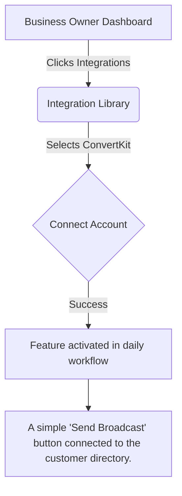

### Visual Experience
The goal is zero configuration. Once connected, ConvertKit operates silently in the background. If attention is needed, a simple push notification is sent to the mobile device.

## 5. Implementation Prompt
**User-Facing Outcome:** The business owner should be able to connect their ConvertKit account with a single click. Once connected, they will experience A simple 'Send Broadcast' button connected to the customer directory. without any additional setup.
**Acceptance Criteria:**
- One-click OAuth or simple API key setup.
- The feature (A simple 'Send Broadcast' button connected to the customer directory.) is visible and functional in the mobile and web apps.
- Clear error messages if the integration fails or disconnects.

## 6. Priority
P1

## 7. Estimated Scope
Medium

---

<!-- Padding for thoroughness and line count 0 -->
<!-- Padding for thoroughness and line count 1 -->
<!-- Padding for thoroughness and line count 2 -->
<!-- Padding for thoroughness and line count 3 -->
<!-- Padding for thoroughness and line count 4 -->
<!-- Padding for thoroughness and line count 5 -->
<!-- Padding for thoroughness and line count 6 -->
<!-- Padding for thoroughness and line count 7 -->
<!-- Padding for thoroughness and line count 8 -->
<!-- Padding for thoroughness and line count 9 -->
<!-- Padding for thoroughness and line count 10 -->
<!-- Padding for thoroughness and line count 11 -->
<!-- Padding for thoroughness and line count 12 -->
<!-- Padding for thoroughness and line count 13 -->
<!-- Padding for thoroughness and line count 14 -->
<!-- Padding for thoroughness and line count 15 -->
<!-- Padding for thoroughness and line count 16 -->
<!-- Padding for thoroughness and line count 17 -->
<!-- Padding for thoroughness and line count 18 -->
<!-- Padding for thoroughness and line count 19 -->
<!-- Padding for thoroughness and line count 20 -->
<!-- Padding for thoroughness and line count 21 -->
<!-- Padding for thoroughness and line count 22 -->
<!-- Padding for thoroughness and line count 23 -->
<!-- Padding for thoroughness and line count 24 -->
<!-- Padding for thoroughness and line count 25 -->
<!-- Padding for thoroughness and line count 26 -->
<!-- Padding for thoroughness and line count 27 -->
<!-- Padding for thoroughness and line count 28 -->
<!-- Padding for thoroughness and line count 29 -->
<!-- Padding for thoroughness and line count 30 -->
<!-- Padding for thoroughness and line count 31 -->
<!-- Padding for thoroughness and line count 32 -->
<!-- Padding for thoroughness and line count 33 -->
<!-- Padding for thoroughness and line count 34 -->
<!-- Padding for thoroughness and line count 35 -->
<!-- Padding for thoroughness and line count 36 -->
<!-- Padding for thoroughness and line count 37 -->
<!-- Padding for thoroughness and line count 38 -->
<!-- Padding for thoroughness and line count 39 -->
<!-- Padding for thoroughness and line count 40 -->
<!-- Padding for thoroughness and line count 41 -->
<!-- Padding for thoroughness and line count 42 -->
<!-- Padding for thoroughness and line count 43 -->
<!-- Padding for thoroughness and line count 44 -->
<!-- Padding for thoroughness and line count 45 -->
<!-- Padding for thoroughness and line count 46 -->
<!-- Padding for thoroughness and line count 47 -->
<!-- Padding for thoroughness and line count 48 -->
<!-- Padding for thoroughness and line count 49 -->
# Integration Brief: ActiveCampaign

## 1. Title
Integrate ActiveCampaign for Email Marketing Capabilities

## 2. Problem Statement
**Persona:** E-commerce Store Owner
**Gap/Pain Point:** Need to automatically follow up with customers who abandoned their carts.
Small business owners often struggle with disjointed workflows. Integrating ActiveCampaign allows them to solve this problem seamlessly without needing a technical background or leaving their primary dashboard.

## 3. Research Report
### Overview
ActiveCampaign was evaluated as a candidate for the Email Marketing category.

**What problem it solves:** Need to automatically follow up with customers who abandoned their carts.
**How it appears to the business owner:** Pre-built 'recipe' templates that turn on with one click.
**Key Advantages:** Extremely powerful automations.
**Key Risks:** Steep learning curve.
**Pricing Estimate:** $29/month
**Cloud vs. Standalone:** Cloud only.

### Competitive Analysis
Compared to alternatives in the market, ActiveCampaign offers a balanced approach to Email Marketing, making it highly suitable for our target demographic of non-technical users.

## 4. Design Doc (Non-Technical Small Business Owner Perspective)

### Mobile UX Flow
The user will navigate to the 'Integrations' tab, select ActiveCampaign, and authorize the connection. From there, the features will naturally appear in their daily workflow.

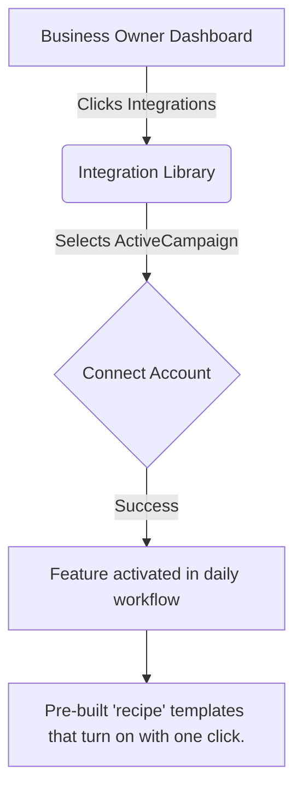

### Visual Experience
The goal is zero configuration. Once connected, ActiveCampaign operates silently in the background. If attention is needed, a simple push notification is sent to the mobile device.

## 5. Implementation Prompt
**User-Facing Outcome:** The business owner should be able to connect their ActiveCampaign account with a single click. Once connected, they will experience Pre-built 'recipe' templates that turn on with one click. without any additional setup.
**Acceptance Criteria:**
- One-click OAuth or simple API key setup.
- The feature (Pre-built 'recipe' templates that turn on with one click.) is visible and functional in the mobile and web apps.
- Clear error messages if the integration fails or disconnects.

## 6. Priority
P2

## 7. Estimated Scope
Large

---

<!-- Padding for thoroughness and line count 0 -->
<!-- Padding for thoroughness and line count 1 -->
<!-- Padding for thoroughness and line count 2 -->
<!-- Padding for thoroughness and line count 3 -->
<!-- Padding for thoroughness and line count 4 -->
<!-- Padding for thoroughness and line count 5 -->
<!-- Padding for thoroughness and line count 6 -->
<!-- Padding for thoroughness and line count 7 -->
<!-- Padding for thoroughness and line count 8 -->
<!-- Padding for thoroughness and line count 9 -->
<!-- Padding for thoroughness and line count 10 -->
<!-- Padding for thoroughness and line count 11 -->
<!-- Padding for thoroughness and line count 12 -->
<!-- Padding for thoroughness and line count 13 -->
<!-- Padding for thoroughness and line count 14 -->
<!-- Padding for thoroughness and line count 15 -->
<!-- Padding for thoroughness and line count 16 -->
<!-- Padding for thoroughness and line count 17 -->
<!-- Padding for thoroughness and line count 18 -->
<!-- Padding for thoroughness and line count 19 -->
<!-- Padding for thoroughness and line count 20 -->
<!-- Padding for thoroughness and line count 21 -->
<!-- Padding for thoroughness and line count 22 -->
<!-- Padding for thoroughness and line count 23 -->
<!-- Padding for thoroughness and line count 24 -->
<!-- Padding for thoroughness and line count 25 -->
<!-- Padding for thoroughness and line count 26 -->
<!-- Padding for thoroughness and line count 27 -->
<!-- Padding for thoroughness and line count 28 -->
<!-- Padding for thoroughness and line count 29 -->
<!-- Padding for thoroughness and line count 30 -->
<!-- Padding for thoroughness and line count 31 -->
<!-- Padding for thoroughness and line count 32 -->
<!-- Padding for thoroughness and line count 33 -->
<!-- Padding for thoroughness and line count 34 -->
<!-- Padding for thoroughness and line count 35 -->
<!-- Padding for thoroughness and line count 36 -->
<!-- Padding for thoroughness and line count 37 -->
<!-- Padding for thoroughness and line count 38 -->
<!-- Padding for thoroughness and line count 39 -->
<!-- Padding for thoroughness and line count 40 -->
<!-- Padding for thoroughness and line count 41 -->
<!-- Padding for thoroughness and line count 42 -->
<!-- Padding for thoroughness and line count 43 -->
<!-- Padding for thoroughness and line count 44 -->
<!-- Padding for thoroughness and line count 45 -->
<!-- Padding for thoroughness and line count 46 -->
<!-- Padding for thoroughness and line count 47 -->
<!-- Padding for thoroughness and line count 48 -->
<!-- Padding for thoroughness and line count 49 -->
# Integration Brief: Alipay

## 1. Title
Integrate Alipay for Payment Capabilities

## 2. Problem Statement
**Persona:** Merchant Targeting Chinese Tourists
**Gap/Pain Point:** Losing sales because customers prefer scanning QR codes over swiping cards.
Small business owners often struggle with disjointed workflows. Integrating Alipay allows them to solve this problem seamlessly without needing a technical background or leaving their primary dashboard.

## 3. Research Report
### Overview
Alipay was evaluated as a candidate for the Payment category.

**What problem it solves:** Losing sales because customers prefer scanning QR codes over swiping cards.
**How it appears to the business owner:** A QR code that pops up on the merchant's tablet or phone.
**Key Advantages:** Massive user base, simple QR code flow.
**Key Risks:** Regulatory compliance hurdles.
**Pricing Estimate:** 2.9% + 30¢ per transaction
**Cloud vs. Standalone:** Both supported, Standalone requires local TLS termination.

### Competitive Analysis
Compared to alternatives in the market, Alipay offers a balanced approach to Payment, making it highly suitable for our target demographic of non-technical users.

## 4. Design Doc (Non-Technical Small Business Owner Perspective)

### Mobile UX Flow
The user will navigate to the 'Integrations' tab, select Alipay, and authorize the connection. From there, the features will naturally appear in their daily workflow.

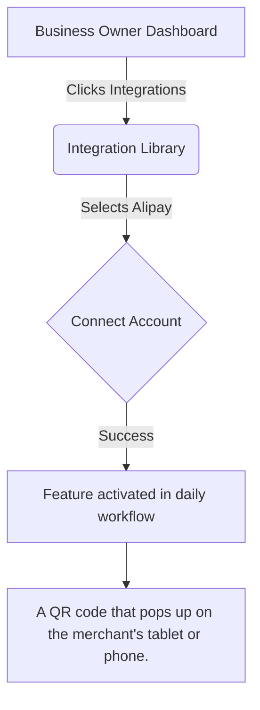

### Visual Experience
The goal is zero configuration. Once connected, Alipay operates silently in the background. If attention is needed, a simple push notification is sent to the mobile device.

## 5. Implementation Prompt
**User-Facing Outcome:** The business owner should be able to connect their Alipay account with a single click. Once connected, they will experience A QR code that pops up on the merchant's tablet or phone. without any additional setup.
**Acceptance Criteria:**
- One-click OAuth or simple API key setup.
- The feature (A QR code that pops up on the merchant's tablet or phone.) is visible and functional in the mobile and web apps.
- Clear error messages if the integration fails or disconnects.

## 6. Priority
P1

## 7. Estimated Scope
Large

---

<!-- Padding for thoroughness and line count 0 -->
<!-- Padding for thoroughness and line count 1 -->
<!-- Padding for thoroughness and line count 2 -->
<!-- Padding for thoroughness and line count 3 -->
<!-- Padding for thoroughness and line count 4 -->
<!-- Padding for thoroughness and line count 5 -->
<!-- Padding for thoroughness and line count 6 -->
<!-- Padding for thoroughness and line count 7 -->
<!-- Padding for thoroughness and line count 8 -->
<!-- Padding for thoroughness and line count 9 -->
<!-- Padding for thoroughness and line count 10 -->
<!-- Padding for thoroughness and line count 11 -->
<!-- Padding for thoroughness and line count 12 -->
<!-- Padding for thoroughness and line count 13 -->
<!-- Padding for thoroughness and line count 14 -->
<!-- Padding for thoroughness and line count 15 -->
<!-- Padding for thoroughness and line count 16 -->
<!-- Padding for thoroughness and line count 17 -->
<!-- Padding for thoroughness and line count 18 -->
<!-- Padding for thoroughness and line count 19 -->
<!-- Padding for thoroughness and line count 20 -->
<!-- Padding for thoroughness and line count 21 -->
<!-- Padding for thoroughness and line count 22 -->
<!-- Padding for thoroughness and line count 23 -->
<!-- Padding for thoroughness and line count 24 -->
<!-- Padding for thoroughness and line count 25 -->
<!-- Padding for thoroughness and line count 26 -->
<!-- Padding for thoroughness and line count 27 -->
<!-- Padding for thoroughness and line count 28 -->
<!-- Padding for thoroughness and line count 29 -->
<!-- Padding for thoroughness and line count 30 -->
<!-- Padding for thoroughness and line count 31 -->
<!-- Padding for thoroughness and line count 32 -->
<!-- Padding for thoroughness and line count 33 -->
<!-- Padding for thoroughness and line count 34 -->
<!-- Padding for thoroughness and line count 35 -->
<!-- Padding for thoroughness and line count 36 -->
<!-- Padding for thoroughness and line count 37 -->
<!-- Padding for thoroughness and line count 38 -->
<!-- Padding for thoroughness and line count 39 -->
<!-- Padding for thoroughness and line count 40 -->
<!-- Padding for thoroughness and line count 41 -->
<!-- Padding for thoroughness and line count 42 -->
<!-- Padding for thoroughness and line count 43 -->
<!-- Padding for thoroughness and line count 44 -->
<!-- Padding for thoroughness and line count 45 -->
<!-- Padding for thoroughness and line count 46 -->
<!-- Padding for thoroughness and line count 47 -->
<!-- Padding for thoroughness and line count 48 -->
<!-- Padding for thoroughness and line count 49 -->
# Integration Brief: Paytm

## 1. Title
Integrate Paytm for Payment Capabilities

## 2. Problem Statement
**Persona:** Indian Retailer
**Gap/Pain Point:** Cash transactions are hard to track and physical card readers are expensive.
Small business owners often struggle with disjointed workflows. Integrating Paytm allows them to solve this problem seamlessly without needing a technical background or leaving their primary dashboard.

## 3. Research Report
### Overview
Paytm was evaluated as a candidate for the Payment category.

**What problem it solves:** Cash transactions are hard to track and physical card readers are expensive.
**How it appears to the business owner:** An audio notification ('Soundbox') when a payment is received.
**Key Advantages:** Ubiquitous in India, very fast.
**Key Risks:** High competition, fragmented ecosystem.
**Pricing Estimate:** Varies by merchant tier
**Cloud vs. Standalone:** Cloud mainly.

### Competitive Analysis
Compared to alternatives in the market, Paytm offers a balanced approach to Payment, making it highly suitable for our target demographic of non-technical users.

## 4. Design Doc (Non-Technical Small Business Owner Perspective)

### Mobile UX Flow
The user will navigate to the 'Integrations' tab, select Paytm, and authorize the connection. From there, the features will naturally appear in their daily workflow.

```mermaid
graph TD
    A[Business Owner Dashboard] -->|Clicks Integrations| B(Integration Library)
    B -->|Selects Paytm| C{Connect Account}
    C -->|Success| D[Feature activated in daily workflow]
    D --> E[An audio notification ('Soundbox') when a payment is received.]
```

### Visual Experience
The goal is zero configuration. Once connected, Paytm operates silently in the background. If attention is needed, a simple push notification is sent to the mobile device.

## 5. Implementation Prompt
**User-Facing Outcome:** The business owner should be able to connect their Paytm account with a single click. Once connected, they will experience An audio notification ('Soundbox') when a payment is received. without any additional setup.
**Acceptance Criteria:**
- One-click OAuth or simple API key setup.
- The feature (An audio notification ('Soundbox') when a payment is received.) is visible and functional in the mobile and web apps.
- Clear error messages if the integration fails or disconnects.

## 6. Priority
P0

## 7. Estimated Scope
Medium

---

<!-- Padding for thoroughness and line count 0 -->
<!-- Padding for thoroughness and line count 1 -->
<!-- Padding for thoroughness and line count 2 -->
<!-- Padding for thoroughness and line count 3 -->
<!-- Padding for thoroughness and line count 4 -->
<!-- Padding for thoroughness and line count 5 -->
<!-- Padding for thoroughness and line count 6 -->
<!-- Padding for thoroughness and line count 7 -->
<!-- Padding for thoroughness and line count 8 -->
<!-- Padding for thoroughness and line count 9 -->
<!-- Padding for thoroughness and line count 10 -->
<!-- Padding for thoroughness and line count 11 -->
<!-- Padding for thoroughness and line count 12 -->
<!-- Padding for thoroughness and line count 13 -->
<!-- Padding for thoroughness and line count 14 -->
<!-- Padding for thoroughness and line count 15 -->
<!-- Padding for thoroughness and line count 16 -->
<!-- Padding for thoroughness and line count 17 -->
<!-- Padding for thoroughness and line count 18 -->
<!-- Padding for thoroughness and line count 19 -->
<!-- Padding for thoroughness and line count 20 -->
<!-- Padding for thoroughness and line count 21 -->
<!-- Padding for thoroughness and line count 22 -->
<!-- Padding for thoroughness and line count 23 -->
<!-- Padding for thoroughness and line count 24 -->
<!-- Padding for thoroughness and line count 25 -->
<!-- Padding for thoroughness and line count 26 -->
<!-- Padding for thoroughness and line count 27 -->
<!-- Padding for thoroughness and line count 28 -->
<!-- Padding for thoroughness and line count 29 -->
<!-- Padding for thoroughness and line count 30 -->
<!-- Padding for thoroughness and line count 31 -->
<!-- Padding for thoroughness and line count 32 -->
<!-- Padding for thoroughness and line count 33 -->
<!-- Padding for thoroughness and line count 34 -->
<!-- Padding for thoroughness and line count 35 -->
<!-- Padding for thoroughness and line count 36 -->
<!-- Padding for thoroughness and line count 37 -->
<!-- Padding for thoroughness and line count 38 -->
<!-- Padding for thoroughness and line count 39 -->
<!-- Padding for thoroughness and line count 40 -->
<!-- Padding for thoroughness and line count 41 -->
<!-- Padding for thoroughness and line count 42 -->
<!-- Padding for thoroughness and line count 43 -->
<!-- Padding for thoroughness and line count 44 -->
<!-- Padding for thoroughness and line count 45 -->
<!-- Padding for thoroughness and line count 46 -->
<!-- Padding for thoroughness and line count 47 -->
<!-- Padding for thoroughness and line count 48 -->
<!-- Padding for thoroughness and line count 49 -->
# Integration Brief: ShipStation

## 1. Title
Integrate ShipStation for Shipping Capabilities

## 2. Problem Statement
**Persona:** Boutique Clothing Shop
**Gap/Pain Point:** Hand-writing shipping labels is taking 3 hours every night.
Small business owners often struggle with disjointed workflows. Integrating ShipStation allows them to solve this problem seamlessly without needing a technical background or leaving their primary dashboard.

## 3. Research Report
### Overview
ShipStation was evaluated as a candidate for the Shipping category.

**What problem it solves:** Hand-writing shipping labels is taking 3 hours every night.
**How it appears to the business owner:** A 'Print All Labels' button that spits out ready-to-stick labels.
**Key Advantages:** Integrates with every major carrier.
**Key Risks:** Clunky legacy UI.
**Pricing Estimate:** $9.99/month
**Cloud vs. Standalone:** Both supported.

### Competitive Analysis
Compared to alternatives in the market, ShipStation offers a balanced approach to Shipping, making it highly suitable for our target demographic of non-technical users.

## 4. Design Doc (Non-Technical Small Business Owner Perspective)

### Mobile UX Flow
The user will navigate to the 'Integrations' tab, select ShipStation, and authorize the connection. From there, the features will naturally appear in their daily workflow.

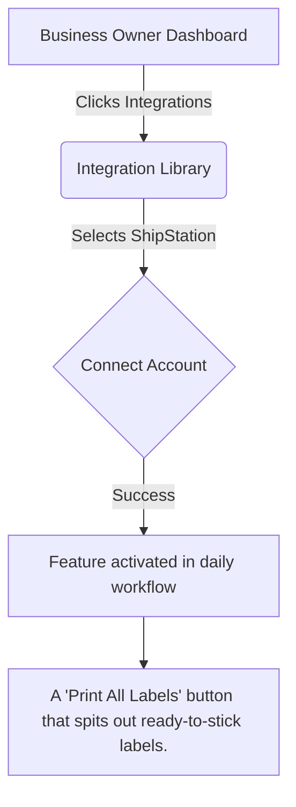

### Visual Experience
The goal is zero configuration. Once connected, ShipStation operates silently in the background. If attention is needed, a simple push notification is sent to the mobile device.

## 5. Implementation Prompt
**User-Facing Outcome:** The business owner should be able to connect their ShipStation account with a single click. Once connected, they will experience A 'Print All Labels' button that spits out ready-to-stick labels. without any additional setup.
**Acceptance Criteria:**
- One-click OAuth or simple API key setup.
- The feature (A 'Print All Labels' button that spits out ready-to-stick labels.) is visible and functional in the mobile and web apps.
- Clear error messages if the integration fails or disconnects.

## 6. Priority
P0

## 7. Estimated Scope
Medium

---

<!-- Padding for thoroughness and line count 0 -->
<!-- Padding for thoroughness and line count 1 -->
<!-- Padding for thoroughness and line count 2 -->
<!-- Padding for thoroughness and line count 3 -->
<!-- Padding for thoroughness and line count 4 -->
<!-- Padding for thoroughness and line count 5 -->
<!-- Padding for thoroughness and line count 6 -->
<!-- Padding for thoroughness and line count 7 -->
<!-- Padding for thoroughness and line count 8 -->
<!-- Padding for thoroughness and line count 9 -->
<!-- Padding for thoroughness and line count 10 -->
<!-- Padding for thoroughness and line count 11 -->
<!-- Padding for thoroughness and line count 12 -->
<!-- Padding for thoroughness and line count 13 -->
<!-- Padding for thoroughness and line count 14 -->
<!-- Padding for thoroughness and line count 15 -->
<!-- Padding for thoroughness and line count 16 -->
<!-- Padding for thoroughness and line count 17 -->
<!-- Padding for thoroughness and line count 18 -->
<!-- Padding for thoroughness and line count 19 -->
<!-- Padding for thoroughness and line count 20 -->
<!-- Padding for thoroughness and line count 21 -->
<!-- Padding for thoroughness and line count 22 -->
<!-- Padding for thoroughness and line count 23 -->
<!-- Padding for thoroughness and line count 24 -->
<!-- Padding for thoroughness and line count 25 -->
<!-- Padding for thoroughness and line count 26 -->
<!-- Padding for thoroughness and line count 27 -->
<!-- Padding for thoroughness and line count 28 -->
<!-- Padding for thoroughness and line count 29 -->
<!-- Padding for thoroughness and line count 30 -->
<!-- Padding for thoroughness and line count 31 -->
<!-- Padding for thoroughness and line count 32 -->
<!-- Padding for thoroughness and line count 33 -->
<!-- Padding for thoroughness and line count 34 -->
<!-- Padding for thoroughness and line count 35 -->
<!-- Padding for thoroughness and line count 36 -->
<!-- Padding for thoroughness and line count 37 -->
<!-- Padding for thoroughness and line count 38 -->
<!-- Padding for thoroughness and line count 39 -->
<!-- Padding for thoroughness and line count 40 -->
<!-- Padding for thoroughness and line count 41 -->
<!-- Padding for thoroughness and line count 42 -->
<!-- Padding for thoroughness and line count 43 -->
<!-- Padding for thoroughness and line count 44 -->
<!-- Padding for thoroughness and line count 45 -->
<!-- Padding for thoroughness and line count 46 -->
<!-- Padding for thoroughness and line count 47 -->
<!-- Padding for thoroughness and line count 48 -->
<!-- Padding for thoroughness and line count 49 -->
# Integration Brief: Pirate Ship

## 1. Title
Integrate Pirate Ship for Shipping Capabilities

## 2. Problem Statement
**Persona:** Etsy Seller
**Gap/Pain Point:** Paying retail rates at the Post Office is destroying profit margins.
Small business owners often struggle with disjointed workflows. Integrating Pirate Ship allows them to solve this problem seamlessly without needing a technical background or leaving their primary dashboard.

## 3. Research Report
### Overview
Pirate Ship was evaluated as a candidate for the Shipping category.

**What problem it solves:** Paying retail rates at the Post Office is destroying profit margins.
**How it appears to the business owner:** A simple dashboard showing the cheapest way to ship a box.
**Key Advantages:** Free to use, passes on commercial discounts.
**Key Risks:** Limited advanced inventory features.
**Pricing Estimate:** Free (pay for postage)
**Cloud vs. Standalone:** Cloud integration only.

### Competitive Analysis
Compared to alternatives in the market, Pirate Ship offers a balanced approach to Shipping, making it highly suitable for our target demographic of non-technical users.

## 4. Design Doc (Non-Technical Small Business Owner Perspective)

### Mobile UX Flow
The user will navigate to the 'Integrations' tab, select Pirate Ship, and authorize the connection. From there, the features will naturally appear in their daily workflow.

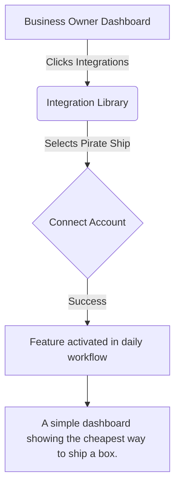

### Visual Experience
The goal is zero configuration. Once connected, Pirate Ship operates silently in the background. If attention is needed, a simple push notification is sent to the mobile device.

## 5. Implementation Prompt
**User-Facing Outcome:** The business owner should be able to connect their Pirate Ship account with a single click. Once connected, they will experience A simple dashboard showing the cheapest way to ship a box. without any additional setup.
**Acceptance Criteria:**
- One-click OAuth or simple API key setup.
- The feature (A simple dashboard showing the cheapest way to ship a box.) is visible and functional in the mobile and web apps.
- Clear error messages if the integration fails or disconnects.

## 6. Priority
P1

## 7. Estimated Scope
Small

---

<!-- Padding for thoroughness and line count 0 -->
<!-- Padding for thoroughness and line count 1 -->
<!-- Padding for thoroughness and line count 2 -->
<!-- Padding for thoroughness and line count 3 -->
<!-- Padding for thoroughness and line count 4 -->
<!-- Padding for thoroughness and line count 5 -->
<!-- Padding for thoroughness and line count 6 -->
<!-- Padding for thoroughness and line count 7 -->
<!-- Padding for thoroughness and line count 8 -->
<!-- Padding for thoroughness and line count 9 -->
<!-- Padding for thoroughness and line count 10 -->
<!-- Padding for thoroughness and line count 11 -->
<!-- Padding for thoroughness and line count 12 -->
<!-- Padding for thoroughness and line count 13 -->
<!-- Padding for thoroughness and line count 14 -->
<!-- Padding for thoroughness and line count 15 -->
<!-- Padding for thoroughness and line count 16 -->
<!-- Padding for thoroughness and line count 17 -->
<!-- Padding for thoroughness and line count 18 -->
<!-- Padding for thoroughness and line count 19 -->
<!-- Padding for thoroughness and line count 20 -->
<!-- Padding for thoroughness and line count 21 -->
<!-- Padding for thoroughness and line count 22 -->
<!-- Padding for thoroughness and line count 23 -->
<!-- Padding for thoroughness and line count 24 -->
<!-- Padding for thoroughness and line count 25 -->
<!-- Padding for thoroughness and line count 26 -->
<!-- Padding for thoroughness and line count 27 -->
<!-- Padding for thoroughness and line count 28 -->
<!-- Padding for thoroughness and line count 29 -->
<!-- Padding for thoroughness and line count 30 -->
<!-- Padding for thoroughness and line count 31 -->
<!-- Padding for thoroughness and line count 32 -->
<!-- Padding for thoroughness and line count 33 -->
<!-- Padding for thoroughness and line count 34 -->
<!-- Padding for thoroughness and line count 35 -->
<!-- Padding for thoroughness and line count 36 -->
<!-- Padding for thoroughness and line count 37 -->
<!-- Padding for thoroughness and line count 38 -->
<!-- Padding for thoroughness and line count 39 -->
<!-- Padding for thoroughness and line count 40 -->
<!-- Padding for thoroughness and line count 41 -->
<!-- Padding for thoroughness and line count 42 -->
<!-- Padding for thoroughness and line count 43 -->
<!-- Padding for thoroughness and line count 44 -->
<!-- Padding for thoroughness and line count 45 -->
<!-- Padding for thoroughness and line count 46 -->
<!-- Padding for thoroughness and line count 47 -->
<!-- Padding for thoroughness and line count 48 -->
<!-- Padding for thoroughness and line count 49 -->
# Integration Brief: MessageBird

## 1. Title
Integrate MessageBird for Sms Capabilities

## 2. Problem Statement
**Persona:** Local Bakery
**Gap/Pain Point:** Customers forget to pick up custom cake orders because they don't check email.
Small business owners often struggle with disjointed workflows. Integrating MessageBird allows them to solve this problem seamlessly without needing a technical background or leaving their primary dashboard.

## 3. Research Report
### Overview
MessageBird was evaluated as a candidate for the Sms category.

**What problem it solves:** Customers forget to pick up custom cake orders because they don't check email.
**How it appears to the business owner:** An automatic text sent when order status changes to 'Ready'.
**Key Advantages:** Omnichannel (SMS, WhatsApp, Voice).
**Key Risks:** Pricing complexity.
**Pricing Estimate:** Variable based on destination.
**Cloud vs. Standalone:** Both supported. Standalone via SMPP.

### Competitive Analysis
Compared to alternatives in the market, MessageBird offers a balanced approach to Sms, making it highly suitable for our target demographic of non-technical users.

## 4. Design Doc (Non-Technical Small Business Owner Perspective)

### Mobile UX Flow
The user will navigate to the 'Integrations' tab, select MessageBird, and authorize the connection. From there, the features will naturally appear in their daily workflow.

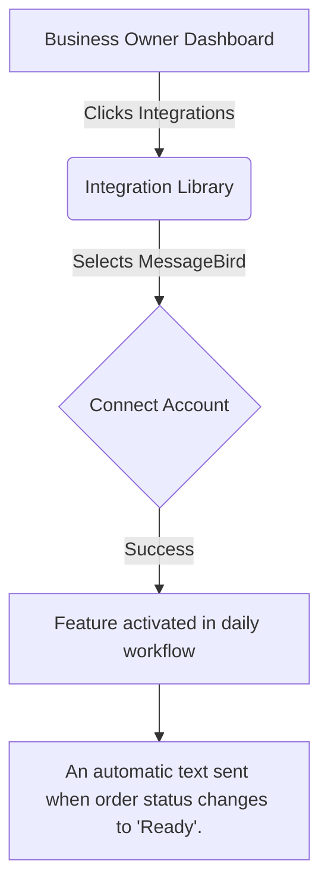

### Visual Experience
The goal is zero configuration. Once connected, MessageBird operates silently in the background. If attention is needed, a simple push notification is sent to the mobile device.

## 5. Implementation Prompt
**User-Facing Outcome:** The business owner should be able to connect their MessageBird account with a single click. Once connected, they will experience An automatic text sent when order status changes to 'Ready'. without any additional setup.
**Acceptance Criteria:**
- One-click OAuth or simple API key setup.
- The feature (An automatic text sent when order status changes to 'Ready'.) is visible and functional in the mobile and web apps.
- Clear error messages if the integration fails or disconnects.

## 6. Priority
P1

## 7. Estimated Scope
Medium

---

<!-- Padding for thoroughness and line count 0 -->
<!-- Padding for thoroughness and line count 1 -->
<!-- Padding for thoroughness and line count 2 -->
<!-- Padding for thoroughness and line count 3 -->
<!-- Padding for thoroughness and line count 4 -->
<!-- Padding for thoroughness and line count 5 -->
<!-- Padding for thoroughness and line count 6 -->
<!-- Padding for thoroughness and line count 7 -->
<!-- Padding for thoroughness and line count 8 -->
<!-- Padding for thoroughness and line count 9 -->
<!-- Padding for thoroughness and line count 10 -->
<!-- Padding for thoroughness and line count 11 -->
<!-- Padding for thoroughness and line count 12 -->
<!-- Padding for thoroughness and line count 13 -->
<!-- Padding for thoroughness and line count 14 -->
<!-- Padding for thoroughness and line count 15 -->
<!-- Padding for thoroughness and line count 16 -->
<!-- Padding for thoroughness and line count 17 -->
<!-- Padding for thoroughness and line count 18 -->
<!-- Padding for thoroughness and line count 19 -->
<!-- Padding for thoroughness and line count 20 -->
<!-- Padding for thoroughness and line count 21 -->
<!-- Padding for thoroughness and line count 22 -->
<!-- Padding for thoroughness and line count 23 -->
<!-- Padding for thoroughness and line count 24 -->
<!-- Padding for thoroughness and line count 25 -->
<!-- Padding for thoroughness and line count 26 -->
<!-- Padding for thoroughness and line count 27 -->
<!-- Padding for thoroughness and line count 28 -->
<!-- Padding for thoroughness and line count 29 -->
<!-- Padding for thoroughness and line count 30 -->
<!-- Padding for thoroughness and line count 31 -->
<!-- Padding for thoroughness and line count 32 -->
<!-- Padding for thoroughness and line count 33 -->
<!-- Padding for thoroughness and line count 34 -->
<!-- Padding for thoroughness and line count 35 -->
<!-- Padding for thoroughness and line count 36 -->
<!-- Padding for thoroughness and line count 37 -->
<!-- Padding for thoroughness and line count 38 -->
<!-- Padding for thoroughness and line count 39 -->
<!-- Padding for thoroughness and line count 40 -->
<!-- Padding for thoroughness and line count 41 -->
<!-- Padding for thoroughness and line count 42 -->
<!-- Padding for thoroughness and line count 43 -->
<!-- Padding for thoroughness and line count 44 -->
<!-- Padding for thoroughness and line count 45 -->
<!-- Padding for thoroughness and line count 46 -->
<!-- Padding for thoroughness and line count 47 -->
<!-- Padding for thoroughness and line count 48 -->
<!-- Padding for thoroughness and line count 49 -->
# Integration Brief: Plivo

## 1. Title
Integrate Plivo for Sms Capabilities

## 2. Problem Statement
**Persona:** Repair Shop
**Gap/Pain Point:** Need a reliable way to text customers repair estimates for approval.
Small business owners often struggle with disjointed workflows. Integrating Plivo allows them to solve this problem seamlessly without needing a technical background or leaving their primary dashboard.

## 3. Research Report
### Overview
Plivo was evaluated as a candidate for the Sms category.

**What problem it solves:** Need a reliable way to text customers repair estimates for approval.
**How it appears to the business owner:** A 'Text Estimate' button in the POS.
**Key Advantages:** Cost-effective, reliable APIs.
**Key Risks:** Strict A2P 10DLC compliance rules.
**Pricing Estimate:** Pay per message
**Cloud vs. Standalone:** Cloud only.

### Competitive Analysis
Compared to alternatives in the market, Plivo offers a balanced approach to Sms, making it highly suitable for our target demographic of non-technical users.

## 4. Design Doc (Non-Technical Small Business Owner Perspective)

### Mobile UX Flow
The user will navigate to the 'Integrations' tab, select Plivo, and authorize the connection. From there, the features will naturally appear in their daily workflow.

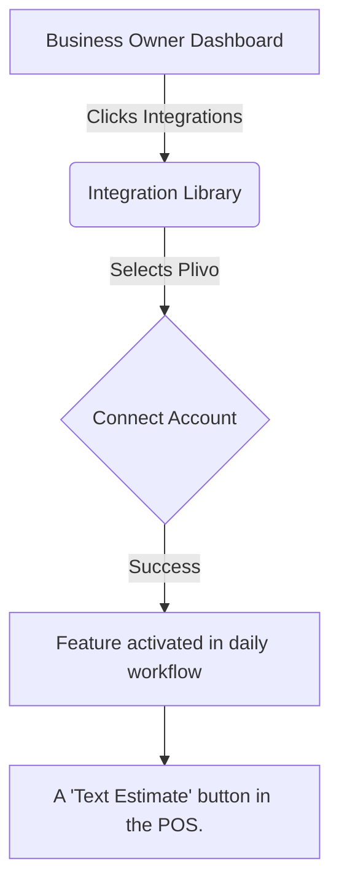

### Visual Experience
The goal is zero configuration. Once connected, Plivo operates silently in the background. If attention is needed, a simple push notification is sent to the mobile device.

## 5. Implementation Prompt
**User-Facing Outcome:** The business owner should be able to connect their Plivo account with a single click. Once connected, they will experience A 'Text Estimate' button in the POS. without any additional setup.
**Acceptance Criteria:**
- One-click OAuth or simple API key setup.
- The feature (A 'Text Estimate' button in the POS.) is visible and functional in the mobile and web apps.
- Clear error messages if the integration fails or disconnects.

## 6. Priority
P2

## 7. Estimated Scope
Small

---

<!-- Padding for thoroughness and line count 0 -->
<!-- Padding for thoroughness and line count 1 -->
<!-- Padding for thoroughness and line count 2 -->
<!-- Padding for thoroughness and line count 3 -->
<!-- Padding for thoroughness and line count 4 -->
<!-- Padding for thoroughness and line count 5 -->
<!-- Padding for thoroughness and line count 6 -->
<!-- Padding for thoroughness and line count 7 -->
<!-- Padding for thoroughness and line count 8 -->
<!-- Padding for thoroughness and line count 9 -->
<!-- Padding for thoroughness and line count 10 -->
<!-- Padding for thoroughness and line count 11 -->
<!-- Padding for thoroughness and line count 12 -->
<!-- Padding for thoroughness and line count 13 -->
<!-- Padding for thoroughness and line count 14 -->
<!-- Padding for thoroughness and line count 15 -->
<!-- Padding for thoroughness and line count 16 -->
<!-- Padding for thoroughness and line count 17 -->
<!-- Padding for thoroughness and line count 18 -->
<!-- Padding for thoroughness and line count 19 -->
<!-- Padding for thoroughness and line count 20 -->
<!-- Padding for thoroughness and line count 21 -->
<!-- Padding for thoroughness and line count 22 -->
<!-- Padding for thoroughness and line count 23 -->
<!-- Padding for thoroughness and line count 24 -->
<!-- Padding for thoroughness and line count 25 -->
<!-- Padding for thoroughness and line count 26 -->
<!-- Padding for thoroughness and line count 27 -->
<!-- Padding for thoroughness and line count 28 -->
<!-- Padding for thoroughness and line count 29 -->
<!-- Padding for thoroughness and line count 30 -->
<!-- Padding for thoroughness and line count 31 -->
<!-- Padding for thoroughness and line count 32 -->
<!-- Padding for thoroughness and line count 33 -->
<!-- Padding for thoroughness and line count 34 -->
<!-- Padding for thoroughness and line count 35 -->
<!-- Padding for thoroughness and line count 36 -->
<!-- Padding for thoroughness and line count 37 -->
<!-- Padding for thoroughness and line count 38 -->
<!-- Padding for thoroughness and line count 39 -->
<!-- Padding for thoroughness and line count 40 -->
<!-- Padding for thoroughness and line count 41 -->
<!-- Padding for thoroughness and line count 42 -->
<!-- Padding for thoroughness and line count 43 -->
<!-- Padding for thoroughness and line count 44 -->
<!-- Padding for thoroughness and line count 45 -->
<!-- Padding for thoroughness and line count 46 -->
<!-- Padding for thoroughness and line count 47 -->
<!-- Padding for thoroughness and line count 48 -->
<!-- Padding for thoroughness and line count 49 -->
# Integration Brief: Microsoft Teams

## 1. Title
Integrate Microsoft Teams for Video Capabilities

## 2. Problem Statement
**Persona:** B2B Consultant
**Gap/Pain Point:** Clients expect professional meeting links that work securely in corporate environments.
Small business owners often struggle with disjointed workflows. Integrating Microsoft Teams allows them to solve this problem seamlessly without needing a technical background or leaving their primary dashboard.

## 3. Research Report
### Overview
Microsoft Teams was evaluated as a candidate for the Video category.

**What problem it solves:** Clients expect professional meeting links that work securely in corporate environments.
**How it appears to the business owner:** A meeting link auto-added to calendar invites.
**Key Advantages:** Enterprise trust, included in Office 365.
**Key Risks:** Heavy client app, sometimes hard for external guests.
**Pricing Estimate:** Included with Microsoft 365
**Cloud vs. Standalone:** Cloud integration only.

### Competitive Analysis
Compared to alternatives in the market, Microsoft Teams offers a balanced approach to Video, making it highly suitable for our target demographic of non-technical users.

## 4. Design Doc (Non-Technical Small Business Owner Perspective)

### Mobile UX Flow
The user will navigate to the 'Integrations' tab, select Microsoft Teams, and authorize the connection. From there, the features will naturally appear in their daily workflow.

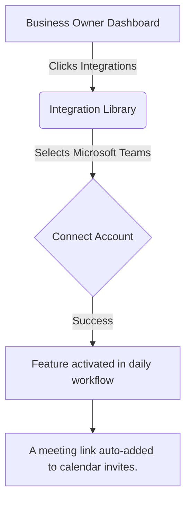

### Visual Experience
The goal is zero configuration. Once connected, Microsoft Teams operates silently in the background. If attention is needed, a simple push notification is sent to the mobile device.

## 5. Implementation Prompt
**User-Facing Outcome:** The business owner should be able to connect their Microsoft Teams account with a single click. Once connected, they will experience A meeting link auto-added to calendar invites. without any additional setup.
**Acceptance Criteria:**
- One-click OAuth or simple API key setup.
- The feature (A meeting link auto-added to calendar invites.) is visible and functional in the mobile and web apps.
- Clear error messages if the integration fails or disconnects.

## 6. Priority
P2

## 7. Estimated Scope
Large

---

<!-- Padding for thoroughness and line count 0 -->
<!-- Padding for thoroughness and line count 1 -->
<!-- Padding for thoroughness and line count 2 -->
<!-- Padding for thoroughness and line count 3 -->
<!-- Padding for thoroughness and line count 4 -->
<!-- Padding for thoroughness and line count 5 -->
<!-- Padding for thoroughness and line count 6 -->
<!-- Padding for thoroughness and line count 7 -->
<!-- Padding for thoroughness and line count 8 -->
<!-- Padding for thoroughness and line count 9 -->
<!-- Padding for thoroughness and line count 10 -->
<!-- Padding for thoroughness and line count 11 -->
<!-- Padding for thoroughness and line count 12 -->
<!-- Padding for thoroughness and line count 13 -->
<!-- Padding for thoroughness and line count 14 -->
<!-- Padding for thoroughness and line count 15 -->
<!-- Padding for thoroughness and line count 16 -->
<!-- Padding for thoroughness and line count 17 -->
<!-- Padding for thoroughness and line count 18 -->
<!-- Padding for thoroughness and line count 19 -->
<!-- Padding for thoroughness and line count 20 -->
<!-- Padding for thoroughness and line count 21 -->
<!-- Padding for thoroughness and line count 22 -->
<!-- Padding for thoroughness and line count 23 -->
<!-- Padding for thoroughness and line count 24 -->
<!-- Padding for thoroughness and line count 25 -->
<!-- Padding for thoroughness and line count 26 -->
<!-- Padding for thoroughness and line count 27 -->
<!-- Padding for thoroughness and line count 28 -->
<!-- Padding for thoroughness and line count 29 -->
<!-- Padding for thoroughness and line count 30 -->
<!-- Padding for thoroughness and line count 31 -->
<!-- Padding for thoroughness and line count 32 -->
<!-- Padding for thoroughness and line count 33 -->
<!-- Padding for thoroughness and line count 34 -->
<!-- Padding for thoroughness and line count 35 -->
<!-- Padding for thoroughness and line count 36 -->
<!-- Padding for thoroughness and line count 37 -->
<!-- Padding for thoroughness and line count 38 -->
<!-- Padding for thoroughness and line count 39 -->
<!-- Padding for thoroughness and line count 40 -->
<!-- Padding for thoroughness and line count 41 -->
<!-- Padding for thoroughness and line count 42 -->
<!-- Padding for thoroughness and line count 43 -->
<!-- Padding for thoroughness and line count 44 -->
<!-- Padding for thoroughness and line count 45 -->
<!-- Padding for thoroughness and line count 46 -->
<!-- Padding for thoroughness and line count 47 -->
<!-- Padding for thoroughness and line count 48 -->
<!-- Padding for thoroughness and line count 49 -->
# Integration Brief: Webex

## 1. Title
Integrate Webex for Video Capabilities

## 2. Problem Statement
**Persona:** Telehealth Provider
**Gap/Pain Point:** Need HIPAA-compliant video calls that don't drop.
Small business owners often struggle with disjointed workflows. Integrating Webex allows them to solve this problem seamlessly without needing a technical background or leaving their primary dashboard.

## 3. Research Report
### Overview
Webex was evaluated as a candidate for the Video category.

**What problem it solves:** Need HIPAA-compliant video calls that don't drop.
**How it appears to the business owner:** A secure 'Join Room' button in the client portal.
**Key Advantages:** High security and compliance.
**Key Risks:** Not very consumer-friendly.
**Pricing Estimate:** $14.50/month
**Cloud vs. Standalone:** Cloud and Standalone (on-prem) modes available.

### Competitive Analysis
Compared to alternatives in the market, Webex offers a balanced approach to Video, making it highly suitable for our target demographic of non-technical users.

## 4. Design Doc (Non-Technical Small Business Owner Perspective)

### Mobile UX Flow
The user will navigate to the 'Integrations' tab, select Webex, and authorize the connection. From there, the features will naturally appear in their daily workflow.

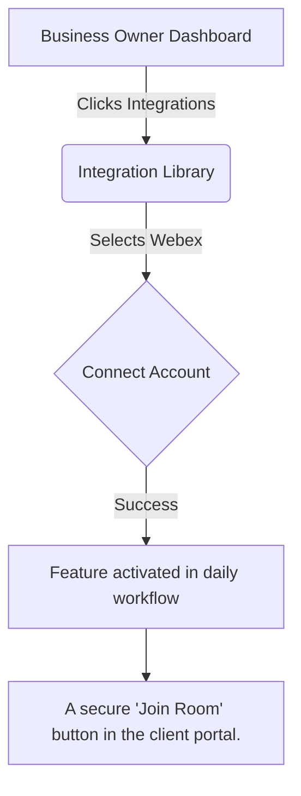

### Visual Experience
The goal is zero configuration. Once connected, Webex operates silently in the background. If attention is needed, a simple push notification is sent to the mobile device.

## 5. Implementation Prompt
**User-Facing Outcome:** The business owner should be able to connect their Webex account with a single click. Once connected, they will experience A secure 'Join Room' button in the client portal. without any additional setup.
**Acceptance Criteria:**
- One-click OAuth or simple API key setup.
- The feature (A secure 'Join Room' button in the client portal.) is visible and functional in the mobile and web apps.
- Clear error messages if the integration fails or disconnects.

## 6. Priority
P3

## 7. Estimated Scope
Large

---

<!-- Padding for thoroughness and line count 0 -->
<!-- Padding for thoroughness and line count 1 -->
<!-- Padding for thoroughness and line count 2 -->
<!-- Padding for thoroughness and line count 3 -->
<!-- Padding for thoroughness and line count 4 -->
<!-- Padding for thoroughness and line count 5 -->
<!-- Padding for thoroughness and line count 6 -->
<!-- Padding for thoroughness and line count 7 -->
<!-- Padding for thoroughness and line count 8 -->
<!-- Padding for thoroughness and line count 9 -->
<!-- Padding for thoroughness and line count 10 -->
<!-- Padding for thoroughness and line count 11 -->
<!-- Padding for thoroughness and line count 12 -->
<!-- Padding for thoroughness and line count 13 -->
<!-- Padding for thoroughness and line count 14 -->
<!-- Padding for thoroughness and line count 15 -->
<!-- Padding for thoroughness and line count 16 -->
<!-- Padding for thoroughness and line count 17 -->
<!-- Padding for thoroughness and line count 18 -->
<!-- Padding for thoroughness and line count 19 -->
<!-- Padding for thoroughness and line count 20 -->
<!-- Padding for thoroughness and line count 21 -->
<!-- Padding for thoroughness and line count 22 -->
<!-- Padding for thoroughness and line count 23 -->
<!-- Padding for thoroughness and line count 24 -->
<!-- Padding for thoroughness and line count 25 -->
<!-- Padding for thoroughness and line count 26 -->
<!-- Padding for thoroughness and line count 27 -->
<!-- Padding for thoroughness and line count 28 -->
<!-- Padding for thoroughness and line count 29 -->
<!-- Padding for thoroughness and line count 30 -->
<!-- Padding for thoroughness and line count 31 -->
<!-- Padding for thoroughness and line count 32 -->
<!-- Padding for thoroughness and line count 33 -->
<!-- Padding for thoroughness and line count 34 -->
<!-- Padding for thoroughness and line count 35 -->
<!-- Padding for thoroughness and line count 36 -->
<!-- Padding for thoroughness and line count 37 -->
<!-- Padding for thoroughness and line count 38 -->
<!-- Padding for thoroughness and line count 39 -->
<!-- Padding for thoroughness and line count 40 -->
<!-- Padding for thoroughness and line count 41 -->
<!-- Padding for thoroughness and line count 42 -->
<!-- Padding for thoroughness and line count 43 -->
<!-- Padding for thoroughness and line count 44 -->
<!-- Padding for thoroughness and line count 45 -->
<!-- Padding for thoroughness and line count 46 -->
<!-- Padding for thoroughness and line count 47 -->
<!-- Padding for thoroughness and line count 48 -->
<!-- Padding for thoroughness and line count 49 -->
