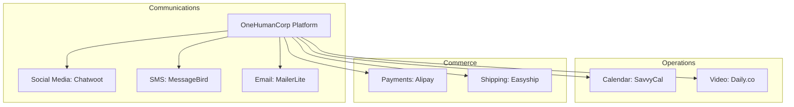

# Scout: Tool Integration Research Q3

## Executive Summary
This report summarizes the research into 7 key integration categories critical for small business owners using OneHumanCorp (OHC). The goal is to identify tools that reduce friction for non-technical users in both Cloud and Standalone environments. The focus is on the "User-First Lens," evaluating tools based on ease of use, pricing, and specific pain points faced by users like Fatima.

## Competitive Landscape & Feature Gap

## Persona Pain Points & Solutions

| Category | Persona Pain Point | Recommended Tool | Key Benefit |
| :--- | :--- | :--- | :--- |
| **Social Media** | Overwhelmed by managing WhatsApp, IG, FB messages separately. | **Chatwoot** | Open-source, unified inbox that simplifies cross-channel communication. |
| **Calendar** | Email ping-pong for scheduling; intimidating links. | **SavvyCal** | Collaborative scheduling interface that overlays calendars. |
| **Email Marketing** | Mailchimp is too complex and expensive for basic newsletters. | **MailerLite** | Simple, affordable, drag-and-drop builder for beginners. |
| **Payments** | Western processors don't work for target demographics (e.g., China). | **Alipay** | Essential for Chinese market penetration; seamless QR payments. |
| **Shipping** | Calculating rates and printing labels manually is error-prone. | **Easyship** | Global courier network integration with a free tier for small volume. |
| **SMS** | Customers ignore emails; need reliable urgent notifications. | **MessageBird** | Reliable global SMS API for automated updates (e.g., shipping, appointments). |
| **Video** | Clients struggle with Zoom downloads and passwords. | **Daily.co** | Frictionless, embedded video calls in the browser. |

## Detailed Findings

### 1. Social Media: Chatwoot
- **Why**: Small business owners need a unified inbox. Chatwoot is open-source, meaning it can be completely self-hosted in Standalone mode or consumed as a service in Cloud mode.
- **Risk**: Setting up the initial webhooks for platforms like WhatsApp Business API can still be technical, requiring OHC to build a very smooth onboarding wrapper.

### 2. Calendar: SavvyCal
- **Why**: It removes the awkward power dynamic of Calendly by allowing the recipient to overlay their own calendar. It's modern and user-friendly.
- **Risk**: It's a cloud-first SaaS. Standalone users will still be relying on a cloud service for scheduling.

### 3. Email Marketing: MailerLite
- **Why**: It's significantly cheaper than Mailchimp and has an interface specifically designed for beginners who just want to send a simple update.
- **Risk**: Requires internet access to sync lists and trigger sends, even in Standalone mode.

### 4. Payments: Alipay
- **Why**: For businesses targeting Chinese consumers, Stripe is insufficient. Alipay is mandatory.
- **Risk**: Merchant onboarding for Alipay outside of China involves significant regulatory paperwork.

### 5. Shipping: Easyship
- **Why**: It aggregates multiple couriers, giving small businesses access to better rates without needing individual accounts with DHL, FedEx, etc.
- **Risk**: Label generation requires accurate weight/dimension data, which users often fail to input correctly.

### 6. SMS: MessageBird
- **Why**: SMS is critical for reminders. MessageBird offers a robust API with competitive global pricing.
- **Risk**: SMS pricing varies wildly by country, requiring OHC to carefully manage credit consumption to avoid unexpected costs for the user.

### 7. Video: Daily.co
- **Why**: Embedded video (WebRTC) is vastly superior to launching external apps like Zoom for simple consultations.
- **Risk**: WebRTC performance is highly dependent on the end-user's local network and browser capabilities.

## Recommendations & Next Steps
1. **Immediate Action**: Prioritize the integration of **Chatwoot** (P0). The unified inbox solves the most acute daily pain point for users managing customer communications.
2. **Short-Term Goal**: Implement **SavvyCal** and **MailerLite** (P1) to improve scheduling and marketing capabilities.
3. **Long-Term Strategy**: Develop robust wrappers for **Alipay** and **Daily.co** (P2), as these require more complex UI integration and regulatory/technical handling.
