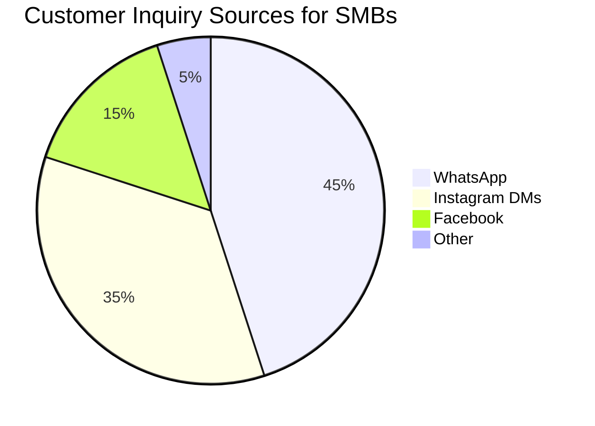
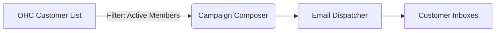
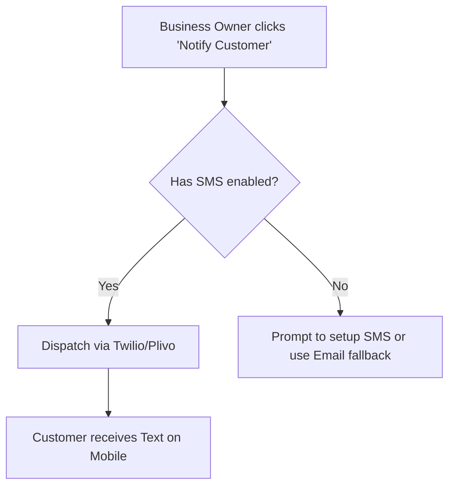

# OHC Integration Research Report Q4

This document outlines seven high-impact integrations tailored to the needs of non-technical small business owners using OHC. Each integration focuses on resolving specific pain points while maximizing ease of use, delivering a simplified experience whether the user is on Cloud or Standalone mode.

---

## [Social Media Integration] Unified Inbox for Instagram, Facebook, and WhatsApp

**Title**: Unified Social Media Inbox Integration

**Problem Statement**:
Small business owners, especially those running boutiques, bakeries, or local service shops, are overwhelmed by managing customer messages across multiple platforms. They miss messages on Instagram DMs, forget to reply to WhatsApp inquiries, and lose track of Facebook comments. They need a single, unified inbox to view and respond to all customer interactions without constantly switching apps.

**Research Report**:
Our research highlights the need for a consolidated communication hub. Integrating Meta’s Graph API and WhatsApp Business API offers the highest coverage for our target audience.
*   **Target Persona**: Fatima, a local bakery owner who receives cake orders via WhatsApp and Instagram DMs.
*   **Benefits**: Reduces missed opportunities, accelerates response times, and centralizes customer history.
*   **Pricing Estimate**: Meta APIs are largely free for standard usage, though WhatsApp Business API charges per conversation (approx. $0.01 - $0.08 depending on region). We can start with free-tier capabilities for basic DMs and comments.
*   **Cloud vs. Standalone**:
    *   *Cloud*: Seamless OAuth integration where OHC manages the webhook subscriptions on behalf of the tenant.
    *   *Standalone*: The business owner provides their own Meta App ID and Secret, with OHC guiding them through a simplified setup wizard to configure local webhooks (potentially using a secure tunnel or polling mechanism if local).

| Feature | Instagram DMs | Facebook Comments | WhatsApp |
| :--- | :--- | :--- | :--- |
| **Media Support** | Yes (Images/Video) | Text mostly | Full (Docs, Images, Voice) |
| **Complexity to Setup** | Medium (OAuth) | Medium (OAuth) | High (Requires verified business) |
| **User Value** | Very High | Medium | Critical in LATAM/Asia |

**Design Doc**:
The OHC dashboard will feature a new "Unified Inbox" icon. When clicked, users will be prompted to connect their Facebook/Instagram and WhatsApp accounts using a "Connect" button. Once authenticated, incoming messages will flow into a chat-like interface within OHC. Users can type a reply, hit send, and OHC routes the message back to the native platform. The system will sync the conversation history and attach it to the relevant customer profile if they exist in the OHC CRM.

**Implementation Prompt**:
Build a unified messaging interface in the OHC app that aggregates messages from connected Instagram and WhatsApp accounts.
*   **Acceptance Criteria**:
    *   A settings page exists to authorize Instagram and WhatsApp with one-click OAuth (or API key input for Standalone).
    *   Incoming messages appear in a real-time, consolidated feed.
    *   Replies sent from OHC successfully reach the customer on their original platform.
    *   The UI must clearly indicate which platform the message originated from (e.g., a small WhatsApp or Instagram icon next to the message bubble).

**Priority**: P1
**Estimated Scope**: Large

---

## [Calendar & Scheduling] Smart Booking with Google Calendar & Outlook

**Title**: Smart Calendar Sync & Automated Booking Links

**Problem Statement**:
Service-based business owners (consultants, tutors, salon owners) waste hours playing "email tag" with clients to find a suitable meeting time. Manually updating their availability and sending out Zoom or physical address details is prone to human error and double-booking. They need a simple link they can text or email to clients to let them book a time automatically based on their real availability.

**Research Report**:
We evaluated integrating standard iCal, Google Calendar API, and Microsoft Graph API. Providing a native scheduling tool inside OHC that syncs bidirectionally with the owner's existing Google/Outlook calendar is the most frictionless approach.
*   **Target Persona**: Sarah, an independent tax consultant who meets clients virtually and in-person.
*   **Benefits**: Eliminates double-booking, looks professional to clients, and saves administrative time.
*   **Pricing Estimate**: Free (utilizing standard OAuth integrations with Google/Microsoft).
*   **Cloud vs. Standalone**:
    *   *Cloud*: OHC handles standard OAuth flows and maintains background sync.
    *   *Standalone*: User configures OAuth credentials locally, and the OHC server periodically fetches calendar updates.

| Provider | Sync Reliability | Setup Difficulty for SMB |
| :--- | :--- | :--- |
| **Google Calendar** | Excellent | Very Low (Standard Google Sign-in) |
| **Outlook / Office 365** | Good | Low (Microsoft Login) |

**Design Doc**:
Under a "Bookings" tab, the owner can set their working hours (e.g., 9 AM - 5 PM) and connect their personal/work calendar. OHC will generate a public-facing booking page (e.g., `mybusiness.ohc.com/book`). When a client visits this page, they see available slots that automatically exclude times where the owner is busy. Once booked, OHC adds the event to the owner's calendar and sends a confirmation email to the client.

**Implementation Prompt**:
Create a bidirectional calendar sync feature and a public booking page for OHC users.
*   **Acceptance Criteria**:
    *   Users can connect a Google or Outlook calendar.
    *   Users can define their weekly working hours and session durations.
    *   A public, shareable link displays a calendar UI where clients can select an available time.
    *   Booked slots immediately block out time on the connected calendar and create an event with the client's details.

**Priority**: P0
**Estimated Scope**: Large

---

## [Email Marketing] Simplified Customer Newsletters

**Title**: Integrated Email Campaign Manager

**Problem Statement**:
Small business owners want to inform their existing customers about promotions, holiday hours, or new services, but tools like Mailchimp are too complicated and expensive. They just want to select a group of customers from their OHC list and send them a beautiful, branded email without dealing with HTML or confusing list segments.

**Research Report**:
Integrating with an email sending service (like SendGrid or AWS SES) underneath a heavily simplified OHC UI provides the best balance of power and simplicity.
*   **Target Persona**: John, a gym owner who wants to email all members about a new yoga class.
*   **Benefits**: Drives repeat business and keeps the brand top-of-mind.
*   **Pricing Estimate**: SendGrid costs ~$19.95/mo for up to 50k emails. OHC could absorb this for Cloud users or pass it through as a premium feature. Standalone users can plug in their own SMTP credentials.
*   **Cloud vs. Standalone**:
    *   *Cloud*: Pre-configured routing via OHC's master email infrastructure with strict anti-spam limits.
    *   *Standalone*: Users provide custom SMTP details (e.g., standard Gmail or basic SendGrid account).

**Design Doc**:
A "Marketing" section allows the owner to draft an email using a simple rich-text editor with a few visual templates (e.g., "Announcement", "Discount"). They can select recipients simply by checking boxes next to customer groups (e.g., "All Customers", "Recent Customers"). The system handles the required unsubscribe links and basic open-rate tracking automatically.

**Implementation Prompt**:
Implement a simple email campaign tool linked to the OHC customer database.
*   **Acceptance Criteria**:
    *   Users can write an email subject and body using a simple WYSIWYG editor.
    *   Users can select recipients from their existing OHC customer list.
    *   Sent emails include a mandatory "Unsubscribe" footer.
    *   A basic dashboard shows how many emails were sent and successfully delivered.

**Priority**: P2
**Estimated Scope**: Medium

---

## [Payment Processing] Localized Payment Gateways

**Title**: Multi-Region Payment Integration (Mercado Pago, Razorpay)

**Problem Statement**:
While Stripe is excellent, it is not universally adopted or cost-effective in all regions. A business owner in Brazil prefers Mercado Pago, while one in India needs Razorpay. Small business owners lose sales when they cannot offer the payment methods their local customers trust and expect.

**Research Report**:
To make OHC truly global, we must move beyond a monolithic Stripe integration. Supporting regional leaders significantly lowers the barrier to entry for international SMBs.
*   **Target Persona**: Carlos, a retailer in Mexico who needs to accept payments via OXXO and local credit cards through Mercado Pago.
*   **Benefits**: Increases checkout conversion rates and lowers transaction fees for international merchants.
*   **Pricing Estimate**: Standard gateway fees (typically 2-3% + fixed local currency fee per transaction). Free to integrate into OHC.
*   **Cloud vs. Standalone**: Fully functional in both modes. Standalone users simply input their regional gateway API keys to process direct payments.

| Gateway | Primary Region | Key Benefit for SMB |
| :--- | :--- | :--- |
| **Stripe** | US / Europe | Standardized, robust |
| **Mercado Pago** | LATAM | High trust, local payment methods (e.g., PIX, OXXO) |
| **Razorpay** | India | UPI support, high local conversion |

**Design Doc**:
In the "Payments" settings, the owner will see a dropdown to select their primary payment provider. The fields will dynamically update to request the specific keys needed for that provider (e.g., `Public Key` and `Access Token` for Mercado Pago). Once connected, any invoices sent from OHC or checkout links generated will route the customer to the selected provider's secure hosted checkout page.

**Implementation Prompt**:
Abstract the current payment logic to support pluggable providers, starting with Mercado Pago as the first alternative to Stripe.
*   **Acceptance Criteria**:
    *   A settings page allows the user to choose between "Stripe" and "Mercado Pago".
    *   Invoices generated by OHC include a "Pay Now" button that links to the active provider's checkout flow.
    *   Successful payments update the invoice status to "Paid" in OHC via webhook or polling.

**Priority**: P1
**Estimated Scope**: Medium

---

## [Shipping & Logistics] Automated Shipping Labels and Rates

**Title**: Seamless Shipping Label Generation

**Problem Statement**:
For local artisans or e-commerce sellers, fulfilling an order is a manual nightmare. They have to copy-paste customer addresses into a separate carrier website, guess the package weight, pay for a label, download it, print it, and then email the tracking number back to the customer.

**Research Report**:
Integrating an API like Shippo or EasyPost provides access to dozens of carriers (USPS, FedEx, UPS, DHL) through a single interface.
*   **Target Persona**: Emma, who makes custom jewelry and ships 20 packages a week.
*   **Benefits**: Saves significant time per order, reduces manual address errors, and provides discounted shipping rates.
*   **Pricing Estimate**: EasyPost charges ~$0.05 per label generated. SMBs pay the actual postage cost.
*   **Cloud vs. Standalone**: Works in both. In Cloud, OHC could potentially broker the account. In Standalone, the user creates an EasyPost account and inputs the API key.

**Design Doc**:
When viewing a "Pending Order" in OHC, a new "Create Shipping Label" button appears. The system auto-fills the customer's shipping address. The owner selects the box size and weight (which can be saved as defaults). OHC fetches live rates (e.g., "USPS Priority - $8.50"). The owner clicks "Buy Label", and OHC generates a printable PDF and automatically emails the tracking link to the customer.

**Implementation Prompt**:
Build an order fulfillment workflow that generates real shipping labels via EasyPost or a similar aggregator API.
*   **Acceptance Criteria**:
    *   Users can generate a real shipping label for an order with a single click.
    *   The system displays live pricing options from carriers before purchase.
    *   Purchasing a label provides a printable PDF.
    *   The order status automatically changes to "Shipped" and the tracking number is saved to the order record.

**Priority**: P2
**Estimated Scope**: Large

---

## [SMS & Notifications] Global SMS Alerts

**Title**: Reliable SMS Customer Notifications

**Problem Statement**:
Email open rates can be low, and some customer segments don't use email frequently. When a business needs to send an urgent update—like "Your car is ready for pickup" or "Your appointment is in 1 hour"—they need a reliable text message. Manually texting from a personal phone mixes business with personal life and cannot be tracked by the team.

**Research Report**:
Twilio or Plivo are industry standards. We must design this so the business owner doesn't need to understand "short codes" or "A2P 10DLC compliance" — OHC should abstract this complexity.
*   **Target Persona**: David, an auto mechanic who needs to text customers when their vehicle repairs are completed.
*   **Benefits**: Immediate customer awareness, higher show-up rates for appointments, professional appearance.
*   **Pricing Estimate**: ~$0.0079 per message via Twilio.
*   **Cloud vs. Standalone**:
    *   *Cloud*: OHC handles the routing and bills the tenant for usage.
    *   *Standalone*: User inputs their own Twilio Account SID and Auth Token.

**Design Doc**:
Within a customer profile or appointment view, a "Send Text" button opens a small dialogue box. OHC will provide templated messages ("Your order is ready!", "Reminder: Appointment tomorrow") or allow custom text. The owner clicks send, and the message is delivered. Customer replies will be routed back into the OHC Unified Inbox (if implemented) or forwarded to the owner's email.

**Implementation Prompt**:
Integrate SMS sending capabilities for appointment reminders and manual notifications.
*   **Acceptance Criteria**:
    *   Users can manually send an SMS to a customer's phone number directly from their profile.
    *   The system can automatically send an SMS reminder 24 hours before a scheduled event.
    *   A settings page allows standalone users to input their Twilio API credentials.
    *   The UI handles invalid phone number errors gracefully.

**Priority**: P1
**Estimated Scope**: Medium

---

## [Video Conferencing] Auto-Generated Meeting Links

**Title**: Instant Zoom & Google Meet Generation

**Problem Statement**:
Tutors, therapists, and consultants who offer remote services have to manually create a Zoom meeting, copy the link, and paste it into a calendar invite for every single client. This repetitive task leads to mistakes, like sending the wrong link to the wrong client, causing confusion and lost revenue.

**Research Report**:
Integrating Zoom API or utilizing Google Calendar's native "Add Meet Conference" feature handles this automatically.
*   **Target Persona**: Elena, a language tutor who does 5 virtual lessons a day.
*   **Benefits**: Zero manual link management, perfect accuracy, frictionless client experience.
*   **Pricing Estimate**: Free (Zoom basic tier API / Google Calendar native).
*   **Cloud vs. Standalone**: Fully supported in both modes via standard OAuth token management.

**Design Doc**:
This feature integrates tightly with the "Calendar & Scheduling" module. When a business owner sets up a service type (e.g., "1-Hour Consultation"), they can toggle a switch: "Online Meeting". If toggled, OHC will automatically generate a unique Zoom or Google Meet link whenever a client books this service. The generated link is prominently displayed on the OHC dashboard for the owner and included in the automated email sent to the client.

**Implementation Prompt**:
Extend the booking and appointment system to automatically generate video conferencing links for remote services.
*   **Acceptance Criteria**:
    *   Users can authenticate their Zoom account or use their connected Google account.
    *   When an online appointment is created, a unique video link is generated automatically.
    *   The link is saved in the OHC database and visible on the appointment details page.
    *   The link is included in the confirmation notification sent to the customer.

**Priority**: P2
**Estimated Scope**: Small
