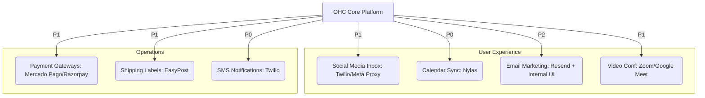

# 🔬 OHC Tool Integration Research Report Q4

## Executive Summary
This report evaluates third-party tool integrations to expand OHC's capabilities for small business owners in both Cloud (multi-tenant) and Standalone (local, private) environments. The focus is strictly on tools that solve direct pain points for non-technical users, abstracting away configuration complexity ("Grandmother Test").

We have identified and analyzed tools across seven distinct categories: Social Media, Calendar & Scheduling, Email Marketing, Payment Processing, Shipping & Logistics, SMS Notifications, and Video Conferencing.

## 📊 Integration Landscape (Mermaid Chart)

## 🔍 Tool Evaluation & Persona Mapping

| Category | Recommended Tool(s) | Primary Persona | Cloud Compat | Standalone Compat | Key Risk / Consideration |
| :--- | :--- | :--- | :--- | :--- | :--- |
| **Calendar & Scheduling** | Nylas | Service Providers (Coaches, Tutors) | ✅ Native | ⚠️ Needs webhook relay / polling fallback | Cost per connected user |
| **SMS Notifications** | Twilio | Businesses serving low-tech demographics | ✅ Native | ⚠️ Needs webhook relay for inbound | A2P 10DLC compliance burden |
| **Social Media** | Twilio / Meta APIs | Retail, Online Sellers | ✅ Native | ⚠️ Needs webhook relay | Complex Meta OAuth flows |
| **Payment Processing** | Mercado Pago, Razorpay | International Merchants (LATAM, India) | ✅ Native | ⚠️ Needs webhook relay / robust polling | Localization of checkout UI |
| **Shipping & Logistics** | EasyPost | Physical Product Sellers | ✅ Native | ✅ Polling acceptable for tracking | Carrier rate variations |
| **Video Conferencing** | Google Meet, Zoom | Remote Service Providers | ✅ Native | ✅ Native API Calls | Managing Zoom OAuth |
| **Email Marketing** | Resend (with native OHC UI) | All Personas | ✅ Native | ⚠️ Needs webhook relay for bounces | Building a good WYSIWYG editor |

## 💡 Evidence-Based Recommendations & Next Steps

1. **Prioritize Calendar and SMS (P0):** The inability to reliably schedule meetings without conflicts and the drop-off in customer engagement due to missed emails are immediate, critical pain points. Nylas and Twilio (outbound) should be the first integrations.
2. **Address the Standalone Webhook Gap:** Almost every crucial integration relies on webhooks (incoming messages, payment confirmations, calendar updates). For the Standalone mode to maintain feature parity, OHC *must* develop a reliable, secure webhook relay service or robust polling fallback mechanisms where applicable (like EasyPost tracking or Calendar sync).
3. **Abstract Compliance Complexity:** For SMS (A2P 10DLC) and Social Media (Meta Business Manager), the technical bureaucracy is too high for a small business owner. OHC must act as the primary registration entity or build extremely streamlined, guided UI flows to hide these requirements.
4. **Develop Issue Briefs:** Detailed issue briefs have been generated and stored in `./docs/research/` for the implementation teams to begin architectural design and execution.