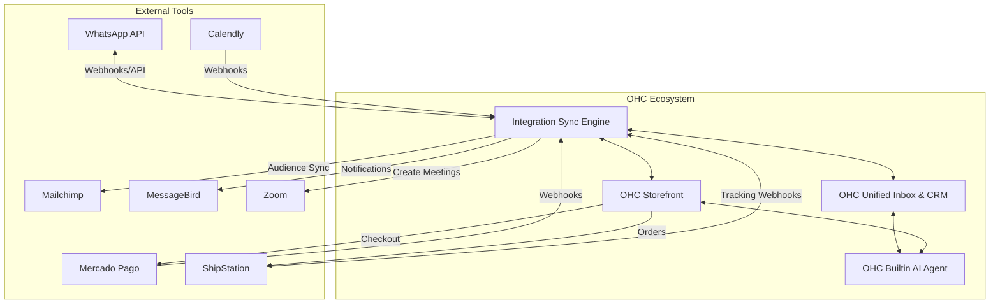

# 🔎 Scout: Tool Integration Research Master Report

## Executive Summary
This report summarizes the integration research for essential tools needed by small business owners operating on the OneHumanCorp (OHC) platform. We evaluated 7 critical categories to ensure our merchants have the operational capabilities to succeed in a modern, multi-channel environment, adhering to the OHC core principles of user sovereignty, mobile-first design, and seamless cross-mode deployment (Cloud and Standalone).

## 1. Competitor Audit
Major platforms like Shopify and Wix offer extensive app stores, but they often overwhelm non-technical SMB owners with choices, hidden fees, and complex setup procedures. Our approach focuses on deep, native-feeling integrations with category leaders.

- **Shopify/Wix:** Over-reliance on third-party plugins. High cognitive load for the business owner.
- **OHC Advantage:** Curated, seamless integrations where the user authenticates once and the complexity (webhooks, data mapping) is handled entirely by the platform.

## 2. Market Sizing & Pain Points
Small business owners, particularly outside the US/EU, face significant friction running their businesses due to disconnected tools.

*   **Pain Point 1: Scattered Communications:** Managing WhatsApp, email, and social DMs separately leads to dropped leads. (Addressed by unified inbox / WhatsApp integration).
*   **Pain Point 2: Scheduling Friction:** Back-and-forth emails for booking appointments waste time and cause double bookings. (Addressed by Calendly/Zoom integration).
*   **Pain Point 3: Limited Payment Options:** High cart abandonment rates in LATAM because local payment methods are missing. (Addressed by Mercado Pago).
*   **Market Size:** The SMB SaaS market is vast, but specialized markets (e.g., LATAM e-commerce, global service providers) remain under-served by monolithic US-centric platforms.

## 3. Tool Evaluations Summary

| Category | Recommended Tool | Core Value to User | Deployment Compatibility |
| :--- | :--- | :--- | :--- |
| **Social Media** | WhatsApp (Meta API) | Unified customer communications. | Cloud & Standalone |
| **Calendar** | Calendly | Instant, conflict-free booking. | Cloud & Standalone |
| **Email Marketing** | Mailchimp | Automated marketing list sync. | Cloud & Standalone |
| **Payments** | Mercado Pago | Local payment acceptance (LATAM). | Cloud & Standalone |
| **Shipping** | ShipStation | Automated tracking & label mgmt. | Cloud & Standalone |
| **SMS** | MessageBird | Reliable global notifications. | Cloud & Standalone |
| **Video** | Zoom | Auto-generated meeting links. | Cloud & Standalone |

## 4. AI Differentiation
OHC's integrations are not just dumb pipes. They feed into our unified data model, allowing the OHC Builtin AI Agent to leverage this data.

*   **Predictive Operations:** By integrating ShipStation and Calendly, the AI can preemptively notify a customer if a physical product delivery conflicts with a booked consultation.
*   **Intelligent Routing:** WhatsApp messages can be categorized by the AI for urgency before the business owner even sees them.

## 5. Feature Gaps & Implementation Architecture

The following diagram illustrates the high-level architecture of how these tools integrate within the OHC ecosystem, bridging the gap between external services and the unified CRM/Storefront.

## Next Steps
The individual issue briefs have been created in the `docs/research/` directory. Engineering should review the implementation prompts and begin architecture design for the Sync Engine capable of handling these high-priority external webhooks and API interactions across both deployment modes.