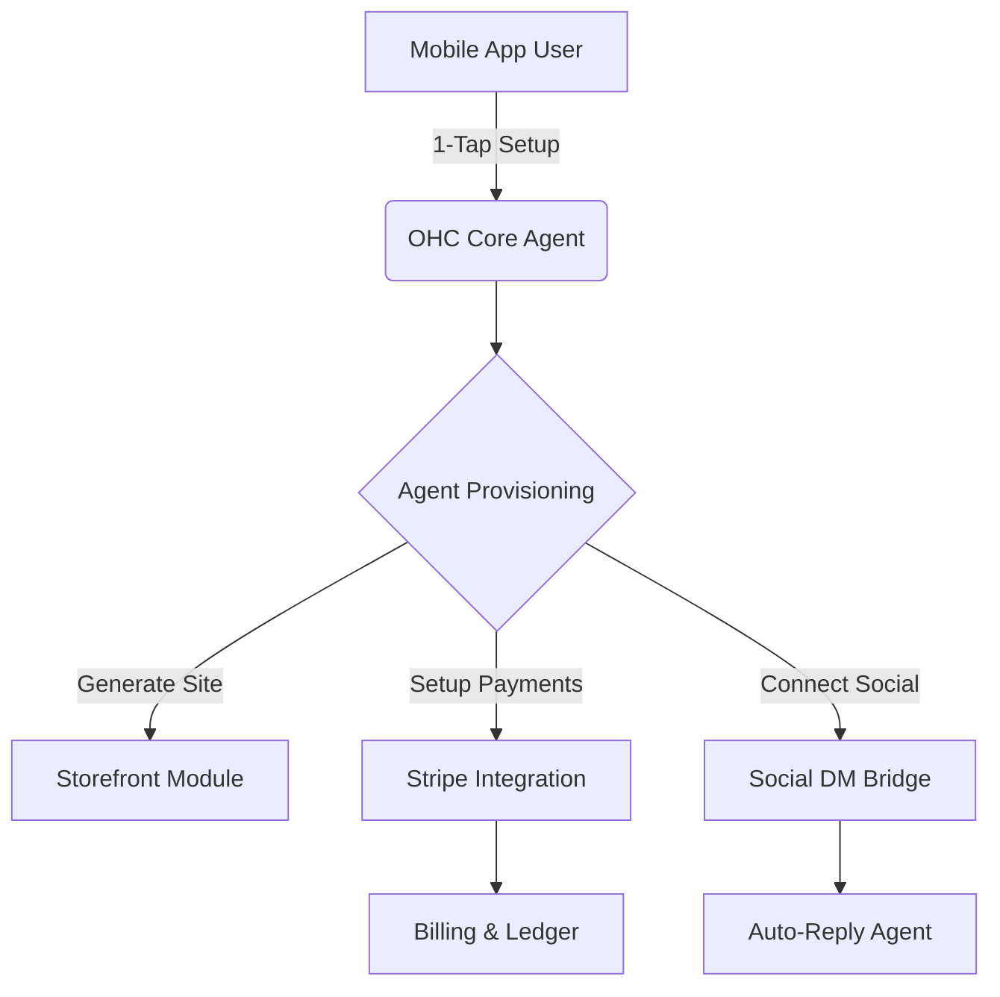

# Title
OHC Small Business Platform Research Report: Invisible Agent Integration for Social DM

# Problem Statement
Non-technical small business owners (SMBs) are currently underserved by the market. Existing platforms like Shopify and Wix are designed for desktop-first, highly involved setups, overwhelming users with complex interfaces, lack of native mobile management, and minimal invisible AI automation.

# Research Report

### 1. Track 1: Deep Competitor Audit
We studied the major platforms targeting SMBs:

- **Shopify:** Industry standard, but extremely complex for true beginners. "Shopify Sidekick" is a chatbot, not an autonomous agent. Mobile app is poor for initial store setup.
- **Wix:** Easier setup with "Wix ADI" (one-time website generation), but not ongoing agentic automation.
- **Squarespace:** Beautiful but lacks strong AI features and meaningful free tiers.
- **Square Online:** Strong POS integration, but restaurant/retail heavy.
- **Rising Entrants (Durable, 10Web, Hocoos):** Provide rapid generation but thin post-launch business management.

### 2. Track 2: SMB User Pain Point Research
Based on Reddit (r/smallbusiness, r/ecommerce), Trustpilot, and App Store reviews, the **Top 10 SMB Pain Points** are:
1. Setting up payments and tax is confusing and scary.
2. Instagram DMs are chaotic to track for orders (Maya the baker).
3. Missing mobile-first management features (Carlos the handyman).
4. Writing product descriptions takes too much time.
5. Inventory sync between in-person and online is broken (Priya the boutique owner).
6. Blank-canvas website builders are overwhelming.
7. Manual booking is clunky and leads to missed appointments (Leo the tutor).
8. Email marketing feels disconnected and hard.
9. Answering repetitive customer questions.
10. Limited English support (Fatima the food cart owner).

**Persona-specific pain points:**
- **Maya (baker, 28):** Cannot manage Instagram DM orders easily from her phone.
- **Carlos (handyman, 42):** Misses leads because he has no automated quoting/booking.
- **Priya (boutique owner, 35):** Struggles to sync physical and digital inventory.
- **Leo (music tutor, 22):** Wants subscription billing and auto-reminders.
- **Fatima (food cart, 50):** Needs simple, non-English mobile notifications and printing.

### 3. Track 3: AI Differentiation
**OHC AI Differentiation Manifesto:**
We will leapfrog competitors not by adding chat, but by adding *invisible agents*.
1. **Auto-replying to customer messages** (Saves 2 hrs/day).
2. **Auto-writing product descriptions** (Saves 30 min/upload).
3. **Auto-generating social posts** (Removes major marketing barrier).
4. **Auto-sending follow-up emails** (Recovers lost revenue).
5. **AI-generated weekly business insights** (Guides growth without overwhelming).

### 4. Track 4: Market Sizing & Strategic Direction
- **TAM:** ~33M SMBs in the US, 300M+ globally. ~30% lack an online presence.
- **Beachhead Market:** Social-media-first micro-retailers (bakers, crafters) and independent service providers (tutors, handymen).
- **Geographic Expansion:** English first, followed by Spanish (LATAM) and Portuguese (Brazil).
- **Vertical Expansion:** Start horizontal. Add marketplace capabilities later to enable shared traffic.

### 5. Track 5: Feature Gap Matrix
| Feature | Shopify | Wix | OHC (current) | OHC (gap/advantage) |
|---|---|---|---|---|
| **Mobile-First Setup** | Weak | Weak | Missing | **Advantage Opportunity** |
| **Agentic AI** | Chatbot | One-time generation | Basic LLMs | **Advantage Opportunity** |
| **Integrated Booking** | App needed | Add-on | Missing | **Gap to close** |
| **Social DM Orders** | App needed | Weak | Missing | **Gap to close** |

# Design Doc

### Architecture Flow

### UI/UX Flow (Mobile First - 375px)
1. **Screen 1 (Onboarding):** "What do you do?" (Text input or voice).
2. **Screen 2 (Processing):** Glassmorphism loader `backdrop-filter: blur(20px) saturate(200%)`.
3. **Screen 3 (Dashboard):** Single button "Share My Store".
4. **Screen 4 (Messages):** Unified inbox mapping Instagram DMs to orders.

# Implementation Prompt
**User-Facing Outcome:** SMB owners can connect their Instagram account to OHC and automatically have DMs categorized into leads, orders, or support questions by the invisible AI agent.
**Critical User Journey (CUJ):**
1. User logs in.
2. User taps "Connect Instagram".
3. Customer sends DM to user.
4. OHC Agent reads DM, categorizes it, and drafts a reply.
5. User approves reply with one tap.
**Acceptance Criteria:**
- Mobile responsive (100% usable at 375px).
- Incorporates Slint UI Glassmorphism.
- Zero manual routing rules required from the user.

# Priority
P0

# Estimated Scope
Large
