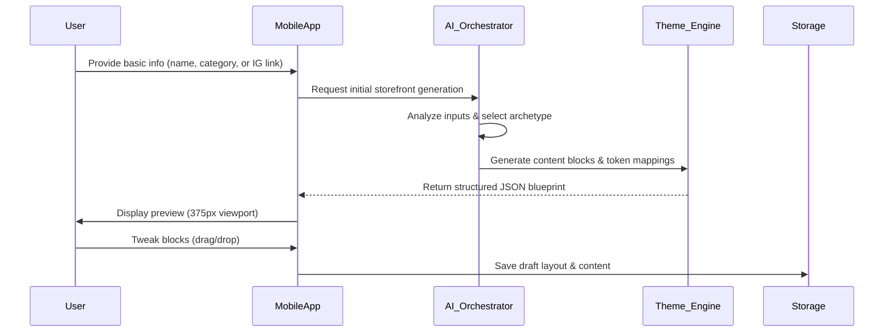

# 🔍 Scout: Tool Integration Research [Q3]

## 1. Title
Revamp Small Business Storefront Builder Architecture for Mobile-First Onboarding

## 2. Problem Statement
Non-technical small business owners (like Maya the baker or Carlos the handyman) currently face friction when setting up their storefronts. The process requires too many decisions upfront, lacks strong mobile-first default templates, and doesn't seamlessly integrate AI to auto-generate content (like product descriptions or service menus) from minimal inputs (e.g., an Instagram link or a few photos). This leads to abandonment before the user achieves their "first dollar" milestone. The platform needs an architecture that supports a progressive, AI-driven, and purely mobile-native drag-and-drop experience.

## 3. Research Report
- **Competitive Landscape**:
  - **Shopify**: Excellent depth, but the onboarding flow is desktop-centric and requires navigating complex menus to customize themes.
  - **Wix/Squarespace**: Visual builders are powerful but overwhelming on mobile screens. AI features are often bolted on rather than deeply integrated into the core flow.
  - **GoDaddy**: Fast setup, but inflexible and visually dated.
- **OHC Opportunity**: By leveraging our existing Slint UI and AI orchestration layer, we can create a "zero-to-live" flow. The AI should act as a "Promoter" and "Manager", inferring the business type, suggesting a layout, and populating dummy (but relevant) content instantly. The builder must operate smoothly on low-end Androids and standard iPhones.
- **User Pain Points**: "I just want a link to put in my TikTok bio that lets people book me and pay a deposit. I don't want to design a website."

## 4. Design Doc
### Architecture
The Storefront Builder will consist of a decoupled presentation layer and a highly opinionated state management layer.

### UI/UX Flow (Mobile First - 375px)
1. **Input Phase**: A conversational AI interface asks 2-3 questions. (e.g., "What do you sell?", "Got any photos?").
2. **Magic Reveal**: The app presents a fully formed, interactive preview.
3. **Edit Mode**: A bottom sheet reveals contextual tools. Tapping a text block opens a keyboard; tapping an image allows replacing it from the camera roll. Drag-and-drop reordering is vertical-only to suit mobile constraints.

### AI Integration Points
- **The Promoter**: Automatically generates SEO-friendly copy for products and services.
- **The Manager**: Sets up default business logic (e.g., if the user selects "Baker", automatically enable custom order deposits).

### Key Design Decisions
- **JSON Blueprint over HTML/CSS**: Storefronts are represented as a strictly typed JSON structure (blocks, properties, theme tokens) rather than raw markup. This allows native rendering via Slint and ensures perfect mobile parity.
- **Progressive Disclosure**: Advanced settings (custom domains, complex shipping rules) are hidden until the user demonstrates basic engagement or explicitly enables "Advanced Mode".

## 5. Implementation Prompt
Implement the backend architecture and UI components for the new AI-driven Storefront Builder.

**Core User Journey (CUJ)**:
A user opens the OHC mobile app, inputs their business name and type, and within 10 seconds sees a functional preview of their store. They can tap to edit text, swap an image, and hit "Publish".

**Acceptance Criteria**:
1. Implement the data structures for the "JSON Blueprint" representing a storefront (e.g., Hero, Product Grid, Text blocks).
2. Create the backend endpoint(s) to handle the initial AI generation request and store the resulting blueprint.
3. Build the native Slint UI components that can parse the blueprint and render the preview interactively on a mobile viewport.
4. Integrate the "Promoter" AI department to automatically generate sample copy based on the business type.
5. All backend functionality must be fully unit tested and the UI flow verified via E2E tests on mobile viewports.

## 6. Priority
P0 (Critical)

## 7. Estimated Scope
Large
