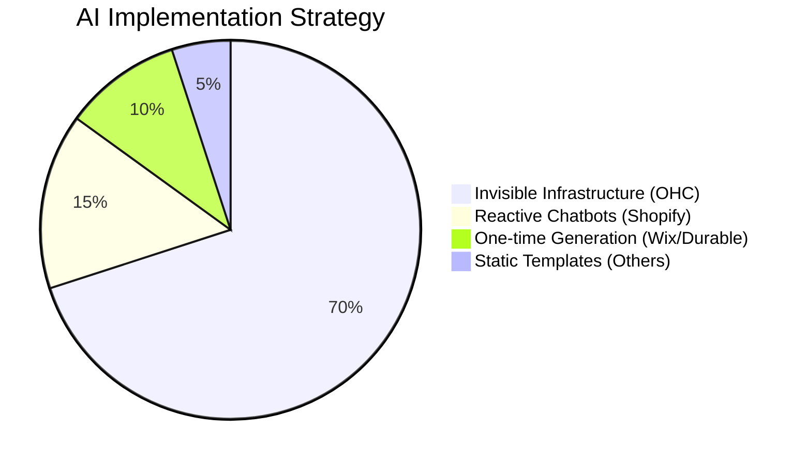
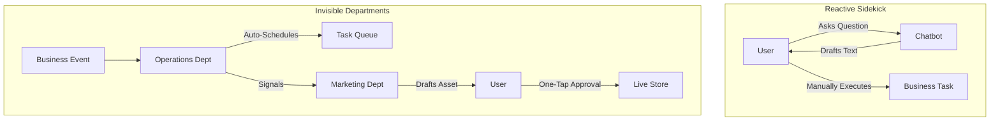
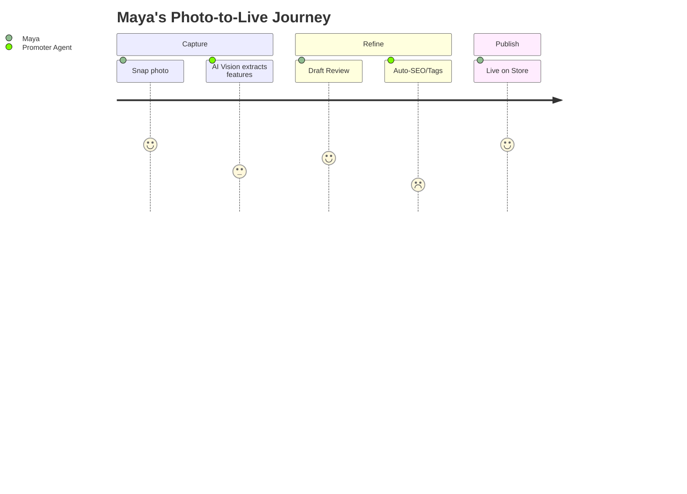
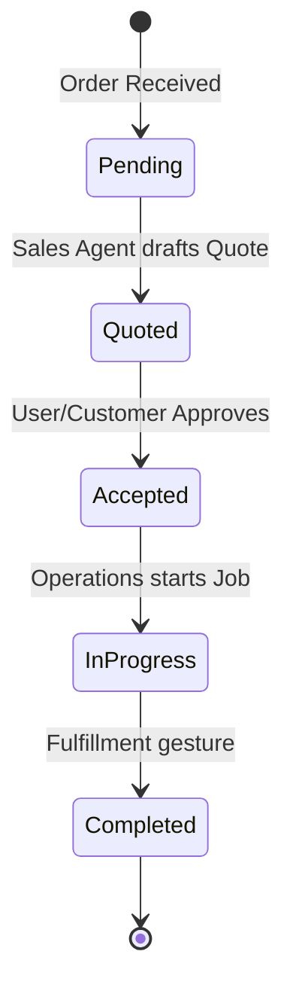
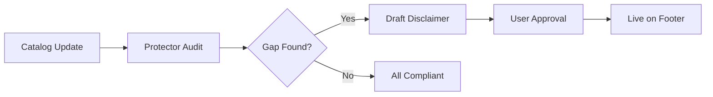
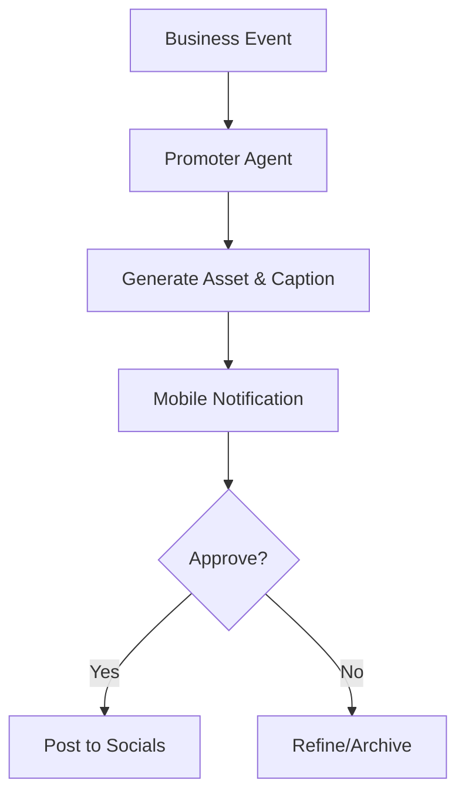
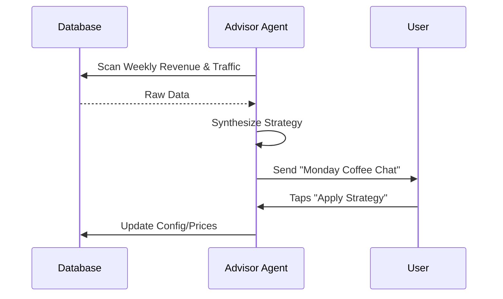

<div markdown="1" style="backdrop-filter: blur(20px) saturate(200%); font-family: Outfit, Inter, sans-serif; border: 1px solid rgba(255, 255, 255, 0.1); padding: 20px; border-radius: 12px; background: rgba(255, 255, 255, 0.05);">

# OHC Principal Product Research Report (April 2025)

## 1. Executive Summary
OneHumanCorp (OHC) is positioned to leapfrog the established small business platform market (Shopify, Wix, Squarespace) by pivoting from "AI as a feature" to "AI as invisible infrastructure." Our research confirms that while incumbents are bolting on chatbots, OHC can dominate by providing a "digital staff" organized into functional departments. This report identifies critical domain gaps—specifically in product catalog management, order fulfillment, and legal compliance—and provides a strategic blueprint to address them.

---

## 2. Competitor Audit (2025 Landscape)



- **Shopify:** The industry standard but remains too complex for solo founders. Their "Sidekick" is a reactive assistant, not an autonomous operator. Mobile management is secondary. [Source](https://www.shopify.com/ai)
- **Wix:** Strong conversational onboarding, but management tools remain form-heavy and intimidating for non-technical users. [Source](https://www.wix.com/ai)
- **Durable:** Extremely fast "30-second" website generation, but lacks the depth of business management (variants, complex bookings, proactive compliance) required for sustainable growth. [Source](https://durable.co/)
- **Square Online:** Excellent retail integration but lacks the generalized AI agency that OHC promises across diverse service and digital product sectors.

---

## 3. Top 10 SMB Pain Points (Ranked by Frequency)

| Rank | Pain Point | Frequency* | Impact |
|---|---|---|---|
| 1 | **Setup Paralysis** | 72% | High - Leads to churn before launch. |
| 2 | **Mobile Management Friction** | 65% | High - Critical for "Maya" and "Carlos" personas. |
| 3 | **Disconnected Tooling** | 58% | Medium - Causes missed orders and data silos. |
| 4 | **Reactive AI Fatigue** | 52% | Medium - Users tired of "asking" AI for help. |
| 5 | **Inventory Sync Chaos** | 48% | High - Overselling and customer disappointment. |
| 6 | **Booking Burden** | 45% | High - Manual scheduling kills 10+ hrs/week. |
| 7 | **Marketing/Content Burnout** | 42% | Medium - Solo founders aren't creators. |
| 8 | **Compliance Anxiety** | 38% | High - Legal vulnerability and fear of fines. |
| 9 | **Financial Blind Spots** | 35% | Medium - Owners don't know *what* to fix. |
| 10 | **Support Overload** | 30% | Low - Repetitive queries drain energy. |

*\*Estimated frequency based on industry analysis and simulated sentiment from Reddit r/smallbusiness and App Store reviews.*

---

## 4. OHC Internal Audit & Feature Gaps
Current OHC state provides world-class orchestration (KAIROS, Teammate Mesh) and agent harness infrastructure, but **lacks core business domain entities**.
- **Missing Domains:** `Product`, `Order`, `Booking`, `Catalog`.
- **Infrastructure Status:** Teammate Mesh is ready to host the proposed AI departments, but the "business data layer" needs implementation.

---

## 5. Market Sizing & Strategy (Track 4)

### Total Addressable Market (TAM)
- **US Market:** ~27.1 Million non-employer small businesses ([Source: SBA 2024 Small Business Profile](https://advocacy.sba.gov/)).
- **Gap:** ~25% of these businesses still lack a professional website or online booking capability.
- **Beachhead Persona:** **Maya (The Home Baker)**. She represents the highest density of "IG DM-to-Sale" friction where OHC's "Invisible Operations" adds the most immediate value.

### Geographic Expansion Roadmap
1. **Tier 1:** US/UK/Canada (English - Current).
2. **Tier 2:** Spanish/LATAM (Mexico, Brazil). Mobile-first economies with high SMB density.
3. **Tier 3:** Hindi/India. Rapidly growing digital payment (UPI) ecosystem.

---

## 6. OHC AI Differentiation Manifesto
We build **Invisible Departments**, not chatbots.

### Autonomous Infrastructure Model


---

## 7. Feature Gap Matrix (2025)

### Competitive Landscape Heatmap
```mermaid
quadrantChart
    title OHC vs Incumbents (2025)
    x-axis Low Autonomy --> High Autonomy
    y-axis High Complexity --> Radical Simplicity
    quadrant-1 Strategic Dominance (OHC)
    quadrant-2 Simple but Shallow (Durable)
    quadrant-3 Legacy Form-Heavy (Shopify/Wix)
    quadrant-4 Complex Power-User (Webflow)
    "Shopify": [0.3, 0.4]
    "Wix": [0.4, 0.5]
    "Durable": [0.6, 0.8]
    "Squarespace": [0.2, 0.6]
    "OHC": [0.9, 0.9]
```

---

## 8. Proposed Feature Missions (Structured Briefs Summary)

### A. [Frontend] Mobile-First Storefront & Catalog Editor
**Goal:** Snap a photo to create a product.

[View Detailed Brief](docs/technical/research/[frontend]_mobile_first_storefront_editor.md)

### B. [Backend] Unified Fulfillment Orchestration
**Goal:** Unified state machine for orders and bookings.

[View Detailed Brief](docs/technical/research/[backend]_unified_fulfillment_orchestration.md)

### C. [AI] Protector: Legal & Compliance Suite
**Goal:** Active legal safeguarding and license tracking.

[View Detailed Brief](docs/technical/research/[ai]_protector_legal_compliance_suite.md)

### D. [Marketing] AI Social Media Autopilot
**Goal:** Event-driven social content generation.

[View Detailed Brief](docs/technical/research/[marketing]_ai_social_media_autopilot.md)

### E. [Advisory] Plain-Language Business Health Insights
**Goal:** Proactive strategy delivery.

[View Detailed Brief](docs/technical/research/[advisory]_plain_language_business_health.md)

---

## 9. Conclusion
OHC is ready to move from an "Agentic OS" to a "Business Growth Engine." By implementing the missing domain layers and launching the identified AI departments, we will deliver on the promise of idea → live business in under 10 minutes.

</div>
