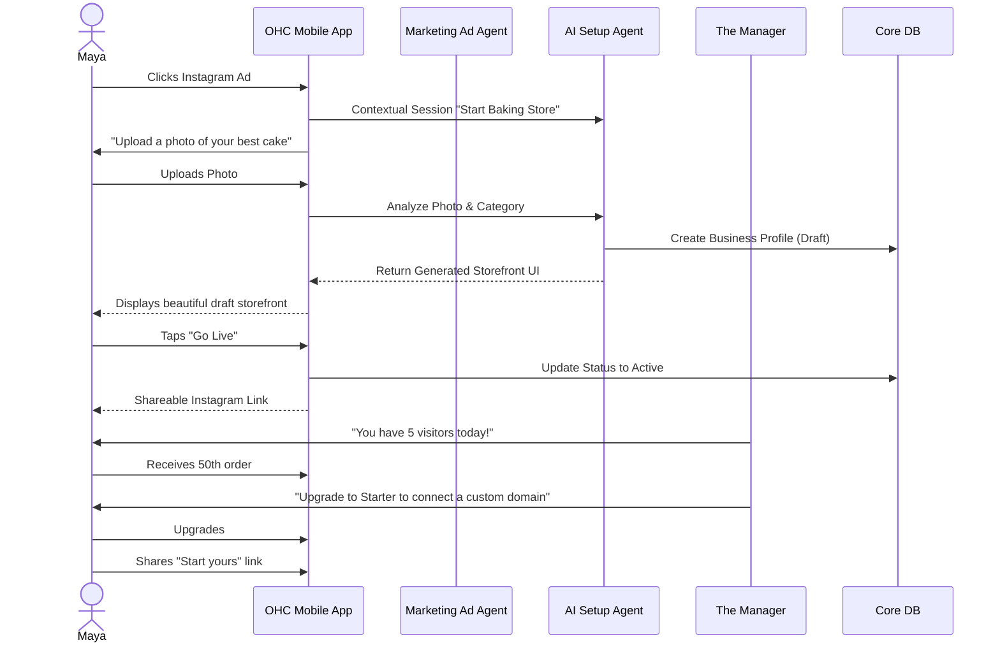
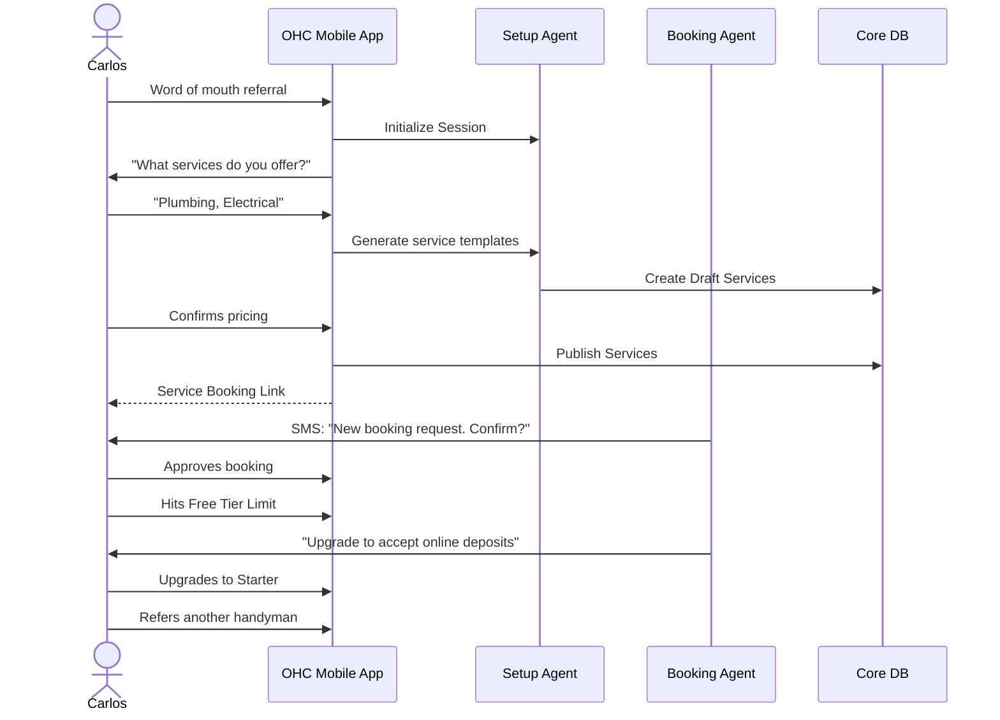
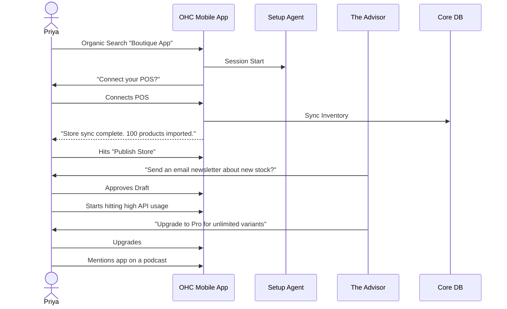
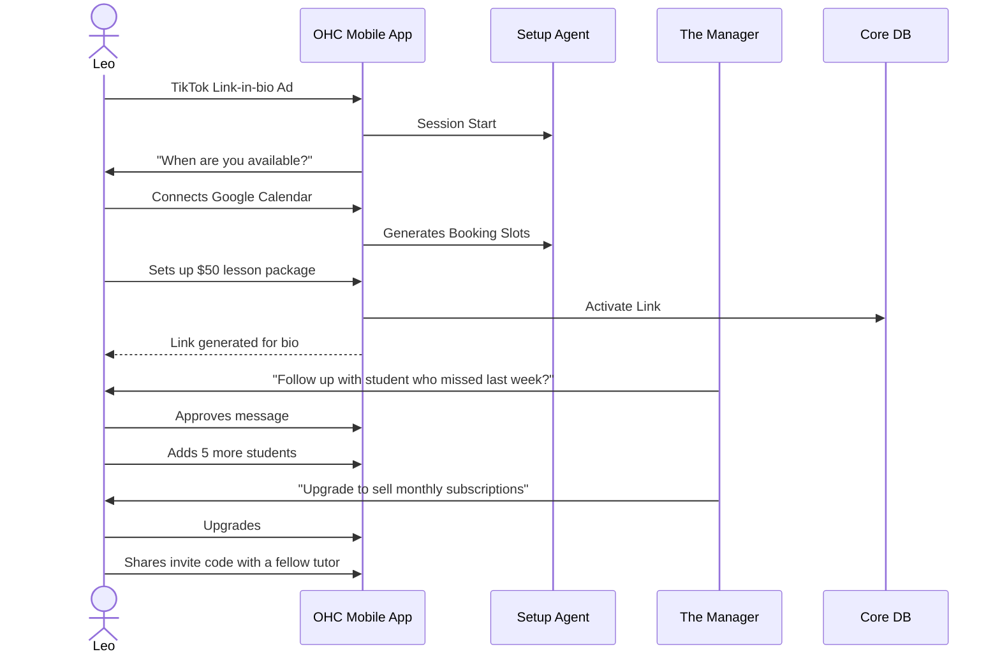
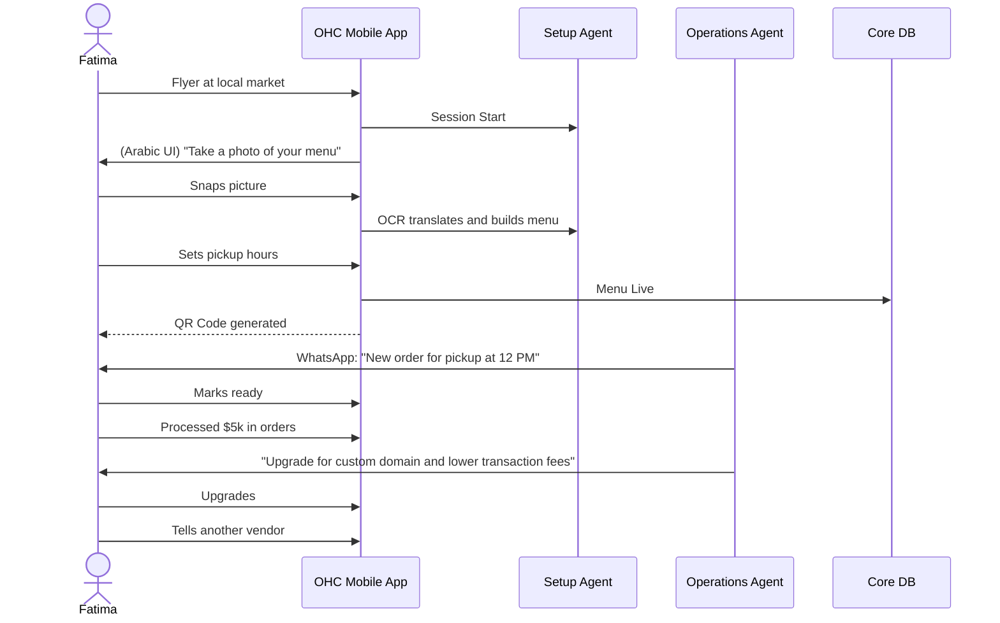

# Business Journey Architecture Research Report

## Executive Summary
OneHumanCorp (OHC) aims to empower anyone to launch and manage a real small business entirely from their smartphone or browser in under 10 minutes. A critical factor in achieving this goal is a frictionless, intuitive end-to-end journey tailored to diverse business types—ranging from physical products and services to digital goods and food operations.

This report evaluates the current friction points and proposes an enhanced, mobile-first Business Journey Architecture. We have mapped the core phases (Acquisition, Onboarding, Activation, Retention, Revenue, and Referral) for non-technical personas like Maya (baker), Carlos (handyman), Priya (boutique owner), Leo (music tutor), and Fatima (food cart).

## Persona Overviews & Needs

1. **Maya (Baker, 28)**
   - **Needs:** Custom cake storefront, deposit-based orders, IG DM agent, fully mobile.
   - **Gap:** Current flow requires too many technical setup steps before the first photo can be uploaded.

2. **Carlos (Handyman, 42)**
   - **Needs:** Service listings, booking calendar, quotes, Android only.
   - **Gap:** Onboarding lacks a quick way to bypass complex tax/shipping configs when just offering services.

3. **Priya (Boutique Owner, 35)**
   - **Needs:** POS sync, product variants, email newsletters.
   - **Gap:** Desktop-heavy analytics; mobile daily view is lacking.

4. **Leo (Music Tutor, 22)**
   - **Needs:** Lesson booking, subscription packages, auto-meetings.
   - **Gap:** Digital services and subscriptions aren't intuitively grouped in the initial setup.

5. **Fatima (Food Cart, 50)**
   - **Needs:** Photo menu, sold-out toggles, bilingual support, SMS notifications.
   - **Gap:** High cognitive load in standard eCommerce onboarding; lacks a specialized "quick menu" setup.

## Journey Mapping & Friction Points

### 1. Acquisition
- **Current Flow:** Generic landing page -> Sign up.
- **Proposed Architecture:** Contextual landing pages based on referral source (e.g., "Start your food cart app" vs "Book more handyman clients").
- **Friction:** Non-technical users often don't understand "SaaS." The CTA must be outcome-based: "Get your business online in 10 minutes."

### 2. Onboarding (The 10-Minute Promise)
- **Current Flow:** Multi-step form requiring store name, currency, tax info, address, before creating products.
- **Proposed Architecture:** AI-driven guided wizard.
  - Step 1: "What do you do?" (Select business type category).
  - Step 2: "Upload one photo of what you sell/do."
  - Step 3: AI automatically generates a draft storefront, names it, and configures basic defaults.
- **Friction:** Asking for complex configuration upfront. We must defer tax, shipping, and advanced domain setup until *after* the user sees their beautiful storefront.

### 3. Activation (AHA Moment)
- **Current Flow:** Dashboard with empty state.
- **Proposed Architecture:** The "First Win" checklist. The AI department (The Manager) proactively prompts the user to add their first item or service. The moment the first item is published, a shareable link is generated.
- **Friction:** Empty states kill momentum. The app must pre-fill content.

### 4. Retention
- **Current Flow:** Passive waiting for orders.
- **Proposed Architecture:** Proactive AI insights. "The Advisor" sends a push notification: "You had 10 visitors today! Let's follow up with them." or "Maya, time to update your weekend cake menu."

### 5. Revenue
- **Current Flow:** Standard subscription upgrade page.
- **Proposed Architecture:** Value-based upgrade triggers. When a user reaches 10 products or hits 100 API actions, "The Accountant" suggests an upgrade showing exactly how much more they can earn.

### 6. Referral
- **Current Flow:** Standard invite link in settings.
- **Proposed Architecture:** Viral loops integrated into the consumer-facing storefront ("Powered by OHC - Start yours").

## Key Architectural Decisions

1. **Mobile-First Data Entry:** All onboarding and management screens must pass the 375px viewport test. Form fields must be minimized; AI should infer data where possible.
2. **Deferred Complexity:** The database schema must allow for businesses to exist in a "partially configured" state. Strict constraints on fields like `tax_id` or `shipping_zones` should only apply when those features are activated.
3. **AI-Assisted Navigation:** Instead of deep nested menus, use a conversational interface where users can ask "The Manager" to "change the price of my vegan cake to $30."

## Sequence Diagrams (Mermaid)

### Maya's Full Journey (Custom Baker)

### Carlos' Full Journey (Handyman)

### Priya's Full Journey (Boutique Owner)

### Leo's Full Journey (Music Tutor)

### Fatima's Full Journey (Food Cart)

## Next Steps
- Define specific data models to support deferred configuration.
- Implement the AI Setup Agent API endpoints.
- Draft the UI wireframes for the new guided onboarding flow.
