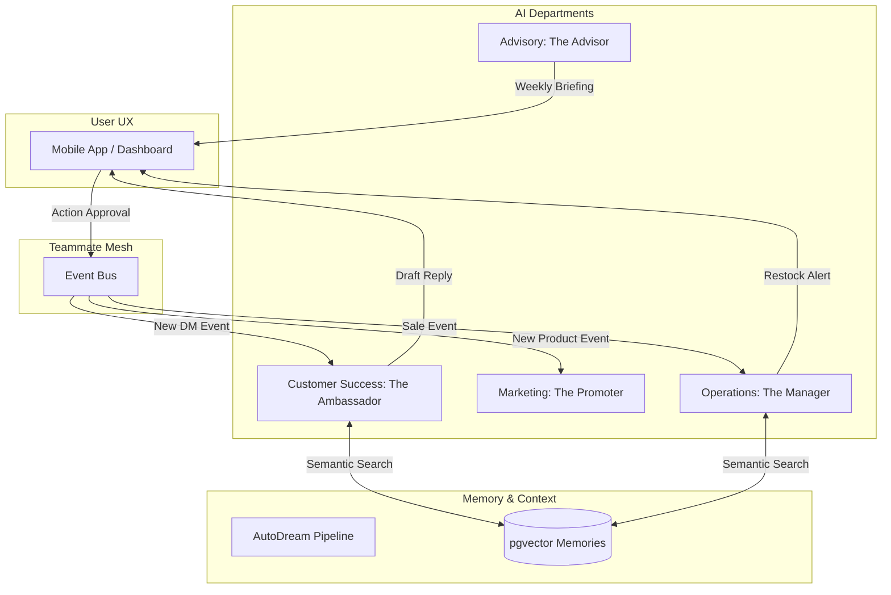

# AI Agent Department Architecture

## Problem Statement
Small business owners lack the technical expertise, time, and budget to handle the daily operational complexity of running a digital business. Competitors provide tools that require prompting and manual oversight, which create more work for the user. OneHumanCorp (OHC) needs an invisible, autonomous layer of AI agent departments that run the business on behalf of the user—shifting the paradigm from "AI as a tool" to "AI as a proactive teammate."

## Research Report
The business journey has been evaluated against five key personas (Maya the baker, Carlos the handyman, Priya the boutique owner, Leo the music tutor, and Fatima the food cart operator). Our market gap matrix and AI differentiation manifesto reveal that an autonomous, event-driven architecture directly addresses the highest friction points (e.g., slow DM responses, stockouts, marketing generation).

The proposed architecture organizes AI agents into understandable "departments":
- **Operations ("The Manager"):** Order and booking processing, inventory tracking.
- **Marketing & Advertising ("The Promoter"):** Content generation, social media, SEO.
- **Sales & Acquisition ("The Salesperson"):** Quoting and follow-ups.
- **Customer Success ("The Ambassador"):** Instant DMs and reviews.
- **Finance & Payments ("The Accountant"):** Financials and billing.
- **Business Advisory ("The Advisor"):** Health reports and strategy.

## Design Doc

### Architecture Integration Points
- **Trigger Mechanisms:** Agents are primarily event-driven, listening to the **Teammate Mesh** (Redis/Centrifugo) for state changes (e.g., a new product added, an incoming Instagram DM). Scheduled tasks (e.g., weekly health reports) are handled via the KAIROS Orchestrator.
- **Memory & Context:** Agents utilize the AutoDream pipeline. Ephemeral events are compressed and stored in `pgvector`, allowing agents to perform exact semantic searches to recall customer history or business context.
- **Approval Flow:** High-risk actions (e.g., refunding a customer) are drafted and queued in the "Action Required" dashboard feed for 1-tap user approval. Low-risk actions (e.g., drafting a social post calendar) are auto-executed.
- **Usage Limits:** AI usage is budgeted and throttled per tenant based on their SaaS tier, verified against the Shared Task List.

### Key Design Decisions
1. **Event-Driven Over Polling:** Agents must react instantly to business events via the Mesh to ensure the "10-minute to live" promise is maintained without performance degradation.
2. **Human-Language Briefings:** The Advisory agent avoids complex data visualizations, instead delivering plain-language insights directly to the user.
3. **Draft-for-Review Protocol:** Maintains user trust by ensuring AI cannot silently execute critical financial or reputational actions without explicit approval.

### UI Wireframes & Mobile UX Flow
**Screen 1: The Feed (375px)**
- **Header:** Glassmorphism (`backdrop-filter: blur(20px)`) with greeting "Good morning, Maya."
- **Body:** Feed-style notifications instead of complex charts.
  - *Card 1:* "The Manager restocked Vegan Cakes. [View Details]"
  - *Card 2:* "The Ambassador drafted 3 replies to IG DMs. [Approve All]"
- **Footer:** Native mobile keyboard triggers for quick edits.

**Mobile UX Flow (Customer Success Trigger):**
1. Customer sends DM -> Event emitted to Mesh.
2. Ambassador Agent wakes up -> Queries AutoDream for customer history.
3. Agent drafts reply -> Sends notification to Maya's lock screen.
4. Maya taps notification -> Opens OHC app -> Taps "Approve" -> Reply sent.

### Architecture Diagram (Mermaid.js)

## Implementation Prompt
**To the Implementer:**
Please implement the "Customer Success: The Ambassador" agent flow.
- **User-Facing Outcome:** When an incoming message event is detected on the mesh, the agent must autonomously draft a context-aware response based on the business's `pgvector` memory and queue it in the user's dashboard for 1-tap approval.
- **CUJ:** A user receives a push notification about a drafted reply, opens the app, reviews the text, and taps "Approve" to send it instantly.
- **Acceptance Criteria:**
  - The agent must successfully listen to specific message events on the Teammate Mesh.
  - The generated draft must correctly utilize semantic search to retrieve relevant business context.
  - The drafted action must require explicit approval before dispatching.
  - The feature must be fully usable and performant on mobile (375px viewport).
  - All interactions must feel premium and adhere to the visual excellence mandate (Glassmorphism, 20px blur).

**Priority:** P0 (Critical)
**Estimated Scope:** Large
