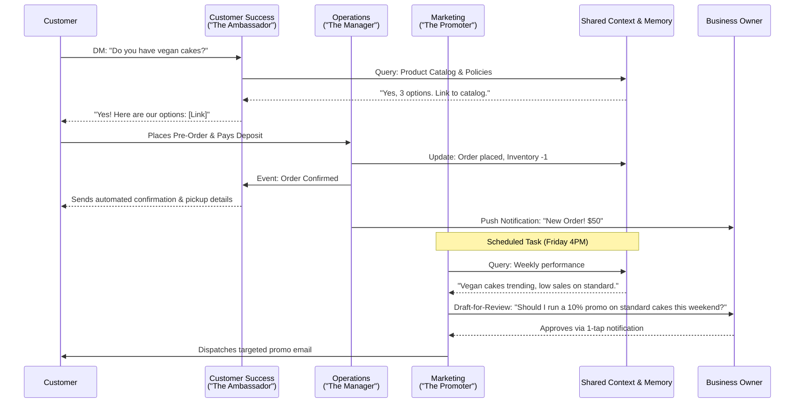

# AI Agent Department Architecture

## Title
AI Agent Department Architecture: Invisible Orchestration for Small Businesses

## Problem Statement
Small business owners (like Maya the baker or Carlos the handyman) are overwhelmed by the operational complexity of running a business—they lack the time, resources, or technical skills to manage marketing, customer service, operations, and finance simultaneously. They need these functions handled for them automatically, but traditional SaaS tools require steep learning curves and manual configuration. They need an intelligent, invisible workforce that speaks their language, organized into intuitive "departments" that autonomously coordinate and act on their behalf.

## Research Report
Our competitive analysis of Shopify, Wix, Squarespace, and GoDaddy reveals that while they offer "AI tools", these are largely fragmented, user-initiated point solutions (e.g., "generate a product description" or "draft an email"). They do not offer autonomous, coordinated *agents* acting as a unified business team.

**Key Findings:**
1. **Mental Models:** Non-technical users reject complex workflow builders (like Zapier) but intuitively understand human roles (e.g., "The Manager", "The Accountant"). Grouping AI agents into functional "Departments" bridges this gap.
2. **Autonomy vs. Control:** Owners want AI to handle repetitive tasks autonomously (e.g., answering FAQs, confirming orders) but require final approval for high-stakes actions (e.g., issuing refunds, sending mass promotions). A clear "Draft-for-Review" vs. "Auto-Execute" mechanism is critical.
3. **Context is King:** The biggest failure point of current AI assistants is lack of shared context. If "The Promoter" runs a discount campaign, "The Manager" must know to expect higher order volume, and "The Accountant" must track the ROI.

**Department Organization:**
*   **Operations ("The Manager"):** Order/booking processing, inventory, fulfillment, refunds.
*   **Marketing & Advertising ("The Promoter"):** Website design, SEO, social media, promos, QR codes.
*   **Sales & Acquisition ("The Salesperson"):** Quotes, lead follow-up, upsells, referrals.
*   **Customer Success ("The Ambassador"):** Message replies, order updates, reviews.
*   **Finance & Payments ("The Accountant"):** Payments, reports, subscriptions, taxes.
*   **Legal & Compliance ("The Protector"):** Policies, contracts, GDPR, liability.
*   **Business Advisory ("The Advisor"):** Health reports, next-actions, trends.

## Design Doc

### 1. Agent Triggering & Coordination Model
Agents operate based on three primary triggers:
*   **On Event:** Real-time reactions (e.g., New Order received -> Operations updates inventory; Operations finishes -> Customer Success sends confirmation).
*   **On Schedule:** Time-based routines (e.g., Friday 5 PM -> Business Advisory generates weekly health report; Daily 8 AM -> Sales follows up on stale quotes).
*   **On Demand:** Direct owner requests (e.g., Owner: "Run a 15% off Mother's Day sale" -> Marketing & Advertising executes).

### 2. Context & Memory Architecture
To function cohesively, agents share a centralized memory bank specific to the tenant (business):
*   **Short-Term Context:** Current active events, recent customer conversations, and pending tasks.
*   **Long-Term Memory:** Business rules, owner preferences (e.g., "always require approval for refunds over $50"), historical customer data, and past successful marketing campaigns.
*   **Cross-Department Data Access:** Departments query a unified tenant graph. For example, "The Ambassador" retrieving order status from "The Manager" to answer a customer inquiry.

### 3. Approval & Budgeting Workflows
*   **Confidence Thresholds:** Routine, low-risk actions (e.g., sending an order confirmation, answering "what are your hours?") default to **Auto-Execute**. High-risk actions (e.g., spending ad budget, sending bulk emails) default to **Draft-for-Review**, generating a notification for the owner.
*   **Usage Budgeting:** Each tenant has an AI action limit (based on their tier: Free/Starter/Pro). Actions are tracked via a centralized token/action ledger. When limits approach, "The Advisor" gently notifies the owner with a clear upgrade path, avoiding hard blocking of critical tasks. Soft limits ensure continuous business operations.

### 4. Architecture Diagram

### 5. Mobile UX Flow (375px)
The user interface prioritizes a mobile-first, grandmother-test-approved experience adhering to OHC Premium Design Standards (Glassmorphism, Outfit/Inter typography, strictly usable at 375px width).

**Screen 1: The AI Hub (Home Screen Dashboard)**
*   **Visuals:** Glassmorphic cards layered over a subtle, slow-moving gradient background (backdrop-filter: blur(15px) saturate(200%)). Outfit heading ("Your Team").
*   **Content:** A horizontal scrolling list of circular avatars representing each "Department" (The Manager, The Ambassador, etc.) with brief status indicators (e.g., a green dot for "Active", or a red badge for "1 Action Required").
*   **Interaction:** Tapping an avatar opens that department's specific feed.

**Screen 2: Department Feed (e.g., "The Manager")**
*   **Visuals:** A chat-like feed interface using Inter for body text. High contrast, WCAG 2.1 AA compliant.
*   **Content:** A chronological list of actions taken or proposed by the agent.
    *   *Auto-Executed Item:* "Processed order #1042 and updated inventory." (Muted styling)
    *   *Draft-for-Review Item:* "A customer requested a refund for order #1039. The policy says no refunds, but this is a VIP customer. Approve $25 refund?"
*   **Interaction:** 1-tap "Approve" or "Deny" buttons on pending actions. Swiping left reveals "Modify Draft" options.

**Screen 3: AI Budget & Upgrades (The Advisor)**
*   **Visuals:** A clear, circular progress bar indicating monthly AI action usage.
*   **Content:** "You've used 85% of your AI tasks this month. Upgrade to Pro to unlock unlimited tasks and a dedicated Salesperson agent."
*   **Interaction:** Single prominent CTA button to upgrade via native mobile billing (Apple Pay/Google Pay).

**Accessibility Notes:**
*   All actionable components have a minimum touch target size of 44x44pt.
*   Full keyboard navigation support for the web-wrapper view.
*   Color contrast ratios exceed 4.5:1 for all text.
### Implementation Prompt
Design and implement the architectural framework for AI Agent Departments as described above.
Your goal is to build the underlying infrastructure (event routers, memory contexts, budgeting limits) that allows agents to be assigned to these functional departments and interact natively within the tenant context.
Acceptance Criteria:
- Agent department configuration structures exist.
- Event routing mechanism triggers agents based on scheduled, event-based, and on-demand triggers.
- Multi-tenant shared context system is implemented with Draft vs Auto-execute workflows.

### Priority
P0

### Estimated Scope
Large
