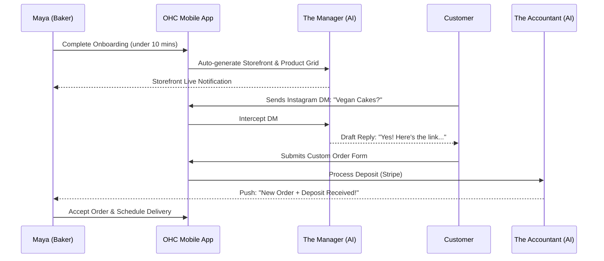
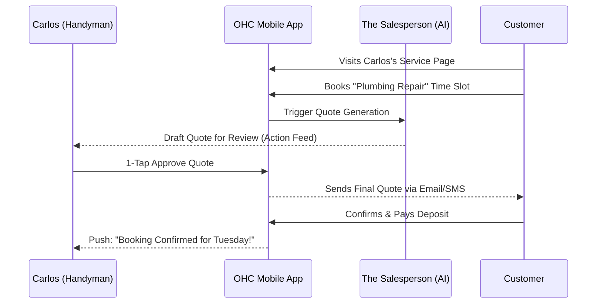
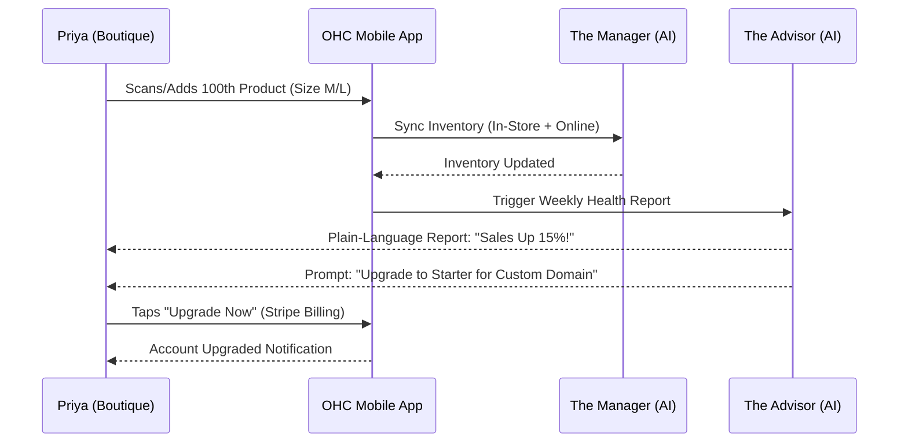
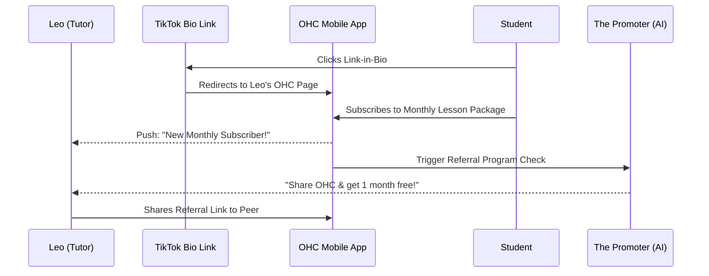
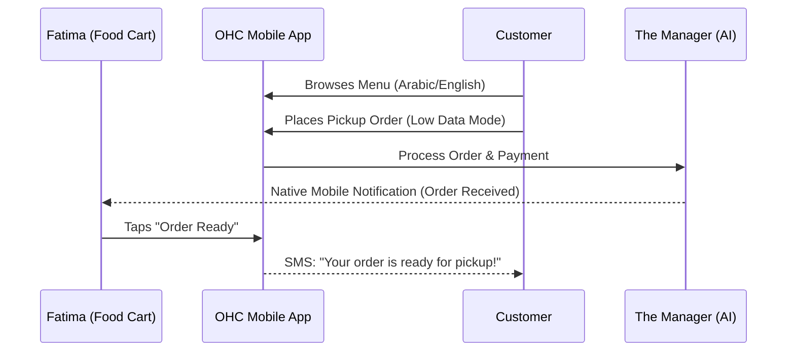

# Business Journey Architecture

## Overview
This document outlines the end-to-end business journey for the five core personas using the OneHumanCorp (OHC) platform. OHC's goal is to enable users to launch a real small business in under 10 minutes without writing a single line of code.

## Persona-Specific Pain Points

| Persona | Business Type | Core Pain Point | OHC Solution |
| :--- | :--- | :--- | :--- |
| **Maya** | Home Baker | DMs take up too much time, difficult to manage custom orders & prepayments. | "The Ambassador" AI handles DMs; deposits integrated into custom order forms. |
| **Carlos** | Handyman | Relies purely on word-of-mouth, no web presence, missing a booking system. | Service listings with straightforward pricing, direct calendar booking via mobile. |
| **Priya** | Boutique Owner | Wants to synchronize physical POS with online store seamlessly. | Unified inventory management & Stripe Terminal integration accessible via mobile app. |
| **Leo** | Music Tutor | Needs scheduling + Zoom links + subscription packages. | Automated scheduling and digital link delivery; recurring billing through Stripe. |
| **Fatima** | Food Cart | Needs multi-language support, rapid online pickup orders on a slow network. | Offline-capable, simple pre-order mobile flow with Arabic+English support. |

## Persona Mobile UX Flows

### 1. Acquisition & Onboarding (All Personas)
* **Goal**: Minimize friction, complete setup in under 10 minutes.
* **Friction Points**: User might drop off if asked to upload a logo, configure DNS settings, or explain complex pricing structures before seeing value.
* **Flow**:
  1. Discovery: User clicks an organic social media post or targeted ad.
  2. Setup Wizard: User opens OHC app (375px native mobile view).
  3. Persona Selection: App asks simple questions ("What do you do?", "What's your business name?").
  4. Generation: Background AI (The Promoter & Operations) generates a draft site in seconds.

### 2. Activation (Maya - The Baker)
* **Goal**: Receive the first pre-paid custom cake order.
* **Friction Points**: Form might ask for too much customization. Deposit payment processing needs to be transparent and trustworthy on mobile.
* **Flow**:
  1. Customer visits Maya's mobile storefront and browses the photo catalog.
  2. Customer selects "Custom Cake Request" and fills out a deposit form.
  3. Maya receives a native mobile notification of the request.
  4. Maya taps "Approve & Invoice" directly from the notification.

### 3. Retention (Carlos - The Handyman)
* **Goal**: Carlos uses the app daily for business management.
* **Friction Points**: If AI quotes are consistently inaccurate, Carlos will lose trust. The UI must allow easy overrides.
* **Flow**:
  1. Push notification: "New service request from John for Plumbing."
  2. Dashboard: Carlos opens the app to see his daily schedule and pending inquiries.
  3. Action Feed: AI (The Salesperson) queues a draft quote; Carlos reviews and taps "Send".

### 4. Revenue & Upgrade (Priya - The Boutique Owner)
* **Goal**: Migrate from Free to Starter tier based on value realization.
* **Friction Points**: Upgrade prompts might feel intrusive or unclear about exactly what happens to existing inventory limits.
* **Flow**:
  1. "The Advisor" (AI) sends a weekly plain-language report highlighting sales milestones.
  2. The report suggests: "You've reached 100 products. Upgrade to Starter for unlimited inventory and a custom domain."
  3. Priya clicks a 1-tap upgrade button processed via the existing payment profile.

### 5. Referral (Leo - The Music Tutor)
* **Goal**: Leo shares his success, driving new user acquisition.
* **Friction Points**: The referral benefit might not be immediate or compelling enough. Copying/pasting links must work seamlessly.
* **Flow**:
  1. Leo sets up his Link-in-Bio via OHC and adds it to his TikTok profile.
  2. "The Promoter" prompts Leo to join the OHC referral program.
  3. Leo shares a personalized referral link with a fellow tutor directly via WhatsApp.

## Mermaid.js Sequence Diagrams

### Maya (Baker) - End-to-End Journey

### Carlos (Handyman) - Booking Journey

### Priya (Boutique Owner) - Inventory & Upgrade Journey

### Leo (Music Tutor) - Subscription & Referral Journey

### Fatima (Food Cart) - Order & Pickup Journey

---
## Implementation Prompt
**Task Name**: Implement Mobile-First Conversational Onboarding
**User Outcome**: A non-technical user downloads the app, answers three simple conversational questions about their business, and instantly gets a functional storefront.
**CUJ**:
1. User taps "Start My Business".
2. UI displays a chat-like interface.
3. User types business name, type, and target audience.
4. "The Promoter" AI agent builds a 375px-optimized storefront.
**Acceptance Criteria**:
- Must support iOS/Android via Flutter/Slint.
- Core completion time must be under 3 minutes.
- Resulting storefront must have a product grid, contact form, and about section.

**Priority**: P0
**Estimated Scope**: Large
