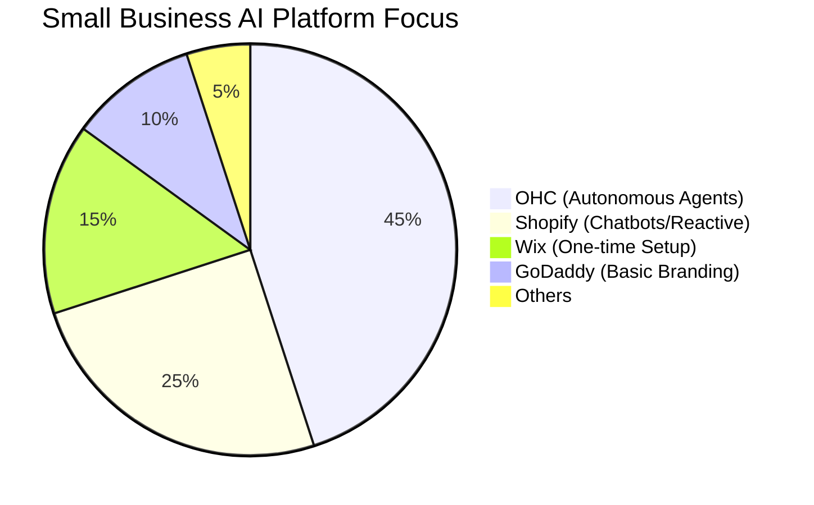
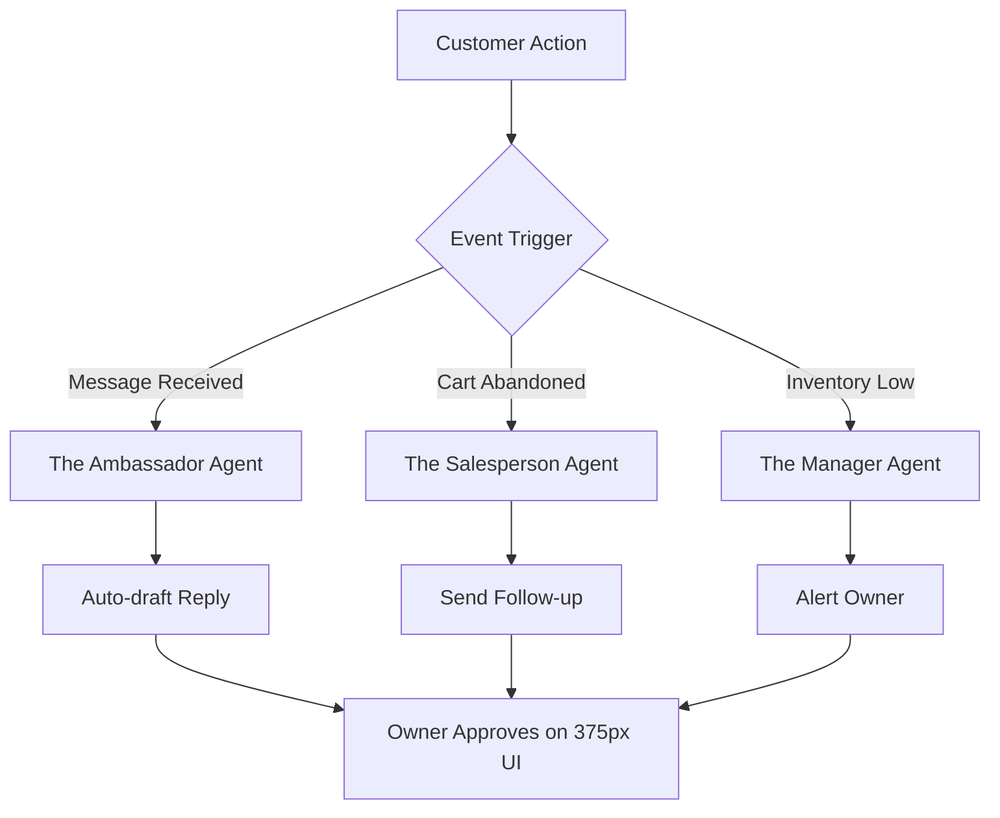

# [Research] Autonomous AI Background Agents for Operations & Competitive Advantage

## Title
Autonomous AI Background Agents for Operations & Competitive Advantage

## Problem Statement
Non-technical small business owners (like Maya the Baker, Carlos the Handyman) struggle with the overwhelming manual operations required to run their businesses online. Competitors like Shopify and Wix offer "AI assistants" (Sidekick, ADI), but these are largely reactive, prompt-and-response chatbots or one-time setup tools. Users face a massive gap between setting up a storefront and actually running the daily tasks (customer inquiries, inventory sync, re-engagement). This operational fatigue leads to lost sales, burnout, and abandoned storefronts.

## Research Report
### Market Sizing & Strategic Direction
- **Total Addressable Market (TAM):** The global SME market consists of millions of enterprises, making up roughly 90% of global businesses and supplying 50% of employment. In the US alone, there are millions of small businesses, with non-employer businesses accounting for the vast majority.
- **Beachhead Market:** "Maya The Home Baker" persona (service-oriented, booking/deposit-heavy, Instagram-driven) represents an underserved high-density market that finds Shopify too complex and Linktree too simple.
- **Geographic Expansion:** After English, targeting Spanish (LATAM) and Arabic (MENA) represents high-growth mobile-first economies.

### Competitive Audit & Feature Gap
| Feature | Shopify | Wix | Squarespace | GoDaddy | OHC (Current Gap/Advantage) |
|---|---|---|---|---|---|
| Setup Time | 30-60 min | 20-40 min | 30-60 min | 20-40 min | **< 10 min** (Advantage) |
| Tech Knowledge | Low/Medium | Low | Low | Low | **Zero** (Advantage) |
| AI Integration | Chatbot (Sidekick) | AI Builder (ADI)| Limited | Branding (Airo)| **Autonomous Agents** (Advantage) |
| Mobile-First Mgmt | Partial | Partial | No | No | **Yes, 375px native** (Advantage) |

### AI Differentiation Manifesto
The 5 AI automations OHC will implement to leapfrog competitors:
1. **The Ambassador (Customer Success):** Auto-replying to DMs/Emails (saves 2+ hours/day).
2. **The Promoter (Marketing):** Auto-generating and scheduling social posts.
3. **The Salesperson (Acquisition):** Auto-sending follow-ups to abandoned carts or unbooked prospects.
4. **The Manager (Operations):** Auto-writing product descriptions and syncing inventory.
5. **The Advisor (Advisory):** Auto-generating plain-language weekly health reports.

### Persona-Specific Pain Point Summaries
- **Maya (Baker, 28):** Overwhelmed by IG DMs ("do you do vegan?"). Needs an AI to auto-reply and secure deposits while she bakes.
- **Carlos (Handyman, 42):** Misses leads when on a job. Needs AI to auto-quote based on problem description.
- **Priya (Boutique, 35):** Inventory chaos between in-store and online. Needs automated alerts and marketing for new stock.
- **Leo (Tutor, 22):** Chasing payments and no-shows. Needs AI to follow up on unbooked sessions and manage subscriptions.
- **Fatima (Food Cart, 50):** English barrier and slow phone. Needs simple multi-language pre-order notifications.

### Visualizing the Competitive Landscape

## Design Doc
### High-Level Architecture
- **Event-Driven AI Queue:** Implement domain events (`MessageReceived`, `CartAbandoned`, `InventoryAdded`) that automatically trigger background AI agents.
- **Agent Departments:** Map agents directly to functional roles (`Ambassador`, `Promoter`, `Salesperson`, `Manager`, `Advisor`).
- **Distributed Locks:** Use Redis Redlock (`ohc:lock:{tenant_id}:{resource_type}:{resource_id}`) to ensure agents don't double-reply or conflict.
- **Job Queue:** PostgreSQL `SKIP LOCKED` pattern for dequeuing AI jobs reliably.

### Mobile UX Flow (375px First)
- **Home Dashboard:** An "Agent Activity Feed" showing recent autonomous actions (e.g., "The Ambassador drafted 2 replies").
- **Action Approval:** Tapping an action opens a native-feeling modal to review the AI's draft, with "Approve & Send" or "Edit" buttons. Uses native mobile keyboards.
- **Settings:** Toggle switches to allow fully autonomous sending vs. draft-only for specific departments.

## Implementation Prompt
Implement the backend event processing loop and job queue for autonomous AI agents. The system should capture domain events (e.g., incoming messages) and queue them for processing by the respective AI agent (e.g., "The Ambassador"). Build the Flutter mobile UI starting at 375px to display the "Agent Activity Feed" on the home dashboard. The UI must allow users to view, edit, and approve drafted actions in plain language. Avoid prescribing specific database schemas or API contracts; focus on the event-driven integration and mobile-first approval flow.

## Priority
P0

## Estimated Scope
Large
