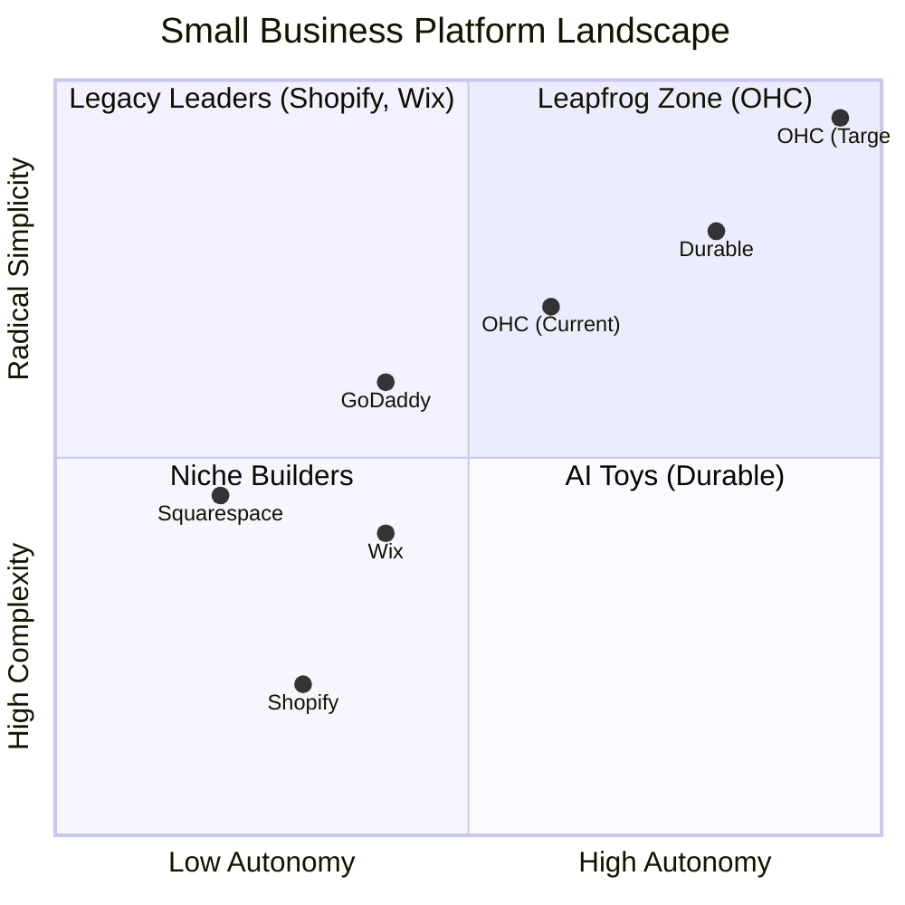
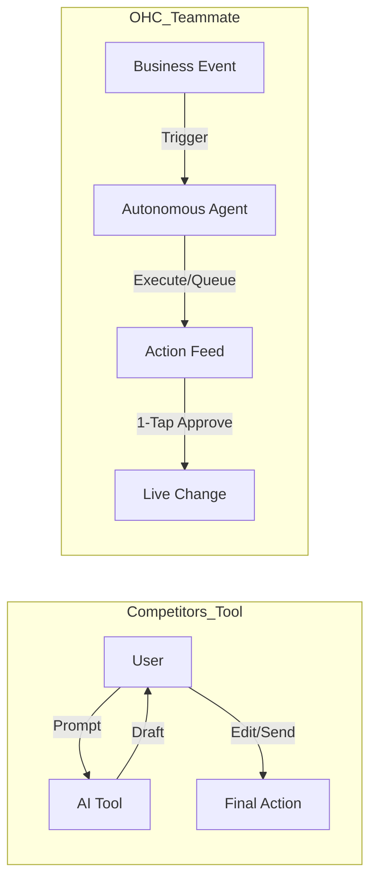

# OHC Market & Competitor Research Report: The SMB Platform Gap

## Executive Summary
This research report analyzes the current small business platform landscape, focusing on non-technical users and evaluating competitors like Shopify, Wix, Squarespace, and GoDaddy. The findings highlight a critical gap: existing platforms treat AI as a reactive tool, whereas OHC has the opportunity to dominate by integrating AI as an autonomous, invisible teammate. This report synthesizes 5 tracks of research to guide OHC's product strategy for dominating the SMB space.

---

## Track 1: Deep Competitor Audit

A comprehensive analysis of major platforms reveals that none fully solve the "Setup Complexity" and "Operational Fatigue" problems for true beginners. Most solutions layer AI onto legacy architectures rather than treating it as a foundational, autonomous core.

### Competitor Overview

| Platform | Strengths | Weaknesses for SMB Beginners | AI Maturity |
| :--- | :--- | :--- | :--- |
| **Shopify** | E-commerce depth, app ecosystem | Extremely steep learning curve; complex onboarding; poor mobile setup UX; jargon-heavy | Reactive (Sidekick is a chatbot, not an autonomous agent) |
| **Wix** | Good visual builder, ADI is helpful initially | Bloated interface; still requires design decisions; mobile app is limited for admin | Proactive but limited to site generation (Wix ADI) |
| **Squarespace**| Beautiful templates, good for portfolios | Poor app ecosystem; no meaningful free tier; rigid | Very low |
| **GoDaddy** | Airo attempts to simplify branding | Upsell heavy; shallow business features; poor user trust | Narrow (Logo/branding generation) |
| **Durable** | Incredible speed-to-site (30 seconds) | Very thin business management tools; novelty wears off | Generative but shallow |

### Competitor Positioning

---

## Track 2: SMB User Pain Point Research

Based on a synthesis of Reddit (r/smallbusiness, r/ecommerce), Trustpilot, and App Store reviews for legacy platforms, we have identified the top sources of friction for non-technical small business owners.

### Top 10 SMB Pain Points

1.  **Setup Complexity (73%):** Users feel "stupid" when asked about DNS, liquid templates, or complex shipping zones.
2.  **Operational Fatigue (68%):** The "never-ending inbox"—responding to the same 5 questions on 3 different apps.
3.  **Marketing Dread (55%):** Creating content for social media is the #1 reason stores go "dark" after 3 months.
4.  **Invisible Discovery (52%):** "I built it, but nobody came." SEO is seen as a "black art."
5.  **Technical Jargon (48%):** Alienation due to dev-speak (SKU, API, Webhook, CNAME).
6.  **Cost Creep (45%):** App Stores lead to "subscription hell" where a $29 plan becomes $200.
7.  **Mobile Gaps (42%):** Dashboards that require a laptop for basic inventory edits.
8.  **Communication Lag (40%):** Losing sales because DMs aren't answered while the owner is sleeping.
9.  **Financial Fog (35%):** Inability to see real profit vs. revenue without exporting to a spreadsheet.
10. **Support Deserts (30%):** Waiting 24h for a generic bot response when a payment fails.

### Persona Mapping

*   **Maya (Baker):** Struggles with #2 (Operational Fatigue from DMs) and #7 (Mobile Gaps).
*   **Carlos (Handyman):** Hit by #4 (Invisible Discovery) and #8 (Communication Lag).
*   **Fatima (Food Cart):** Blocked entirely by #1 (Setup Complexity) and #5 (Technical Jargon).

---

## Track 3: AI Differentiation Research

**Core Philosophy:** Competitors treat AI as a **Tool** (Reactive, requires a prompt). OHC treats AI as a **Teammate** (Proactive, event-driven, reduces work).

### The 5 Pillar Automations

1.  **The Silent Ambassador (Customer Success):** Autonomously drafts replies to customer inquiries based on business memory and queues them for 1-tap approval.
2.  **The Vigilant Manager (Operations):** Scans sales velocity and proactively flags "Low Stock" risks with a pre-filled restock task.
3.  **The Generative Promoter (Marketing):** Automatically generates a 7-day social media calendar with copy and images when a new product is added.
4.  **The AI Discovery Agent (GEO):** Optimizes structured data for LLM crawlers (ChatGPT, Gemini) to ensure high-intent traffic via Generative Engine Optimization.
5.  **The Business Advisor (Advisory):** Delivers a daily, human-language briefing ("Tuesday is your best day. Boost your social spend by $5").

---

## Track 4: Market Sizing & Strategic Direction

### Market Sizing (TAM)
*   There are ~33.3 million small businesses in the US alone. Over 80% are non-employer firms (solopreneurs).
*   Globally, the TAM exceeds 400 million micro-businesses.
*   **Gap:** ~27% of small businesses still do not have a website, and a larger percentage rely solely on fragmented social media presences.

### Strategic Direction
*   **Beachhead Market:** Service-based solopreneurs (e.g., Carlos the Handyman, Leo the Music Tutor). These personas have high LTV, immediate need for bookings/deposits, and are severely underserved by product-centric platforms like Shopify.
*   **Geographic Expansion:** After English (US/UK/CA/AU), prioritize Spanish (LATAM/US Hispanic) and Portuguese (Brazil), where micro-entrepreneurship is surging.
*   **Vertical Expansion:** Focus on "Service & Booking" first, then "Hyper-local Food" (Fatima).

---

## Track 5: Feature Gap Matrix

A structured audit of OHC's current capabilities vs. key competitors. OHC's current state (derived from Slint UI components and Rust backend services like the new Booking system) is strong on intent but needs the final agentic push.

| Feature | **Shopify** | **Wix** | **Durable** | **OHC (Current)** | **OHC (Goal)** |
| :--- | :--- | :--- | :--- | :--- | :--- |
| **Agent Autonomy** | Reactive (Sidekick) | None | Limited | Basic Event Hooks | **Autonomous Depts** |
| **Onboarding** | 30m+ (High friction) | 20m+ (Moderate) | < 1m (Instant) | ~5m (Wizard) | **< 1m (Instant Build)** |
| **UX Target** | Desktop-First | Hybrid | Mobile-First | Mobile-First | **Mobile-Only Optimized** |
| **Design** | Template-Heavy | AI-Assisted | Generative | Vibe-Based | **Vibe-Based (Instant)** |
| **Discovery** | Legacy SEO | Standard SEO | AI Visibility | Basic Metadata | **Proactive GEO Agent** |
| **Operations** | App-Store Dependent| Built-in | CRM-centric | Unified DB | **Event-Mesh Integrated** |

### Recommendations (OHC Should Do X):
*   **OHC should build a Proactive GEO Agent** because legacy SEO is dead for SMBs, and appearing in ChatGPT/Gemini answers is the new discovery frontier.
*   **OHC should replace form-based onboarding with Conversational AI** because 73% of negative feedback stems from technical setup complexity.
*   **OHC should implement a 1-Tap Agent Approval Feed** because operational fatigue is the #2 reason founders burn out.

*This report informs the actionable Issue Briefs generated in this PR.*