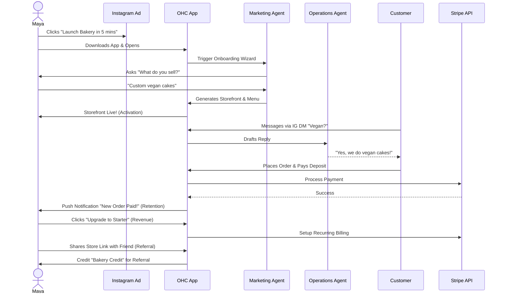
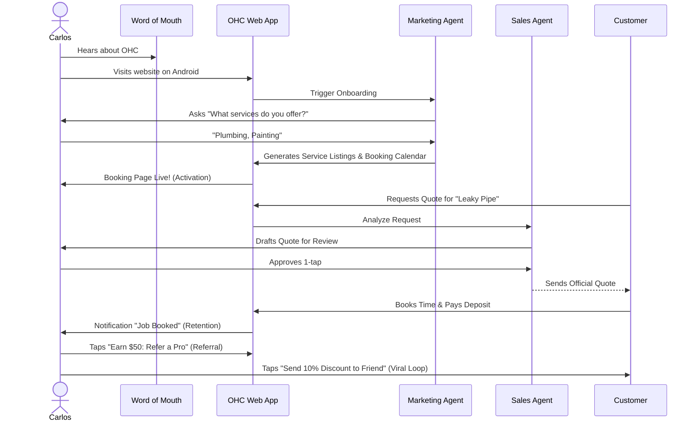
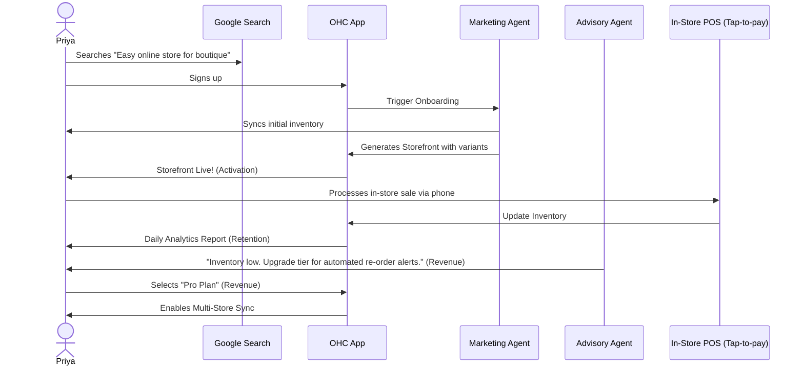
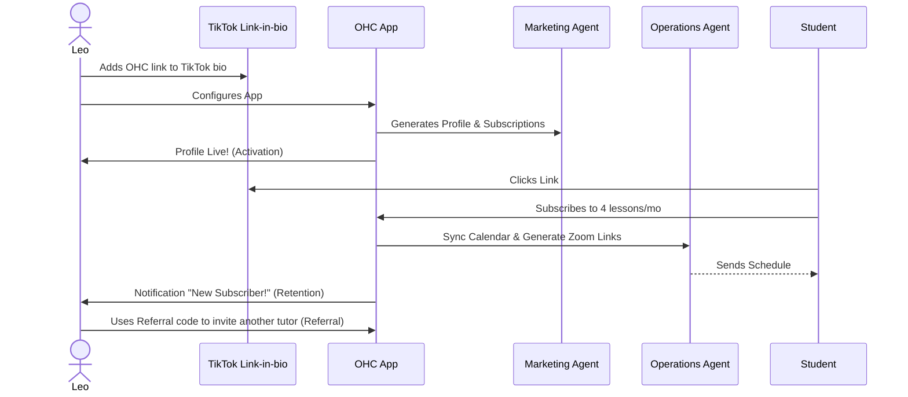
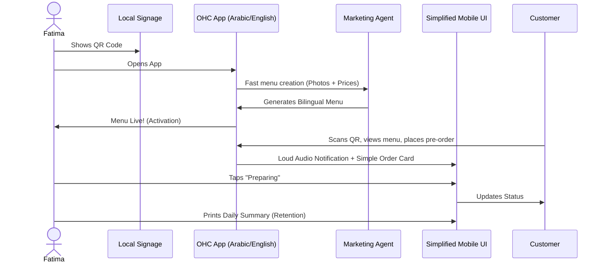

# Unified End-to-End Business Journey Architecture

## Problem Statement
The OHC platform must serve a diverse set of real-world small business owners (e.g., Maya the Baker, Carlos the Handyman, Priya the Boutique Owner, Leo the Music Tutor, and Fatima the Food Cart Operator) who share a common goal: launching and growing their business entirely from a mobile device without technical expertise. Currently, the overarching business journeys—from initial acquisition to sustainable revenue generation and referral loops—are fragmented. We need a unified architectural map of the end-to-end user journeys for these personas to ensure that the system naturally supports their progression through Acquisition, Onboarding, Activation, Retention, Revenue generation, and Referral, while identifying critical friction points where non-technical users might abandon the platform.

## Research Report
### Context and Personas
The business journey is evaluated against the following core personas:
1.  **Maya (Home Baker, 28)**: Needs a mobile-first storefront, Instagram integration, order management with deposit payments, and AI handling direct messages.
2.  **Carlos (Handyman, 42)**: Requires clean service listings, a robust booking system with deposits, a unified customer inbox, and an AI quote generator.
3.  **Priya (Boutique Owner, 35)**: Wants omnichannel support (in-store/online), POS integration (tap-to-pay), inventory sync, and actionable daily analytics.
4.  **Leo (Music Tutor, 22)**: Needs subscription-based packages, schedule syncing, automated meeting links, and a strong public profile (link-in-bio).
5.  **Fatima (Food Cart Operator, 50)**: Prioritizes extreme simplicity, pre-order management, multi-language UI, and fast low-data mobile performance.

### Journey Stages
-   **Acquisition**: The entry point. Organic search, social media ads (Instagram/TikTok), or word-of-mouth. The call-to-action (CTA) must clearly promise a functional business setup in under 10 minutes.
-   **Onboarding**: A highly guided, AI-driven wizard flow. Crucial to minimize initial input; deferring advanced configurations (like custom domains) to a later stage.
-   **Activation**: The "Aha!" moment. A live storefront, the first booking, or the first payment. Must be achieved within Day 1.
-   **Retention**: Kept engaged through actionable notifications (e.g., new order alerts) and AI-generated weekly health reports.
-   **Revenue**: Transitioning from a free tier to a paid plan. Triggered by hitting specific milestones (e.g., reaching product/action limits, needing custom domains).
-   **Referral**: Incentivized sharing. Creating a viral loop through referral discounts and shareable success metrics.

### Identified Friction Points
1.  **Cognitive Overload during Onboarding**: Requesting too much setup information upfront (e.g., complex shipping rules) causes drop-offs.
2.  **Payment Gateway Integration**: Technical jargon during Stripe connection can stall progress.
3.  **Inventory/Calendar Sync**: Difficulties mapping real-world availability to digital systems without intuitive AI assistance.
4.  **Language and Accessibility Barriers**: Interfaces that assume high technical literacy or english fluency (e.g., for Fatima).

## Design Doc
### Key Design Decisions
-   **Progressive Profiling**: The onboarding flow will request the absolute minimum required data to generate a viable starting point. Advanced settings are dynamically suggested by the Business Advisory Agent post-activation.
-   **AI-First Setup**: The Marketing & Advertising Agent acts as the primary onboarding guide, generating the initial website layout and copy based on a single descriptive prompt or a few simple questions.
-   **Mobile-First Constraint**: All journey flows are designed and tested starting at the 375px breakpoint.
-   **Asynchronous Processing**: Non-critical setup tasks are handled asynchronously by background agents, keeping the UI responsive.

### Architecture Diagrams (Mermaid.js)

#### 1. Maya (The Home Baker) Journey

#### 2. Carlos (The Handyman) Journey

#### 3. Priya (The Boutique Owner) Journey

#### 4. Leo (The Music Tutor) Journey

#### 5. Fatima (The Food Cart Operator) Journey

### Mobile UX Flow Notes
-   **375px First**: All onboarding forms utilize native mobile keyboards appropriately (e.g., numeric for prices, email for contacts).
-   **Progress Indicators**: Clear visual indicators during the onboarding wizard.
-   **Optimistic UI**: Immediate feedback on actions (like saving a setting), with background sync handled by the KAIROS Orchestrator.

## Implementation Prompt
**To Implementer Agent:**
Implement the foundational user onboarding flow and dashboard state management that supports the progression from Acquisition to Activation. The system should define the required data models to capture the user's business type and minimal initial configuration. Build the mobile-first (375px) UI wizard that guides a user through the initial setup, ensuring that advanced configurations are deferred. The final step of the wizard should instantly generate a functional "Storefront/Booking Page" view, satisfying the 'Activation' milestone. Ensure that interactions feel premium (Glassmorphism, correct typography) and are resilient to network issues (optimistic updates). Do not prescribe the specific database schema or backend routing; focus on the unified API contract and the user journey transitions. Include E2E test coverage verifying a successful run-through from login to the generated storefront.

## Priority
P0

## Estimated Scope
Large
