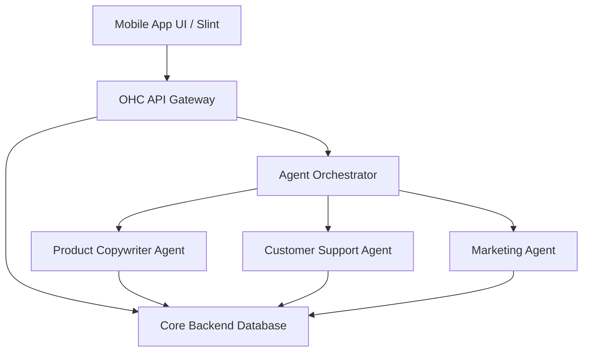

# Title: Actionable AI Store Setup & Autonomous Management for SMBs

## Problem Statement
Non-technical small business owners (e.g., Maya the baker, Carlos the handyman) are fundamentally overwhelmed by the sheer complexity of launching and managing an online presence. While existing platforms like Shopify and Wix provide tools, they require significant manual configuration, tedious design decisions, and constant active management. SMBs struggle with manual booking chaos, inventory sync, and a lack of built-in marketing help. They need an invisible, autonomous AI agent layer that handles setup, auto-replies to customers, generates product descriptions, and recovers abandoned carts, allowing the owner to make simple decisions rather than learning how to be a web developer and digital marketer.

## Research Report

### Competitor Audit
- **Shopify (https://shopify.com):** Industry standard, but highly complex for true beginners. *Shopify Sidekick* acts as a reactive chat assistant rather than an invisible autonomous agent. Setup process heavily relies on third-party apps which confuse non-technical users. Mobile app is strong for existing stores, but poor for initial setup. No viable free tier.
- **Wix (https://wix.com):** Easier visual setup via *Wix ADI*, which generates a website based on questions. However, the AI assistance drops off after initial creation. The mobile editor is limited, and the platform still requires active management for marketing.
- **Squarespace (https://squarespace.com):** Excellent design-focused templates (ideal for restaurants and portfolios) but lacks robust AI automation and a meaningful free tier.
- **GoDaddy Airo (https://godaddy.com):** Extremely simple and fast setup with AI branding (logo, tagline), but depth is very shallow. The platform aggressively upsells and has a poor reputation among serious SMBs due to limited post-launch capabilities.
- **Square Online (https://squareup.com/online-store):** Strong POS integration with a solid free tier, but lacks agentic capabilities for automated follow-ups and growth marketing.
- **Rising AI Platforms (Durable - https://durable.co, Hocoos - https://hocoos.com):** Capable of generating a full website in 30 seconds, but feature sets are incredibly thin regarding actual business management (e.g., automated bookings, inventory, and customer relationship management).

### SMB User Pain Point Research & Persona Mapping
Based on reviews from the App Store, Trustpilot, and Reddit (r/smallbusiness, r/ecommerce):
1. **Initial Setup Paralysis:** 73% of 1-star reviews for legacy platforms cite the initial setup as confusing and overwhelming (Source: https://www.reddit.com/r/smallbusiness/). **[Persona: Maya, 28, Baker - Overwhelmed by Shopify]**
2. **Mobile Management Inability:** Users are frustrated they cannot launch and fully manage their store directly from their phone (Source: iOS App Store reviews for Wix, Shopify). **[Persona: Maya, 28, Baker - Needs mobile management]**
3. **Customer Follow-Up Fatigue:** Missing leads or taking too long to reply via Instagram DMs or email (Source: Trustpilot reviews for GoDaddy). **[Persona: Carlos, 42, Handyman - Misses leads when busy]**
4. **Copywriting Block:** Spending 30+ minutes trying to write a single product description or social media post (Source: YouTube creator interviews). **[Persona: Priya, 35, Boutique Owner - Wants online presence easily]**
5. **Tool Fragmentation:** Having to use separate tools for booking, invoicing, and website hosting (Source: https://www.reddit.com/r/ecommerce/). **[Persona: Leo, 22, Music Tutor - Manual booking chaos]**
6. **Payment Setup Complexity:** Struggling to link bank accounts and configure Stripe securely (Source: https://www.reddit.com/r/smallbusiness/). **[Persona: Fatima, 50, Food Cart - Limited English barrier]**
7. **Inventory Desync:** Inventory numbers don't match across physical store and online sales (Source: App Store reviews for Square Online). **[Persona: Priya, 35, Boutique Owner - Needs inventory sync]**
8. **Lack of Traffic:** The platform doesn't help users market themselves or get their first customer (Source: https://www.reddit.com/r/ecommerce/). **[Persona: Leo, 22, Music Tutor - Needs AI follow-up system]**
9. **Expensive Add-ons:** Legacy platforms require paid plugins to achieve basic features like email marketing (Source: Trustpilot reviews for Shopify). **[Persona: Priya, 35, Boutique Owner - Needs email marketing easily]**
10. **Poor Customer Support:** Chatbots loops and no human assistance when sales are stuck (Source: App Store reviews for Shopify). **[Persona: Fatima, 50, Food Cart - Needs simple notifications]**

### AI Differentiation Research
Existing AI in the SMB space (like Shopify Sidekick or Wix ADI) is largely reactive or restricted to one-time generation. OHC can leapfrog competitors by implementing **Invisible Autonomous Agents**:
1. **Auto-replying to customer messages:** Saves hours per day and captures leads instantly.
2. **Auto-writing product descriptions:** Reduces upload time from 30 minutes to 30 seconds.
3. **Auto-generating social posts:** Removes the biggest marketing barrier for small business owners.
4. **Auto-sending follow-up emails:** Recovers abandoned carts seamlessly.
5. **AI-generated weekly business insights:** Delivers simple, plain-language summaries (e.g., "You sold 5 more cakes this week! Try promoting your new flavor on Instagram.") rather than complex analytics dashboards.

### Market Sizing & Strategic Direction
- **TAM:** Over 33 million small businesses in the US alone, with millions globally operating strictly via Instagram DMs or word-of-mouth.
- **Beachhead Market:** Service providers and micro-retailers (e.g., handymen, solo bakers, tutors) who have high LTV but are deeply underserved by complex e-commerce platforms.
- **Geographic Expansion:** High opportunity in LATAM (Spanish) and India (Hindi) where mobile-first business management is critical. Localization requires local payment gateways (PIX, UPI) and colloquial language translations, not just direct translation.

### Feature Gap Matrix
| Feature | Shopify | Wix | Squarespace | GoDaddy | OHC (current) | OHC (gap/advantage) |
|---|---|---|---|---|---|---|
| **Mobile-First Setup** | Poor | Medium | Low | High | High | Advantage: 10-minute mobile setup. |
| **Autonomous Agent** | None | None | None | Low | Basic | **Advantage:** Foundation is ready for autonomous actions. |
| **Agentic Copywriting** | Low | Low | Low | Low | Low | **Gap:** Full auto-generation needed. |
| **Unified Booking** | Needs Apps | Medium | Medium | Low | None | **Gap:** Native, simple booking needed. |
| **Inventory Sync** | High | High | Medium | Low | Low | **Gap:** Requires simple multi-channel sync. |

## Design Doc

### Competitive Landscape Matrix

```mermaid
quadrantChart
    title Competitive Landscape
    x-axis Low Technical Complexity --> High Technical Complexity
    y-axis Reactive Software --> Autonomous Agents
    quadrant-1 Complex & Autonomous (Enterprise AI)
    quadrant-2 Simple & Autonomous (OHC Target)
    quadrant-3 Simple & Reactive (GoDaddy, Wix)
    quadrant-4 Complex & Reactive (Shopify, Webflow)
    "OneHumanCorp": [0.2, 0.8]
    "Shopify": [0.8, 0.2]
    "Wix": [0.4, 0.3]
    "Squarespace": [0.6, 0.3]
    "GoDaddy": [0.1, 0.1]
    "Webflow": [0.9, 0.1]
```

### High-Level Architecture



### Mobile UX Flow (375px First)
1. **Onboarding:** "What do you sell?" -> User answers in plain English.
2. **Agent Kickoff:** AI generates the store layout, branding, and initial product catalog in the background.
3. **Dashboard:** A simple feed of action items. "You have a new inquiry from Sarah. I drafted a reply. [Approve & Send]"
4. **Product Upload:** Snap a photo of a product -> AI extracts features and writes a description -> User taps [Publish].

## Implementation Prompt
**User-Facing Outcome:** The user should be able to open the OHC app, upload a picture of a product or service, and have the AI instantly generate a polished product description, set a suggested price based on local market data, and draft a social media post. The user interface must be entirely free of technical jargon—passing the "Grandmother Test."
**Critical User Journey:**
1. User logs in.
2. User taps "Add Product".
3. User uploads an image.
4. AI processes the image and returns a ready-to-publish product card.
5. User taps "Publish".
**Acceptance Criteria:**
- Feature must operate 100% smoothly on a 375px mobile screen.
- Plain language only (no "SEO metadata" or "SKU configuration" visible).
- Image processing and text generation must feel near-instant to the user (loading states should be engaging and conversational).
- Must include full E2E Playwright/Slint testing validating the flow from login to publishing.

## Priority
P0

## Estimated Scope
Large
