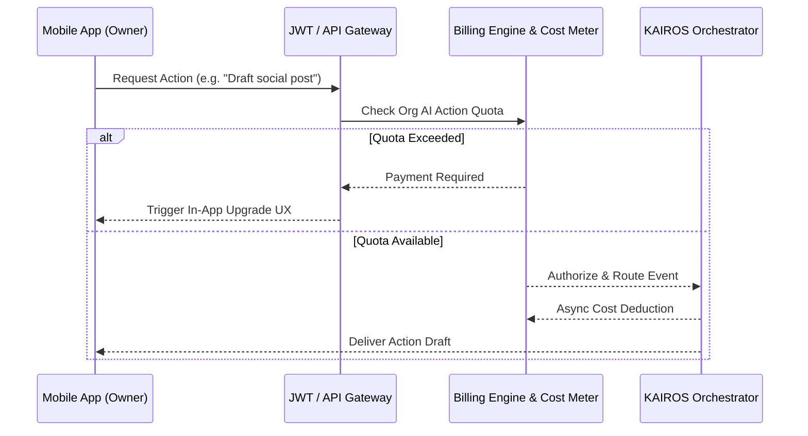

# OHC Multi-Tenant SaaS Tier Architecture

## Problem Statement
The One Human Corp (OHC) platform aims to empower non-technical users to launch businesses instantly. However, as the platform expands, there is a clear need for a scalable, transparent SaaS tier system. Users must easily understand usage limits (especially regarding the underlying AI and storage) and naturally upgrade from the Free tier to higher tiers (Starter, Pro, Business) as their businesses grow.

From the non-technical owner’s perspective:
- Limits must be described in plain language.
- The upgrade process must be seamless and entirely mobile-native.
- AI operations should not "stop" unpredictably but provide proactive warnings, graceful throttling, or queueing when limits approach.

## Research Report
Current multi-tenancy routing exists via the `TenantRegistry` (`src/server/dashboard/tenant.go`), where requests are routed using `organization_id` present in JWT claims. Additionally, OHC utilizes a `billing` module (`src/server/billing/README.md`) using `sync.RWMutex` and matching API calls against a `DefaultCatalog` to track AI Agent token usage dynamically.
Competitor platforms (e.g., Shopify, Wix, Squarespace) often gate features behind complex pricing arrays. OHC’s competitive differentiation will gate on *scale of operations and AI leverage*, keeping all "core business" tools universally accessible but limiting volume and advanced automation depth.

| Tier | Price | Products | AI Departments | AI Actions/mo | Storage | Custom Domain | Target Persona |
|---|---|---|---|---|---|---|---|
| Free | $0 | 10 | 1 (Ops) | 100 | 500MB | No | The casual weekend side-hustler. |
| Starter | $9/mo | 100 | 3 | 1,000 | 5GB | Yes | Maya the Home Baker. |
| Pro | $29/mo | Unlimited | 10 | Unlimited | 50GB | Yes + SSL | Carlos the Handyman; Priya the Boutique. |
| Business | $79/mo | Unlimited | Unlimited | Unlimited | 500GB | Yes + multi-domain | Expanding franchises. |

## Design Doc

### 1. Architecture Diagram (Mermaid)

### 2. UI Wireframes & Screen Flow Description (375px First)
1. **The Proactive Advisor:** The "Business Advisory" agent notices the user has used 85% of their monthly AI Actions. It sends a push notification: *"You're having a busy month! You've used 85% of your AI assistance. Upgrade to Starter to ensure no delays."*
2. **The Soft Block:** When a limit is hit, the UI blurs the target action (Glassmorphism effect) and displays an inline, non-intrusive upgrade button.
3. **The 1-Tap Upgrade:** Clicking the upgrade button opens a bottom sheet.

### 3. Mobile UX Flow
- The bottom sheet opens using native mobile keyboards. Given Stripe integration, if a card is on file, the upgrade is a literal "Swipe to Upgrade" (Apple Pay / Google Pay). No complex pricing tables—just a simple prompt highlighting the specific unlocked value.

### 4. AI Agent Integration Points
- **AI Token Metering vs Action Metering:** For end-users, "Tokens" is jargon. Therefore, limits are presented as "AI Actions" (e.g., 1 drafted email = 1 action).
- **Graceful Degradation:** If limits are hit during an async process (e.g., Customer Success replying to an Instagram DM), the task goes into a `Paused` state on the dead-letter queue, and an urgent push notification is sent to the owner, rather than hard-failing the task.

## Implementation Prompt
**Objective:** Implement the mobile Upgrade UX bottom sheet for OHC.
**CUJ:** As Maya (a baker on the Free tier), when I reach my limit of 100 AI actions, the Business Advisory agent notifies me. When I attempt the 101st action, a beautifully blurred bottom sheet appears on my iPhone, allowing me to upgrade to Starter ($9/mo) using Apple Pay in one tap.

**Acceptance Criteria:**
1. Flutter Mobile UI catches the limit exhaustion, blurring the background (`backdrop-filter: blur(20px)`) and presenting the "Swipe to Upgrade" bottom sheet using the OHC Design Tokens (Outfit/Inter).
2. The AI Job Queue pauses rather than failing active tasks if limits are breached mid-execution.
3. Add full E2E test verifying a user hitting a limit, seeing the upgrade sheet, mock-upgrading, and having the paused task resume.

**Priority:** P1
**Scope:** Large
