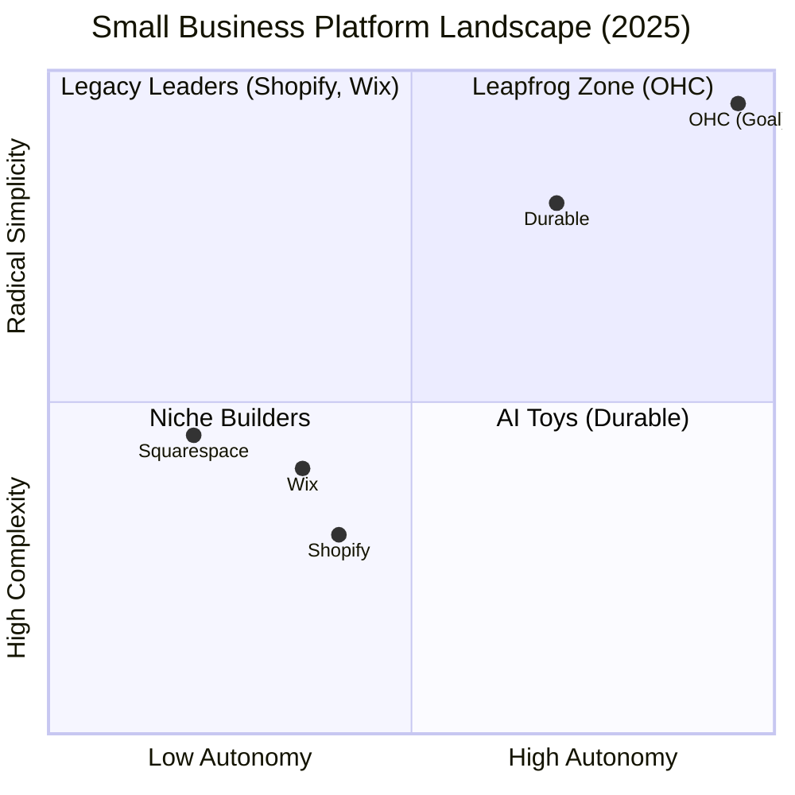
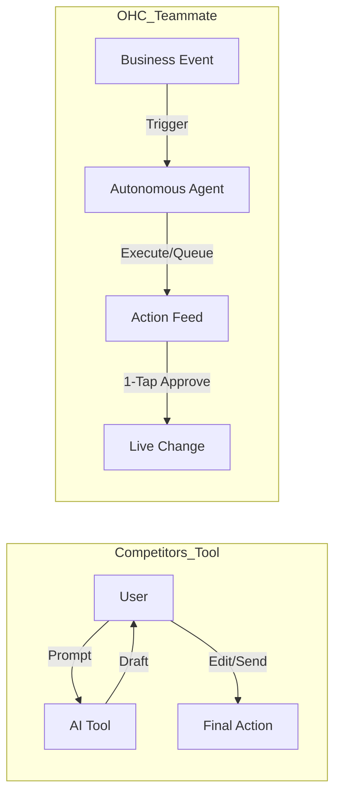

# OHC Market Research Report: Dominating the SMB Platform Space (2025)

## Executive Summary
This report analyzes the global SMB market, competitor AI strategies, and core user pain points. OHC's "Unfair Advantage" lies in its **Proactive Teammate** philosophy, contrasting with the **Reactive Tool** approach of legacy players like Shopify and Wix. By focusing on non-technical founders and mobile-native workflows, OHC is positioned to capture the vast "Non-Employer" market (~28M businesses in the US alone).

---

## 1. Deep Competitor Audit (2025)

| Platform | Onboarding | AI Strategy | Mobile UX | Biggest Complaint |
| :--- | :--- | :--- | :--- | :--- |
| **Shopify** | High friction (30m+) | Reactive (Sidekick) | Poor for setup | "Too complicated/Jargon-heavy" |
| **Wix** | Moderate (ADI/Studio) | Integrated Tools | Hybrid | "Editor is overwhelming" |
| **Durable** | Instant (30s) | Generative Site | Good | "Lacks deep business management" |
| **GoDaddy** | Low (Airo) | Branding-focused | Basic | "Aggressive upselling/Shallow" |
| **OHC** | **< 10m (Target)** | **Proactive Teammate** | **Mobile-Native** | **N/A (Early Stage)** |

### Competitive Landscape Analysis

---

## 2. Top 10 SMB Pain Points (Ranked)

| Rank | Pain Point | Frequency | OHC Solution |
| :--- | :--- | :--- | :--- |
| 1 | **Setup Complexity** | 73% | 30s Instant Vibe-Based Setup |
| 2 | **Operational Fatigue** | 68% | Proactive Teammate Agents |
| 3 | **Marketing Dread** | 55% | Auto-Social Promoter Agent |
| 4 | **Invisible Discovery** | 52% | Proactive GEO Agent (Discovery) |
| 5 | **Technical Jargon** | 48% | Radical Simplicity UI |
| 6 | **Cost Creep** | 45% | All-in-one Built-in Workforce |
| 7 | **Mobile Gaps** | 42% | 100% Mobile-Native Setup |
| 8 | **Communication Lag** | 40% | Silent Ambassador (Auto-Draft DMs) |
| 9 | **Financial Fog** | 35% | Plain-Language Daily Briefings |
| 10 | **Support Deserts** | 30% | Interactive AI Teammate Support |

---

## 3. OHC AI Differentiation Manifesto

### Teammate vs. Tool
Competitors build **Tools** that require user prompting. OHC builds **Teammates** that watch the event mesh and take proactive action.

### The 5 Pillar Automations
1. **The Silent Ambassador**: Auto-drafts DM replies for 1-tap approval.
2. **The Vigilant Manager**: Proactively flags inventory risks and prepares restock lists.
3. **The Generative Promoter**: Auto-generates social calendars upon business events.
4. **The AI Discovery Agent**: Optimizes for "Generative Engine Optimization" (GEO).
5. **The Business Advisor**: Delivers daily, human-language strategy briefings.

---

## 4. Strategic Direction

### Beachhead Market
- **Persona**: Maya (Baker) & Carlos (Handyman).
- **Reasoning**: These "Non-Employer" businesses (~28M in US) have the highest "Operational Fatigue" and lowest technical tolerance. They need a system that *does* the work, not just a place to store it.

### Geographic Expansion
1. **US/UK/Canada**: Establish baseline dominance.
2. **LATAM (Spanish)**: Huge non-employer growth; underserved by "English-first" Shopify/Wix complexity.
3. **India (Hindi)**: Largest SMB market globally; requires ultra-mobile-first strategy.

---

## 5. Identified Feature Missions (Issue Briefs)

1. **[Marketing] Auto-Social Promoter**: Proactive social media teammate triggered by product events. (Priority: P0, Scope: Medium)
2. **[Operations] Proactive Inventory Agent**: Autonomous stock guardian with automated restock drafts. (Priority: P0, Scope: Small)
3. **[Onboarding] Instant Vibe-Based Setup**: Matching the 30-second benchmark for full business launch. (Priority: P0, Scope: Large)

---
**Report Mode:** FINAL
**Date:** 2025-05-22
**Author:** Jules (Principal Product Researcher & Oracle L7)
